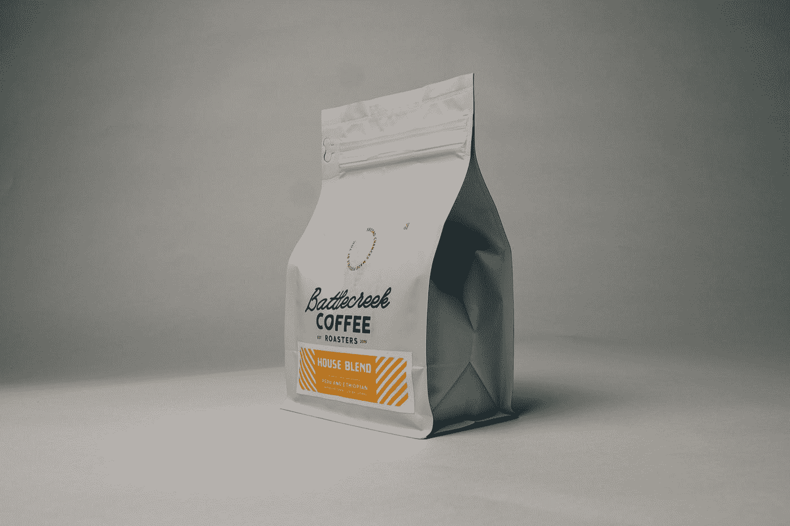

# 创业公司的初期投资怎么花？

> 原文：<https://medium.datadriveninvestor.com/how-to-spend-your-startups-initial-investment-fe88f7a2b9b0?source=collection_archive---------44----------------------->

倒闭最简单的方法就是浪费你省下或收到的钱来创业。如果你口袋里有 50 美元买新鞋，在你花了 48 美元买披萨和啤酒后，你不会在一个好地方结束。

Photo by [Markus Spiske](https://unsplash.com/@markusspiske?utm_source=medium&utm_medium=referral) on [Unsplash](https://unsplash.com?utm_source=medium&utm_medium=referral)

人们不能明智地使用他们的初始投资有两个主要原因。首先，他们不知道他们需要制造什么，所以他们花费时间和金钱来制造一些没有人想要或需要的东西。第二，人们陷入了创业的想法。他们在应该建造东西的时候买了台球桌、水壶和跑步机办公桌——任何东西，真的。

明智消费的关键之一是对待你的钱——不管它来自哪里——就像它是你的钱一样。创业者经常谈到，花自己的血汗钱会让你反思每一项投资的质量。然而，无论你从哪里得到现金，你都可以采用这种心态。

让我建议如何使用你的钱，无论是 100 万美元还是 10，000 美元。

*   高达 20%的市场调查
*   至少 75%的时间用于构建最低可行的产品
*   当时看起来很重要的东西的剩余部分

Photo by [Thiébaud Faix](https://unsplash.com/@thips?utm_source=medium&utm_medium=referral) on [Unsplash](https://unsplash.com?utm_source=medium&utm_medium=referral)

# 从市场调查开始<20%)

If you’re making a product that no one cares about, you’re not going to sell much. Spending money and time on research is money and time saved later during development. I’ve said it before and I’ll repeat it here — your friends and family are not reliable sources of feedback.

There are three simple ways to get this done.

1.  **采访你的潜在买家**。和你认为可能对你的产品感兴趣的人坐下来，看看他们是否真的感兴趣。这是一个获得关于您心目中的功能和价格的反馈的绝佳机会。
    买家角色研究所的 Adele Revella 有一些很好的建议，可以让买家角色变得正确。她专注于摆脱“75 岁的马克，热爱高尔夫”的人物角色风格，并深入到人们如何做出购买决定的更详细的分析中。
2.  **调查一大帮人**。如果你没有时间、资源或技能去采访人们，就发一份调查问卷。不过请记住，*调查很难准确无误*。你得到的回答的质量很大程度上取决于谁来回答这个调查。预先做好工作，如果预算允许，和以前做过的人一起工作。
3.  **打起那个脸书动作**。我从埃里克·罗伊的 Hydroviv 电梯间演讲中得到了这个，“唯一一个为你的水质定制的滤水器。”他花了几百美元在脸书广告上，想弄清楚谁对他设计的产品感兴趣。脸书的美妙之处在于，它能提供大量关于点击你广告的人的人口统计信息。你认为你的产品是给首席财务官的？当 25 岁的会计师开始点击时，准备好大吃一惊吧。

创始人需要走出他们的泡泡，获得真正的反馈。我喜欢面对面的采访，我很高兴看到调查，至少，我想从脸书的竞选活动中获得一些信息。

Photo by [Battlecreek Coffee Roasters](https://unsplash.com/@battlecreekcoffeeroasters?utm_source=medium&utm_medium=referral) on [Unsplash](https://unsplash.com?utm_source=medium&utm_medium=referral)

# 构建您的最低可行产品(> 75%)

这是一种捏造，因为构建 MVP 所需的资源可能包括办公空间、员工和技术。尽管软糖是有意的——也是美味的。

当你考虑花钱的时候，我希望你看着购买的东西，问自己，“这是否让我更接近完成我的业务初稿？”如果是的话，那么它就属于 MVP 的范畴。如果它支持你的企业文化或未来的财务结构，或者只是一盒乒乓球，它就不是 MVP 的核心。

这是你最大的一笔现金，因为这是你将要做的最重要的事情，也是人们最常搞砸的事情。Hacker Noon 将最小可行产品定义为“所有关于通过最基本的解决方案解决问题的内容”

这意味着产品将会改变，但它完成了工作。

如果你曾经写过东西，你会知道把想法从你的头脑中取出并写到纸上可能是这个过程中最困难的部分。你必须组织、计划并执行这个在你头脑中过着完美生活的伟大想法。

当想法停留在你的大脑中时，它们总是可爱的——把它们放到现实世界中会凸显出它们所有丑陋的缺陷。

在游戏的这个阶段，有很多方法可以降低费用。

*   **使用合同制员工**。雇用全职或兼职人员可能会有回报，但也会以不可预见的方式限制你的预算。合同工可以帮你度过最初的几个难关，把事情做好。
*   **找到支持你的免费软件**。你需要会计软件，可能想要一个 CRM，并且可能使用一些项目管理软件来完成 MVP。获得免费的东西——如上面的链接。
*   **文化是给封闭者的**。我热爱我的办公室文化，如果没有这种文化，Capterra 就不会有现在的业务。当你和三个从伯明翰远道而来的人在一起时，文化可以退居其次。请，请，请不要在成功之前庆祝你的成功，否则你只会看着它慢慢消失。
*   **事半功倍**。如果你正在构建一个应用程序，你不需要你的 MVP 被设计在一个定制的外星人盒子上。如果你正在制作一个蓝牙扬声器，它不需要由碳纤维制成。在您知道您正在构建的东西可以工作之后，您可以迭代组件。即使你正在创办一家咨询公司，你也能找到省钱的方法。在联邦快递打印，拿中档名片，或者在星巴克与人会面，而不是在一个你每周只支付一次会议租金的地方。

如果你能盯着产品目标，你就能立即开始省钱。你在这一点上省下的每一美元都将成为你以后用来完善产品的一美元。

Photo by [Louis Reed](https://unsplash.com/@_louisreed?utm_source=medium&utm_medium=referral) on [Unsplash](https://unsplash.com?utm_source=medium&utm_medium=referral)

# 重复研究

哈哈——逮到你了！

在我们拿到那笔甜蜜的现金之前，你必须重新评估市场。现在你已经有了一个 MVP，人们可以一起工作和打破，你有一个很好的机会来扩大你的目标市场。

我的人托马兹·通古兹说，由于初稿的自然限制，你“只能用最少的可行产品来满足 5%到 10%的潜在市场。”随着产品的发展，它可能会进入新的市场。这意味着你可能想要添加新的特性，重新评估价格，或者重新定义你的理想测试用例。

# 其他东西(沙发垫变化%)

*感觉自己开始做某事很重要。否认作为创始人的次要好处很容易，但它们很重要。*

用你剩下的钱加入创业网络。让你的客厅成为一个稍微好一点的工作场所。买一个大显示器或者新的笔记本电脑或者平板电脑。买那些厚到没人能把它们放进口袋的名片。

节食的人必须设定现实的界限，否则他们会崩溃——成为一名创始人也不例外。为自己设定明确的开支界限，但要想办法享受生活。