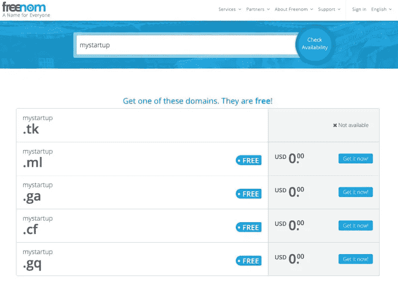
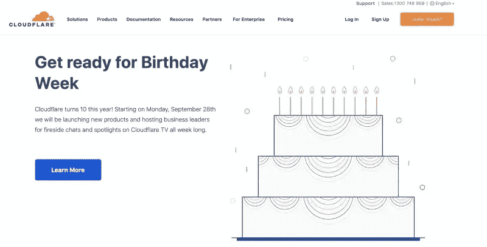
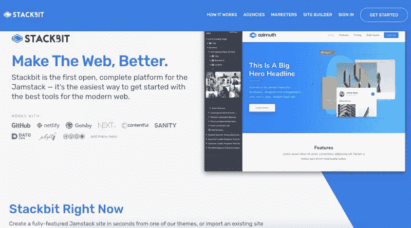
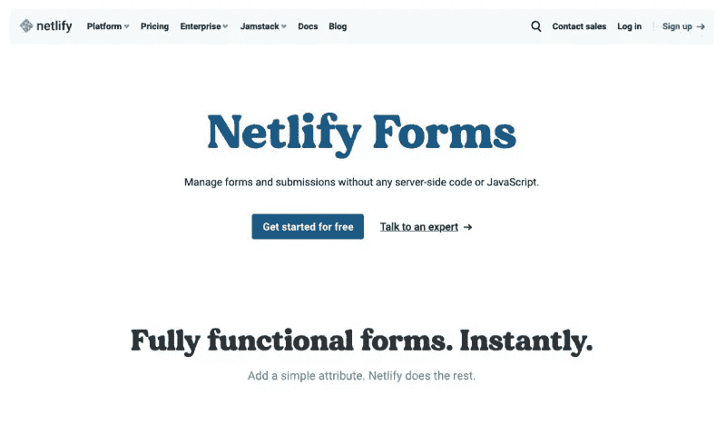
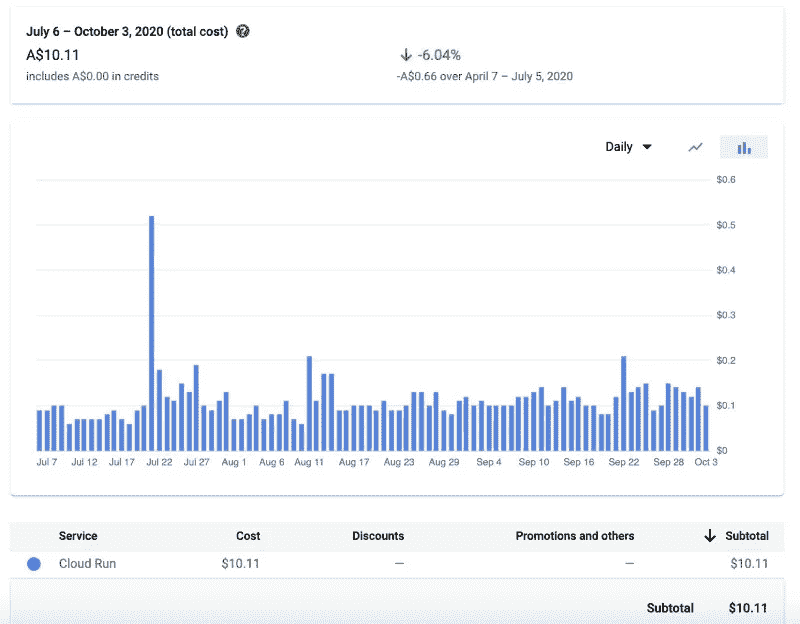

# 如何用谷歌云平台和其他服务零美元创业

> 原文：<https://medium.datadriveninvestor.com/how-to-start-a-tech-startup-for-0-with-google-cloud-platform-and-other-services-stitched-together-b7ff08f34e2b?source=collection_archive---------22----------------------->

Image from Unsplash

了解如何在没有资金的情况下创业。你可能认为我在开玩笑，但我不是。在这份简单的循序渐进的半技术性指南中，我将带你经历一个科技创业的过程。

本指南不会深入探究技术细节。如果你知道如何建立一个域名系统，对你的应用程序进行分类等技术方面的事情，你就可以在不使用信用卡的情况下创建一个科技创业公司。

谷歌云平台为期 12 个月的 300 美元免费信贷是你在 9-10 个月内起步的关键。让我们开始吧:

# 如何创办一家科技创业公司

你有一个科技创业的想法已经有一段时间了。你已经忙了一圈，也许已经准备好了一个概念证明，甚至是一个最小可行的产品( [MVP](https://fonsekainnovations.com/what-does-mvp-mean/) )。

现在是时候让你的创业走向世界了。

> 遵循[精益创业方法论](http://theleanstartup.com/principles)，你想看看你的产品是否有需求。你还想知道人们是否愿意为这种类型的服务付费。

对于以上两种情况，你需要一个品牌名称和一个工作网站，和/或一个网络应用程序。本指南将帮助您以 0 美元的价格将 GCP 产品与其慷慨的免费产品和其他免费服务整合在一起。

# 考虑

1.  你需要注册一个新的 GCP 账户，并准备好你的[300 美元信用点数](https://cloud.google.com/free)，这些信用点数应该在 12 个月内使用。
2.  在您按照指南进行操作时，您必须注册其他服务。
3.  我们的目标是以每天 1 美元的价格运行您的试运行和生产应用程序，因此这 300 美元可以维持 9.5 个月。
4.  在那之后，你将需要找到一种方式来赚钱或获得更多的谷歌云平台(GCP)信用，比如从[谷歌创业](https://cloud.google.com/developers/startups)或一些[其他](https://www.joinffl.com/cloud-credits)方式。
5.  对于本指南，我们将考虑在 Netlify 上建立一个 JAMstack 网站，当然全部免费。
6.  web 应用程序将托管在 Google Cloud 上，并在 Google Cloud SQL 上运行 MySQL 数据库。

是时候深入研究这些步骤了:

# 步伐

在我们深入了解这些步骤之前，这些步骤会有一点技术性，但不会太技术性。这些步骤将更像指针，而不是具有最佳细节的截图的逐步过程。如果你觉得这个想法很有趣，请继续:

## 域名

没有域名，你的品牌就无法存在。如果你对你的科技创业更认真，这可能是你想花点钱的地方。不过，如果你想走 0 美元的道路，这里是你的选择。您可以在 [FreeNom](https://freenom.com/) 注册您的域名，只需 0 美元。您可以获得以结尾的域名。ml，。tk，。ga，和. gq。

Get a free domain for 12 months (renewable at $0) from Freenom.com

> 好的一面是，你只需支付 0 美元，就可以获得一个. com 或. net，没有任何竞争。另一面是，你无法获得这样一个“标准”域名。

选择权在你，如果你的预算很紧，没有 0 美元，我建议你买一个. ml 域名，把你的创业公司打造成“机器学习”的概念，它也有销售的潜力:)。

## DNS、安全性和缓存

注册域名后的下一步是获得一个免费的 [Cloudflare](https://www.cloudflare.com/) 账户。然后，您可以使用 FreeNom 的 Cloud flare 帐户中提供的 DNS 将网站/web 应用程序流量定向到您想要的位置。在我们的例子中，我们希望将 JAMStack 手册重定向到 Netlify。web 应用程序流量将转到我们在 Google Cloud Run 上托管的应用程序。

Use Cloudflare free plan to manage DNS, security, and caching

目前，可以登录并“添加一个站点”。然后谷歌更多地了解如何使用 cloud flare 将流量链接到各自的服务。除了 DNS 管理，您还可以通过 Cloud Flare 免费获得缓存和安全性等功能。按照这个教程来连接 [Freenom 和 Cloudflare](https://dev.to/hieplpvip/get-a-free-domain-with-freenom-and-cloudflare-k1j) 。您还将获得免费的 cloud flare HTTPS，无需与[证书](https://letsencrypt.org/)和设置争论。

## 宣传册网站

现在您已经有了基本的设置，是时候让您的 JAMStack 小册子网站开始运行了。你可以按照这个循序渐进的教程[来运行你的 JAMStack 网站，而不需要一行代码。](https://geshan.com.np/blog/2020/04/jamstack-tutorial-website-with-no-code-for-free/)

这里主要的胶水是 [Stackbit](https://stackbit.com/) 。随着最近的变化，你可以直接进入 Stackbit，选择一个主题，然后在 Netlify 上部署你的网站。你也将得到一个易于使用的 CMS 与所见即所得类型的编辑器，不仅适用于文本，也适用于图像，布局和网站的配置。

如果你的初创公司是一个 SAAS 产品，我会推荐使用[方位](https://app.stackbit.com/create?theme=azimuth)主题。它非常适合 SAAS 产品，只需点击一个按钮，你甚至可以改变配色方案。

## 把它们粘在一起

当你在 Netlify 上用 Stackbit 运行你的宣传册网站后。在 Freenom 上正确配置 DNS，以便网站流量访问启用了 Cloudflare 安全性的 Netlify 网站。

如果你只是想测试你的想法，那么你可以就此打住。有了宣传册网站，你可以开始使用[电子表格](https://www.netlify.com/products/forms/)收集电子邮件地址。Netlify forms 免费版有限制，请注意，请参考 [Netlify 定价页面](https://www.netlify.com/pricing/)。在那之后，你就可以知道人们是否会付钱，并决定是否继续付钱。

Netlify with Netlify forms is a good way to collect leads.

请注意，对于上述所有服务，你甚至没有花一分钱。所以你想做多久就做多久。

如果你已经有了一些代码和某种形式的技术创业工作，那么继续用谷歌云上的无服务器容器 GCP 托管它。

## 谷歌云平台时代(GCP)

现在是时候获得你的谷歌云平台(GCP)帐户了。这是你需要搜索你的信用卡的地方。尽管你不会被收费，但谷歌会收集你的信用卡信息。对于云和云运行，要非常小心不要让[超过](https://www.theregister.com/2020/12/10/google_cloud_over_run/)它，所以从一开始就要收紧配置。

我们将为部署在 [Google Cloud Run](https://cloud.google.com/run) 上的应用程序使用无服务器容器。我们选择无服务器容器是因为成本和其他原因。其他[原因](https://geshan.com.np/blog/2019/11/why-use-google-cloud-run-5-compelling-reasons/)主要包括不需要学习一个新的框架/范例，你可以运行任何应用程序，只要它可以被容器化。

> 您还将获得免费的 HTTPs 和自定义域映射，以将应用程序指向 FreeNom 域。

有了 Cloud run，你每月可以获得 200 万个免费请求。之后，每一百万次请求收取 0.40 美元。嗯，数学并不那么简单，但它是这样宣传的。Google cloud run 比功能齐全的 Kubernetes 集群更容易设置，也有类似的好处。在这个[讲座](https://geshan.com.np/blog/2019/11/from-0-to-working-serverless-url-for-a-containerized-app-with-google-cloud-run-slides-and-video/)中了解更多。

 [## 去公关还是不去公关？初创公司的 5 个关键问题|数据驱动的投资者

### 在 2015 年发表了一篇发人深省的观点文章，将围绕创业公司的新闻周期比作 12 小时的时钟…

www.datadriveninvestor.com](https://www.datadriveninvestor.com/2020/12/21/to-pr-or-not-to-pr-5-key-questions-for-startups/) 

## 将你的申请归档

要部署您的应用程序，您需要对它进行 dockerize。在这个[分步指南](https://geshan.com.np/blog/2019/10/get-laravel-6-running-on-google-cloud-run-step-by-step-with-ci/)中，你将看到如何部署一个 PHP Laravel 应用程序到 Google Cloud 完全托管运行。按照类似的步骤，您可以部署任何可以 dockerized 到 Google Cloud Run 的应用程序。请记住，您选择了一个像 us-central-1 这样的低成本地区，并将最大容器数设置为 2，这样您就不会很快耗尽免费信用。

Actual costs for running a small scale application on Google Cloud Run

根据我的经验，目前，对于一个同时具有过渡和生产工作负载的应用程序，我们每天要花费 10-20 美分。这也是从我们的免费信贷。

## 数据库ˌ资料库

仅仅有一些代码并不能使应用程序工作，大多数应用程序的本质是数据。你可以在 MySQL 或 Postgres SQL 上的 [Google Cloud SQL](https://cloud.google.com/sql) 中存储你的数据。这将是你主要的财神爷。

按照目前 MySQL [的定价](https://cloud.google.com/sql/pricing#2nd-gen-pricing)，使用两个 *db-f1-micro* 每天花费我们 88 美分。临时数据库每天 44 美分，生产数据库也是如此。生产环境有一个自动备份设置。

为了节省成本，如果你一次最多可以支持 5 个连接，你可以选择使用[远程 MySQL](https://remotemysql.com/) 。如果您使用远程 MySQL 进行暂存，那么数据库的每日成本可以降到 44 美分。

一件重要的事情是将您的云 SQL 实例置于防火墙之后。按照官方[说明](https://cloud.google.com/sql/docs/mysql/connect-run)将云运行完全托管服务与云 SQL 数据库连接起来。

如果您使用其他形式的数据存储，费用将根据您的选择而有所不同。

## 其他 GCP 服务

除了 Cloud Run 和 Cloud SQL，你应该使用其他服务，让你的生活更轻松。您可以使用云构建来构建您的容器。它可以与 Github 链接，你可以在每次推送时或者在某些条件下开始构建你的容器。

> 云构建每天有 [120 分钟](https://cloud.google.com/cloud-build/pricing)的空闲时间。这对像你这样的初创公司来说应该绰绰有余了。

通过云构建，容器映像将被推送到[容器注册中心](https://cloud.google.com/container-registry)。谷歌容器注册使用[云存储](https://cloud.google.com/storage)来存储图片。在云存储桶上设置[生命周期配置](https://cloud.google.com/storage/docs/lifecycle)，以便超过 X 天的文件可以在它增加[成本](https://cloud.google.com/storage/pricing)之前被自动删除。

您还可以利用免费的 VM — [F1 微实例](https://cloud.google.com/free)来完成小任务。

> 我们用它来运行一个用 Hubot 建造的机器人。它使用 gcloud 命令来做一些事情，比如[部署云运行应用](https://cloud.google.com/sdk/gcloud/reference/run/deploy)以及在 Slack 上显示[日志](https://cloud.google.com/sdk/gcloud/reference/logging/logs/list)。

所以不用说，我们正在使用 [GCP 日志](https://cloud.google.com/logging)来获得关于应用程序如何工作的更多可见性，你也应该使用它。

当然，GCP 有过多的服务，但不要进入分析瘫痪模式，什么也做不了。我们使用了上述服务，我们的产品运行良好。以最佳方式探索和使用您的产品所需的服务。

## 其他免费服务

以下是其他免费服务，将帮助你建立你的科技创业:

1.  Github——Github 有一个[免费团队计划](https://github.blog/2020-04-14-github-is-now-free-for-teams/),所以别忘了利用它。Github Actions 有 2000 分钟，你也可以把它作为你的 CI/CD 管道。
2.  特雷罗/阿萨纳——根据你的项目/产品管理风格，你可以使用[特雷罗](https://trello.com/)或[阿萨纳](https://asana.com/)免费版本来管理你的产品开发。
3.  code climate——为了让你的代码保持健康，你可以使用 CodeClimate [免费计划](https://codeclimate.com/quality/pricing/)的 4 个座位。这将有利于你的科技创业公司的代码质量。
4.  转发电子邮件——很好，你有自己的域名，但使用 Gmail 电子邮件对你的品牌形象来说不是最好的。通过[转发电子邮件](https://forwardemail.net/en)免费计划，免费获取您的 [info@yourdomain.ml](mailto:info@yourdomain.ml) 。
5.  免费 CDN——如果您在您的网站或 web 应用程序上提供图像或静态资产，您可以静态地使用[来获得 CDN 优化和好处。试试吧，也是免费无限的。](https://statically.io/)

如果你知道任何其他可以帮助初创科技公司的服务，请把它们添加到评论中。

# 结论

> 你不需要钱来启动你的科技创业。如果你有正确的想法，并正确利用你的技术技能，你可以零美元启动你的技术创业。

我希望你不要让你的科技创业想法胎死腹中，通过 GCP 和其他服务免费获得一些东西。

*原载于*[*https://geshan.com.np*](https://geshan.com.np/blog/2020/10/start-tech-startup/)*。*

## 访问专家视图— [订阅 DDI 英特尔](https://datadriveninvestor.com/ddi-intel)