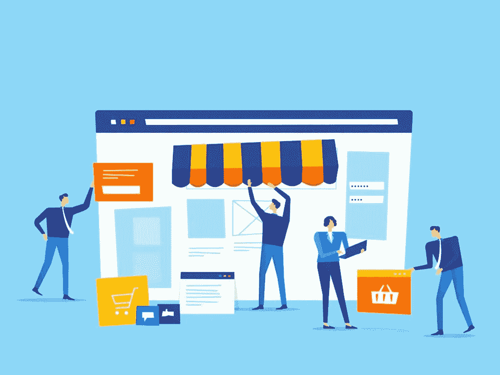

# 如何开始一个网上零售店，需要多少钱

> 原文：<https://medium.datadriveninvestor.com/how-to-start-an-online-retail-store-and-how-much-will-it-cost-3e873467a377?source=collection_archive---------21----------------------->

开办自己的零售店是一项伟大的投资，在动荡和经济繁荣时期也能有所帮助。这一点在封锁期间表现得非常明显，当时顾客希望购买新产品，但却无法离开自己的家。除了实体商店之外，有网上商店的公司比没有网上商店的公司发展得更好。由于推出自己的网上商店是一个非常具有挑战性和复杂的过程，我们想回答一些最常见的问题，企业主正在问自己如何开始网上零售业务。

# 你从哪里开始？

很难列出网上零售业务的所有步骤，因为有太多的方面需要考虑。以下是一些主要的例子:

*   选择你的定位——你需要做的第一件事就是选择你的定位。这就是你计划销售的产品，以及你将向谁销售这些产品。避开家喻户晓的领域是个好主意。如果大品牌在某个特定市场占据主导地位，人们甚至不会考虑其他选择。如果你还没有决定你到底想卖什么，考虑在谷歌趋势上做一些研究，看看哪些产品是受欢迎的或者正在上升。
*   **选择您的平台** —我们稍后将更详细地介绍所有可用的各种平台，但是想想它的设置和设计有多简单？容易导航吗？如今，人们期望网站对用户友好，易于导航，所以如果你在这方面有问题，你将会有很多废弃的购物车。该平台还应该有广泛的集成选项可供选择。至少，它应该能与你的社交媒体渠道整合，最好能与你的 CRM 和你使用的任何营销软件顺畅运行。对他们提供的插件和扩展做一些研究，这些插件和扩展可以进一步扩展你的网站的功能。
*   **选择供应链管理方式**——你可以选择直运或者持有自己的产品。直运是指客户在你的网站上订购产品。订单被转发给供应商，供应商以您的名义将产品直接发送给客户。另一种选择是，如果有可用的库存空间，就持有自己的产品。
*   **创建网站** —好的网站建设者可以给你提供一些模板开始。尽可能提供更多的定制。虽然你现在可能不需要这样做，但以后你肯定会这样做，因为这将极大地帮助你转化。最后，上传你所有的产品和必要的描述。

现在你的网站已经上线运行了，让我们回到之前关于选择平台的问题。

# 有哪些平台？

为您的电子商务业务选择平台是您将要做出的最重要的决定之一，因此做出正确的决定非常重要。让我们来看看一些最受欢迎的:

*   **Shopify**——这是一个非常知名的平台，如果你刚刚起步，它会非常有用。他们真的会握着你的手，带你完成整个安装过程。不利的一面是，API 调用的数量有限，这可能会导致可用性问题，而且他们会让你使用他们自己的销售点软件，否则，他们会向你收取费用。使用这个平台的费用从每月 29 美元开始，简单地使用这个平台，自己做所有的事情。但是你想雇佣一家外包公司来为你做所有的事情，这大约是每月**5000 美元**。
*   Magento 是一个非常通用和移动友好的平台。它最大的优势之一就是全球有成千上万的公司在从事 Magento 扩展。有了这么多可用的扩展，你将不必为你的网站开发特定的功能而付费。您可以简单地找到最适合您需求的扩展，价格从 10 美元到 500 美元不等。有关更多详细信息，请咨询专门从事零售软件解决方案的公司。Magento 的电子商务商店成本可能在**30，000 美元左右**，但这是值得的。下面的视频展示了 Magento 的一些优点和功能。

*   Volusion 也很适合最近开业的商店。他们通过帮助你进行搜索引擎优化和设计来帮助你建立网站。你必须小心的是，他们的所有计划都有销售限额，如果你超过了年度销售限额，你将不得不做一些研究。而 Volusion 的平均计划在每月 29 美元到 299 美元之间。
*   **WooComerce** —这是另一个对新人友好的平台。很多时候，它会被那些希望扩展到电子商务领域的博客作者和爱好者所使用。最大的缺点之一是可扩展性。如果你想扩大你的经营，副作用将会是现场商店的经营放缓。该平台本身是免费的，但你将不得不购买一个域名，这通常是在 **$12** 左右。
*   **3dcart** — 3dcart 在场上算是小角色。它提供多语言支持以及高级运输解决方案，而不需要 API。然而，如果你有大量的流量，事情会变得棘手，因为它没有 CDN。这可能会导致一些停机时间。计划价格从**19.99 美元到**129.99 美元不等。

现在我们已经对一些最流行的平台有了一个总体的了解，我们需要考虑在线商店和市场的问题。

# 开网店和市场哪个好？

开办网上零售业务的成本不同于普通的网上商店和市场。一旦你的网上商店成功运营，你可能会考虑把它变成一个市场。然而，运营一个市场的成本会更高，因为用户流更复杂，这需要定制解决方案和许多迭代来提供正确的产品市场匹配。另一方面，一个简单的电子商务网站可以快速建立并运行，因为交易结构要简单得多。

# 推出一个线上平台需要多少钱？

在线业务的启动成本将因企业而异，并取决于许多因素。生意有多大？如果你卖的不是一整批产品，你也没有广泛的客户基础，最好把事情简单化，这会降低你的成本。然后你需要考虑网页设计。如果你想给你的商店一个定制的设计，你需要雇佣一个专业的用户界面/UX 设计师。此外，您还需要考虑平台的成本以及需要完成的任何开发工作。以下是定价概述:

*   对于小型电子商务商店(最多 1000 件商品—约为 **$5000** 前期成本和 **$500** 一个月。
*   对于中型电子商务商店(10，000 件商品)以及一个定制设计— **$15，000 — $20，000** ，前期维护将为前期成本的 10%。
*   对于一个具有完全定制和所有必要集成的网上商店来说，前期费用为 30，000 美元到 50，000 美元，维护费用为前期费用的 10%。

# 你的网店需要多少人来维持运营？

每个商店都是不同的，成本取决于规模、销售的产品和库存管理。虽然你可以独自经营商店，但通常需要 1-4 个人来维持必要的销售额。你将需要人来处理诸如会计、追踪不付款、回答客户询问等等事情。就技术支持而言，价格将取决于平台，每月花费在 500-5000 美元之间。如果你遇到紧急情况，需要马上修理某样东西，那么费用就是执行这项工作的技术专家的工资。然而，如果你有一个小企业，你通常可以自己执行修复。

# 你如何吸引人们到你的网上商店？

就像实体店一样，你需要吸引顾客，让他们了解你提供的所有产品。最好的方法之一是通过电子邮件营销。你可以建立一个电子邮件滴活动，通知潜在买家任何促销或销售目前正在进行。你也应该在社交媒体上积极推广你的业务。脸书广告是吸引买家的一个非常好的方式，你每天只需花 1 美元就能得到一个好的结果。搜索引擎优化(SEO)也是非常重要的，因为你想在人们搜索的时候出现在搜索结果的顶端。

就成本而言，你可以期望在 SEO 上每月花费**500-5000**美元。电子邮件营销会让你每月花费**10 美元到**2500 美元不等，这取决于你有多少订户。

# 如果我在设置在线商店时需要帮助，该怎么办？

我们非常关注开办一家在线商店需要多少成本，但事实是，许多电子商务平台非常复杂，你需要聘请一家专门从事电子商务网站的开发机构来为你完成这项工作。虽然这将增加总体维护成本，但您最终将获得更高的投资回报，并吸引更多的客户。Skywell Software 在开发[零售软件解决方案](https://skywell.software/retail-software-development/)方面有着悠久的历史，我们知道如何建立一个在线商店来帮助您吸引客户。今天就雇佣我们来克服您所面临的任何挑战，并从今天开始增加收入。

*最初发布于*[*https://sky well . software*](https://skywell.software/blog/how-to-start-an-online-retail-store-and-how-much-will-it-cost/)*。*