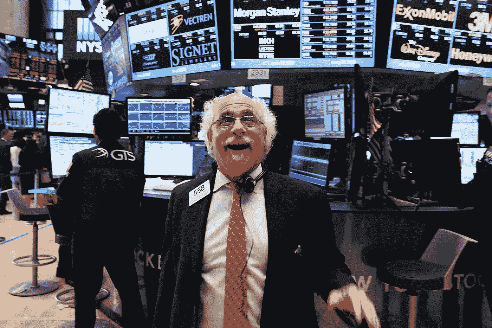
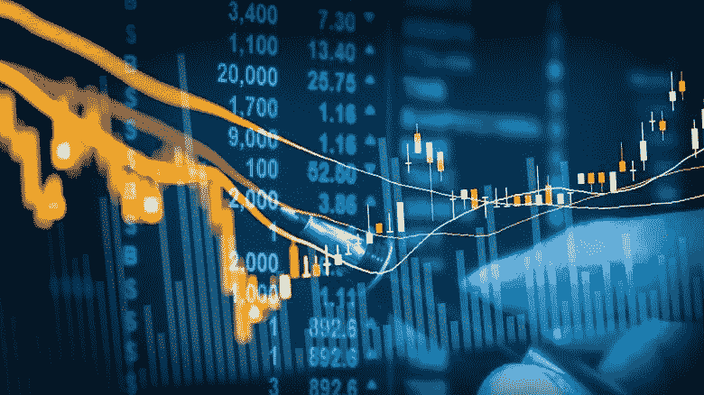
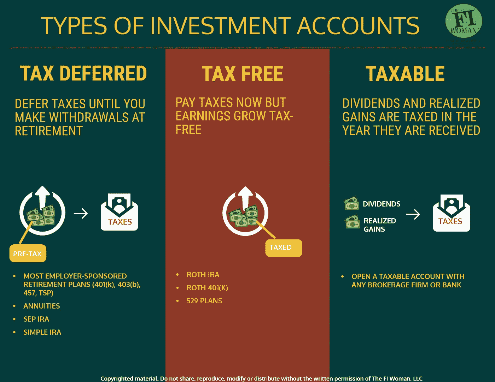
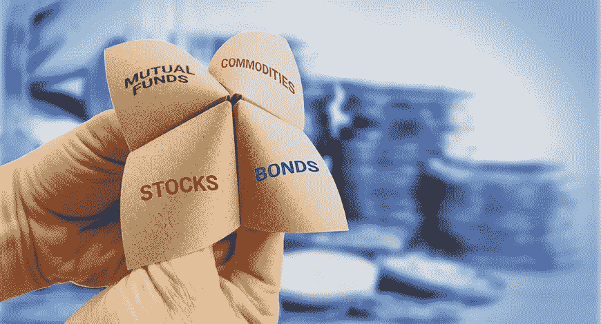
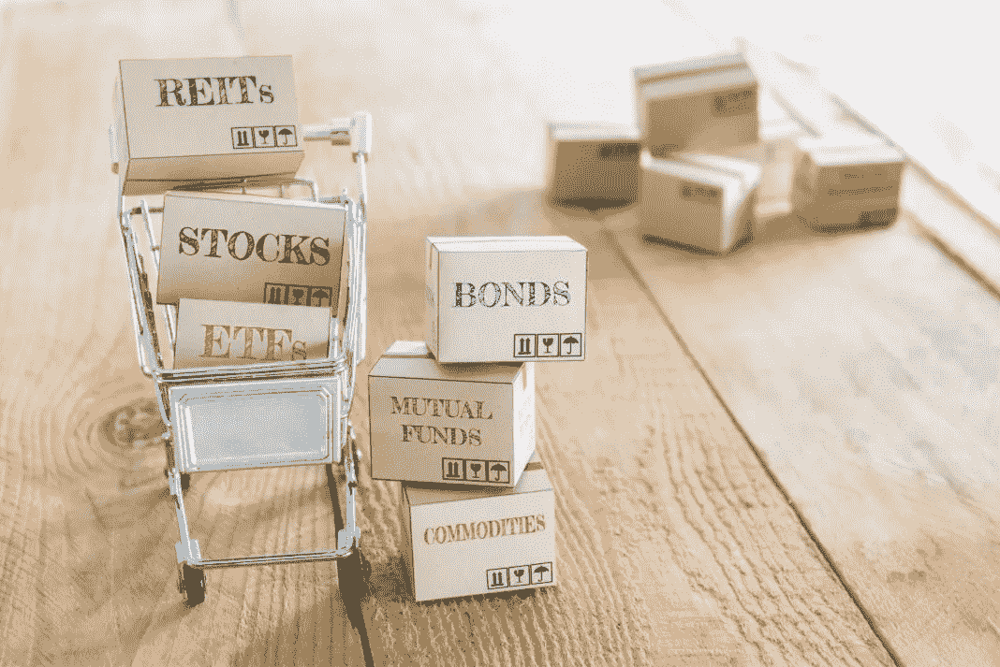
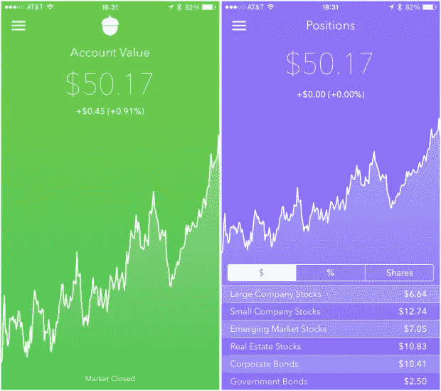

# 如何开始投资

> 原文：<https://medium.datadriveninvestor.com/how-to-start-investing-b20bd8cfb080?source=collection_archive---------10----------------------->

免责声明:如果你认为你已经了解了足够多的关于市场、资产类别和投资的背景信息，你可以使用下面的链接跳到文章的不同部分。(这在手机上不起作用😢 *)*

*如果你是罗宾汉交易者，看看背景。*😉

1.  [到底什么是投资？为什么要投资？](#a142)
2.  [4 个资产类别](#4cff)
3.  [我如何开始投资？](#976b)

**投资。很可能你不仅以前听说过，而且现在开始一直听到。**

听到“投资”这个词，你会想到什么？很可能你想到的是纽约市中心，西装革履的男人，或者在纽约证券交易所对着股票代码微笑的老人。

是的，这家伙。你可能在《美国消费者新闻与商业频道》或其他节目中见过他至少一次。

我的观点是，要成为一名投资者，你不需要具备这些条件。并非所有人都是沃伦·巴菲特。你不需要成为华尔街的大投资者。小狗是存在的。而且小狗可以赚很多钱。小狗的名字里只能有几美元，然后成长为一个大数目。

这一切都始于知道如何储蓄，接受理财教育，并拥有良好的理财习惯。当你可以在家做一杯卡布奇诺时，不要在星巴克花 5 美元。取消那些你不用的包月套餐。停止从电视购物中购买你永远不会用到的东西。

这样每月可以节省 100 多美元。我的观点:省钱没那么难(不要取消我)。只需要一点点训练。一旦你掌握了这一点，前途无量。

你只需要几美元。然后嘣，你就可以开始投资了。

# 投资到底是什么？为什么要投资？

既然有钱，为什么还要投资？你对如何投资所做的任何一点点研究都会把你吓跑。跌停，套利，首次公开募股，杠杆，波动性，卖空。在已经错综复杂的股票市场上，你会被这些复杂的术语搞得晕头转向。你被要求花钱去挣钱，基于一些每 5 秒钟从红变绿的数字。你为什么要这么做？

财务安全。增加你的财富。被动收入。很多原因。为什么你认为扎实的 401(k)被广泛认为是最大的职场福利？是的，因为你需要利用复利和投资的力量来建立一个足够大的养老基金。不仅仅是退休，基本上你所有的人生里程碑都是如此:住房所有权、大学基金、创业等等。几乎每个金融专业人士，以及数百万普通员工，都有某种类型的投资来帮助增加他们的财富。

投资帮助你避开财富管理的恶魔:通货膨胀。历史平均通胀率在 4-5%之间；大多数储蓄账户(低收益银行储蓄账户和“高收益”网上储蓄账户)的利率都比这个低得多。投资于市场，可以帮助你跟上通货膨胀，实际上保持你的钱的价值。

此外，不要太深入被动收入的概念，但在我看来，投资和建立一个强大的投资组合是创造一个与你的时间/工作没有直接联系的资金流的最简单和最好的方式(因此，被动收入)。事实上，一旦你有了一个好的投资组合，管理它只需要最少的努力，你就可以看到一些不错的回报。

给你一个统计数据:

> 在过去的 100 年里，普通投资者见证了 10%的年增长率。

是啊，你现在肯定感兴趣了。所以现在我们开始我们的初学者投资教育。

# 4 个资产类别

首先，一些背景。简单来说，有 4 种资产类别/投资类型。

> ***1)股票/股权投资***
> 
> ***2)债券/固定收益投资***
> 
> ***3)财产/不动产/其他有形资产***
> 
> ***4)货币市场工具/现金等价物投资***

## 股票/股权投资

我把这个放在第一位是有原因的。这是迄今为止最受欢迎的投资类型，因为几乎每个人都熟悉它是什么。股票市场:你拥有一家上市公司的股票，随着公司的扩张/成长，股票价值也随之增加，这意味着你获得了利润。

利润以股票红利的形式支付给股东。显然，如果公司陷入困境/如果出现熊市(投资者普遍恐惧、衰退逼近、市场下跌等)。)，公司可以被私募吞并，也可以倒闭，这种情况下你就血本无归了。

这是投资，总是有风险的。但是有一些方法可以降低这些风险，我将在本文的后面详细介绍。

## 债券/固定收益投资

固定收益投资顾名思义:一种有预定固定利率的投资。这些投资通常在一段特定的时间后开始支付，并定期持续。

债券是最受欢迎的固定收益投资形式。例如，当你购买美国政府债券时，你购买的是政府债券。换句话说，你给政府一笔贷款，政府在一段时间后(债券到期后)以预定的利率还给你。

一般来说，债券被认为是非常安全的:它们不容易受到影响股市的波动因素的影响。

## 财产/房地产/其他有形资产

同样，这正是顾名思义:投资是有形的(实物投资)。这些包括房地产、艺术品、古董、金条等。

不，不是你能拥有的每一份财产都是可以用来增加财富的有形资产。随着时间的推移，你拥有的大多数东西都会失去价值。例如，汽车每年损失高达 10%的价值。

## 货币市场工具/现金等价物投资

最后，也是最不重要的，我们有货币市场工具。同样，顾名思义，这些是对高流动性资产的短期投资(可以很容易地转换为纯现金的东西)。货币市场工具最流行的形式是存单；MM 工具也可以投资于短期债务证券，如美国短期国库券。

我说“最后和最少”的原因是因为这个资产类别在所有资产类别中增长最少。但这风险很低，所以想想吧。

从技术上讲，还有其他资产类别；其他金融衍生品，如商品、期货，甚至加密货币，在技术上也可以归类为一种资产类别。但我列出的 4 大是大多数投资者，尤其是刚开始投资的人参与的。我们将关注四大巨头的最佳策略。

# 我如何开始投资？

最后，我们已经了解了所有的背景，您现在对不同类型的投资有了更多的了解。或者你可能已经了解了投资/资产类别并跳到了这里。也许在读完我要说的内容后，你会回过头来阅读背景。不管怎样，现在我们可以开始复习如何真正开始投资了。

Courtesy *The FI Woman*, LLC.

## 第一步:选择你的投资账户/工具

你会问什么是投资工具？本质上，这是你用来赚取信用利差的账户类型。为什么这很重要？类似于为什么选择正确的银行账户/信用卡很重要。我们都有不同的财务限制和目标。如果你管理得当，有些账户有税收优惠。

我知道你在学校里没有学到这些有价值的信息。为什么？我不知道。我在这里试着把这个写进一篇文章里来帮助你。请原谅我。

让我们用一些例子来阐明整个情况。

假设你正在为退休储蓄进行投资。你有很多选择:传统的个人退休帐户，401(k)，罗斯个人退休帐户等。这些都是不同的东西。例如，传统的个人退休帐户允许你进行延税缴款:这可以降低你的所得税，同时也为退休增加你的财富。另一方面，罗斯个人退休帐户是随着你的贡献而征税的，但是当你将来提取你的储蓄时，你可以免税。

除了所有的税务技巧，你还应该知道你的账户附带的美国国税局的规章制度。我想说的是:

> 做你的研究。

如果有人要求我写所有无聊的规章制度和我的建议，我会写的。

## 第二步:选择你想要的投资类型

这可能是最重要的一步。

你想冒多大的风险？你能负担多少？你希望你的投资周期持续多久？你愿意奉献多少时间？

这些是许多问题中的一部分，将引导你做出关于你想要做什么样的投资的明智决定。

既然你知道所有的资产类别是什么以及它们需要什么(如果你不知道并且跳过了阅读背景信息，那么回去阅读它！)，我将给出一些关于您应该做什么的一般性建议。

## 第三步:选择你的投资方法

根据你想投资的资产类别，你可以选择你的投资方法。

如果你是初学者(对投资完全陌生)或新手(有一些投资知识)，我会建议你投资 ETF 或共同基金。

ETF 和共同基金是一回事吗？没有，为什么我给初学者推荐这些？主要是因为它们是你所说的“一篮子资产/投资。”

作为一个小狗投资者，你可能没有太多的钱来投资。那完全没问题！这就是 ETF 存在的原因:它允许你投资大型股票和知名公司，而无需购买整只股票。特斯拉刚刚飙升至超过 1000 美元，亚马逊的股票超过 2500 美元。不是每个人都能负担得起，但你有可能负担得起 ETF。

共同基金非常相似。大多数 401(k)账户涉及共同基金投资，所以如果你有 401(k)账户，你很可能已经在共同基金里了。无论如何，我向初学者推荐共同基金的原因是:

1.  就像 ETF 一样，你的投资组合是多样化的。如果一只股票崩盘，你不会受到伤害。至少不是很多。
2.  金融专家管理共同基金。这样做的坏处是，你无法控制自己的投资组合。但往好的方面看，专家不会比你更糟糕。
3.  与第一个原因相关，一揽子投资比其他投资的风险要小得多(你的鸡蛋放在多个篮子里，而不仅仅是谚语中的一个篮子。)

*免责声明:共同基金通常比交易所交易基金要求更高的最低投资额(记住，我说过它们不是一回事。)他们有时会收取维护费之类的费用，所以也要小心这些费用。*

如何开始？简单。

对于交易所交易基金，你可以使用像 Acorns 这样的应用，以很少甚至零成本进行投资。特别是 Acorn，它将自动储蓄工具与机器人顾问模型相结合，使投资变得更加容易。费用很低(通常是 1-3 美元)，但如果你有一个小的余额/投资组合，即使是这样也会很费力。

*免责声明:我不是由 Acorn 或我提到的任何特定公司/应用赞助的。我认为 Acorn 很一般，但对你的起步很有帮助。研究一下使用什么应用程序/服务。*

对于共同基金，你可以去咨询各种公司(富达，美国基金等。).大多数共同基金的最低投资额都在 3000 美元以上，所以要小心。然而，有一些基金，比如[先锋的明星基金](https://investor.vanguard.com/mutual-funds/profile/VGSTX)，只收取 1000 美元的费用。

现在，我将讲述更有经验的投资者应该做些什么。如果你正在读这篇文章，并且已经读到这里，你可能不是一个有经验的投资者。让我重申一下，这完全没问题。

我不会像初学投资那样花太多时间来讨论更高级的投资，但我还是会讨论一下以防万一。🙃

如果你是一个有经验的投资者，我建议你投资那些大狗投资者正在谈论的:房地产和个股。

这是非常违反直觉的，因为如果你是一个经验丰富的投资者，你很可能会在房地产投资信托基金(REIT)、实际房地产或一些个股上投资。但是对于仍在阅读的初学者，我将快速解释我的推理。

房地产几乎总是会比简单的投资股市给你带来更好的回报。股票市场的长期投资历史上为你赢得了 7%的实际(经通胀调整)年回报率，而房地产投资信托基金为你带来了 17-18%的年回报率。

显然，投资房地产需要很高的最低投资额。不要担心，如果你刚刚开始，你有这个工作要做。努力工作，好好存钱，遵守纪律，你就会成为一名经验丰富的房地产投资者。

附注:我个人没有参与任何房地产投资。然而，我计划很快。

最后，你有你的个人股票。最危险的一个。波动是真实存在的，尤其是现在。你可以购买一家大公司的股票，杰罗姆·鲍威尔可能会出来给你施压，毁掉你的投资。

一句话:投资个股可能会很昂贵，而且肯定有风险。这也是我不推荐给新手的原因。但是如果你冒了很大的风险，并且得到了回报，显然会赚很多钱。向经纪公司咨询可能有助于降低风险，但归根结底，投资个股是一件有风险的事情。

## 第四步:小心管理你的投资组合

很多时候，你并不真的需要维护你的投资组合(我之前提到过，拥有强大的投资组合意味着几乎不需要管理)。但为了让这种“买入并持有”的投资策略长期有效，有时你需要做出基于业绩的改变，以增加你的回报。

显然不要对美国消费者新闻与商业频道发生的事情和彭博骇人的头条新闻做出反应。冲动和短视是“长期”投资者最大的弱点。

自己做研究，实际看数据。更好的办法是咨询金融专业人士。但是请记住，我们没有人能够预测未来。请记住:

I plugged my Twitter. Get over it.

我们的小课到此结束。如果你一开始对金融市场或投资一无所知，我希望你对事情的运作有一个初步的了解。我希望你对如何投资/投资什么有所了解。最重要的是，我希望你对投资的想法充满热情，去做你的第一笔投资。

喜欢，并分享给你所有的朋友！投资愉快！