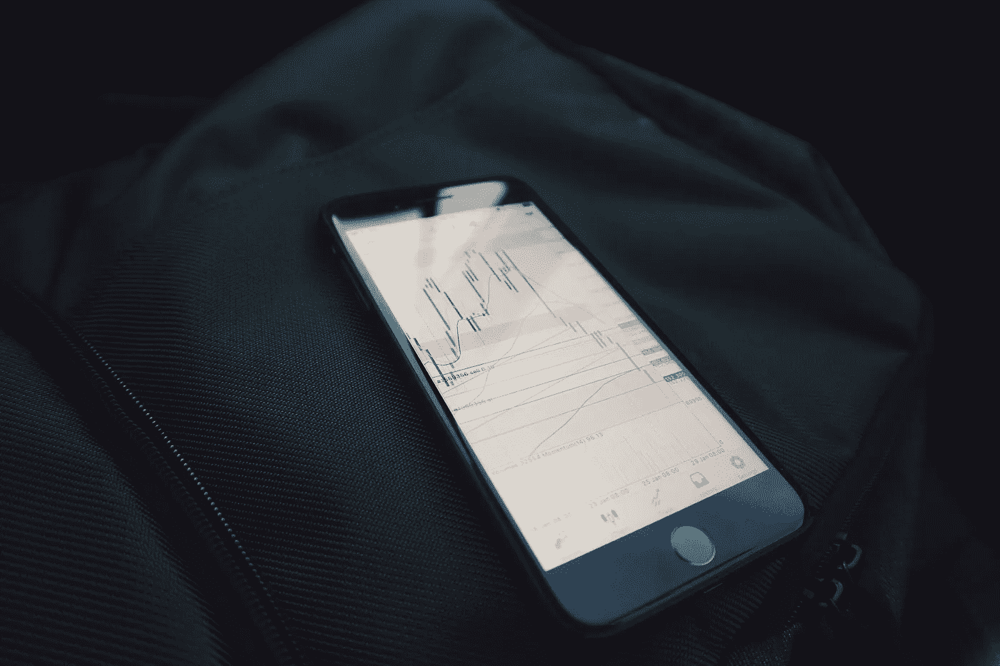
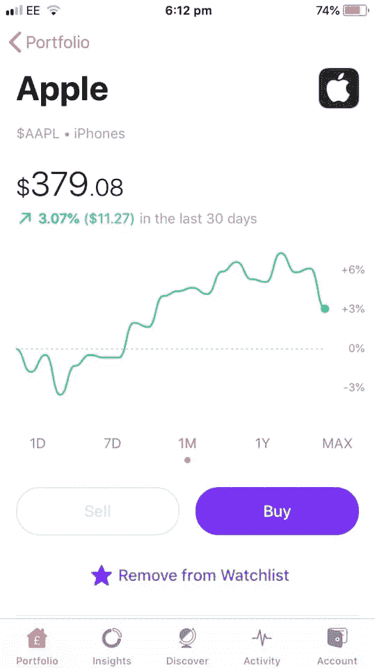

# 如何用 4 个简单的步骤开始投资

> 原文：<https://medium.datadriveninvestor.com/how-to-start-investing-in-4-simple-steps-4d54761698f7?source=collection_archive---------3----------------------->

## 投资从未如此简单

Photo by [Mark Finn](https://unsplash.com/@mrkfn?utm_source=unsplash&utm_medium=referral&utm_content=creditCopyText) on [Unsplash](https://unsplash.com/s/photos/investing?utm_source=unsplash&utm_medium=referral&utm_content=creditCopyText)

当我 2011 年大学毕业时，我想投资股市。唯一的问题是，我不知道该怎么办。

从来没有人教我如何开始投资。这个话题在学校从未被提及，在我们毕业前举行的大学会谈中也没有任何人提及。

我知道这是一个好主意，开始投资，由于法律的复利，我只是不知道如何开始。

最终，我的新工作让我分心了，随后在不同的国家旅行和生活了五年，然后我发现自己回到了英国，经济状况有所恶化，仍然不知道如何投资。

 [## 轻松投资颠覆性技术|数据驱动型投资者

### 研究并做好你的尽职调查，找出 10 个可能主宰未来行业的装袋者可能会很难。的…

www.datadriveninvestor.com](https://www.datadriveninvestor.com/2020/07/13/investing-in-disruptive-technology-made-easy/) 

大约就在这个时候，我决定认真对待投资。我看到一句名言，这句话总结了原因:“种植一棵树的最佳时间是 20 年前，第二好的时间是今天。”

这句话概括了投资的重要性。你做得越早，你在这条路上就越顺利。对许多人来说，问题是开始往往是最难的部分。

几年前我也遇到过这种情况，完全不知道该怎么办。现在我对投资股票市场有了更多的信心和知识，我不敢相信我花了这么长时间才投入进去。

下面是四个简单的步骤，任何人都可以遵循，开始投资，把你的钱用好！

# 下载应用程序

当我 2011 年离开大学时，应用程序还是一个新事物。今天，它们是我们移动设备功能的关键部分。俗话说，有一个应用程序，从来没有如此真实。

今天就开始投资，你所要做的就是下载一个交易应用程序，然后你就可以开始了。罗宾汉是一个受欢迎的应用程序，如果你住在欧洲， [Freetrade](https://medium.com/u/c727c9d21230?source=post_page-----4d54761698f7--------------------------------) 是一个优秀的应用程序，买卖股票不收任何费用！

一旦你下载了应用程序，并按照屏幕上的所有程序操作，比如填写 W-8BEN 表格，声明你不是美国税收居民，如果你住在美国以外，你就可以开始了！

Screenshot of the Freetrade app.

当然，你可以通过经纪公司用老办法做事，但为什么要这么麻烦呢？当你可以下载一个 app，不需要支付任何佣金就可以买卖股票的时候，还有什么意义？

投资股市从来没有像今天这样容易。一旦你的应用程序启动并运行，你就可以开始在你的投资组合中添加股票了。

# 研究，研究，研究

我记得当我第一次把自由贸易下载到我的手机上，并把一些钱存入我的账户。感觉圣诞节提前到来了。问题是，一旦你建立了一个账户并准备好了，挥金如土的诱惑就很强烈！

股市不可预测，你的钱有风险。如果一只股票下跌或破产，而你投资了它，那你的钱就没了。这就是为什么在你买任何股票之前做研究是很重要的。

我的第一个建议是买一本个人理财书籍，它将帮助你理清你的财务，并指导你如何构建你的投资组合。《我会教你变得富有》是一本很棒的书，对我帮助很大。

股票市场的诱惑是投资你了解的公司，虽然这不是一个坏主意，但不是最好的。是的，特斯拉是一家伟大的公司，我也是它的股东，但是它的股票现在比我第一次投资的时候值钱多了！

对于股票市场的新手来说，最好的起点是指数基金。这些基金将最大的公司汇集成一个大基金。如果你投资一家独立的公司，你可能不会获得超高的回报，但它们的波动性要小得多。

如果基金中的一家公司破产，它们会被另一家取代，你不会损失任何钱。像[先锋](https://www.vanguardinvestor.co.uk/)这样的基金以年复一年持续获得回报而闻名。如果你每个月投资一个稳定的数额，那在五年内会很有价值。

如果你下定决心要拥有一支特定的股票。前往[雅虎财经](https://uk.finance.yahoo.com/)，深入了解该股的基本面。看看它的资产负债表和季度业绩。如果你在读完所有这些后不知道发生了什么，那么你可能应该坚持指数基金！

# 使不同

任何投资组合最重要的一个方面就是多样化。作者[纳西姆·尼古拉斯·塔勒布](https://medium.com/u/f138bf5466fe?source=post_page-----4d54761698f7--------------------------------)因其著名的[杠铃策略](https://www.investopedia.com/articles/investing/013114/barbell-investment-strategy.asp)而闻名，该策略建议你在极其安全的投资中投入大量资金，然后将部分资金投入投机性押注。

这对大多数初学者来说可能太复杂了，所以另一个好主意是遵循雷伊·达里奥的[全天候投资组合](https://www.iwillteachyoutoberich.com/blog/all-weather-portfolio/)策略。对于大多数新手来说，这是一个更容易实现的投资方式。

你想在全天候投资组合中做的是将你的投资分散到几种资产中。所以，你会投资股票、长期债券、中期债券、黄金和大宗商品。

这样，万一股市暴跌，你也能得到保护。通过这样做，你可以保护自己免受黑天鹅事件的影响，比如 2008 年的股灾和冠状病毒，这是有可能发生的。

如果你把所有的鸡蛋放在一个篮子里，你就在冒财务毁灭的风险。想象一下，如果你在安然 2001 年倒闭前只投资了它的股票。你会没钱也不走运。

多样化意味着当市场变得更糟时，你会受到保护。当股票下跌时，资金通常会流入大宗商品和黄金等更安全的投资领域，这些被认为是价值储存手段。因此，当你的股票下跌时，你的其他投资会得到补偿。

这是一个为长期规划的策略，意味着你不会遭受与 1929 年华尔街崩盘或 2008 年金融危机期间损失惨重的多名投资者相同的命运。

# 每月投资

现在你已经有了自己的投资组合，你要确保每个月都把钱投入其中。这样，你的投资组合价值增加，你可以让复利发挥它的魔力。

最简单的方法是从你的银行账户直接扣款。当你的工资支票每月入账时，金额会自动记入你的交易应用程序的借方，供你投资。

这可能听起来令人生畏，尤其是如果你的工资每月都在变化，但这种疯狂背后有一种方法。如果你不这样做，很容易忘记把更多的钱放进你的交易账户。

这样做的问题是，你最终会错过长期增长，更糟糕的是，完全忘记投资。建立直接借记意味着你不必考虑每个月转移你的钱，这已经为你做好了。

这让你更容易养成投资习惯，从而腾出你的时间和精力去做其他更重要的事情。投资很像写作，如果你不断出现并做出明智的选择，你投入的时间和努力最终会得到回报。

无论你做什么来简化这个过程，都只会加快你的回报。

**访问专家视图—** [**订阅 DDI 英特尔**](https://datadriveninvestor.com/ddi-intel)