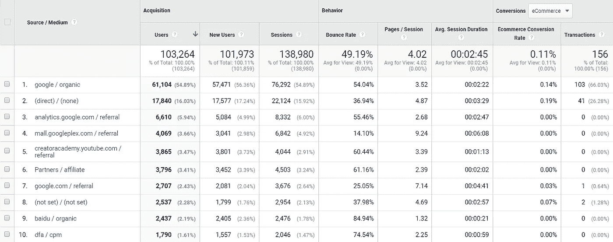
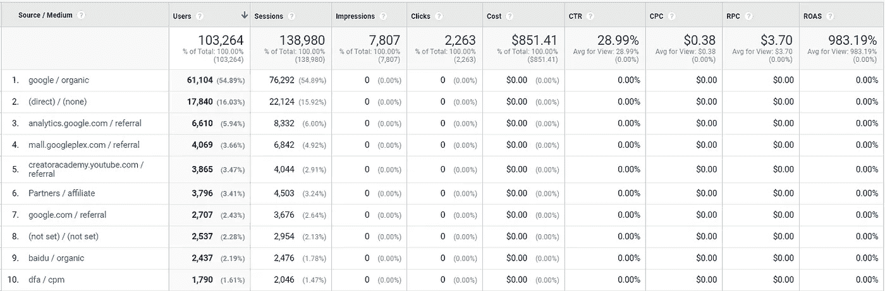
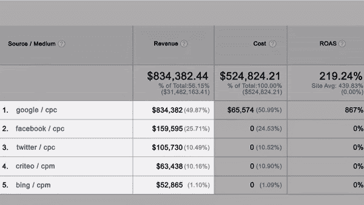

# 如何开始网上销售

> 原文：<https://medium.datadriveninvestor.com/how-to-start-selling-online-a61739268c78?source=collection_archive---------16----------------------->

Source: [Depositphotos](https://ru.depositphotos.com/179277422/stock-photo-businessman-using-digital-shopping-icons.html)

## 在线开展业务并快速吸引新客户的指南。

一些正在艰难地转向线上的商家，例如，线下零售店。网站的开发对于线下零售来说是不必要的，所以通常会尽可能推迟。现在，当疫情冠状病毒导致隔离覆盖全球时，更多的人呆在家里，在网上购物。每个企业都必须为在线销售做好准备，以保持盈利。

请记住，冠状病毒疫情将会结束，但来到网上商店的顾客会在之后继续与你在一起。

# 隔离期间您的业务如何变化

由于冠状病毒的传播，许多行业(旅游业、运输业、制造业等。)损失很大，那些变化也触动了中小商家。

**首先要知道的**:2020 年的所有预测和发展计划都不再相关。由于疫情，经济形势、消费重点和消费方式都发生了变化。

 [## 影响者在聚光灯下表演|数据驱动的投资者

### 影响者营销是一个脱颖而出的游戏。结果是一个令人难忘的-和可信的-连接到一个产品或…

www.datadriveninvestor.com](https://www.datadriveninvestor.com/2020/01/15/influencers-perform-in-the-spotlight/) 

**其次**，人们不断购买。越来越多的买家出现在网上。这意味着新的商业机会已经到来，是时候利用它们了。根据[eMarketer](https://www.emarketer.com/content/coronavirus-is-changing-how-consumers-shop)的首席分析师 Andrew Lipsman 的说法，“但是他们的家庭需求不会简单地消失，甚至可能随着许多人寻求储备资源而增加。”

为了做出正确的决策，您需要了解客户行为是如何变化的。您应该注意客户行为的一些特征:

1.  人出门少，很少逛线下店。
2.  疫情鼓励顾客一次购买更多的商品。
3.  人们专注于必需品。
4.  网上销售的数量和频率都在增加。
5.  送货上门成为在线服务的必备功能。
6.  人们仔细选择他们购买的每件产品。
7.  顾客推迟所有昂贵的购买。
8.  人们减少旅行次数，远程工作，投资自我发展。

公司是如何看待这些新闻的？例如，大多数企业推出了送货上门(甚至非接触式送货)和在线购物应用程序或在线服务。

如果你的客户现在更喜欢网上商店，广告预算应该重新分配到网上。与此同时，广告预算也减少了，因为所有企业都试图在危机期间减少开支。为了让它变得聪明，你需要应用**营销分析**。对于初学者来说，现在是开始学习和实施分析基础知识的时候了，对于有经验的专家来说，现在是根据掌握的数据自信地优化营销的时候了。

没有高质量的数字分析，你的企业在网络海洋中是“盲目的”。如果没有线下销售和与客户直接沟通的可能性，您的在线行动必须依靠分析数据来避免错误假设和无价值支出的“冰山”。借助数据分析，您将通过比较广告服务的成本数据和 CRM 系统的收入，了解如何降低广告成本和提高广告效率。

# 网上销售的基石

# 网站(全球资讯网的主机站)

要推出一个网上商店，你不必雇佣一个开发团队，从头开始写代码。有很多网站建设者，有付费的，也有免费的。自由构建者没有各种各样的模板和模块。但现在，更重要的是快速推出你的商店，提供基本的购买和服务选项。稍后你会有时间考虑复杂的设计。

最受欢迎的建筑商是:

*   [WIX](https://www.wix.com/)——是网站建设者中的市场领导者。它有一个广泛的模板集合，可以方便地分为不同的类别(商业、在线商店、登陆页面等)。).WIX 的网站针对移动设备进行了优化，并有一个全面的帮助中心。
*   [Tilda Publishing](https://tilda.cc/?lang=en)——非常适合快速轻松地创建登录页面和在线商店。在免费版中，你可以用基本模块创建一个网站。其余的功能都要付费。该服务也有网站管理的移动应用程序。
*   WordPress——是一个免费平台，运行着知名公司，如 Spotify、CNN、TED、IBM 等。

考虑到付费网站建设者，你应该试试 [Shopify](https://www.shopify.co.uk/) 、 [uKit](https://ukit.com/) 、 [Squarespace](https://www.squarespace.com/) 。

# 呼叫跟踪

大部分以前线下购物的人现在被迫转向网购。这意味着他们希望与真实的人有更多的交流，更多的关注，因为他们对互联网服务的经验和依赖较少。因此，您还应该将电话跟踪系统连接到网站，帮助您改善客户支持并确定网站流量的热门来源。最受欢迎的服务有 [Ringostat](https://ringostat.ua/en/) 、 [CloudTalk](https://www.cloudtalk.io/) 、 [Clixtell](https://www.clixtell.com/) 、[engage ebay](https://www.engagebay.com/)等等。

# CRM 系统

为了收集更多关于你的客户的数据，使用 CRM(客户关系管理)系统来存储使用你的网站和商店的所有客户的数据。这个系统把所有必要的信息都保存在一个地方。

市场上有许多不同版本的 CRM 系统，包括小公司免费使用的可能性。以下是一些最受欢迎的解决方案:

*   [Bitrix24](https://www.bitrix24.com/) —帮助控制与客户沟通的所有渠道，实现销售自动化。该服务还内置了 IP 电话和邮件集成。
*   [Pipedrive](https://www.pipedrive.com/) —被超过 90，000 家公司使用。它跟踪你与客户的沟通，并与你最喜欢的销售促进应用程序轻松集成。
*   [Salesflare](https://salesflare.com/) —是一款简单但功能强大的 CRM，适用于销售 B2B 的小型企业。

# 为您的团队提供视频通话服务

要联系您的员工，您应该选择视频通话提供商。有时候和同事打个简短的电话比花一天时间查看和回复邮件更有效

最受欢迎的服务是 Skype 和 Google Hangouts。如果你有一个大团队，你需要其他选择。例如，你可以免费使用视频会议服务，如 [Zoom](https://zoom.us/) 和 [Trueconf](https://trueconf.com/) 。

# 广告

启动网站后，您需要告知您的客户，您的商品或服务现已在线提供:

**第一步**。在投放广告之前，考虑一下你在追求什么。一个容易跟踪和衡量的目标是，例如，“N 个客户收到了 N 笔钱。”太抽象的目标很难评估。

**第二步**。运行你的广告来增加你网站的流量。

**第三步**。调整再销售。回访已经熟悉你公司的老客户总是比吸引新客户更容易(也更便宜)。

**第四步**。衡量动态和同期的关键数字(月与月、季度与季度)。

所有的公司在网上变得比以前更加活跃。因此，信息噪音增加并迷惑了潜在客户。明智地使用你的广告预算，在竞争对手中保留位置，衡量所有广告。它有助于您:

1.  迅速了解你的广告是否带来销售。
2.  如果你的活动没有效率，及时改变你的推广策略。

# 如何用谷歌分析来衡量在线广告的效果

**第一步**。你需要跟踪和衡量你的广告，了解哪些产品和广告来源盈利。如果你还没有太多的数据，而且你刚刚推出你的在线商店，那么谷歌分析非常适合你。我们建议你阅读我们关于如何设置谷歌分析的详细说明。

**第二步**。你需要添加一个独特的代码到你的网站，谷歌分析开始工作。好消息是——你不需要雇佣一个 web 开发团队来做这件事。[谷歌标签管理器](https://www.owox.com/blog/use-cases/what-is-google-tag-manager/)，缩写为 GTM，帮助你添加代码片段。

使用 GTM 有助于避免可能的错误和故障。一旦为站点设置了标记管理器代码，就可以在服务中实现所有其他设置。

**第三步**。要跟踪广告活动，您必须配置 UTM 标签。有了它们，你可以发现哪个广告吸引顾客，哪个广告活动有效或无效。

**第四步**。从广告服务导入成本数据。谷歌分析只自动传输来自谷歌广告的数据，但来自[脸书](https://www.owox.com/products/bi/pipeline/facebook-to-google-analytics/)、 [Instagram](https://www.owox.com/products/bi/pipeline/instagram-to-google-analytics/) 、 [Twitter](https://www.owox.com/products/bi/pipeline/#provider=twitter) 和其他网站的数据必须单独上传。为什么需要这些数据？发现哪个广告活动最有效，哪个广告活动应该被禁用。

一开始，如果你只有几个广告源，你可以很容易地手动下载数据。但是随着广告渠道和广告活动数量的增加，考虑这个过程的自动化是值得的。否则，你会发现自己在例行公事和无聊的数据传输工作的废墟下。为了节省时间和避免人为错误，你应该自动化你的营销。

[OWOX BI](https://www.owox.com/products/) 可让您轻松快速地设置不同广告服务的自动成本数据收集。此外，OWOX BI 检查 UTM 标签并转换货币。

# 如何使用谷歌分析获得 ROAS 报告

谷歌分析提供了两个选项:

*   **标准**显示订单和利润。
*   [**增强的电子商务**](https://www.owox.com/blog/articles/ecommerce-google-analytics/) 显示基于漏斗的分析。

要获得关于每个广告来源或渠道的信息，您需要采集-所有流量-来源/媒体报告:

Image courtesy of the author

该报告提供了不同的行为指标(用户在您的网站上完成的会话数量、平均会话持续时间、用户在一个会话中查看的平均页面数量等)。数值越高(当然跳出率除外)，对访问者来说网站越好。

它意味着人们停留在网站上并与之互动(例如，购买商品)。

当您想要衡量广告的盈利能力时，您需要获取—活动—成本分析报告:

Image courtesy of the author

**重要提示**:如果您使用不同的广告服务(谷歌广告和脸书等)，您需要在谷歌分析中设置成本数据导入。否则，您的数据是不正确的。

最重要的是搞清楚广告是否有回报，是否带来收入。为此，你需要比较广告活动的成本和收入。请特别注意 ROAS 指示器！

**重要提示**:你应该至少每周监测一次 ROAS。如果你在广告上花了很多预算，每天检查一下。

Image courtesy of the author

不同的业务有不同的 ROAS 指标；他们中的一些人甚至可以在低 roa 的情况下赚取利润，而另一些人则需要非常高的指标。最主要的是投资回报率是:

*   积极的。
*   高于 100%。

如果 ROAS 是 100%左右，那么投入的钱就有回报了。如果在 100%以上，你就赚了。

# 如何利用营销渠道与客户沟通

数字是业务增长和创收的唯一可用渠道，隔离后，这一渠道将继续增长。

通过在线营销渠道与客户沟通有助于您的企业保持运转。让人们知道您在隔离期间正在做什么:

*   告诉他们你的工作安排。
*   报告运输机会(包括无接触交付)。
*   显示您的网站和手机应用程序进行订购。

最重要的是，表明你理解客户面临的困难，并且你有解决他们问题的办法。

# 社交网络

人们呆在家里，但是人们需要交流。因此，在覆盖范围方面，它不可能与社交网络竞争。利用社交媒体推广你的商店和商品。此外，您的社交媒体页面是支持客户的绝佳平台。

# 电子邮件营销

电子邮件是向客户展示个性化方法的最有效的广告工具之一。尤其是现在，当人们仅限于在线交流时，提醒邮件会提醒他们关于你的公司。您可以通知客户促销活动，告诉他们新的运输服务，或者为特定商品提供个人折扣。

你可以使用免费的电子邮件生成器，比如 [Stripo](https://stripo.email/) ，来创建群发邮件列表。有了它，您可以快速定制您的电子邮件模板，无需 HTML 知识。此外，Stripo 允许你在 90 多个流行的环境中预览电子邮件的布局。

其他流行的电子邮件营销服务:

*   [Mailchimp](https://mailchimp.com/) 提供细分和行为定位，如果你每月发送 10，000 封信，它也是免费的。付费计划也可进行 A/B 测试。
*   SendPulse 创建自适应信函，并提供超过 130 种电子邮件模板。此外，该服务使用脸书网页上的聊天机器人发送自动回复。
*   [eSputnik](https://esputnik.com/en) 是适用于小型和大型企业的现成解决方案。对于小公司:电子邮件、短信、Viber 消息、网络推送通知和移动推送通知。

# 关键要点

*   过去危机的经验表明，你必须迅速调整业务，才能在艰难时期胜出。
*   人们选择容易记住和找到的品牌。如果顾客上网，公司也应该在那里。
*   将广告成本导入到单一服务中，以衡量成本和收入的平衡，几乎实时地跟踪变化，并在耗尽您的预算之前禁用低效的活动。
*   危机是优化的时候，分析是帮助你的最佳工具。