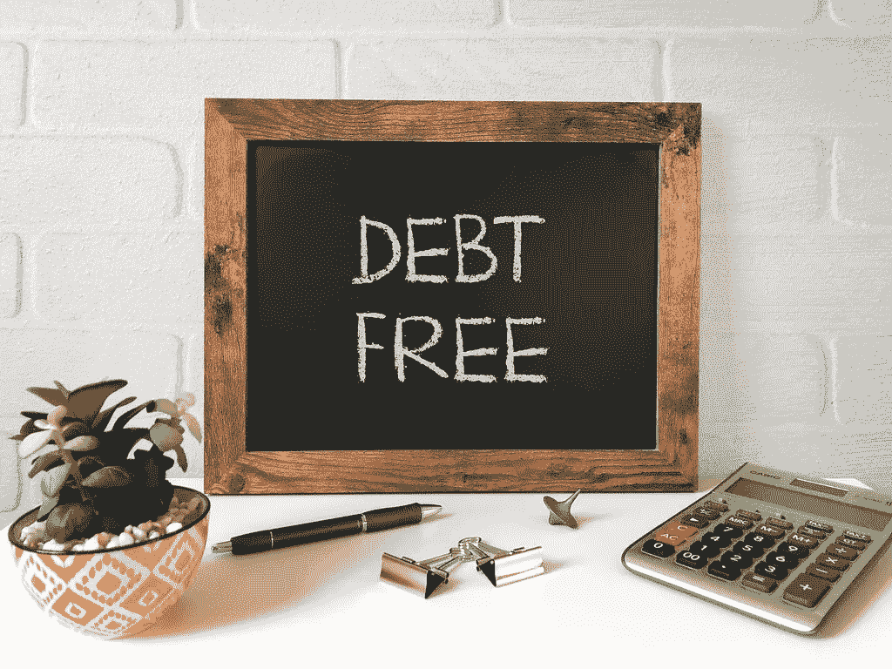

# 如何远离坏账

> 原文：<https://medium.datadriveninvestor.com/how-to-stay-out-of-bad-debt-6e35ad717077?source=collection_archive---------7----------------------->

建立你的财务健康，一次一个明智的决定。

并非所有债务都是坏的，但几乎所有债务都是坏的。你负债越多，就需要越多的时间来摆脱你已经积累的债务。

债务是一种开始时感觉不到的东西，但复合后会变得更大。

大多数人谈论股票市场的复合回报，但复合效应也包括债务。如果你承担了债务，你必须有效地管理它，以避免进一步陷入困境。你必须一直控制你的债务，并跟踪你是如何减少债务的。

如果你不追踪它，你欠的数目会激增，你会处于非常糟糕的境地。为了避免这种命运，遵循下面的建议来摆脱坏账，远离坏账。

 [## 组织债务的问题和机遇|数据驱动的投资者

### 一般来说，处于高速增长中的初创公司和公司有两个共同特征——高度模糊和快节奏。这些是…

www.datadriveninvestor.com](https://www.datadriveninvestor.com/2020/06/29/the-problem-and-opportunity-of-organizational-debt/) 

# 你是怎么来的？

你知道有人超重，健身，变得超级健康，然后体重反弹吗？

在财务上，同样的事情也会发生。有些人摆脱了债务，对自己的成就稍加抨击，然后让自己陷入更深的债务。

如果你不知道自己是如何走到这一步的，你注定要重复同样的决定，做出同样的行为，而这些行为正是你当初陷入困境的原因。

在你解决你面临的任何问题之前，你必须先解决你自己。你要改变成为那种能解决问题的人。

原因可能包括糟糕的财务决策、把钱给了你不该给的朋友和家人、不知道你的数目以及物质主义。

但根本原因总是基于你的金钱思维定势。如果你认为金钱是万恶之源，你会避免赚更多的钱。如果你周围都是负债累累、花钱大手大脚的人，猜猜会发生什么…

人们最终在金钱问题上的立场的一个重要原因是因为他们所受的教育以及他们与谁相处的时间。在你采取任何策略或承诺偿还债务之前，你必须想想你是如何陷入这种境地的。

# 看看你的利率

有些债务比其他债务更难偿还。大多数抵押贷款的利率相对较低。虽然你必须还清，但房产抵押贷款被认为是好债，因为这是一种会随着时间的推移而升值的投资。

虽然大多数抵押贷款利率徘徊在 4%或更低，但信用卡利率是一个非常不同的故事。根据 Wallet Hub 的数据，[信用卡债务的平均利率为新信用卡 18.61%，现有账户 15.09%。](https://wallethub.com/edu/cc/credit-card-interest-rates/52541/)

姑且大方一点说，信用卡为了数学，收取 15%的利率。

你在抵押贷款上投资的每 10，000 美元的利息是 400 美元(假设 4%的利率是相当准确的)。

假设 15%的利率，每 10，000 美元的信用卡债务的利息是 1，500 美元。

两个数字是一样的，但是一个比另一个更伤害你。你仍然需要每月支付抵押贷款，但是在你完全还清信用卡债务之前，没有理由超过最低还款额。

15%的利率对你的伤害远远大于 4%的利率。

此外，提前付清房款在经济上也不合理。我在另一篇文章中分享了更多。

 [## 为什么你永远不应该付全款买房

### 马克·扎克伯格仍然有 30 年的抵押贷款

medium.com](https://medium.com/the-innovation/why-you-should-never-pay-for-a-house-in-full-deb36a3c712f) 

# 设定具体的债务后目标

如果你设定的目标只是过得去，你就不会过得去。如果你设定的目标只是摆脱债务并保持这种状态，你将永远处于边缘。

如果你想要有意义的增长和改变，你必须设定具体的债务后目标。

你每个月想赚多少钱？你希望你的投资组合有多大？你每年想旅行多长时间？

这一切应该在什么时候发生？

很容易产生幻想。更有意义的是，设定可实现但具有挑战性的目标，并与你想要的生活方式保持一致。

债务后的目标会激励你存钱并追求额外的好处。如果你还没有变得更聪明地使用你的钱，你最终会生活在你的手段之下。

当你看到另一边有丰厚的回报等着你时，你会更容易投入工作。当你没有债务并且有足够的钱的时候，弄清楚你的新生活是什么样子的。然后开始做出必要的改变来实现它。

**访问专家视图—** [**订阅 DDI 英特尔**](https://datadriveninvestor.com/ddi-intel)