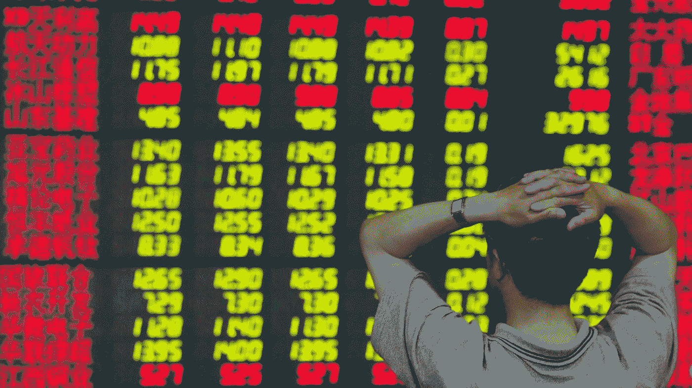
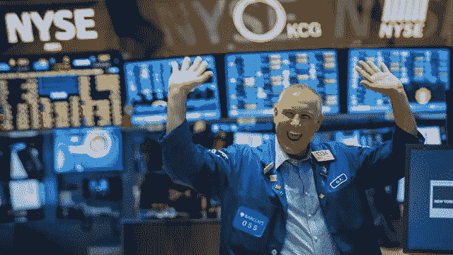

# 当你的投资组合下跌时，如何保持乐观

> 原文：<https://medium.datadriveninvestor.com/how-to-stay-positive-when-your-portfolio-is-tanking-d9c783f717ab?source=collection_archive---------12----------------------->

## 通往财富之路的疯狂之旅

“Alexa, play “Bad Day” by Daniel Powter”

12 月 22 日，我把 6000 XRP 的买入上限定为 0.50 美分。几个小时后，Ripple 被 SEC 起诉的消息传出。我去把我的买入限额调整到 0 . 25 美分，但是太晚了。我的职位已经有人了。消息传出后，人们开始恐慌性抛售，我的股票在几天内下跌了 50%。

大多数人会认为我会为此疯狂。我无拘无束。我已经接受了 XRP 会做两件事中的一件:要么崛起，要么死亡。不管怎样，我已经承认了我的风险并接受了结果。这些年来，我学会了如何在压力下保持冷静——或者像互联网上所说的那样，拥有一双钻石手。

什么是钻石手？这是一个持有高风险财务头寸的人。投资者预计他们的头寸将在未来某个时候恢复。

一个例子是，有人在 2017 年末以 18k 美元的价格购买了一个比特币，并持有到现在。在 2018 年跌至 3500 美元后，这足以让人心脏病发作。在撰写本文时，比特币的价格现在是每枚 3.3 万美元，是初始投资的两倍。

有些投资不会让你担心，有些则需要很大的勇气去管理。如果你是一个焦虑情绪占了上风的人，这里有一些帮助你处理发怒的建议。

# 永远不要投资超过你能承受的损失

这是第一条规则。最紧张的人是那些投入超过承受能力的人。赌上你所有的一切是在玩傻瓜游戏。赌场心态可能在电视上行得通，但在现实中很少会有好结果。

你成功靠的是*而不是*把你一生的积蓄都投资在一个举动上。你想变得富有，坐在海滩边啜饮冰镇果汁朗姆酒？酷，但是你是通过计算风险而不是赌博来达到目的的。

如果你最大的投资失败了，你会有什么感觉？大多数人都会崩溃。这种破坏可以通过分散投资组合来缓解。

# 冷静

总是检查你的投资组合会让你焦虑。你知道你的投资组合下跌了，为什么还要继续检查呢？这就像调查前任，知道看到他们和新的伴侣在一起会很受伤。别再找你不想看的东西了。如果你控制不了，那就随它去吧。谈到市场，最好的办法是设置价格警报，继续过你的生活。

价格警报是当价格达到选定水平时发出的通知。当我以 65 美元投资$OSTK 时，它的价格跌到了 54 美元。因为我相信它会反弹，我在 65 美元的进场点设置了一个警报，告诉我价格是否回到 65 美元。从那里，我可以决定下一步做什么。我会退出盈亏平衡还是继续持有？

设置提醒是一个很好的选择，可以避免每五分钟看一次屏幕。

还有，忽略互联网。不一定要下线，但是不要找让你不安的东西。目前，XRP 正在被加密货币社区嘲笑。在 XRP 之前，比特币是审查和嘲笑的目标。它将成为地球上最受追捧的数字货币。人们讨厌的东西只是为了以后喜欢它们，这是一种暴民心态的表现。

如果从投资中能学到什么，那就是永远不要随大流。

Photo by [Adam Nowakowski](https://unsplash.com/@adamaszczos?utm_source=medium&utm_medium=referral) on [Unsplash](https://unsplash.com?utm_source=medium&utm_medium=referral)

# 了解市场如何运作

投资没有什么是确定的。一家公司可能做得很好，但价格并没有反映出来。价格会无缘无故地上涨或下跌。每个人都希望有一个水晶球来捕捉大动作，但我们没有。因为我们没有，我们做尽职调查。

最好的尽职调查并不简单。投资的目标不是完美，而是正确多于错误。

如果你最怕的就是亏损，那你就走错了游戏。没有人不亏损就能赚钱，但那些亏损不应该一下子就把你的账户抹掉。

哪里有风险，哪里就有回报。了解市场如何运作，有助于我们掌握其概念，并更好地表现。再次，做自己的研究。

# 别听 FOMO 的

如果你查看过论坛和社交媒体，你可能会看到这些评论:

> “进 brso！这东西要去月球了！!"
> 
> “世卫组织卖的每个人都会后悔的！!"
> 
> “这将在下周暴涨！我就是买多了！”
> 
> “买蘸料！不要错过！

不要听那些白痴垃圾邮件时间线与 FOMO 的谈话。听从你的直觉。如果你觉得无论什么原因都必须减少损失，那就去做吧。做最适合你情况的事。

FOMO 害怕错过机会。人们对 FOMO 犯的错误是在最坏的时候进入。最糟糕的地方是在回撤前的最高点或最高点附近。

如果你的投资组合因为 FOMO 仓位而下跌。你有两个选择。你要么坚持，要么减少损失。记住，你不卖就不亏。

你会听到有人谈论人们错过了什么。从比特币到 NIO，人们希望在大肆宣传之前拥有一台时光机。

你错过了大收获吗？它发生了。如果你错过了，就让它过去吧。不要追逐已经离开的公共汽车。等下一个来。

投资者应该有一个明确的目标。二月份，我以 10 美元的价格投资了$SAVE。我一直持有，直到它达到每股 24 美元的高点。看了新闻，我觉得会下跌，所以我卖了。很多人说会更高，但我做了研究，自己做了决定。当你用计划交易时，FOMO 不会影响你。

(Credit: NYSE)

## 在时代中生存

2020 年初，新冠肺炎的消息让市场陷入螺旋式下降。街道上的血迹反映在红色图表和断路器上。在混乱中，我的祖父和朋友打电话给我征求意见。

我的建议？让暴风雨过去吧。

到了夏天，风暴已经过去了。不仅如此，大多数股票都获得了丰厚的回报，对许多人来说，这是最赚钱的一年。

市场发生什么并不重要，重要的是我们如何应对。不管发生什么，坚持住。你会没事的。

**访问专家视图—** [**订阅 DDI 英特尔**](https://datadriveninvestor.com/ddi-intel)