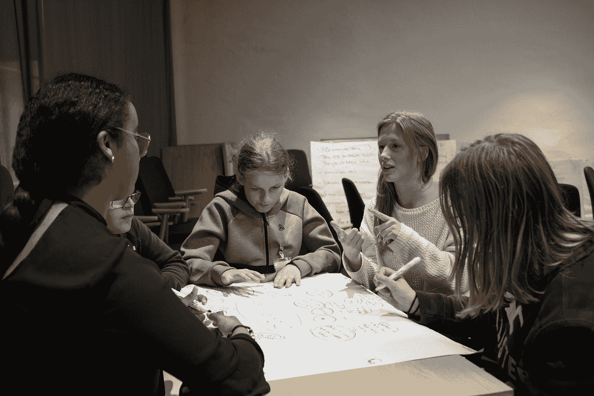

# 如何停止羡慕别人，开始工作

> 原文：<https://medium.datadriveninvestor.com/how-to-stop-envying-others-and-start-working-448d1d616213?source=collection_archive---------9----------------------->

## 停止对他人成功的嫉妒、羡慕和怨恨，变得富有成效

Photo by [Edvin Johansson](https://unsplash.com/@edvinjohansson?utm_source=medium&utm_medium=referral) on [Unsplash](https://unsplash.com?utm_source=medium&utm_medium=referral)

当我们看到别人为成功铺路时，我们会怀疑并把它与一些捷径联系起来。

有了怀疑，下一件让我们不知所措的事情就是嫉妒。我们不能容忍他人的成功。隐藏在我们内心的某种东西想把它从他们那里夺走，变成我们的。

人类是一个复杂的现象。这对每个人来说都很自然。

但是我们中的一些人消除了这些消极的感觉。他们已经发现了嫉妒别人只会让他们的生活变得更糟的本质，这使他们变得没有生产力。

根据心理学家的说法，嫉妒他人不仅会贬低你，还会引发其他负面情绪，如仇恨、愤怒和敌意，这些情绪会进一步破坏你的身心健康。

但是，如果你再三考虑，把嫉妒的帷幕从你的眼中移开；你会发现他们的成功并不是突如其来的，而是一个漫长、艰辛和痛苦旅程的产物。

以这种方式看待他人，会给人一种敬畏和尊重的感觉，你会欣赏他人。

但问题是如何停止羡慕别人，开始做自己的工作。这是你可以做到的。

# 嫉妒是自然的，但不摆脱嫉妒是个人的

人类由各种元素组成，并被赋予了各种各样的感觉和情感，如爱、恨、嫉妒、妒忌、愤怒、恐惧和忍耐。

还有很多其他的感觉，我们不能说出它的名字，但它们是存在的。

所有这些感觉和情绪都是自然的，是由某些事件和情况引起的。

但并不意味着这些感情有压倒性的力量。如果我们只培养一种东西——耐心，所有其他的感觉都是可以控制的。

如果你掌握了你的耐心，它会让你用不同的眼光看待事物。所有其他的情绪都不会蒙蔽你。

每一种情绪开始都是强大的。但几分钟后，一个人可以用耐心和理智驱散它的魅力。

耐心允许一个人有空间使用他的思考和推理能力。当你想到其他人是如何取得成功的，你就会知道他们的忍耐、挣扎、痛苦和所有其他与此相关的事情。

这种体悟给了你一条走出被羡慕的圈子，步入欣赏和仰慕的圈子的路。

欣赏和钦佩是积极的情绪，也激励你努力工作，并致力于你的目标。

它讲述了如果别人能做到，为什么你不能？

它让你兴奋不已，让你更有活力地工作。

这也迫使你思考为什么你落后了。为什么你没有得到你想要的结果？

把嫉妒变成积极的嫉妒感，也会让你成功。

一点点嫉妒总是好的，如果它只是刺激你工作的话。

如果你已经适应了这种类型的嫉妒，我告诉你去做。是积极的羡慕。它让你变得伟大。

但是如果你的嫉妒蒙蔽了你的双眼，让你变得没有生产力，因为它压倒了你，阻碍了你做更多的意愿，那就远离它。

这是消极的嫉妒，它消耗你的能量，除了痛苦和折磨之外，什么也没给你回报——一切都是徒劳的。

# 记住，你有不同的命运

成功对我们所有人来说都不是客观的。这是非常主观的。

对一些人来说，成功可能是通过毕业考试或建立一个家庭，或找到一份工作并赚很多钱。

对于另一些人来说，成功似乎是找到了一个爱人，拥有了一段美好的感情，或者帮助了处于困境中的他人。

甚至写一篇精彩的文章或一首伟大的诗或画一幅杰作对一些人来说也是一个巨大的成功。

找出你的成功。问问你自己什么是你的成功？

有很多钱是不成功的。获得学位并不是成功。找一段美好的感情也不算成功。

成功取决于你对成功的想法。

也许早起对你来说是一种成功。也许塑造一个好的外形对你来说就是一种成功。也许一口气跑 10 英里对你来说就是成功了。

我们的成功不一样。如果它与金钱或美好生活有关，你不会知道你看到的成功对他们来说可能不是成功。

# 我们来自不同生活阶层

每个人的生活都不一样。

也许四个邻居上同一所学校，坐同一辆公交车，住在同一个小区，但这并不意味着他们的生活是一样的。

不是两个兄弟姐妹过着同样的生活。我们都来自不同的阶层。

我们的成功取决于我们来自何方。

也许你姐姐有最好的工作，你羡慕她过着最好的生活。但她可能会认为这是一场噩梦。

也许她认为你享受过生活。因为它的人性。

而且俗话说，草总是另一边绿。

了解自己和他人的情况。

也许从一开始你就被给予较少的机会。因为你被赋予了能力，可以为自己得到你现在可能用不到的东西。

其他人可能什么都没有，这就是为什么他们被别人给了东西或提供了直截了当的情况。

因为把他们放在我们的地方会危及他们的生命。

你不能指望一条鱼在地上跑来跑去。你不希望鸟在水中游泳，像鱼一样生活。

如果他们都敢这样做，他们将冒着生命危险，几个小时后就会死去，如果不是几分钟的话。

# 做比较的话不要有选择性

不管我们愿不愿意，我们都会进行比较。

看，他有一辆漂亮的车

*“为什么我没有这么赚钱的工作”*

*“什么！她又升职了？”*

是的，当我们看到别人出类拔萃时，所有这些问题都会直接或间接地浮现在我们的脑海中。

我们把自己和周围的人进行比较。这也是自然的。但是仅仅将他人的成功或光明的前景与我们生活中严峻的一面相比较是不公平的。

是吗？我不相信。当我还是个孩子的时候，我经常拿我的悲惨生活和我邻居的其他孩子做比较。甚至在我读大学的时候，甚至在今天，我都拿自己和别人比较。

但那时候，我的生活很悲惨。我还是个孩子，贫困让我很容易失明。我看不到我有什么。甚至到了今天，有时我还会质疑为什么我买不到车。

附近很多和我同龄的人都有自己的车。但现在我思考并运用我的理性。我也比较我们生活的其他方面。

每当我自发地遇到这样的感情，我就不像以前那样娱乐那么久了。相反，现在我想到了我的成就。

我是我们附近为数不多的大学毕业生之一。我想到我的教育和我的好的教学工作。

我在想我的家人。四个漂亮的孩子和一个可爱的妻子。

我想到了我阅读和理解书籍的习惯。我认为我的能力可以做得更多。我很高兴我能把我的想法写出来。

他们不能做所有这些事情。他们不能阅读一本书，或者即使他们能，对他们来说也是不愉快的。因为他们缺乏教育。我相信这些年来他们为了赚钱而付出的努力是浪费时间。

到目前为止，他们很难接受教育。当我想到我被赋予了所有这些知识，并且现在已经完成了，并且获得了丰厚的回报，我感到更加幸福。

我相信他们生活得很好，有好车，也许还有一点钱，但我也相信他们不能像我一样喜欢看书。我知道他们不能接受一个能给他们洞察力或至少精神愉悦的想法。

他们不可能像我在优秀的书中看到的那样去探索这个世界和美好的生活。他们不知道我知道什么，我相信知识比金钱更有价值。原因是我们在学习和认知上花钱。

**所以，每当你把你的生活和别人比较时，要完整地比较；不在零件中**。然后睁大眼睛看一看，你所拥有的是他们所没有的或者不可能拥有的。

也许你的邻居比你富有，但你比她漂亮。现在，如果她把所有的钱都用来打扮自己，她就做不到了。而女人想不惜一切代价变得美丽迷人。所以，他们在化妆品上花了很多钱。

如果你更漂亮，那意味着你更富有。

也许你被赋予了孩子，而其他人被赋予了你所希望的其他东西。但他们可能没有孩子，并愿意放弃他们所有的财产来有一个孩子。

> 记住，你总有别人没有的东西。他们准备牺牲他们所拥有的一切来获得你所拥有的。

拿自己和别人比较。很好。但是完整地去做，你就会知道你是多么富有和幸福。

 [## 宝贵的经验引领数字化成功之路|数据驱动的投资者

### 浮躁在线相当于数字营销的弊端。以错误的方式——或者根本没有——蒙混搜索引擎…

www.datadriveninvestor.com](https://www.datadriveninvestor.com/2020/10/08/valuable-lessons-lead-the-way-to-digital-success/) 

# 也许你还没到时候

俗话说，**每只狗都有自己的时间**。是真的。

你会有自己的时间。当时机成熟时，你会得到一切。

当你做好充分准备的时候，你想要的东西就会来到你身边。又一句俗话说得好，*首先配得上*。

值得很重要。所有有所成就的人。他们应得的。如果你不相信，只要跟随他们的魅力，你会发现痛苦、汗水、努力、耐力和一致性。

在那里你会把你的嫉妒和羡慕抛在脑后。而你的怨恨会变成钦佩和欣赏。

一旦你这样做了，你也会得到积极的结果。你将开始工作，并随着时间的推移取得成果。但在此之前，获得成功是不可能的。

> 任何有价值的事情都需要时间、努力、耐心、坚持和承诺。最重要的是，对自己的信念和奋斗。

所以不要急。做你的工作，等到时机成熟。如果你能等待，并且不厌倦等待，时间就会到来。它一定会到来。

所以工作吧，直到你的时候到来。如果还没来，不代表不会来。它会来的。不要绝望。也许你的时间对你来说很重要。这就是为什么需要时间。

就像大象和母狗不会生出同一个物种。一只母狗两年生四次孩子，但是一只大象生一次。

当一头大象出生时，人们带着敬畏和灵感看着它。狗到处都是，但大象很少。

> 也许你还没有了解你自己。也许你像一头大象。你的成功需要时间来成熟，当它实现时，人们会对你充满敬畏和钦佩。

# 最终外卖

羡慕、嫉妒和怨恨他人的成功是很自然的事情。它们发生在我们每个人身上。但只有目光短浅、智力盲目、忘恩负义的人才会被它淹没。

当你看着别人时，你会被他们吸引。其中一些会激励你，而另一些会带来嫉妒和羡慕的负面感觉。这是自然的。

但是不摆脱它是不自然的。这是私事。你不能控制自己的想法是你的问题。对你的负面感觉和情绪要有所克制，否则它会夺走你已经拥有的东西。

如果你只羡慕别人生活中迷人的一面，而不去关注他们的辛勤工作、应得的自然或其他痛苦，那么你的美丽、健康和工作都会处于危险之中。

他们可能过着地狱般的生活，但你可能视之为天堂。

所以，停止嫉妒，开始工作，变得富有成效的最好方法就是保持耐心和自我控制。

记住你的祝福和别人的堕落。知道你的时间会到来。从好的方面考虑你自己，等待合适的时机。

最重要的是，努力奋斗，即使失败 10 次也不要放弃。就像托马斯·爱迪生失败了一千次一样。如果你不是爱迪生，你可能拥有他的十分之一。

像这样，生活就会富有成效、快乐和繁荣。

## 获得专家视图— [订阅 DDI 英特尔](https://datadriveninvestor.com/ddi-intel)