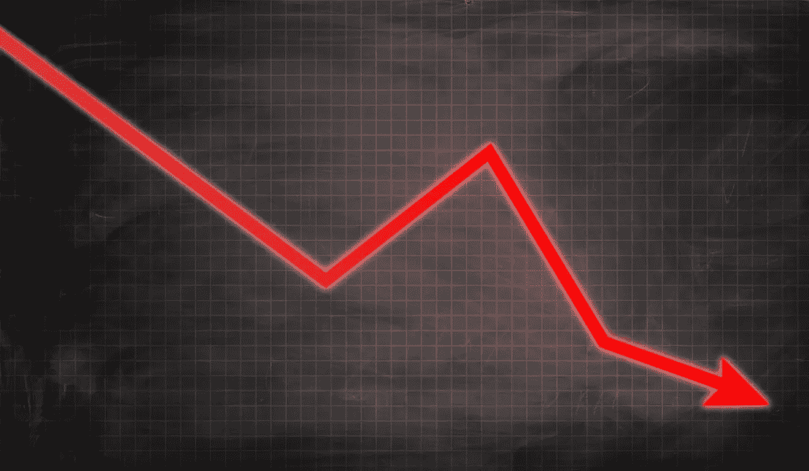

# 如何停止对股市的恐慌

> 原文：<https://medium.datadriveninvestor.com/how-to-stop-panicking-about-the-stock-market-ceac027cb33b?source=collection_archive---------3----------------------->

## 人们会因为告诉你它会崩溃而得到报酬…

人们对股市感到恐慌是很常见的。他们得到一点消息，股市即将崩盘，或者他们最喜欢的投资被高估。

一家大银行的分析师告诉你，是时候远离股市了。由于分析师来自一家大银行，他们被认为是可信的，新投资者通常会相信他们的话。

正是这种情况导致了恐慌性抛售，即人们在冲动之下抛售，而不是采取更有计划的方法。投资者会觉得他们在采取一种经过计算的方法，但这种“经过计算的方法”包括全心全意地遵循分析师的建议，或者对股市连续几天的上涨做出反应。

# 着眼于长远

人们恐慌的主要原因是因为他们看不到长远。他们被今天的股价走势所引导，而不是被潜在公司的潜力所引导。

我们现在在比特币上看到了这一点。在令人惊讶的 2020 年上涨后，比特币的价值迅速下跌超过 20%，并短暂跌破 30，000 美元。基金经理们已经在谈论向 20，000 美元的撤退。

这让你害怕吗？肯定有很多人在顶部买入只看势头，现在最近亏本卖出。基础资产比特币没有改变。只是价格变了。

澄清一下，我没有比特币，可能近期也不会购买。然而，比特币目前的氛围与许多投资者在他们最喜爱的股票出现短期暴跌时面临的情况相吻合。

他们惊慌失措，抛售股票，目前公司周围的消息似乎没有一条是好消息。

只购买你能理解长期前景的投资。如果你不知道现有股票的未来机会，你就不会在下跌时继续坚定地持有该股票。

你选择的股票会有亏损，不是因为你是一个糟糕的投资者，而是因为这就是投资的方式。成长型股票在几乎没有消息的情况下下跌 10%甚至 20%的日子尤其常见。Shopify 就是这些股票中的一只。我一度非常担心 Shopify 的估值，以至于在股价涨到 200 美元之前就卖掉了我的股票。不要犯类似的错误。

# 负面新闻对媒体来说是好消息

你更感兴趣的是一篇解释为什么 2021 年股市会涨 50%的文章还是一篇解释为什么 2021 年股市会暴跌 50%的文章？

几乎每个人都会对谈论潜在股市崩盘的文章更感兴趣。这意味着更多的点击和广告展示。

每年，我们都被预先警告会有假想的股市崩盘，但这并没有发生。如果你听媒体的人说，2016 年、2017 年、2018 年和 2019 年都应该出现股市崩盘。

2020 年的特点是股市以惊人的速度从崩溃中恢复过来，但大型科技公司和其他公司的出色收益给了这次反弹一些好处。现在，一些人已经敲响了 2021 年崩盘的警钟。

我并不是建议你摒弃与自己相反的观点。阅读股票市场崩盘的情景很好，这样你也知道看跌的观点。

然而，重要的是不要轻信股市的负面消息。审视争论的双方，知道你的立场。即使股市进入调整(非常正常，我们每年通常会有 2-3 次调整)，这也不是急于退出的迹象。

只要你喜欢你所投资的公司的长期性质，短期噪音就不会有太大影响。

负面消息唯一会对你的投资产生重大影响的时候，是你了解到投资组合中一家公司的新细节的时候。

如果你投资了 Nikola Motors，当我们都知道 Nikola 把一辆卡车推下山坡来欺骗人们相信他们的技术在起作用时，冲向出口是最理想的。

卖空者的报告应该持保留态度，但当尼古拉承认欺骗，他们的创始人下台并删除他的社交网络时，这是一个危险信号。由于你之前不知道的新细节，投资发生了重大变化。

# 停止每小时检查你的投资组合

看着自己的投资组合是赚不到钱的。你通过工作赚钱，然后你可以每个月将一部分钱投资到你的投资组合中。

不断查看你的投资组合还会引发一种短期思维，即我们更关注当前的股价走势，而不是公司几年后的样子。

如果你对股票市场感到紧张，你会过于频繁地检查你的投资组合。你也有可能过度投资于一只股票，比如特斯拉或 Nio。在这种情况下，你应该更加明确你的标准，并考虑分散你的投资组合，但这并不是每个人都想要的选择…尤其是当涉及到资本收益的时候。

如果你对自己的投资组合感到极度紧张，你也可以将多余的钱投资于被低估的股息股，而不是成长股。

关注投资的长期前景将有助于你围绕投资组合做出更好的决策，避免在错误的时间卖出一支令人惊叹的股票。

[***想学习如何投资股市赚钱？确保你订阅了我的 YouTube 频道***](http://bit.ly/2W4ag01)