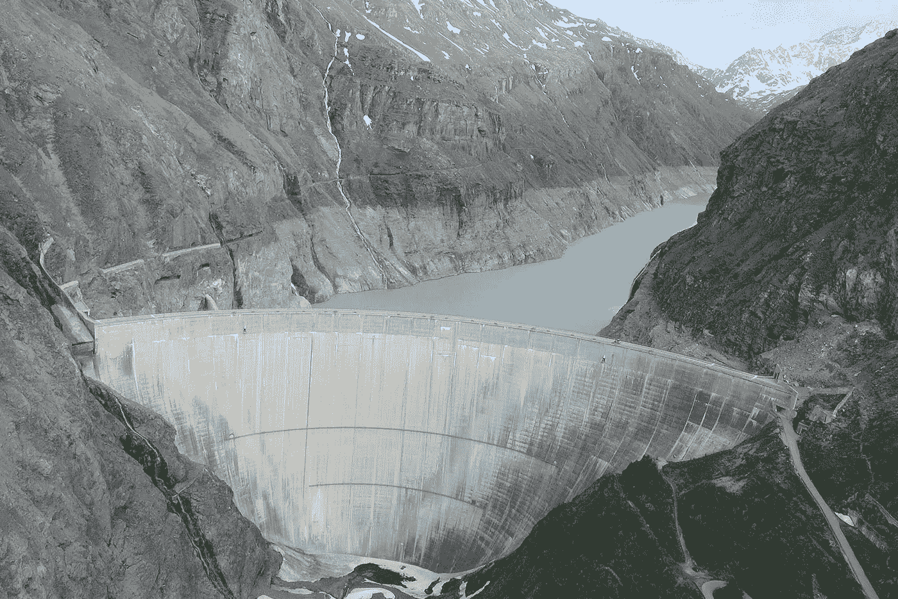
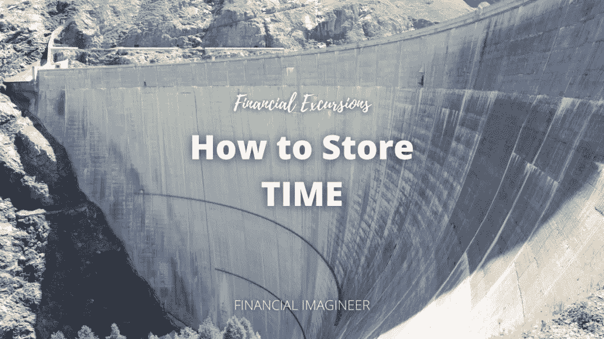
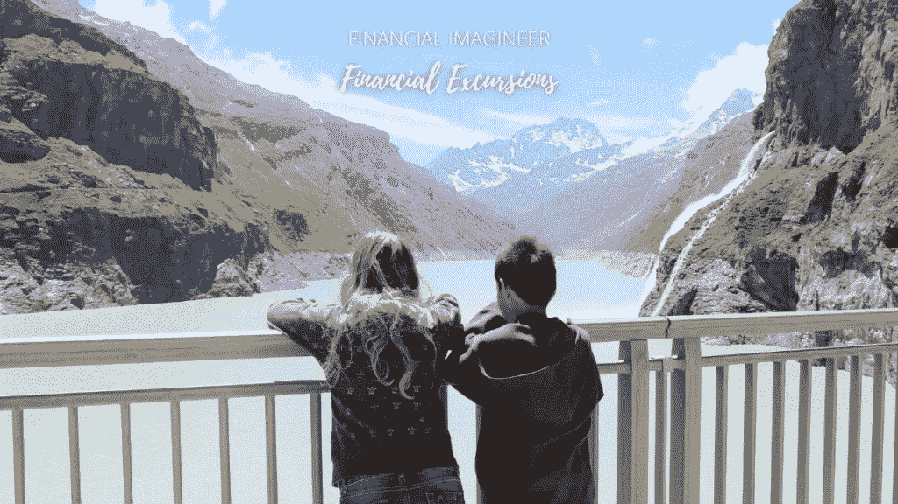
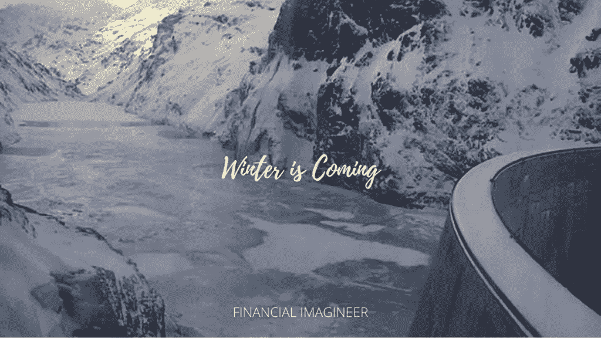
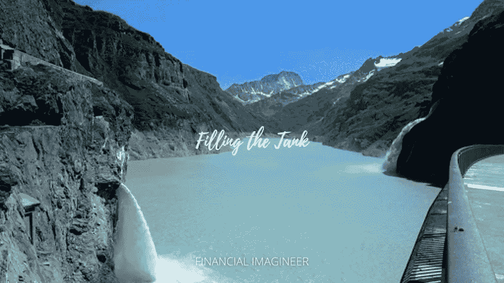
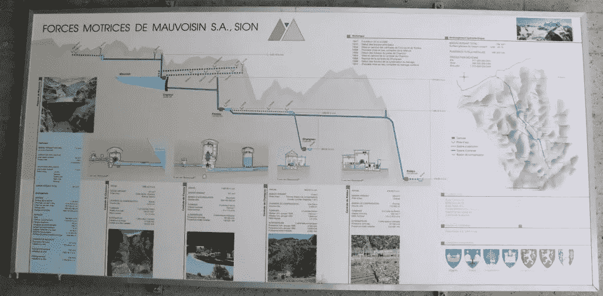
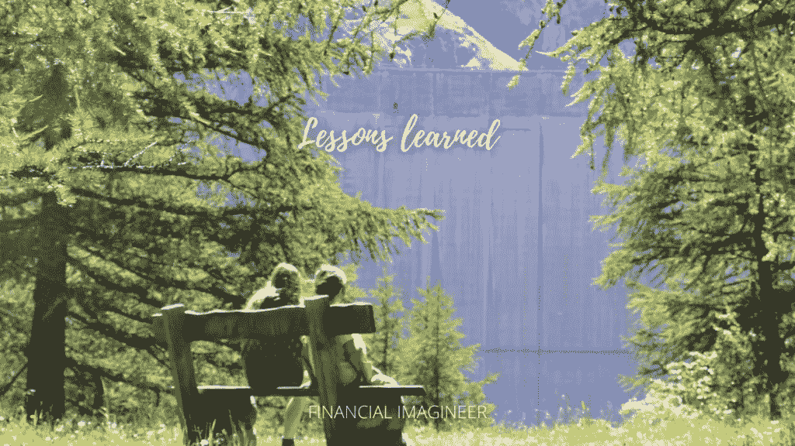

# 如何储存时间——金融幻想家

> 原文：<https://medium.datadriveninvestor.com/how-to-store-time-financial-imagineer-ceddbfb339dc?source=collection_archive---------31----------------------->

这是“金融旅行”系列的第一篇文章，在这里我们将探索如何在了解金钱和你的生活的同时更好地理解这个世界。在我看来，“金融旅行”是教你的孩子钱的最好方法。今年夏天，我们带孩子去参观了瑞士最大的水电站大坝之一。

我们惊叹于这堵巨大的墙，欣赏着它顶部的景色，了解了它的功能，当然，我抓住机会解释了建造大坝是如何类似于获取你的收入流和省钱，从而为以后的生活节省时间。

让我们一起探索我们的发现。

# 拉克莫沃辛

今年夏天，我们去看了莫沃辛大坝。在瑞士，我们非常自豪的是，我们的大部分电力生产来自水力发电(59.9%)，其次是核电(33.5%)，常规火力发电厂(2.3%，不可再生)构成了电力结构。

瑞士目前有 638 座水力发电站。瑞士最大的大坝是高 285 米的 Grande-Dixence 大坝(瓦莱州)，第二大大坝是高 250 米(820 英尺)的 Mauvoisin 大坝，它是世界上第八高的大坝。

Mauvoisin 大坝后面的蓄水形成了 5 公里(3 英里)长的湖，容量为 2.115 亿立方米，从 167 平方公里的区域收集水。

关于这座大坝令人印象深刻的统计数据当然包括了它的发电能力。从 Mauvoisin 大坝释放的水进入山谷中的几个水电站，每年为瑞士电网提供 9 . 43 亿千瓦时的电力。

大坝还被选为世界纪录最高[成功]篮球投篮的完美地点。2016 年，28 岁的澳大利亚人德里克·赫伦(Derek Herron)从大坝顶部发射了一个篮球，篮球从 180 米的高度直接落入下面地面上的一个网中。

# 水和重力

我上一篇关于瀑布的文章涉及了主题[如何建立一个收入流的丰富瀑布](https://www.financial-imagineer.com/2020/08/01/how-to-build-your-abundant-waterfall-of-income-streams/)，在那里我们已经学会了如何使“获得报酬”多样化。

事实是:百万富翁平均有七种收入来源！

有收入流是好事，但一旦“水”流向你，你该怎么办？如果你不做什么特别的事情，“水”就会跟随重力，再次消失在它最初来的那一望无际的海洋中。

看着荒凉的山脉，孩子们可以看到即使在夏天，山脉仍然被白雪覆盖着。从那里，太阳将雪融化成水，当它落下时，能量被释放出来。这种从向下流动的水中释放出来的能量，已经被人类利用了几千年。两千多年前，希腊人已经用流动的水转动磨坊的轮子，把小麦磨成面粉。今天，我们将这种动能转化为电能。

这听起来很棒。然而，这里有一个大问题:随着水的不断流动，你必须在现场不断使用和消耗能量。因此，如果你想推迟消费呢？站在宏伟的大坝上，我问我的孩子们:“如何防止金钱流过你的生活?”？

> *如果你计划一年，播种水稻；如果你是十年规划，那就种树；如果你在规划一生，那就去教育人。*
> 
> *中国俗语*

 [## 加密过山车 ETH2.0 测试网的麻烦，动荡的市场，美联储谈论 CBDCs |数据…

### 是只有我这么想，还是外面的情况越来越乐观了？从酒吧凳体育创始人戴夫波特诺伊泵他最喜欢的…

www.datadriveninvestor.com](https://www.datadriveninvestor.com/2020/08/20/crypto-rollercoaster-trouble-on-the-eth2-0-testnet-volatile-markets-the-fed-talks-cbdcs/) 

# 建造你的大坝

当然，站在上面，孩子们很快就明白了:阻止水流过的最好方法就是建一个大坝。从财务角度来说，这意味着控制你的支出，抑制你随着收入增加而增加支出的倾向:

避免生活方式膨胀。

忘掉攀比吧。

将你流动良好的收入中的一部分重新投入到你未来使用的“蓄水池”中。

为了省钱，你需要在生活中筑起你的理财大坝。

一个有巨大墙壁的容器或工具，可以捕捉你源源不断的收入流，并保持储蓄的“安全”。

我向我的孩子们解释说，一旦[冬天来临](https://www.financial-imagineer.com/2020/09/02/winter-is-coming/)，把所有的水都存起来是多么有用。然后你可以简单地打开阀门，在你需要的时候获得新鲜的能量。

金钱也是一样:

现在就在你的“容器”里装满钱，这样一旦需要，你就可以动用你的存款。

我们将在其他文章中讨论如何处理你的储蓄，因为由于通货膨胀，仅仅把它放在“钱”里已经不是最好的选择了。

我进一步向孩子们解释说，运行这个水力发电厂的人不能收集所有的水，否则会导致下游干旱。

他们排出的水量代表了你生活中的“足够”。

多少钱够了，你的人生才值得活下去？

# 获取尽可能多的收入流

一旦你的大坝建成，尝试收集更多的收入流入你的水库。越多的资源有助于你的收藏，最终就越容易、越快地填满它。

在 Mauvoisin，工程师们建立了隧道系统和更多的偏差，以获取该地区可能的最大水量。

在这一点上，你可以问你的孩子，他们是否觉得通常要花很长时间才能注满家里的浴缸。

如果水从不止一个标签进来，在家里洗个热水澡不是更容易吗？

你放的越多，它就越快变满。

你存得越多，你的目标就越容易达到。

解释一下，金钱也是一样的，最终会买回你的时间。

# 最大化你的潜力

Mauvoisin 系统——和瑞士的其他系统一样——有一个额外的功能，这个功能很多人不知道，但我非常喜欢。

在更下游一点的地方，还有其他更小的水库来重新收集一些水。这些中间湖泊再次成为水库，当水让重力发挥作用时，可以产生更多的电力。

从财务角度讲，这意味着:

明智地花钱或花时间。

最大限度地利用它们。

拥有这样的中介湖也可以看作是“预算”。

让我解释一下:

一天中的能源消耗是不一样的，白天消耗的多，晚上消耗的少。在瑞士，我们也有大量来自核电厂的能源输出。由于夜间使用的能源减少，为什么不重新利用已经产生的核能，将中间湖中的额外的水抽回主水库呢？

为什么这像预算？

假设你计划每月花 40 美元理发。如果你自己剪头发呢？然后你就不再需要你已经准备好的 40 美元，你可以把它放回你的主储蓄。点击此处阅读更多[如果你开始按照这个想法去做，会发生什么。](https://www.financial-imagineer.com/2020/07/23/the-million-dollar-haircut/)

# 按需发电

水电站系统就像一个电池。

你可以用它来捕捉、储存和释放能量。

每当你需要一些，你只需打开标签，立即产生能量。

在这最后一步，结合上面的经验，从金钱的角度考虑水，从时间的角度考虑金钱。

时间就是金钱。

而金钱又可以变成时间。

我的孩子以及你应该从第一次“财务旅行”中得到的主要收获是，现在花/投资一些时间来为你的生活创造你自己的电池是值得的！

你的系统建立得越好，你的生活就会越轻松，越有趣。

相信这篇文章可以帮助你和你爱的人储存一些金钱、精力和时间——这是最有先见之明的——这样你就可以活得更精彩！

如果你有孩子，考虑带他们进行第一次“财务旅行”。

如果你喜欢这篇文章，请不要忘记通过电子邮件订阅我的博客，比如我的[脸书页面](https://www.facebook.com/financialimagineer/)或者在[推特](https://twitter.com/FI_imagineer)上关注我，以便不要错过任何未来的“金融旅行”！

现在，和你自己的孩子一起享受“金融旅行”吧，请和你的朋友和其他父母分享这个想法！

保持好奇，享受探索的乐趣，

马特(男子名ˌ等于 Matthew)

*原载于 2020 年 9 月 26 日 http://www.financial-imagineer.com***。**

## *访问专家视图— [订阅 DDI 英特尔](https://datadriveninvestor.com/ddi-intel)*