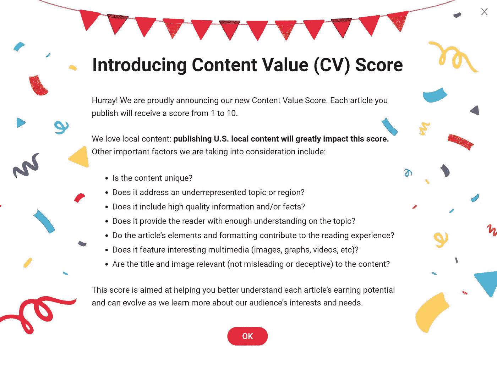

# 如何在新的货币化条款下取得成功

> 原文：<https://medium.datadriveninvestor.com/how-to-succeed-under-the-new-monetization-terms-at-news-break-5ac3f4f0c81c?source=collection_archive---------2----------------------->

以及它与旧计划有何不同

Photo by [krakenimages](https://unsplash.com/@krakenimages?utm_source=medium&utm_medium=referral) on [Unsplash](https://unsplash.com?utm_source=medium&utm_medium=referral)

你上新闻联播了吗？你应该害怕吗？

这很难说，但请继续阅读，了解更多信息。

自 12 月中旬以来，我一直在新闻休息，并一直很高兴我在那里赚了钱。但这仅仅是因为他们提供给新作家的计划。现在程序变了。会更好还是更差？和生活中很多事情一样，看情况。

当我第一次在 Medium 上听说这个平台并查看它时，我几乎立刻就被吸引住了。为什么？很高兴你问了。这是因为他们在我面前晃着一个非常诱人的短语。那句话是，“我们每月至少会付给你 1000 美元。”

等等，什么？

许多媒体作家也加入了这项交易，但据我所知，只有不到 10%的作家每月收入超过 100 美元。幸运的是，我不属于这一类。我在第四个月就扫清了这个障碍，在过去的八个月里，我平均每月收入 1000 美元。

尽管如此，将这个数字翻倍还是很有吸引力的。尤其是因为我跟踪的许多人只是在新平台上重新利用他们的媒体文章。

太棒了。

但是等等，还有更多。更少。

第一，少的部分。那 1000 美元只有在你满足三个条件时才能得到保证。你必须一个月发表 12 篇文章(或者一周 3 篇，具体情况各不相同)，你必须平均每篇文章有超过 500 次阅读，你必须有超过 500 个追随者。根据我使用 Medium 的经验，我不认为这是个问题。但以防万一，还有更重要的部分。

作为“早起鸟”特别计划的一部分，他们会在前三个月提出后两个要求。没错。我不得不一个月写 12 篇文章，甚至不需要是原创的，并且每月带回家一千美元的额外收入。正如堂-科利昂所说，他们给了我一个我无法拒绝的提议。

剧透提醒:我没有拒绝。

然而，我对此表示怀疑，因为这显然属于好得令人难以置信的范畴。但是，嘿，我主要是复制和粘贴，所以让我们看看会发生什么。就这样，在 12 月 11 日，我在 Newsbreak 上发表或重新发表了我的第一篇文章。这也是我在 Medium 上的第一篇文章。我唯一做的改动是标题。

我改标题不是为了让它与众不同。我改了标题，因为与 Medium 不同，News Break 不仅不喜欢 clickbait，而且还鼓励它。这会很有趣的。

我的怀疑一直持续到 1 月 6 日，当时我的新闻简报上的一个链接显示，一笔 1000 美元的支出已被批准。现在，我们正在谈话。我继续复制旧的媒体文章，但也探索和写新的作品。毕竟，我有三个月的时间来弄清楚这个东西是如何工作的，我不想浪费这段时间。我在这里写了另一篇文章。

我对前景既兴奋又对结果失望。在 Medium，我已经聚集了超过 25000 名关注者，我的高度创造性和精彩鼓舞人心的文章获得数千甚至数万次阅读并不罕见。即使我自己这么说。

但是在新闻发布会上，我只有区区 100 个关注者，我的许多文章的阅读量，他们称之为页面浏览量，都是个位数。这两个数字都离 500 很远。我确实发现，本地新闻类文章通常比我在 Medium 上写的那些人类兴趣或生产力类文章做得更好。毕竟，这就是蜜月期的目的。想办法利用这个系统。我是说，利用他们微妙的细微差别。

一周前，当新闻报道说，“嘿，我们有一个新的交易”的时候，我正在慢慢地建立追随者，并学习如何吸引更多的阅读他们在星期五下午说了这最后一件事。我怀疑最后一个离开办公室的人是在他们周末熄灯前负责发送的。

这份简短的说明概述了一项交易，不再有最低要求，而是根据阅读次数乘以一些模糊的评级系统，支付有保证的最低金额。它还提到了前三个月的一项新交易，即不管阅读量多少，每篇文章都支付统一费率。这也是基于文章的评级，尽管没有给出评级系统的细节。

不出所料，致力于这一平台的脸书团体发起了一系列活动。有哪些细节？我们以前的约定呢？那些知道自己无法达到最低标准的人既有庆祝，也有已经达到最低标准的人的愤怒。

最后，昨天，周五晚些时候，他们公布了所有的细节。他们不只是发布它；他们用它打我们的头。每个人都收到了一封电子邮件，里面有新的服务条款和货币化方案的链接。但是他们也在创建者的门户上弹出了一个你必须同意才能进入的页面。

经过许多绝望和困惑，他们透露，这个弹出窗口只是迫使你同意新的服务条款(TOS)，而不是货币化计划本身。你必须访问门户网站上的链接，点击它，并单独同意它。

好吧，那交易是什么？首先，这很大程度上取决于你的文章是如何被评分的。下面是他们如何解释新的内容价值(CV)分数。

Screenshot from News Break

有意思的是，我之前的文章都是有评分的。从他们的角度来看，这有助于了解什么可行，什么不可行。但在我开始之前，交易的其余部分是什么？

对于三个月的签约基本工资，而不是保证的 1000 美元，CV 为 1-4 的每篇文章将获得 25 美元，CV 为 5-10 的文章将获得 60 美元。之后，你会得到每千次页面浏览量 4 美元或 10 美元的报酬，这也取决于你的简历。

那么这对我意味着什么呢？临近支付日期时，我的第一个问题是，这对我的 1，000 美元有什么影响？因为他们给了我历史性的简历，这很容易弄清楚。根据 1 月份的文章和新的基本利率，在新计划下，我实际上比 1000 美元赚得更多。这是好消息。我一会儿会谈到坏消息。

今天早上，当我看到我一月份的 1000 美元报酬被批准后，这场争论就此结束了。二月份是否会成功还有待观察。我想这很大程度上取决于我何时或是否签署新协议。

现在是坏消息。如果我的一篇评级低的文章每千次浏览量为 4 美元，而我的文章有 7 次浏览量，那么，算算吧。我肯定要学习如何让这些阅读量上升，而秘诀似乎是当地的新闻角度。在我的文章中，这似乎是高简历和高阅读数的结合点。这不是我想写的，所以时间会告诉我是否能或想调整。

新的“打破脸书”组织中的一些人指出了这种情况的问题。在他们的案例中，阅读量数万的文章 CV 很低，而 CV 高的文章阅读量相对较低。

所以，更坏的消息是，我的旧媒体文章不太可能表现良好。但至少它们会计入总阅读量。在旧条款下，阅读量低的项目只会拉低我的平均阅读量。我可以想象玩一个游戏，在任何一个月，如果我达到了最低要求，我的平均分上升了，我将不得不停止发布直到下个月，因为害怕平均分下降。现在，每次阅读都很重要。

仍有许多未解之谜。但我会很快找到答案，并会跟进。如果你读到这里，请鼓掌几百次，给我一颗金星，然后评论，我会让你知道我的发现。但我在想的是，我会试着按照老计划完成二月，我希望在三月我能再净赚 1000 美元。然后，在 3 月 1 日，我签署了新协议，这给了我额外的三个月宽限期来解决问题。

所以，这就是我们今天的情况，以及在新闻插播中你如何在新计划下赚钱。

等等，后排有人站起来了。“嘿，达里尔，声乐媒体怎么样？”

嗯，听起来像是另一篇文章。敬请关注。