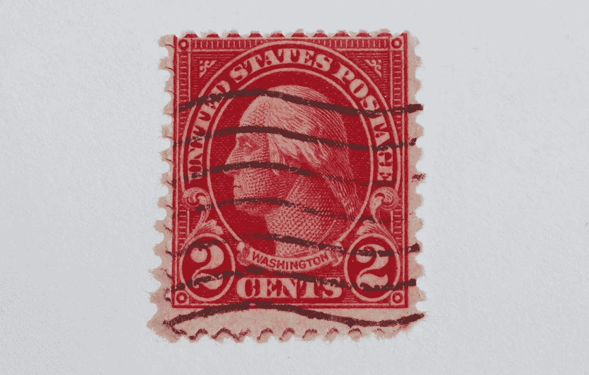

# 当你没有所有正确的关系时，如何取得成功

> 原文：<https://medium.datadriveninvestor.com/how-to-succeed-when-you-dont-have-all-the-right-connections-8b8ca4b10afe?source=collection_archive---------3----------------------->

*我过去的策略是从“没有游戏”到建立一个庞大的冠军网络*

Photo by [Alina Grubnyak](https://unsplash.com/@alinnnaaaa?utm_source=unsplash&utm_medium=referral&utm_content=creditCopyText) on [Unsplash](https://unsplash.com/collections/9323194/my-first-collection/d15d983906400252b94274c68322f38d?utm_source=unsplash&utm_medium=referral&utm_content=creditCopyText)

F 或更好或更坏，很多**生活都是一场竞争**——争夺资源、金钱、教育、工作、住房、关系、接近领导等等。

我们大多数人都想知道:

我们如何玩这种竞技游戏？

规则是什么？获奖者是如何确定的？

但是如果游戏和游戏规则一直在变呢？

当我从大学过渡到开始职业生涯时，这是我必须弄清楚的。

# **现实世界**

关于大学，我欣赏的是你的学校根据你在测验和考试中的表现来评估你。

Photo by [Good Free Photos](https://unsplash.com/@goodfreephoto_com?utm_source=unsplash&utm_medium=referral&utm_content=creditCopyText) on [Unsplash](https://unsplash.com/collections/9323194/my-first-collection/d15d983906400252b94274c68322f38d?utm_source=unsplash&utm_medium=referral&utm_content=creditCopyText)

每门课都给你一个期末成绩，以及一年的总平均绩点，这让你知道你在学校里是**【成功】**还是**【失败】**。

虽然我不是优等生，但大学的比赛对我来说是公平合理的。不管你是谁，也不管你来自哪里，感觉我们都在一个公平的竞技场上竞争。

 [## 在科技中心外创业？It 的 3 个论据|数据驱动的投资者

### 所以你不在像旧金山、纽约、伦敦、北京、特拉维夫或班加罗尔这样的顶级创业生态系统中？许多…

www.datadriveninvestor.com](https://www.datadriveninvestor.com/2020/03/15/startup-outside-a-tech-hub-3-arguments-for-it/) 

然而，一旦我进入公开的商业领域，我注意到竞争环境并不总是公平的，而是经常有利于一些玩家而不是其他人。

虽然天赋、动力、雄心和学术表现在成功中发挥了一些作用，但那些似乎在职业世界中获胜的球员对我来说有一个巨大的优势——**人脉！**

# **人脉很重要**

当我开始职业生涯时，我在一个离我长大的地方有几个州远的城市工作。我没有生意上的联系或关系网可言，我认为只要我擅长我的手艺，这并不重要……但我很快意识到这还不够。

当我和许多来自其他州的人一起工作时，有些人有优势在他们开始生活的地方开始他们的职业生涯。尽管他们经常不相信这一点，但这个在他们成长的地方工作的有利决定让他们有机会接触到数百个，如果不是数千个的话，每天与他们一起工作的潜在关系。

> 当他们需要肉商、面包师、理发师、银行家、经纪人、会计师、警察、律师或法官时，这些联系人会派上用场。

与一个只需打个电话的人保持某种联系(甚至是松散的联系),可以在攀登成功的阶梯上产生巨大的影响。

当然，还有一些享有特权的当地人，他们的家庭成员在社区里有很深的根基，上的都是好学校，是镇上最高级俱乐部的会员，在政府、机构或企业里有着所有合适的关系。

这些人通常会得到一个银盘的人脉关系作为他们的毕业礼物。能够从这些当地联系人中挑选出他们所需要的，可以帮助打开许多大门。

> "我怎么能和他们的黑色通讯录竞争呢？"我想知道。

我对这些人没有任何怨恨。他们很好地利用了在**自助餐厅的生活中**放在他们盘子里的**额外联系人**，这是我们大多数人在同样情况下会做的事情。

> 我的重点是弄清楚我能做些什么来让我的职业生涯走上一条更繁荣的道路。

# 没有游戏

在我职业生涯的最初几年，我被一些同龄人超越，他们在社区中的关系和根基比我好得多。

Pexel: Free to use. No attribution required.

这些关系帮助他们在最好的公司获得合适的面试机会。这帮助他们建立了一个令人印象深刻的参考列表。这些当地人还被推荐到合适的银行、律师事务所、医生和社区的合适的人那里扎根，而我则努力让接待员让我和经理们交谈。

这些关系听起来可能只是微小的优势，但它们可以累积起来，让年轻人在商界有一个良好的开端。

> 当我试着利用我手头仅有的几个联系人时，我那少得可怜的联系人名单并没有涉及到任何势力范围。

更糟糕的是，当我大学毕业时，我不知道如何和陌生人交谈。我害羞、紧张、内向。但是我很羡慕那些人，他们可以走到任何人面前，用自己的方式谈论机会。

虽然我试着去参加一些当地的活动，和当地社区的一些重要人物交朋友，但我并不擅长。他们瞥了我一眼，让我知道我没有合适的车、衣服、袖扣和高尔夫球杆。正如一位当地女士直言不讳地告诉我的那样，

> “…你没有机会和院子里的大狗玩球。”

我所拥有的只是来之不易的学历教育，大量的动力，以及脑子里的一堆理论想法。

> “那我能做什么呢？”我想知道。

就在这个时候,**治愈我网络缺陷的方法**向我袭来。

# **将好想法付诸实践**

回到 20 世纪 80 年代末和 90 年代，如果你想知道你所在的城市发生了什么，你会阅读当地的报纸和商业新闻/贸易杂志。作为职业记者的儿子，我从很小的时候就学会了如何像专业人士一样阅读报纸。

> 我一天可以轻松地浏览几本出版物，而且我对我所读的一切都有强烈的看法。

Photo by [Roman Kraft](https://unsplash.com/@romankraft?utm_source=unsplash&utm_medium=referral&utm_content=creditCopyText) on [Unsplash](https://unsplash.com/collections/9323194/my-first-collection/d15d983906400252b94274c68322f38d?utm_source=unsplash&utm_medium=referral&utm_content=creditCopyText)

但不幸的是，这就是我对这些出版物所做的一切。

我只是读了它们——没别的了。

> 我从未将这些想法付诸实践，也从未将**这些观点付诸实践**。

**但就在那时，我决定尝试一些不同的东西。**

# **我的计划**

由于没有什么可失去的，我决定开始自己建立一个冠军关系网。

我该怎么做呢？

我和自己约定每周至少写三封信给我在报纸上读到的某个有趣的人。请注意，这是一个寄信的时代，阅读你的邮件是人们非常重视的事情。

我的信的收件人可能是我刚刚读过的文章的主题，他们在文章中引用的二手资料或专家，甚至可能是写文章的记者。

Photo by [Miryam León](https://unsplash.com/@miryam_leon?utm_source=unsplash&utm_medium=referral&utm_content=creditCopyText) on [Unsplash](https://unsplash.com/collections/9323194/my-first-collection/d15d983906400252b94274c68322f38d?utm_source=unsplash&utm_medium=referral&utm_content=creditCopyText)

当然，那是在互联网和谷歌出现之前的日子，所以找出这些人的正确姓名、头衔和邮寄地址并不容易。这需要一部固定电话、一本 3 英寸厚的电话簿、一些勇气和大量的聪明才智来向柏林墙的秘书解释为什么你需要这个人的确切姓名、头衔和详细信息。

> 但是获取这些信息是我擅长做的事情。

# **那么，我在这些信里写了些什么呢？**

对于这些每周来信，我有三条简单但严格的规则:

## **规则 1:真诚**

首先，这些信必须是真诚的，真正的与收件人相关的想法，而不是我。

这些信不可能有任何程度的推销，甚至没有一点推销的暗示。他们甚至不能有一丁点儿我试图向接受者推销任何东西的迹象。

与我们头脑中反复思考的所有商业建议相反，这些信件不可能有***行动号召***

这意味着收信人不必对我的信做任何事情，除了满怀希望地阅读和欣赏信中的文字。

但这是我任务中最具挑战性的部分:

写一封如此吸引人的信，以至于让收信人想从头到尾看一遍我的信。我没有写信的技能，我的语法很糟糕，也没有数字语法软件工具或应用程序来帮助我…所以我有我的家庭作业。

## **规则 2:相关**

这些信件必须有令人印象深刻的想法、真实的想法、有用的建议和深刻的评论，这些都与领导者代表他们的公司或个人事业正在努力或试图实现的目标有关。

我怎么知道这些领导关心什么或试图实现什么？

嗯，记者们通常在告知读者这个人在他们的生活或职业中关心或关注什么方面做得很好。但是我也不得不徒步去当地的图书馆(还记得那些建筑吗？)至少每隔一周做额外的研究。

***这次调研和写信很辛苦吗？***

是啊！

但作为一个害羞和孤僻的人，我别无选择，只能把这额外的工作投入到为自己创造更好的未来中去。

# 坚持计划

**每周我都会在当地的报纸和杂志上寻找三篇关于我梦想有一天会遇到的人的相关文章，然后我会给这些人写三封定制的信。**

****

**Photo by [Joe Pregadio](https://unsplash.com/@pregadio?utm_source=unsplash&utm_medium=referral&utm_content=creditCopyText) on [Unsplash](https://unsplash.com/collections/9323194/my-first-collection/d15d983906400252b94274c68322f38d?utm_source=unsplash&utm_medium=referral&utm_content=creditCopyText)**

**自己设定的完成这三封信的最后期限是周五中午。在午休时间，我会把它们投入邮箱，希望这些信能在下周的周一或周二送到领导的办公桌上。**

**我不知道这种给成功人士写信的策略是否有效，但我向自己保证会坚持一年。在 6 周的时间里，我写下并寄出的前 18 封信有些笨拙和不优雅，但每次我寄出一封信，我都会做得更好更快。**

****很久没有听到任何人的回音。****

**三个月过去了，我开始认为我的伟大想法是失败的，我的信可能会让我永远无法与我所在城市的任何大人物交往。**

**但是有一天我发现了宝藏。**

# ****呼叫****

**我写过许多信，其中一封是给当地报纸的出版商的。他是这个城市里一个杰出的、受人尊敬的、地位稳固的人。**

**在读了他写的一篇社论后，我给他写了一封深思熟虑的信，他写道，对城市、银行和发展社区来说，投资于我们城市最贫困、就业最不充分的地区是多么重要。关于这个话题，我有一两句学术上的话要说，因为我在大学的很多研究都集中在潜在的社区资本主义领域。**

> **作为一名建筑师，我有一些具体的想法、计划和建议，来帮助我们城市中这些得不到充分服务的公民在生活中获得成功。**

**当我接到这个出版商的电话时，已经是下午 4 点了。当他说出他的名字时，我以为是我的一个朋友在跟我恶作剧，于是我对他说了一些讽刺的话。**

**但后来我意识到，OMG，真的是他！**

> **"《夏洛特观察家》的发行人打电话给我？"我无声地用慢动作向我的一个同事做了个口型。**

**出版商和我在电话里就他写的社论和我的信进行了一次有趣的交谈。然后，令我惊讶的是，他邀请我下周去他的办公室喝杯咖啡，聊聊天。**

**我简直不敢相信。**

**我的办公桌上放着一个空的名片夹，这是我父母给我的圣诞礼物，我要填写的第一张进入卡是给报纸的著名出版商的，当时是一个城市最重要和最有影响力的领导人之一。**

****

**Free to use. Poolcode / CC BY-SA ([https://creativecommons.org/licenses/by-sa/3.0](https://creativecommons.org/licenses/by-sa/3.0))**

> **于是，第二周，我穿上最好的衣服，去了报社总部。**

**出版商邀请了他的另一位行政同事加入我们，我们就他的文章、我们的城市面临的问题以及他帮助住在市中心街区的被忽视的公民的意图进行了热烈的讨论。**

**在我们的谈话中，他和他的同事问了我很多试探性的问题，关于我的背景、教育以及我的特殊才能和技能。我能感觉到我受到了一点检查和秘密采访。**

**当我向他讲完我的故事和背景时，他问了我一个非常令人吃惊的问题:**

> **你愿意参加我们主办的关于旧城区改造的圆桌讨论会吗？**

**那将是在一家豪华酒店的舞厅里，在社区领袖和我们城市最大公司的首席执行官面前。**

> **“当然可以。”我想，“我也许可以把它放进我的时间表。”**

**虽然我超级紧张，但这次圆桌讨论对我来说是一大成功。从那次简单的活动中，我的名字和想法被展示给了社区，不是作为一个有联系的人，而是作为一个对这个城市有好想法的人，这是我更喜欢被人看到的。**

**当我从那次活动中回到家的时候，我已经能够填写十张新的卡片加入到我的小而有前途的名片夹中。**

# ****我的第二个大热门****

**在我与出版商见面后不久，我的写信活动又获得了一次巨大成功。**

**这次是总部设在我们城市的一家主要国家银行的首席执行官发来的。**

**我写给这个人的信与银行业无关，而是关于这位首席执行官对研究企业公民在改善城市形象方面所能发挥的作用的兴趣。**

**他对这个话题很感兴趣，因为他的银行试图吸引来自纽约、旧金山和伦敦等地的最佳金融候选人，但遇到了如何让我们的城市在其他世界级城市的舞台上竞争的问题。**

**在给首席执行官的信中，我介绍了像管理品牌一样管理城市声誉和形象的概念。我们称之为 ***地方品牌*** ，这在 20 世纪 90 年代初还不是大多数领导人听说过的概念。**

**他对这个关于**“地方品牌化我们的城市”**的想法非常感兴趣，并邀请我去他的办公室，那是我们市区最高、建筑上最著名的建筑。**

**我们在他俯瞰全城的富丽堂皇的行政套房里聊了一会儿后，他带我去行政餐厅吃午饭，在那里我努力回忆起我母亲恳求我学习的那些礼仪和礼节。**

****

**Photo by [Joakim Honkasalo](https://unsplash.com/@jhonkasalo?utm_source=unsplash&utm_medium=referral&utm_content=creditCopyText) on [Unsplash](https://unsplash.com/collections/9323194/my-first-collection/d15d983906400252b94274c68322f38d?utm_source=unsplash&utm_medium=referral&utm_content=creditCopyText)**

**在那次与一家大银行的首席执行官的小型但关键的会议之后，我后来被邀请参加哥伦比亚大学的一个大型研讨会，会上市长、学者、城市规划官员和公司首席执行官的智囊团来讨论如何改善他们城市的形象和吸引力。**

**在我意识到这一点之前，我被首席执行官介绍给了这群人，成为一名地方品牌专家，我的名片夹里塞满了更有影响力的联系人。**

# ****努力和结果****

**现在我不想让这个写信策略听起来简单、容易或快速。我花了很多时间，努力，创意，坚持，往邮箱里乱投飞镖，看看会不会有东西击中靶心。**

****

**Photo by [NeONBRAND](https://unsplash.com/@neonbrand?utm_source=unsplash&utm_medium=referral&utm_content=creditCopyText) on [Unsplash](https://unsplash.com/s/photos/bullseye?utm_source=unsplash&utm_medium=referral&utm_content=creditCopyText)**

**在我写信运动的前三年，我给我所在的城市、州和其他地方的不同个人写了大约 450 封定制的信。**

****我得到回复的命中率**——即使只是领导的一封短信或一个电话— **只有大约 12%** ，但这相当于我每年能够**在我珍贵的名片夹上添加近 50 个著名的名字**。**

**最初的 50 个人中的许多人允许我在他们的组织、社区和网络中结识其他人，这最终要求我购买第二个和第三个名片夹，以跟上我积累的所有新联系人。**

# ****网络效应****

**虽然这种**“网络效应”**在今天很普遍——脸书、Instagram、Snap、LinkedIn 和其他许多社交应用程序都在那里——但我仍然遇到许多人在努力开始他们的职业生涯，或他们的创业。**

**这些认真的人经常告诉我，他们需要做的是“更多的营销”或“更多的社交媒体”，但我鼓励他们努力建立正确的联系，从而创建一个冠军网络。**

**虽然我们今天与人接触的方式已经发生了根本性的变化，但领导者应该如何沟通的基本原则并没有改变。大多数领导者都被与他们当时试图实现的目标相关的伟大想法所吸引。他们正在寻找年轻、聪明、有战略眼光的思想家，让他们想起自己。**

> **简而言之，你给这些领导的信应该是关于他们的，而不是你。**

**如果你觉得你的职业需要一些有影响力的关系，我鼓励你试试这个技巧，每周给你在社区中读到的领导写三封真诚而有说服力的信。**

**35 年后的今天，我仍在使用这种方法，但我很自豪地说，这个冠军网络现在位于一台计算机服务器上，拥有一份国内和国际的联系人名单，T2 可以填满 100 个通讯录。**