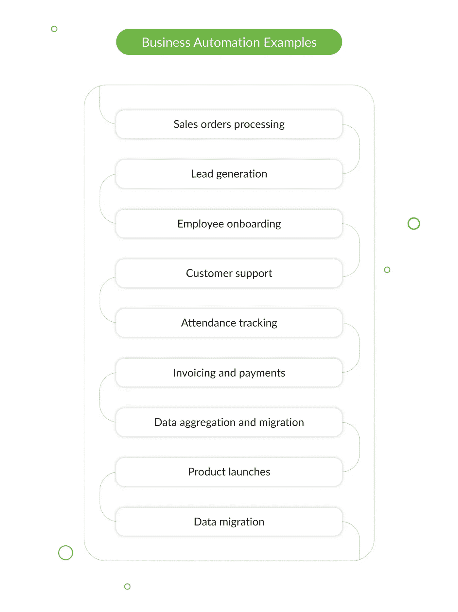
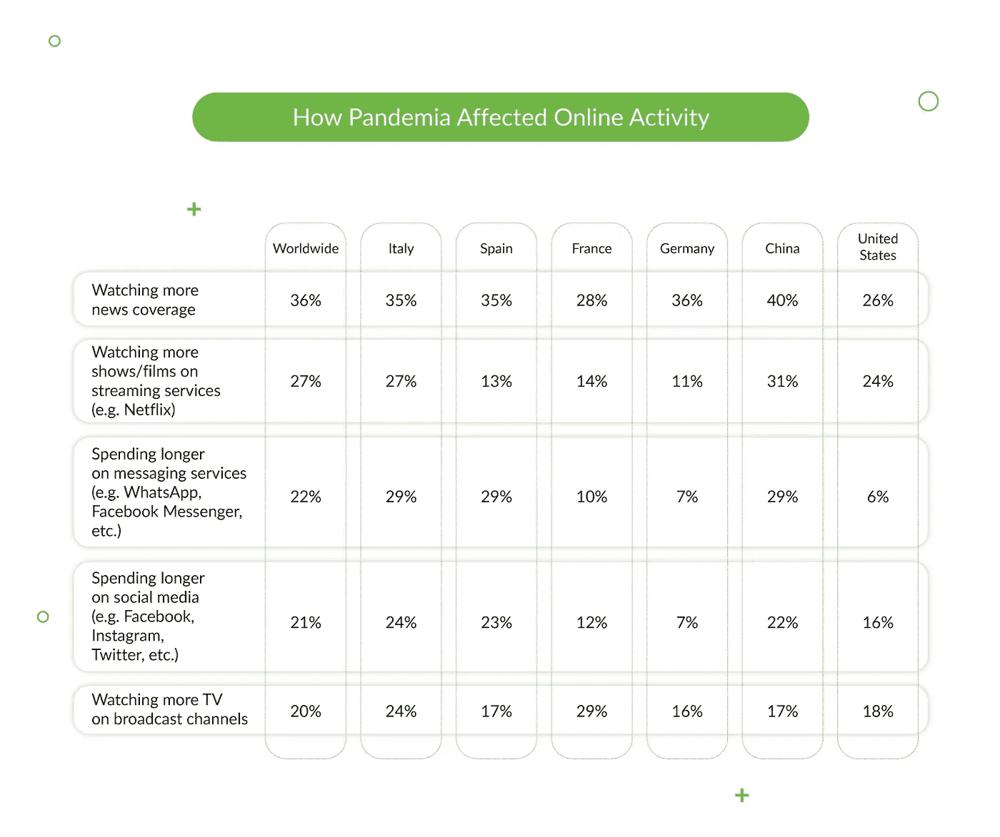
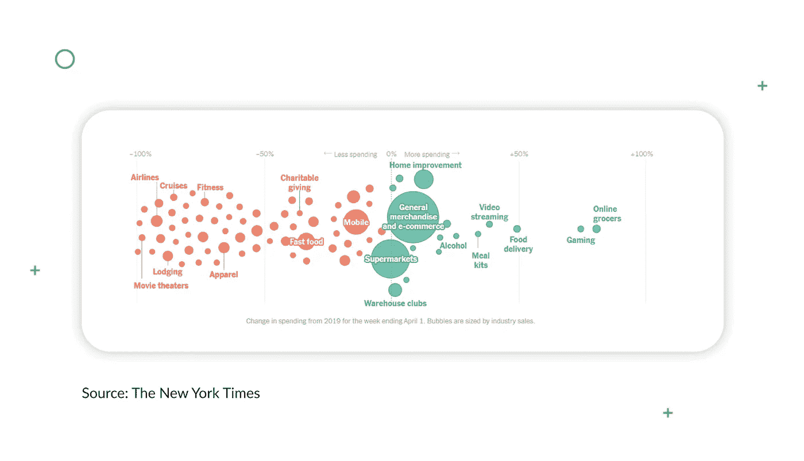
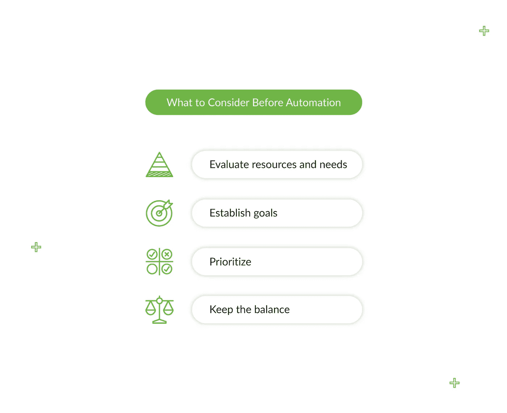
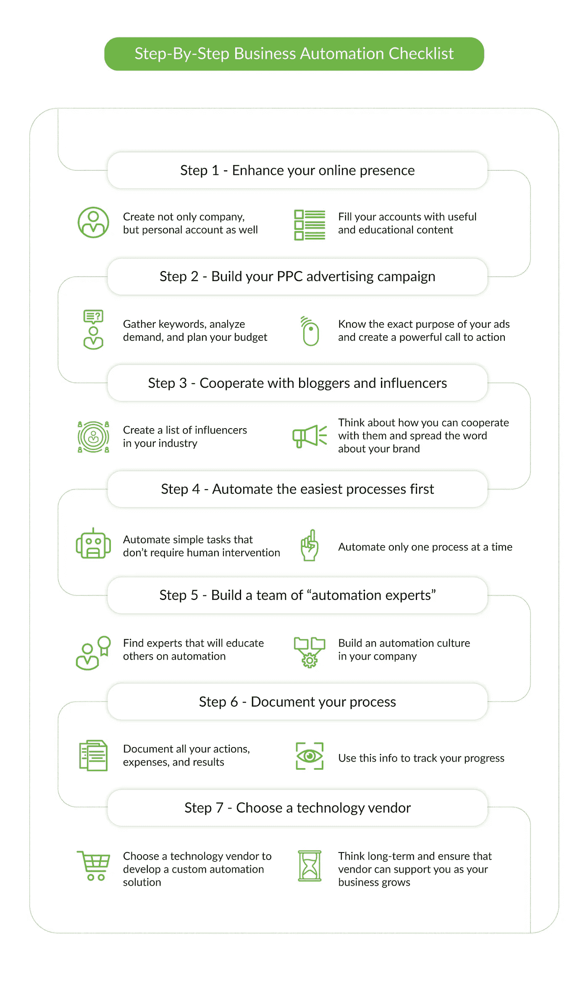
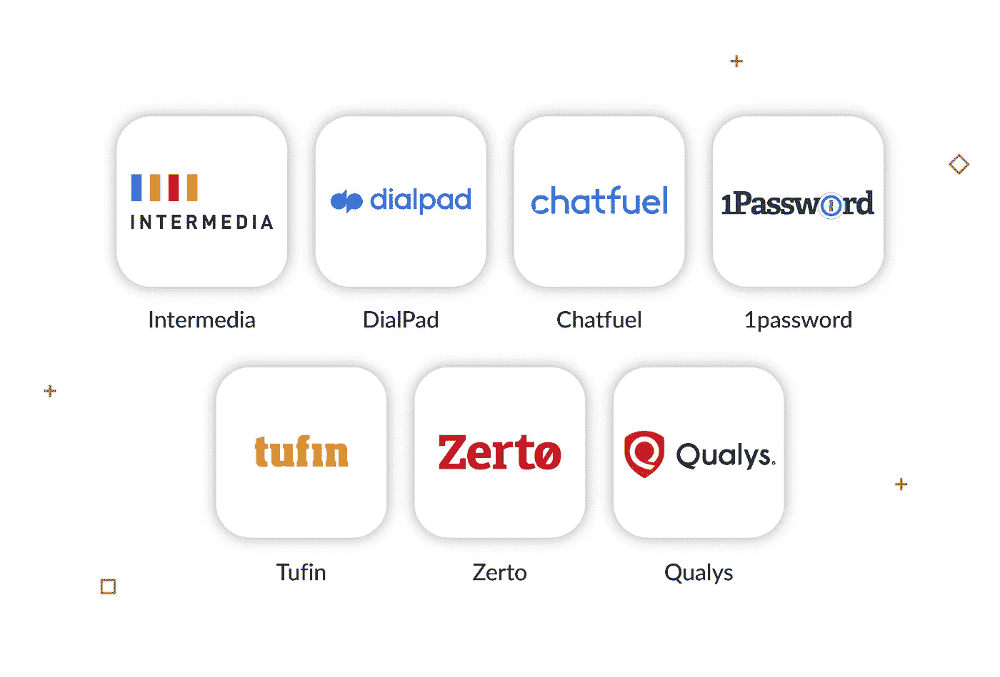

# 如何在危机中生存，或者为什么需要业务自动化

> 原文：<https://medium.datadriveninvestor.com/how-to-survive-in-crisis-or-why-you-need-business-automation-b14261f2db01?source=collection_archive---------9----------------------->

在这些艰难时期，大多数公司都处于某种不稳定状态。他们正试图找出如何维持他们的业务的方法。一个对许多人都有效的解决方案是“业务自动化”。

现在，如果业务自动化对您来说不是一个新术语，并且您已经自动化了大部分手动流程——您太棒了！

如果您不熟悉业务自动化，不用担心！在这篇博文中，我们将解释如何通过在企业中实施自动化来消除疫情的影响。您将学习首先自动化哪些任务，避免哪些错误，以及使用哪些工具来获得好的结果。

我们走吧。

> 这篇关于如何在危机中生存，或者为什么你需要业务自动化的指南最初发表在 Django Stars 博客上。由 Kate Kryzhnenko 撰写，她是 [Django Stars](https://djangostars.com/) 的业务发展经理

# 什么是业务流程自动化？

业务自动化是利用技术来自动化可重复的手动日常任务。它允许公司在没有或最少人工干预的情况下执行业务流程。

为了让您更容易理解，这里列出了一些您可以自动化的事情:

您可能会问，“为什么我需要自动化我的业务？”要寻找答案，看看新冠肺炎期间五个行业的[自动化繁荣的例子。](https://www.protocol.com/automation-boom-caused-by-coronavirus)

正如您所看到的，不同的行业使用自动化来应对危机和提高业务绩效。你还怀疑自动化的重要性吗？然后，让我们看看它能为您的企业带来的一些主要好处。

# 为什么您需要自动化业务流程

大多数企业主习惯于他们使用的流程，并将创新视为一种风险——直到必要性出现。例如，新冠肺炎危机正迫使企业重新审视或彻底调整生存策略。如果您仍然怀疑业务自动化是否值得，这里列出了业务流程自动化的主要好处。增强您的在线形象

新冠肺炎几乎把地球上的每个人都锁在家里，所以人们大部分时间都在网上度过。

这意味着企业有更多的机会通过数字化和提供在线产品或服务来改善客户的在线体验。病毒也改变了我们的购买偏好。例如，美国人增加了他们在网上食品杂货、食品配送、餐包、酒类和家居装修等方面的支出。

如果你的企业服务于这些类别，这是一个很好的时间来考虑如何上网。记住，你需要和你的客户在一起。你知道现在业务自动化有多重要吗？

*业务流程自动化示例:*

灵活的在线售票平台 [Tito](https://ti.to/home) 的创始人建立了一个新的直播平台( [Vito](https://vito.community/) )，以促进新冠肺炎期间的在线活动体验。因为这种病毒对活动行业产生了巨大的影响，Tito 通过允许其客户销售在线活动的门票来应对这一问题。

 [## 如何使用自动化从您的数据中获得更多价值？数据驱动的投资者

### 去年的新闻故事不停地谈论机器学习变得多么先进。电脑现在…

www.datadriveninvestor.com](https://www.datadriveninvestor.com/2020/02/27/how-to-use-automation-to-get-more-out-of-your-data/) 

# 改善客户服务

没有人喜欢缓慢、无礼的客户服务或漫长的决策过程。

但是雇佣和维护一个呼叫中心或客户服务部门是资源密集型的——这时自动化就来帮忙了。好消息是，几乎所有手动文档管理和客户关系流程都可以自动化。

记住一件事:不要让你的客户等待！如果你迅速为他们服务，他们会以忠诚回报你。

*业务流程自动化示例:*

Molo 是一个数字抵押贷款平台，允许客户在线获得即时抵押贷款，并提供自动建议，说明哪些产品最适合他们的需求。客户不必处理文书工作或排队等候——他们可以在不离开家的情况下立即获得抵押贷款。

# 确保更好的工作流程和员工效率

将员工从繁琐耗时的体力劳动中解放出来，将他们的精力转向正确的方向。您知道吗 [60%的职业可以通过自动化诸如线索生成、文档处理和文书管理等任务节省 30%的时间](https://www.mckinsey.com/business-functions/mckinsey-digital/our-insights/four-fundamentals-of-workplace-automation)？业务自动化可以让你的员工更有效率和责任感。

*业务流程自动化示例:*

[YourSales](https://yoursales.com/) —销售咨询和外包公司[使用 Leadfeeder](https://www.leadfeeder.com/customers/yoursales/) (在线销售线索生成工具)自动识别从销售线索表单退回的销售线索，将其信息发送到 CRM，并对其进行跟踪。它为销售线索挖掘经理节省了时间，并改进了销售流程。

总而言之，自动化就是让你的业务上线。但是在这样做之前——慢慢来，考虑业务自动化的所有利弊。以下是企业主应该考虑的主要问题。

# 在实现业务自动化之前需要考虑什么

请记住，业务自动化不是小菜一碟。不要把它当成一种马上就能产生奇效的灵丹妙药。以下是你之前应该考虑的:

*   **评估你的资源和需求**

停下来想一想你现在在哪里。问问你自己:此刻我的业务需求是什么？我有足够的资源来自动化我的业务吗？没有必要让你的业务马上上线。首先，提高你在社交媒体上的影响力，并与你的受众建立关系。首先考虑需要较少努力的渠道，然后才能进一步发展。

*   **为业务自动化创建详细的目标。你想达到什么目的？**

如果你不知道你为什么开始，不知道你想得到什么，你就不会取得成功。在将时间投入到业务自动化之前，设定具体的目标，这将有助于您跟踪进度并优化结果。问问你自己:我想通过业务自动化实现什么？从提高员工的生产力到提高客户忠诚度，一切都可以。定义你的主要目标，并使其具体化、可衡量。

*   **决定首先自动化哪些流程**

创建一个耗时、重复且不需要任何人工干预的业务流程列表。它可能包括导入电子表格、发送发票、优化图像或同时定期向社交媒体发布帖子。不要将需要创造力和人力投入的复杂任务自动化。从小处着手。

首先，你可以在 ABBY FineReader 12 的帮助下将所有公司文件数字化。您还可以使用[DocuSign](https://www.docusign.com/)/[DocHub](https://dochub.com/)在线签署文档。然后，想想如果你还没有一个强大的 CRM 系统，你将如何与你所有的客户保持联系——现在正是整合它的时候。

*   **不要过于依赖自动化**

尽量保持自动化和人情味的平衡。自动化应该让你的工作更容易，但不能取代与客户和公共关系领域的联系。首先考虑你的客户，以及自动化如何让他们对你的体验更好。

# 紧急分步业务自动化清单

当您决定自动化正是您的企业现在所需要的时候，就该行动了。首先也是最重要的，不要急于让你的业务“上线”。在大多数情况下，匆忙的结果是低质量的产品和网站。

自动化过程很复杂，而且有些繁琐。这就是为什么分清主次很重要。我们理解您的时间紧迫，这就是为什么我们准备了一份所谓的紧急清单来帮助您实现业务自动化。

> **注意:**我们建议你同时进行两个过程:开始发展你的在线业务，同时为你的业务开发一个自动化的解决方案。这样，你不会损失任何时间，并且会得到更好的结果。

## **第一步。增强您的在线形象**

如果你还没有网站，那就不要急着开发。通过增加您在社交媒体上的曝光率开始您的数字之旅。用有用的内容和产品评论填充你的账户。如果你还没有社交媒体账户，最好创建一个公司页面和一个个人账户。比起品牌，我们更信任人，尤其是在这样的艰难时期。

## **第二步。建立你的 PPC 广告活动**

一个 PPC 活动是所有关于热点请求和发送流量到您的网站或登陆页面。开始收集关键词，分析需求，规划预算。因为你的数据和目标评估可能需要一个月左右，所以不要为了更快得到结果而推迟

## **第三步。与你所在领域的意见领袖和有影响力的人合作**

如今，大多数人在网上的存在感显著增强。人们写博客，在 Instagram 上直播视频，并以其他方式增加他们的社交存在。不要做落伍者！创建一份你所在行业中能够推广你的产品的有影响力的人的名单。你可以这样与他们合作:

*   撰写客座博文
*   提供促销职位
*   交叉推广你的产品或服务
*   为他们的观众提供产品折扣
*   写产品评论

当你开始建立你的“在线形象”时，是时候考虑业务自动化了。

## **第四步。首先自动化最简单的流程**

你的第一份工作是自动化不需要人工干预的繁琐和重复的任务。一旦你确认这样做提高了你的业务绩效，就进行更复杂的自动化。自动化需要时间，你的员工需要习惯。一次自动化一个流程，并跟踪变化对您业务的影响。

## **第五步。建立一个“自动化专家”团队**

在你的公司里找 1 到 2 个专家，他们将负责自动化并教育其他员工。这将有助于你确信每个人都在同一页上。

## **第六步。记录您的流程**

永远记录你所做的事情。记录你所有的花费、行动和结果。在未来，这将帮助你“从上面”看到图片，并跟踪你努力的结果。

## **第七步。选择技术供应商**

当您看到业务自动化正在给您带来丰硕的成果时，可能是时候选择一个技术合作伙伴并开发一个满足您需求的定制解决方案了。在当前的新冠肺炎危机期间，许多开发公司调整了价格以留住更多客户(您可以在这里与我们[预约一次会议，了解更多关于我们如何调整价格以适应客户需求的信息)。选择供应商时，请始终考虑长远。确保您的供应商拥有合适的专业知识和技术来支持您的业务增长。](https://calendly.com/kate-djangostars/intro)

# 如何保持关注— 7 种业务自动化工具

作为对您的奖励，我们列出了 7 个业务自动化解决方案，它们将帮助您保持关注、远程工作并留住客户。

## [中介](https://www.intermedia.net/anymeeting-video-conferencing)

为各种规模的企业打造的强大在线视频会议平台。它为语音和统一通信、安全性和合规性、生产力和电子邮件、备份和文件共享提供了各种产品。无论您身在何处，Intermedia Unite 通信和协作产品始终伴随着您。

## [拨号盘](https://www.dialpad.com/going-remote/)

一个云业务通信平台，用于从任何地方接收电话、消息、视频和会议。拨号盘为呼叫中心生产力、呼叫和路由、消息传递和语音智能提供了不同的功能。这里有一些好消息:在新冠肺炎危机期间，DialPad 免费提供 DialPad Talk Pro 和 UberConference 业务，让您在远程工作时保持联系。

## [聊天燃料](https://chatfuel.com/)

一个聊天机器人平台，帮助脸书页面经理增加销售，合格的线索，并自动化常见问题。通过使用 Chatfuel 自动化您的脸书信使，您有机会提高您的打开率和点击率，自动化您的销售，并提高客户满意度。Chatfuel 的客户包括阿迪达斯、TechCrunch、乐高和 T-Mobile 等著名公司，所以不要犹豫，去试试吧。

## [1 密码](https://1password.com/)

一个密码管理系统，帮助您保存密码，只需点击一下就可以登录到您的网站。你只需要记住一个密码；所有其他密码都受到 1 密码平台的安全保护。在新冠肺炎期间，1Password 取消了试用限制，以帮助公司安全地在家办公。

## [凝灰岩](https://www.tufin.com/)

确保您的企业符合安全标准的安全策略公司。Tufin 为安全策略管理、网络安全变更自动化、应用连接管理和云安全提供产品。

## [泽尔托](https://www.zerto.com/)

用于数据恢复、备份和云移动性的 IT 弹性平台。它帮助您降低应用程序迁移的成本和复杂性，保护您的业务免受中断，并使用云实现 It 现代化。此外，Zerto 正在向受新冠肺炎影响的组织免费提供他们的技术，以保护他们的系统免受破坏。

## [Qualys](https://www.qualys.com/)

一体化信息安全和漏洞管理平台。借助 Qualys，您可以实时分析威胁，快速修补关键威胁，并确定最危险漏洞的优先级。Qualis 还让你有机会免费测试你的公共网络服务器的安全性，所以不要错过这个机会。

# 结论

业务自动化是改善客户体验、降低成本和提升整体工作流程的最佳方式之一。关键是一步一步地自动化流程，并且知道你的目标和期望。但是，首先，作为企业主，你必须准备好改变。尝试一下业务自动化，看看它会带来什么结果。