# 如何在人工智能革命中生存

> 原文：<https://medium.datadriveninvestor.com/how-to-survive-the-ai-revolution-75a5ee592aa1?source=collection_archive---------19----------------------->

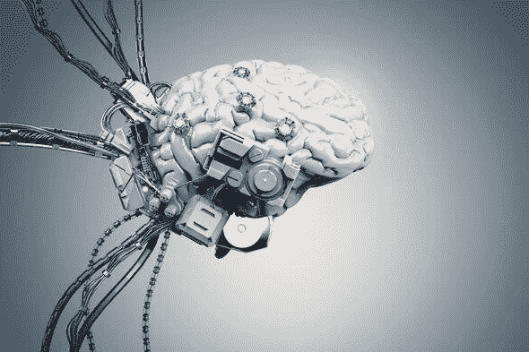

不管你喜不喜欢，人工智能正在接管。

从开灯到准备午餐，有一天**甚至 ***你的工作*都可能被机器接管。****

我的意思是……看看统计数据:

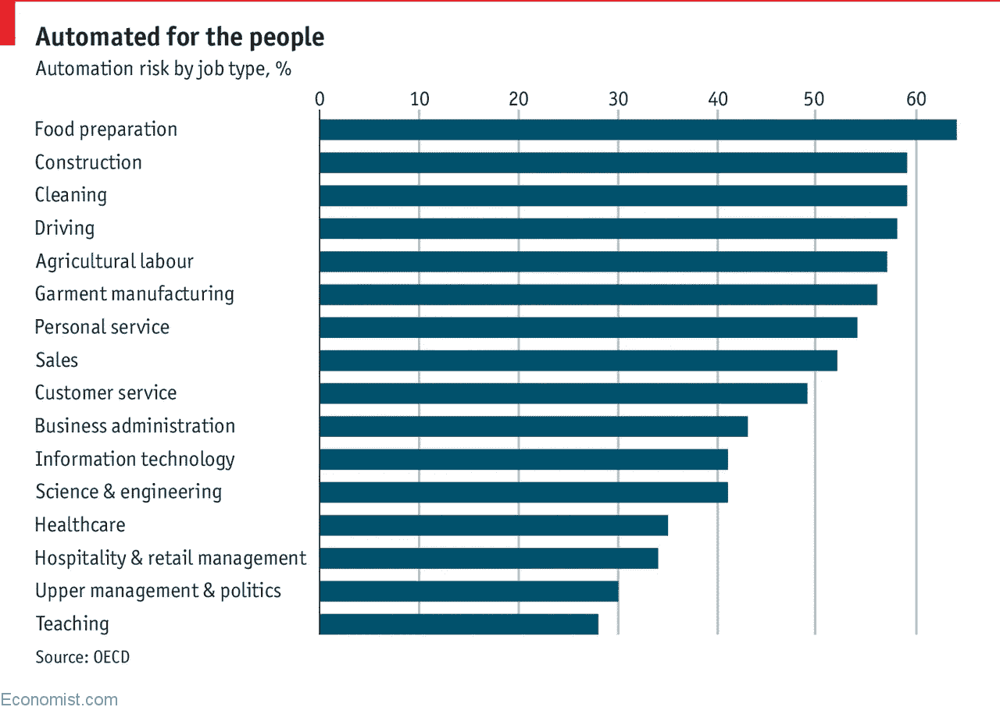

[www.economist.com%2Fgraphic-detail%2F2018%2F04%2F24%2Fa-study-finds-nearly-half-of-jobs-are-vulnerable-to-automation](https://www.economist.com/graphic-detail/2018/04/24/a-study-finds-nearly-half-of-jobs-are-vulnerable-to-automation)

根据经合组织的一项研究:

*   32 个国家 14%的工作至少有 70%的机会被无人驾驶机器人取代，
*   另外，32%的人至少有 50%的机会发生同样的事情。
*   **这是 46%的工作岗位！按照目前的就业率，这将使 2 . 1 亿份工作处于危险之中！**

# 那么我能做什么呢？？？

正如老话所说:

如果你不能打败他们，就加入他们。

人工智能等软件是一个非常受欢迎的领域，许多公司都会雇用工程师，只要他们拥有必要的技能，**即使他们没有学位。**

这意味着**你**可以成为一名人工智能工程师，并获得需求的好处[在过去几年里翻了一番多](https://www.techrepublic.com/article/demand-for-ai-talent-exploding-here-are-the-10-most-in-demand-jobs/)以及每年超过[114，121 美元的薪水。](https://www.techrepublic.com/article/demand-for-ai-talent-exploding-here-are-the-10-most-in-demand-jobs/)这一切都从机器学习的简单介绍开始

# 有监督与无监督的机器学习

**机器学习**，是人工智能(AI)广泛使用的子集，是**让计算机通过经验**进行学习的实践。这意味着，像人一样，计算机做得越多越好。

ML 的方法主要分为两个子类别，**监督学习、**和**非监督学习**。

**监督学习**可以最简单地解释为:**给计算机问题和答案，并让它知道如何到达那里。**

鉴于…

无监督学习最好解释为:给计算机数据，让它找到自己的模式。

两者之间的主要区别在于是否存在“答案”

下面我将解释**一种方法**，它使用每种类型的机器学习及其现实世界的应用。

# 线性回归

**线性回归，**监督学习的一种，[是世界上最广泛使用的统计技术](https://www.linkedin.com/pulse/regression-analysis-weather-forecasting-chonghua-yin/)，它确实显示了。从天气预报到创造最佳效率的引擎，它无处不在，因此，将需要在这场人工智能革命中生存。

**回归**可以最好地定义为**找到输入和输出**之间的连续关系，并使用它来预测给定新输入的输出。

那么线性回归基本上是什么呢，是一种**查看数据并在输入和输出**之间找到连续的*线性*模式的方式，就像一条最佳拟合线。

如果你还记得 7 年级的数学课，我们被介绍了散点图的概念，散点图基本上是图表上的一堆小数据点。

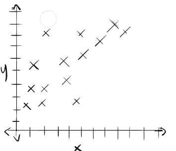

Image by Author

我们要做的是找到最佳拟合的**线，这是一条最好地显示图形模式的线，如果图形看起来像这样，这很容易:**

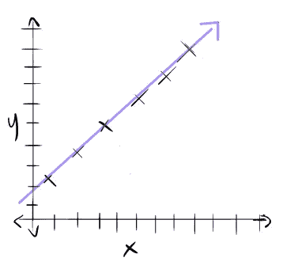

Image by Author

但是如果图表看起来更像这样呢？

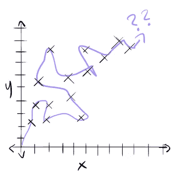

Image by Author

我们如何教计算机做到这一点呢？

这就是线性回归的用武之地。

线性回归的作用是创建一条线。然后，它测量数据点和直线之间的距离，称为**残差。**

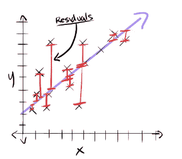

Image by Author

然后，该算法将所有这些距离加在一起，并改变直线，直到该数字尽可能低，这一过程称为**残差平方和。**这在方程式中表示为:

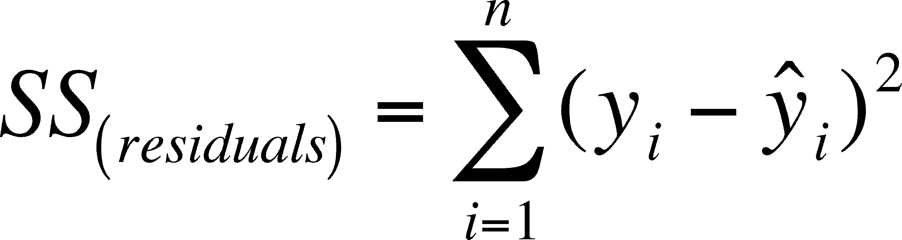

计算机可以做的是，它可以接受你的任何输入，并在它发生之前预测输出，只需简单地跟随线条的模式，让我们看到未来。

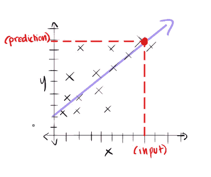

Image by Author

# k 均值聚类

K-Means 聚类是一种无监督学习，已经广泛应用于垃圾邮件过滤器和 clickbait 检测器，也是一种非常有用的替代方法，可以替代费力的数据分类。

**聚类**最好定义为****将数据分组**的过程，以便每个组中的所有数据都有其他组没有的共同点。**

**K-Means 聚类就是这样做的一种方法。**

**让我们回到那些散点图。**

**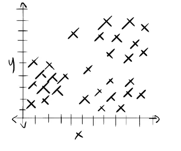**

**Image by Author**

**当人眼看到这个时，我们可以清楚地看到三组不同的数据点。**

**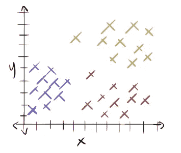**

**Image by Author**

**但是我们怎么才能让计算机做到这一点呢？**

***这就是我们需要 K 均值聚类的地方。***

**为了对数据进行聚类，我们首先必须告诉算法我们想要多少个组。**这是 K-Means 中的 K。****

**让我们做 K=3。**

**然后，该算法将取我们 K，我们决定它是 3，并绘制随机点的数量作为聚类的**中心，**称为**质心**。**

**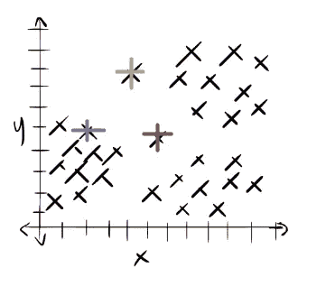**

**Image by Author**

**然后，遍历每个数据点，该算法计算从该点到质心的距离，称为平均值，并将每个点分组到最接近的聚类中。**

**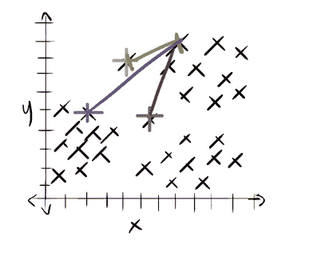**

**Image by Author**

**一旦所有的数据点都被放入一个聚类中，该算法就找到每个数据点的中心，将其设置为质心，并重复这个过程。**

**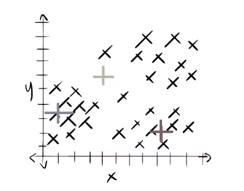**

**Image by Author**

**并重复该过程**

**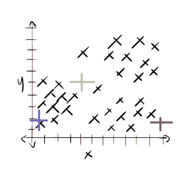**

**Image by Author**

**该算法将不断重复这个过程，直到聚类在下一次迭代后不再改变。**

**但是…那看起来不对…**

**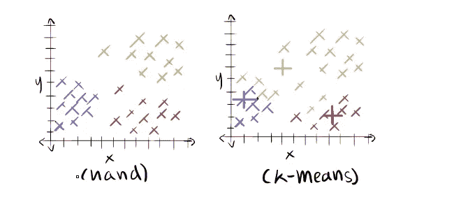**

**Image by Author**

**如果你还记得的话，计算机 ***随机*** 选择了 3 个点作为我们的质心，也就是说我们不知道那些点是不是最好的质心。**

**为了补救这一点，算法重复这个过程一段时间，每次选择不同的质心。**

**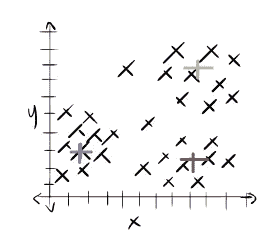**

**Image by Author**

**该算法然后比较**方差**，即**平均值，即这些点离它们的质心**有多远。**

**在重复你设定的次数后，算法挑选出具有最佳方差的聚类，并将其作为你的输出提供给你。**

**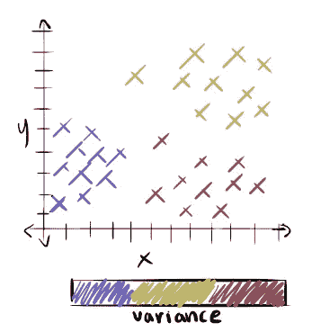**

**Image by Author**

**现在我们有了自己的聚类，我们可以给计算机任何输入，它会找到最近的聚类。**

**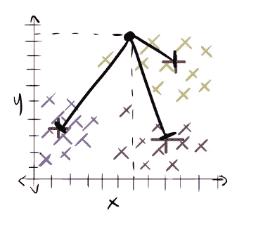**

**Image by Author**

# **概述**

*   **人工智能正在接管就业市场，所以我们需要学习人工智能来跟上，并获得低门槛和高薪的好处。**
*   **机器学习是人工智能的一个亚型，主要分为两类，监督学习和非监督学习。**
*   **监督学习就是你教计算机正确的答案。**
*   **无监督学习是当你教一台计算机而没有正确答案的时候。**
*   **线性回归是一种监督学习，可用于通过找到最佳拟合线来预测未来。**
*   **K-Means 聚类是一种无监督学习，可用于通过找到每个组的中心并将这些点与该中心进行比较，将数据分组到一定数量的聚类中。**

****访问专家视图—** [**订阅 DDI 英特尔**](https://datadriveninvestor.com/ddi-intel)**