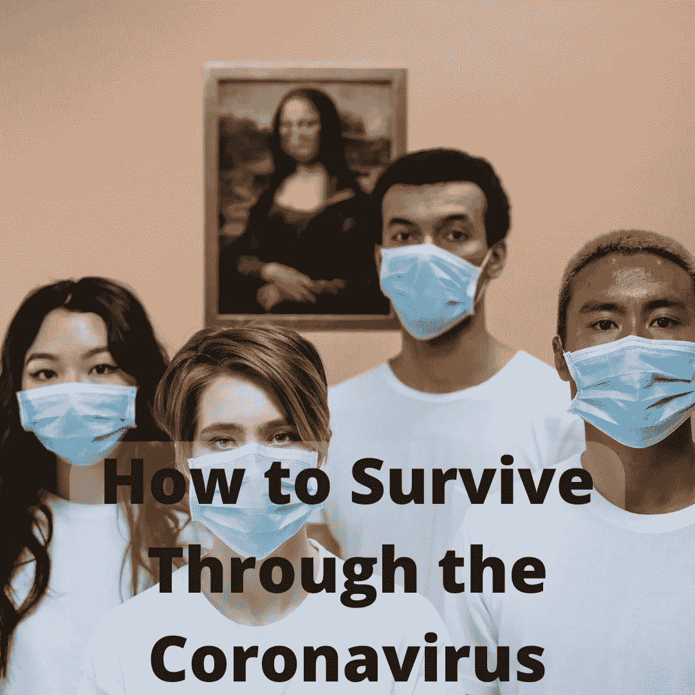

# 如何挺过冠状病毒

> 原文：<https://medium.datadriveninvestor.com/how-to-survive-through-the-coronavirus-eb7f4b7fa4ef?source=collection_archive---------15----------------------->

# 这一切是如何开始的

我每周有五天乘地铁去曼哈顿。地铁并不迷人，但比开车便宜又快。也很拥挤。随着冠状病毒开始占据头条，我惊讶地发现大多数通勤者似乎并不担心。当然，人们与咳嗽的人保持距离，但除此之外一切如常。市政官员没有认真对待冠状病毒，所以通勤者也没有。然后，人们开始生病。大约一个月前，我的雇主通知我，我接触了一位冠状病毒检测呈阳性的同事。我担心我的同事只是许多会被感染的人之一，所以我开始远程工作。大约一周后，我出现了最初的症状。这就是在冠状病毒中存活下来的感觉。

# 情况会变得多糟？

我的喉咙有点沙哑，但我没觉得有什么。也许我感冒了…毕竟是冬天。一旦我开始咳嗽，毫无疑问我已经得到了冠状病毒。我的妻子是纽约市立医院的家庭医学住院医师。她听到了我的干咳，听起来和她“Covid 患者”的咳嗽非常相似。我尽最大努力把自己隔离在我们的小公寓里。我的妻子给了我一个口罩，并告诉我在触摸我们共用的任何东西之前要洗手。不幸的是，几天后，她也生病了。鉴于她是一线医务工作者，接触过很多次，我们对她被感染并不感到惊讶。尽管我们并不惊讶，但这并没有减少我们的担心。

坦白地说，相对于我生病最初几天的头痛，我的咳嗽并没有给我带来多大的困扰。我无法工作，因为我无法集中注意力。我的能量完全耗尽了。我几乎被限制在打盹、吃饭(尽管比我平时做的少得多)和上厕所。随着日子一天天过去，我感觉越来越糟。大概病了五天，胸口开始发紧。我不得不放慢语速以免喘不过气来。

这些症状本身并不痛苦。冠状病毒更可怕的一面是不确定你会变得多糟糕。每天早上，我都觉得比前一天更难受。我妻子开始用听诊器检查我的肺部，看我是否患上了病毒性肺炎。我开始怀疑我最终是否能挺过冠状病毒。

# 恢复

在经历了最初的症状一周后，我开始康复。复苏是缓慢的，但却是持续的。在我生病的两个星期里，我经历了以下症状，虽然不是一下子:

## 1.乏力

## 2.干咳

## 3.头痛

## 4.身体疼痛

## 5.胸闷

## 6.气促

让我说清楚:这不是我得过的最严重的病。虽然我不可否认地生病了，但我现在把我的冠状病毒病例描述为中度。我妻子的症状甚至比我的还轻。我们俩都没有发烧。说了这么多，我们在变好之前变坏了。我们调到了新闻频道，那里报道了最严重的病例。我不知道我是否会像那些被感染后住进医院的年轻健康的人一样。

我在第一周体验到的无助感让我把冠状病毒与我以前遇到的任何病毒区分开来。除了喝流质和服用泰诺，我什么也帮不了自己。我只能让病毒自生自灭。伴随冠状病毒的恐惧比病毒本身更具病毒性质。恐惧感染了我的朋友、同事和爱人。他们几乎每天都来看我。新冠肺炎总有一天会消失，但对另一个疫情的恐惧会在冠状病毒中存活下来，就像我一样。老实说，我希望这种恐惧一直存在。恐惧可能是让我们为下一个疫情做好准备的唯一强大动力。

# 世界对疫情冠状病毒完全没有准备

在世界各地，现在有超过一百万例冠状病毒确诊病例[。政府领导人非常担心检疫措施会造成的短期经济混乱，以至于他们没有采取必要的措施来阻止疾病的传播。不幸的是，数百万人可能会失去他们的生命，经济混乱现在将更加明显和持久。未能为这场疫情做好准备是现代史上代价最大的错误之一。然而，也许还有一线希望。这个疫情是一个惨痛的教训，告诉我们为](https://www.bbc.com/news/world-52144390)[黑天鹅事件](https://bunkerbasics.com/black-swan-events/)做准备的重要性。毫无疑问，我们正在认识到早期投资和准备对保护全球社会的重要性。而且，需要**协调** **和** **集体**动作。我希望这场灾难足以让世界更加紧密。

# 如何挺过冠状病毒

冠状病毒疫情期间涌现了许多英雄。像我妻子这样的前线医护人员正在生病，因为他们

为保持我们的健康而战。为了确保受隔离措施影响的每个人都能获得必要的商品和服务，其他重要工作人员正冒着风险。为了换取他们的牺牲，我们至少可以遵守最新的疾病预防控制中心指南。让我们尽自己的一份力量来保护自己和他人的安全。

我希望我们能够学会同情那些在这场对抗冠状病毒的斗争中受伤的人。对于那些没有受伤或已经康复的人，我们应该感谢我们的好运。没有同情和欣赏，冠状病毒就赢了。从冠状病毒中幸存下来的最好方法是认识到我们所有人的共同点:一个看不见的敌人。我们现在都站在同一边了。让我们一起战斗吧。

最初发布于:【https://bunkerbasics.com/survive-through-the-coronavirus/ T3