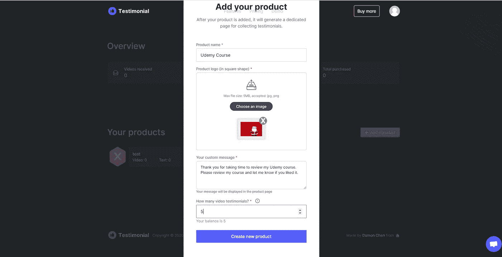
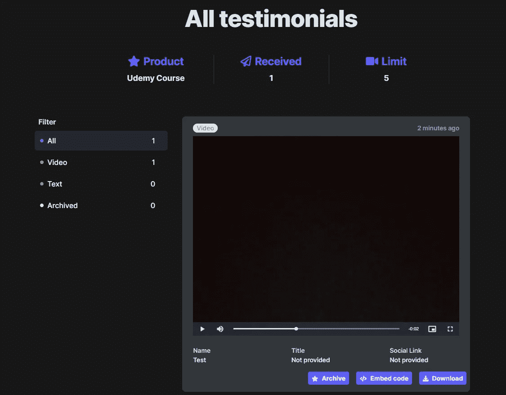

# 如何通过 2 个步骤获得视频证明并提高销售额[2021]

> 原文：<https://medium.datadriveninvestor.com/how-to-take-video-testimonials-in-2-steps-and-increase-sales-2021-f5e8adc2655f?source=collection_archive---------10----------------------->

Source: [Testimonial | Collect video testimonials](https://testimonial.to/)

想要将您的产品销售额提高 1000%以上吗？拍视频见证。在这篇文章中学习如何去做。

# 这篇文章不适合谁

如果你刚刚开始你的创业，你的网上销售业务或任何业务，但你没有采取至少 100 销售，也许这篇文章不适合你。如果在另一方面，你是一个成功的企业家，请继续阅读如何帮助你的企业成倍增长。

# 对未来的预测

几年后，我们会看到越来越多的公司，比如亚马逊，接受视频推荐。如果一份书面的顾客评论能让产品销量增长 10 倍，那么一份视频评论至少能让产品销量增长 100 倍。为什么我会预测这个？想想吧。

普通顾客一天比一天聪明。在 5 年的时间里，普通顾客会知道如何区分假评论和真评论。另一方面，如果一个客户看到 5 或 10 个客户视频评论(我这里不是指 YouTube 影响者！)，他们更有可能购买一个产品。

与任何其他形式的评论相比，视频评论更难伪造，更能激发行动。视频中的顾客对话会让销售过程更具“个性化”，你的产品会被推荐出来。它验证你的产品。

# 如何接受评论

[reference . to](https://testimonial.to/)是最近在硅谷中心推出的一家初创公司，它可以让你非常容易地从你的客户那里获得视频推荐。只需 3 分钟，您就可以在世界任何地方观看视频评论。

首先，你注册。然后你点击“添加一个产品”,你就可以创建你的软件、数字或实物产品来接受审查。放一个有意义的图片，选择一些感言(你可以稍后增加这个！)

您将收到一个链接，您可以将该链接与愿意花时间来查看您产品的最有意义的客户分享。他们不需要注册什么的，最多花几分钟时间。

也许你可以有策略地把链接发给在另一个平台上评论过你的人。或者也许只是回到你的电子邮件列表，请人们帮个大忙。

在他们评论你的产品后，你可以在仪表盘上看到所有的评论。您可以通过点击“嵌入代码”或“下载”来决定在您的网站或其他任何地方包含哪一个。

# 关于视频的更多信息

根据 [Magisto](https://www.magisto.com/reports/video-market-size) 的数据，2017 年数字制作视频投资创下 1350 亿美元的历史新高。

> “可购买的视频有助于增加流量和创收”

网络视频很快就会变成巨头之战。我们最近看到谷歌加入了这一趋势，推出了自己的“YouTube Rewind”系列。如果你不知道，去看看 [YouTube 倒带 2018](https://www.youtube.com/watch?v=YbJOTdZBX1g) 和 [YouTube 倒带 2019](https://www.youtube.com/watch?v=2lAe1cqCOXo&t=1s) 。公司已经在尝试用一种新的数字化方式与客户联系。你应该趁早跳上火车吗？