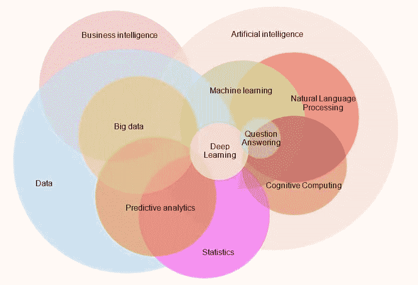
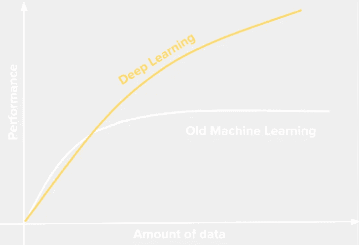
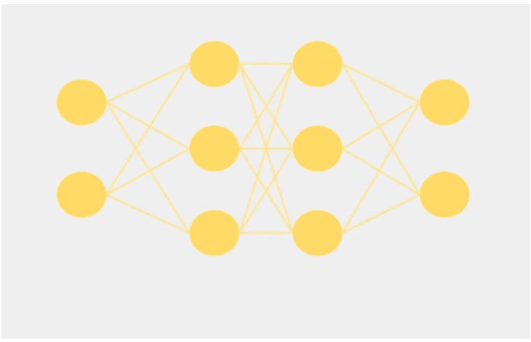
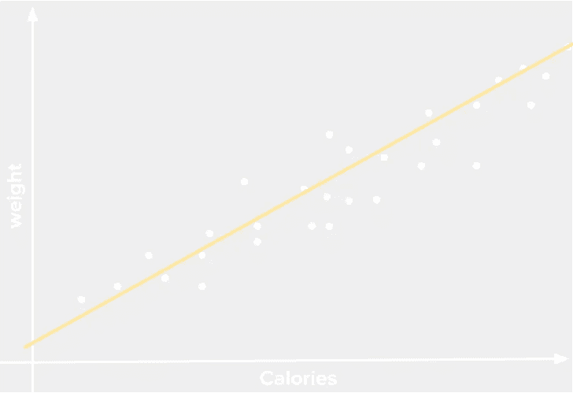
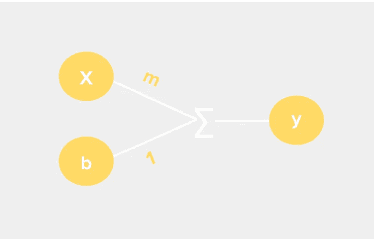
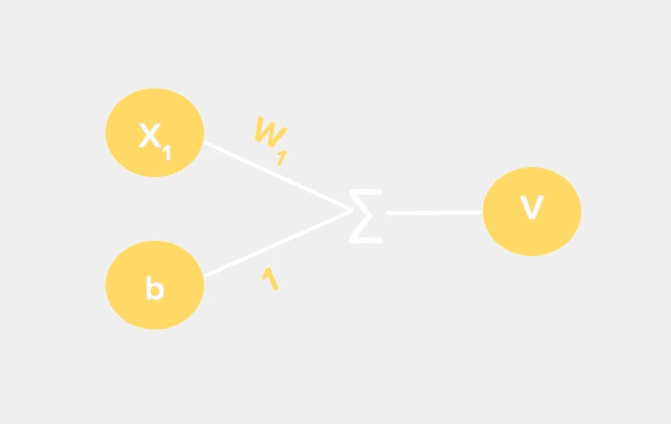
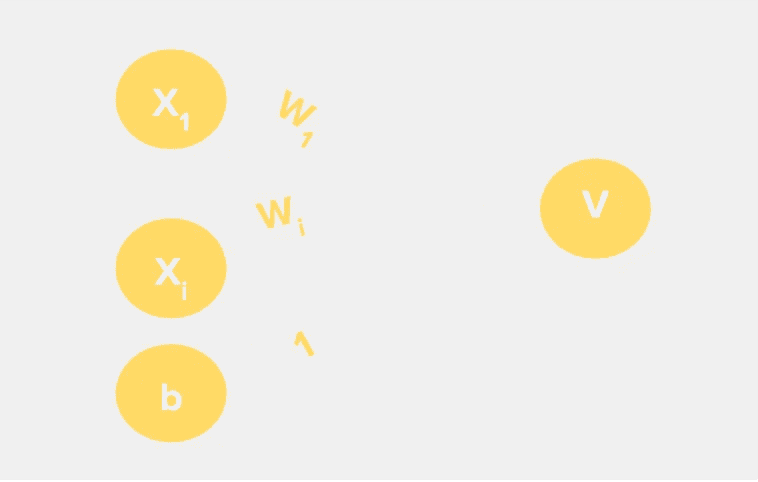
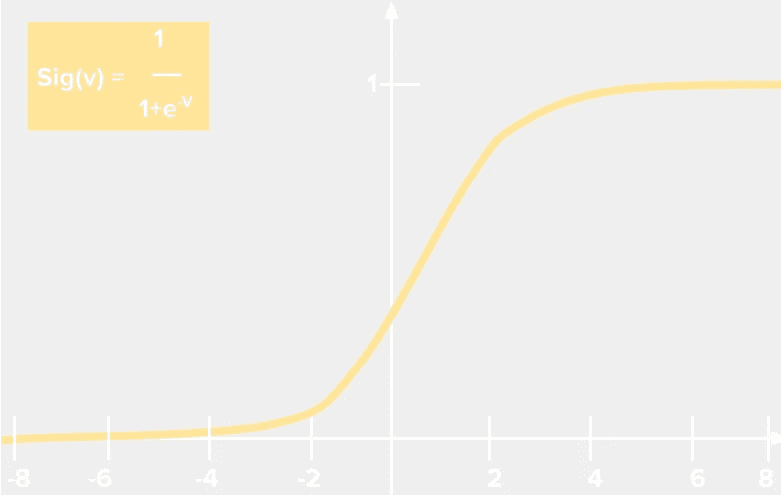
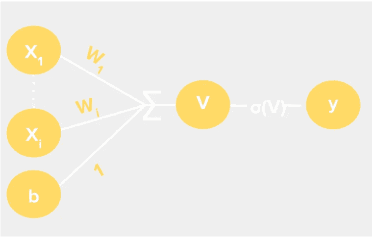
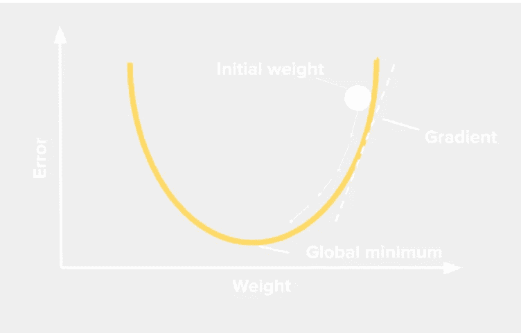

# 如何在晚宴上谈论人工智能

> 原文：<https://medium.datadriveninvestor.com/how-to-talk-about-ai-at-a-dinner-party-3b6daba77156?source=collection_archive---------8----------------------->

## 深入研究虚拟人的深度学习

你在一个鸡尾酒会上，一个男人走向你。他说他是人工智能研究者，好奇你问人工智能具体指什么。他没有回应…

**蟋蟀**

你该跑了。

人工智能是一个被广泛使用的时髦词。不仅仅是在鸡尾酒会、饮水机和政治辩论上，而是在圣诞晚餐和 Reddit 上讨论我们的工作、生活和世界是如何被机器接管的。

但你不必担心《黑镜》剧集中的终结者式机器人即将降临人类。

 [## 深度学习用 7 个步骤解释-更新|数据驱动的投资者

### 在深度学习的帮助下，自动驾驶汽车、Alexa、医学成像-小工具正在我们周围变得超级智能…

www.datadriveninvestor.com](https://www.datadriveninvestor.com/2019/01/23/deep-learning-explained-in-7-steps/) 

除非你生活在岩石下，否则你每天都在和人工智能互动，甚至现在当你在媒体上读到这篇文章的时候。

但是 Ai 到底是什么？

这是一个对执行通常需要人类智能的任务的计算机的总称。

但艾是**疯狂**广泛。

这就是为什么有人说他们在人工智能领域就相当于有人说他们在金融领域，具体在金融领域是什么？只是金融。

所以让我们在人工智能最热门的领域之一更深入地了解一下；机器学习。

机器学习使用大数据中的模式来执行任务，而不需要明确地被告知要做什么。

## 机器学习有三种主要方式:👶🧠

*   **监督学习**:给机器标注数据。给它看一张猫或狗的照片。它会给出一个随机输出。然后将显示实际输出。它会调整它的模型，直到找到猫和狗之间的模式。一旦经过训练，让它尝试弄清楚未标记的数据是猫还是狗。就像一个蹒跚学步的孩子的父母让他们猜字母表中的字母，如果他们猜错了，他们会替他们念出来，或者他们会祝贺这个蹒跚学步的孩子。
*   **无监督学习:**给机器未标记的数据。这台机器会在数据中找到模式。如果我们想一想人类是如何学习的，没有一个蹒跚学步的孩子会被展示成千上万张一棵树和一个消防栓的照片，并被告知哪个是哪个。当他们发现逻辑模式时，他们发现了差异，没有人告诉他们“不，那不是消防栓，那是一棵树。”
*   **强化学习:**就像小孩猜对了就给冰淇淋，猜错了就打(*请不要这样*)。我们教导的模型是奖励最大化，惩罚最小化，奖励和惩罚可以是任何一组规则。在我们幼儿的例子中，奖励是猜对字母，惩罚是猜错字母。

在机器学习中，有一个子集叫做深度学习。

深度学习使用模拟人脑神经连接的算法，称为**神经网络**。我们可以使用监督和非监督学习来训练这些算法。

在大脑中，神经元通过**将每个输出的信息作为输入传递给下一个神经元。**

由于计算技术的进步和我们拥有的海量数据，深度学习领域在这十年里飞速发展。自 2016 年以来，我们已经生成了全球 90%以上的数据！

**与传统的机器学习模型相比，深度学习依靠更多的数据蓬勃发展**，传统的机器学习模型在一定数量的数据后性能会停滞不前。

# 窥视神经 Network🧠⚙️的内部

当输入大量关于 x 和 y 的数据时，神经网络找到输入和输出的模式。使用这些模式，它们根据输入(x)预测自己的输出(y)。

神经网络可以分为三层:输入层、隐藏层和输出层。

输入层接受所有的输入值，并将它们传递给隐藏层，在隐藏层中进行一些数学魔术和计算，最后输出层给出网络的预测。

网络的**神经元或节点**是计算和处理发生的地方。每一层的输出作为下一层的输入被传递。

# 隐藏层🎩

这一层中的节点对输入执行计算，生成输出。让我们考虑一个线性模型，取两个相关的变量，比如摄入的卡路里量(x)和体重(y ),如果我们把它们画在散点图上。我们将看到一个线性关系，在线性回归中，我们通过这些点绘制一条最佳拟合线，以获得我们的模型。

我们希望这些点与最佳拟合线的距离尽可能小，因为这意味着我们的实际输出和预测输出(y)之间的误差最小

你在高中的噩梦中见过这个熟悉的直线方程:

Y=mx+b

我们所做的就是将输入(x)乘以斜率(m)，然后加上常数 y 截距(b)。

y=mx+b

现在，这与我们在机器学习模型中的节点所做的没有什么不同，除了我们有不同的变量。

我们的输入 X 乘以一个称为权重(W)的因子，权重取决于输入值的重要性。然后加上一个称为偏差的常数(b)。我们将它们相加得到输出 v。

V= X1(W1) + b

如果我们改变我们的权重或偏差，输出也会改变，我们会得到一个新的模型。

## 处理更多输入

如果这么简单，为什么我们不对所有的节点使用线性回归呢？线性模型只能接受一个输入。

当我们想考虑其他因素时，比如人的新陈代谢、卡路里的营养价值或者锻炼的频率，我们该怎么做？

深度学习模型允许我们的神经元接受**多个输入。**我们用 *i* 表示当前层*来标记这些输入。*

> **V=X1(W1) + X2(W2)…Xi(Wi)+b**

这个公式在处理大量输入时会变得混乱。所以我们把它清理成这样。

> **V= ∑(Xi x Wi)+b**

输入越多，图形的维度就变得越复杂。尺寸基于 *i* 值建模，因此具有 3 个输入的模型将在 3D 空间中。

当分层时，这些神经网络能够在 ***i* 维空间中模拟输入之间的复杂关系。**

这是神经网络的超能力，人类可以在第三维空间建模关系，但在那之后，我们的大脑几乎无法将它们可视化，这就是神经网络在处理多种输入时派上用场的地方**。**

我们添加的层次越多，我们的网络就变得越“深”。

# 激活函数:压缩数字

我们希望我们的节点总是输出一个 0 到 1 之间的数字，因为很容易使它成为一个概率。**我们使用一个激活函数来标准化我们的输出**。这样我们的神经网络就可以计算任何类型的函数，而不仅仅是线性函数。

sigmoid 函数(逻辑曲线)是一个非常流行的激活函数，它处理我们所有的加权和，迫使它们总是输出 0 或 1 之间的数字。

> **y=σ(∑(Xi x Wi)+b)**
> 
> **y=σ(V)**

其他激活功能包括 [ReLU](https://machinelearningmastery.com/rectified-linear-activation-function-for-deep-learning-neural-networks/) 和 [TanH](https://medium.com/the-theory-of-everything/understanding-activation-functions-in-neural-networks-9491262884e0) 等等。但我们还是坚持用乙状结肠做模型吧。

恭喜我们刚刚制造了一个神经元！🥳

# 训练时间

我们从随机权重和偏差开始，通过向我们的模型显示正确的输出进行调整，并根据预期输出进行测量

我们使用损失函数计算出误差有多大。

最流行的是均方误差(MSE)。我们取预期输出和实际输出之差的平方，除以数据点的数量。

> **误差= ×(真实输出-预测输出)**
> 
> **误差= 1/n×∑(y*I*-ŷ*I*)**

我们希望误差尽可能接近 0。

其他类型的[损失函数](https://ml-cheatsheet.readthedocs.io/en/latest/loss_functions.html#cross-entropy)包括:回归损失函数、分类损失函数、嵌入损失函数(L1 铰链误差、余弦误差)

## 一旦我们发现了错误，我们就用反向传播🛠️来修正它们

为了改变误差函数，我们需要调整我们的权重，我们可以随机地摆弄它们，直到我们得到一个损失函数为 0。

但是那需要太多时间。

你第一次去举重，你不知道你的起始重量，所以你随便拿了一个 25 磅的重物，但是你拿不起来。然后你拿起一个 24 磅的重物，但仍然太重，你试了一个 22 磅的重物，但太轻了，最后在实验后你得到了正确的，一个 23 磅的重物。

起初，你不确定你的起始重量，所以你调整重量，直到你找到一个完美的，不太重也不太轻，刚好适合任务的重量。

过度简化这就是梯度下降优化，我们改变我们的权重，并测量我们的预测输出和实际输出之间的差异。

深度学习的梯度下降被称为**反向传播。**

如果我们的损失函数是一座山，我们希望在最低点，最小值，因为那是误差最小的地方。

通过找到我们损失函数的梯度，我们就能找出我们损失函数的最小值的方向，并且可以通过调整我们的权重向它移动。坡度就像指向山最低点的指南针。

我们用新的权重继续这样做，直到达到全局最小值。

我们下山的步子有多大，叫做我们的**学习率**。而是每次调整了多少权重。

我们的模型将继续这样做，直到找到全局最小值，在那里误差不能再小了。这是一个合法的模式，很难得到任何更好的。

这是一个非常基本的神经网络，但还有其他类型，如用于计算机视觉的[卷积神经网络](https://www.youtube.com/watch?v=YRhxdVk_sIs)和用于自然语言处理的[递归神经网络](https://www.youtube.com/watch?v=_aCuOwF1ZjU)。我将在另一篇文章中更深入地探讨它们😉

# TLDR

*   Ai →机器学习→深度学习
*   机器通过监督、非监督和强化学习进行学习
*   深度学习能够预测输入的输出，如果有足够的数据，性能会随着数据的增加而提高。
*   神经网络模仿大脑中的神经连接，它们可以接受多个输入，每个神经元的输出作为输入传递给下一个神经元。它们有三层:输入、隐藏和输出
*   神经元使用 **V= ∑(Xi x Wi)+b，**，其中输入乘以权重并添加偏差。
*   然后，应用类似 sigmoid **y=σ(V)** 的激活函数
*   我们使用像均方差(MSE) **误差= 1/n ×∑(yi-ŷi)** 这样的损失函数来计算预期输出和预测输出的误差
*   然后，通过改变权重，使用反向传播最小化损失函数，直到它不能变得更小。

希望你学到了一些东西，现在你可以用你新发现的深度学习知识在鸡尾酒会上给人们留下深刻印象。😉

随时联系 LinkedIn 或者订阅我的时事通讯！