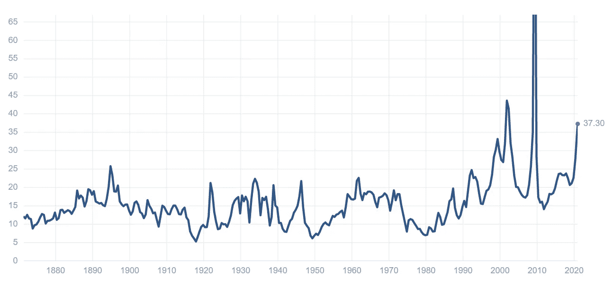
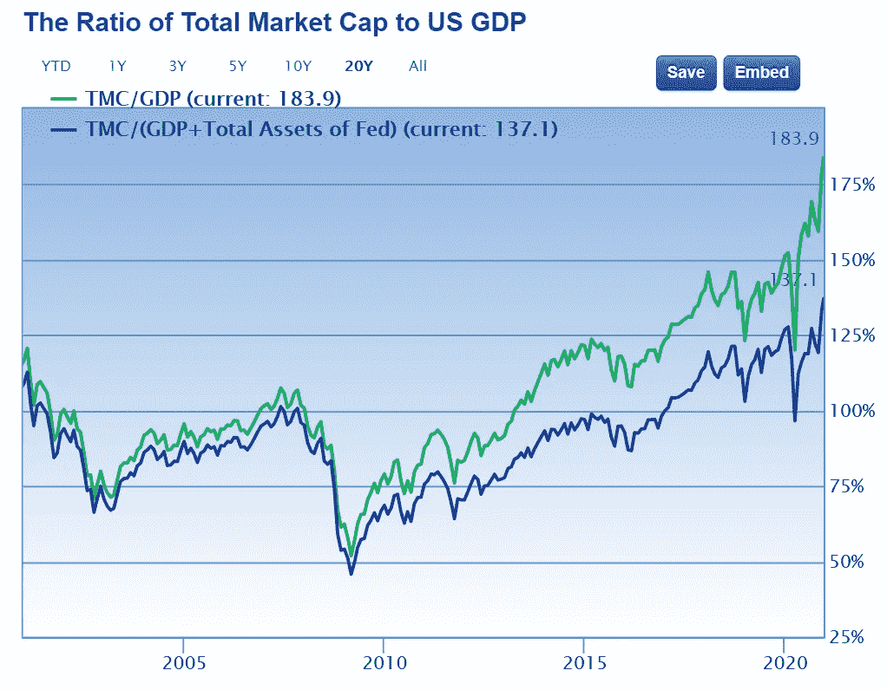
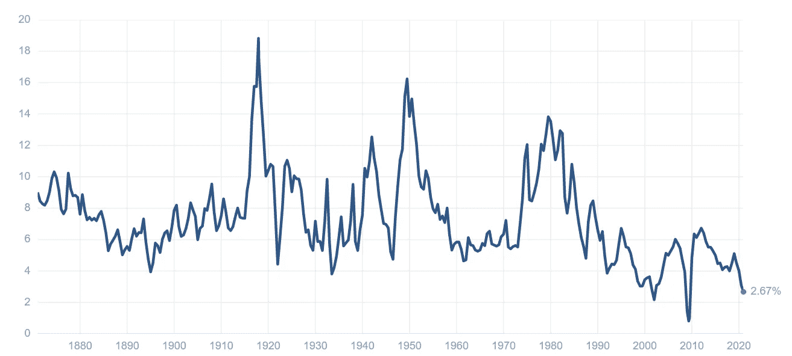

# 如何判断股市何时被高估

> 原文：<https://medium.datadriveninvestor.com/how-to-tell-when-the-stock-market-is-overvalued-bcdd64269cf3?source=collection_archive---------0----------------------->

## “泡沫”市场的迹象以及如何解读它们

投资者经常问自己的一个问题是*如何判断股市是否被高估？*价格是否过高，我们应该等待市场下跌还是现在正是入市的好时机？这是一个重要的问题，因为说实话，没有人喜欢把钱投入股市，然后看着价格下跌。

幸运的是，我们可以通过一些指标来判断市场是否被高估，或者至少对市场估值有一个良好的感觉。有四个关键指标，我们可以用来确定一个市场是否被高估，公平估价或低估。我将使用当前的美国市场作为例子，但是你可以在任何时候使用任何市场的这些指标，其中一些也可以用于个股。

Photo by [Ishant Mishra](https://unsplash.com/@ishant_mishra54?utm_source=unsplash&utm_medium=referral&utm_content=creditCopyText) on [Unsplash](https://unsplash.com/s/photos/stocks?utm_source=unsplash&utm_medium=referral&utm_content=creditCopyText)

*免责声明:本人不是理财顾问，不提供任何理财建议，以下内容仅供娱乐。*

# 第一，市盈率

如果你了解投资，你可能(希望)已经听说过这个指标。这是市盈率或*市盈率*，你可以得到单个股票、行业甚至整个市场的市盈率，你可以用它来判断事物是否被高估。

为了计算它，我们要做的是得到指数的价格(基本上是组成指数的股票的总价值)，计算成本，然后将其与这些股票的总收益进行比较，基本上是这些股票带来了多少利润。这个成本利润比是书中最古老的基准数据，这个市盈率真的很容易找到:你需要做的就是做一个很好的谷歌搜索，然后在雅虎财经或 multipl.com 这样的网站上找到这个图表:

S&P500 P/E values — multipl.com

现在，你可以看到目前 S&P500 的市盈率大约是 37.3，所以如果你拿着它看历史，你会发现它比正常数字高很多。历史上的平均比率是 15.85，现在股票的交易价格是这个数字的两倍多，这不是一个好的迹象。当前的市盈率和 1999 年的差不多，当时是 T7。com 崩溃即将发生。这意味着目前的市场可能被高估，但我们必须看看其他指标，以证实这一假设。

但也有一些著名的投资者批评传统的市盈率衡量市场，因为他们说特定年份的收益可能会因商业周期而波动，因此它并不真正准确(特别是在 2020 年这样的年份)。这就是罗伯特·希勒教授出现的地方，他开发了一种叫做“*希勒市盈率*”的东西。

# 第二，席勒市盈率

席勒教授所做的是，他对过去 10 年的收益进行平均，并根据通货膨胀进行调整，这样短期市场波动就不会出现在等式中，因此至少在许多人看来，这是一种更准确的衡量市场的方法。如果我们看看这个值目前是多少，当前的席勒市盈率是 33.7。

Shiller PE ratio — multipl.com

这远远高于正常水平:如果你回顾历史，过去 150 年的平均席勒市盈率为 16.75，**使得当前值约为平均水平的两倍**。但故事还不止于此，我们还需要看一个指标来自信地判断市场是否被高估。

 [## 为 2022 年 70%的股市崩盘做好准备

### 如何和为什么会发生，有证据和数学支持

medium.datadriveninvestor.com](/be-ready-for-a-70-stock-market-crash-in-2022-86085a2c89d5) 

# 第三:巴菲特指标

沃伦·巴菲特可能是众所周知的[有史以来最伟大的投资者](https://medium.com/datadriveninvestor/how-warren-buffet-achieved-a-30-annual-return-for-10-years-fb4be87bc43c)，他也是众所周知的不喜欢把握市场时机的人，他通常只专注于购买正在出售的优质公司。然而，他确实使用了一个公式来衡量市场的前景:他曾在《财富》杂志(Fortune Magazine)的采访中表示，“*可能是衡量任何特定时刻估值水平的最佳单一指标*”。所谓的巴菲特指标衡量的是公司股票的市值除以国家的国内生产总值，本质上是股票的总价格与它们生产的商品数量之比。

如您所见，在当前时间点，该指标设置为 183.9%。这比 2008 年房地产泡沫崩溃时的价格还要高，甚至比网络市场崩溃时的价格还要高。在同一次采访中，巴菲特说了如下的话。com 崩溃应该是一个非常强烈的警告信号“也许今天也应该是这样，谁知道呢。该指数最终要说的是，与各公司的国内生产总值相比，公司股票的交易价格非常高，股票价格与整体经济之间存在巨大差距。

# 第四，收益

还有最后一种方法来确定市场是否被高估，它依赖于这样一个事实，在一天结束时，当某样东西被高估时，这都是相对的，你需要将它与你用同样的钱可以做的事情进行比较。所以，你应该做的是将你在股票市场上获得的回报与你在其他资产类别中获得的回报联系起来。

我们需要确定的第一件事是，从目前的市场水平，我们可以期待什么样的回报。一个总指标是收益率，即 12 个月的收益除以股价。基本上，这意味着获取之前看到的市场市盈率，并计算其倒数:获取收益，将其除以股票或指数价格，你将看到该只股票的理想回报率(如果你将每股 1 美元的利润除以 33.00 美元的股价，你可以预期的收益率为 3.0%)。等式中缺少的一点是这些收益的增长，它将随着时间的推移而发生深刻的变化，但这一特定的衡量标准更多地关注于短期。

投资经理经常将标准普尔 500 等广泛市场指数的收益率与当前市场利率进行比较，如 10 年期美国国债收益率。如果收益率低于 10 年期美国国债的收益率，股票可能被认为估值过高；另一方面，如果收益较高，股票可能被认为被低估。当然，这种比较并不意味着以数字的方式，而是以相对的方式进行，因为股票总是要求比无风险利率(如美国国债利率)高出几个百分点的额外风险溢价。

S&P500 Earnings Yield — multipl.com

那么，如果我的股市回报率是 2.67%，那么其他资产类别呢？投资者比较的主要资产是储蓄账户和债券。就债券而言，10 年期美国国债目前的收益率为 0.90%，无论你怎么看，这都是一个非常非常低的回报率。如今银行的情况也没什么不同，因为储蓄利率停留在 1%左右或更低，这让 2.67%的收益率看起来已经好了很多。

纵观历史，股票市场总是给投资者带来平均 7%的回报率。然而，由于股票的交易价格非常高，回报率已经大幅下降。高估的投资会降低收益，反之，低估的投资会提高收益。**在收益没有相应增长的情况下，股价涨得越高，收益下降得越低**。如果股价下跌，但收益保持不变或上升，收益就会增加。

这就是为什么即使价格和指标显示股市非常高，投资者仍在投资股市:**你的钱根本没有其他用途，因为债券和银行什么也给不了你。我的意思是，我个人住在欧洲，我的支票账户有-0.50%的利率，这意味着我每年要向银行支付 0.5%的利息。在这种情况下，我会接受任何高于零的值，即使这意味着相对可怜的 2.67%。**

喜欢这篇文章，并想阅读更多？通过下面的链接成为中等会员。这不会花你什么钱，但它会支持我成为一名作家。谢谢大家！

 [## 用我的推荐链接加入媒体。

### 作为一个媒体会员，你的会员费的一部分会给你阅读的作家，你可以完全接触到每一个故事…

medium.com](https://medium.com/@ThomasH_/membership)