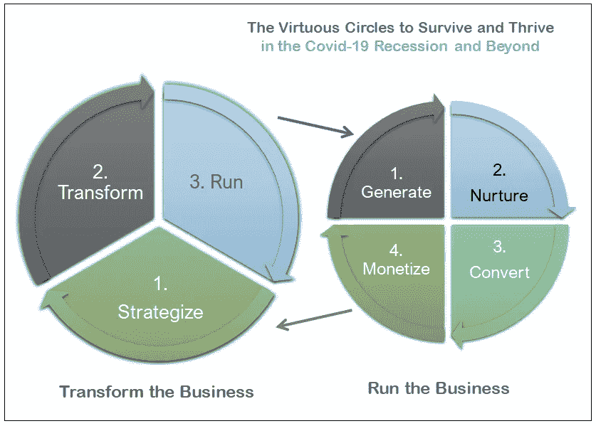

# 如何通过使用 SCENARIO 实现数字化，在新冠肺炎经济衰退中茁壮成长

> 原文：<https://medium.datadriveninvestor.com/how-to-thrive-in-the-covid-19-recession-by-going-digital-using-scenario-1f0b4ee7f36?source=collection_archive---------11----------------------->

Source

W 如果走向*数字*是避免新冠肺炎破产的解药吗？

100 万人死亡，3800 万人感染，数亿人失去工作，中小型企业(SMEs)倒闭，疫情制造了自大萧条以来最严重的信任危机之一。
受到前所未有的悲观情绪打击，企业家们正在寻找度过衰退并实现增长的方法。

具有讽刺意味的是，著名作家[拿破仑·希尔的](https://www.naphill.org/)信念，“你最大的机会可能就在你现在的地方”从未像今天这样正确。

数字化经营是中小企业应该走的路！

问题是，数字现在是一个混淆的词，仅限于社交媒体和数字技术问题。

事实是，数字业务是一个更大的、然而却不为人所知的领域的一部分，这个领域被称为*数字经济。*我互换使用 [*平台业务*](https://searchcio.techtarget.com/definition/platform-economy) 。

这篇文章是为企业家和中小企业写的，它揭穿了围绕数字业务的许多神话，提供了你需要的洞察力，以了解新冠肺炎经济衰退对你的业务的影响，以及你的业务如何利用平台业务来繁荣。

史无前例地，第一次介绍了 ***场景*****(****S****UC****CE****ss I****N****p****A****

# ****生存第一步:了解数字经济的前因后果****

*在今天的经济衰退中，少有的商业繁荣转向了数字经济。根据世界经济论坛的一份报告，“在短短的八周内，经济在消费者和商业数字应用方面跨越了五年。“该报告证实了我们所有人的怀疑，”*疫情已经导致了结构性转变，包括客户对数字化参与的偏好以及员工向远程工作模式的转移，这种情况可能会持续下去。**

*首先，忘记你所在的喧闹的行业的笑话是怎么说的；知道这是“*一个基于互联网的经济*”不会有任何帮助。
如图所示([维基百科](https://en.wikipedia.org/wiki/Platform_economy))，数字经济指的是围绕几个主要在线市场构建的商业和社会活动:*

**

*The Platform Economy Ecosystem — Source: Wikipedia*

*它涉及到包括*消费者*在内的各种玩家，他们购买并消费*数码产品*；*供应商*在*交易商的控制下开发、供应和销售数字产品，交易商*通常是平台所有者，他们利用自己的平台电子算法来推广和分销产品，并促进商业交易。*

*让我们详细介绍一下您需要了解的关于平台业务生态系统的关键事项！*

> ****了解数字产品和服务的关键影响****

*“*到底什么是数码产品？*“客户问我！我总是回答同一个问题，“*它是你可以在网上赚钱的任何产品和服务。*谓句号。*

*它们在本质上是无形的，它们没有任何物理形式或物质，它们涵盖了广泛的领域，包括视频、书籍、摄影、音乐、教程和指南、软件程序、烹饪食谱等等。*

*它们会对你的业务产生积极影响；你不需要管理库存，你不需要空间来存放它们；根据您的业务，交付时间不会超过鼠标点击；而且你不会有任何材料和制造成本。*

*然而，要记住的第一件事是，要传递价值，你的数字产品应该满足消费者对新冠肺炎糟糕的社会经济环境的期望。*

*记住这一点！*

> ****了解这个拥有 18 亿人口和 4.8 万亿美元的在线市场，它会让你的业务蒸蒸日上****

*你会很高兴地得知，2018 年，全球有 18 亿人在线购物，同年创造了 2.8 万亿美元的收入。据德国一家专门研究市场和消费者数据的公司 Statista 称，到 2021 年，网上销售额有望增长到 4.8 万亿美元。*

*正如你所看到的，在网上做生意并不是虚构的！*

*在线消费者可以被定义为那些购买一个或多个在线市场(亚马逊、沃尔玛、易贝、阿里巴巴)的数字产品的人。*

*如今，网购是新常态；无论地点、性别和收入，每个人都这么做。例如在美国，百分之六十九(69%)的美国人在网上购物，这个数字预计到 2021 年将达到百分之九十一(91%)。*

*要记住的第二件事是，在线市场，无论你在哪里，都会给你一个拥有 18 亿消费者的非凡的全球市场。*

> ****了解你的下一个在线市场卖家或供应商角色，它会发现你的业务****

*许多企业家需要澄清的一个问题是，“*成为亚马逊或任何市场卖家或合作伙伴是什么感觉？*”*

*你需要知道的是，作为你与市场伙伴关系的一部分，比如说亚马逊，你的主要责任将是供应和销售符合特定标准的数字产品；如果你是音乐家，可以是音乐虚拟专辑；如果你是作家，可以是 kindle 电子书；如果你是视频制作人，可以是视频。*

*重要的是要知道，达到这些标准就意味着更高的排名，从而增加销售额。更重要的是，市场会向你收取费用——要么很高，要么很合理。*

*要记住的第三件事是，全球有近 10 亿件商品在网上销售，例如，超过 4 亿件商品在亚马逊上销售。*

> ****在线市场是你的下一个合作伙伴，了解你将如何与他们打交道****

*毫无疑问，你别无选择，只能和市场打交道——亚马逊、沃尔玛、易贝、阿里巴巴。*

*他们是你的下一个合作伙伴！*

*在许多企业家的心目中，市场仍然是一个模糊的概念；它值得澄清。*

*我能告诉你的是！*

*最简单的形式，在线市场是连接卖家和买家的网站，所有的交易都由市场所有者管理。公司基本上使用它们来接触那些想要购买他们的产品和服务的客户。*

*在线市场不仅仅是在线销售商品的网站，比如亚马逊，Krista Fabregas 说得很清楚，“一旦你成为亚马逊的卖家，你就成为了亚马逊体验的一部分，吸引了大量忠实的购物者。”她补充道，“*亚马逊销售机器旨在给顾客提供他们想要的东西，这一策略获得了巨大的回报。购物者成群结队而来，被亚马逊丰富的选择、有竞争力的价格、卓越的运输和良好的声誉所吸引，这只是其众多销售激励福利中的一小部分。**

*因此，准备好应对重要的在线市场，如北美的亚马逊、易贝和沃尔玛，亚洲的 Pay Pay Mall，南美的自由市场和欧洲的 Fnac。*

*要记住的第四件事是，在线市场是你的下一个合作伙伴。全世界有一百五十三(153)个这样的网站，它们可以让你进入五大洲的各种市场——零售、拍卖、消费电子、艺术品。*

# ****生存第二步:了解冠状病毒和平台业务带来的变化****

*既然你已经对平台业务、其生态系统、风险、挑战和机遇有了一个现实的了解，你就要迈出在疫情经济衰退中幸存下来的下一步了。它是关于得到你可能想到的那个问题的有效答案:*

*"*新冠肺炎和平台业务这对我所在的行业、我的业务以及我的经营方式有什么影响？*”*

*以下是我的想法、观察和建议！*

> ****了解新冠肺炎经济衰退的商业影响及其带来的反弹选择****

*简而言之，衰退是持续数月的经济活动下降，企业和消费者失去信心，减少投资、生产和消费，同时将经济带入恶性循环，不断扼杀就业和企业。*

*我让你看看你周围的社会损害，但也有反弹的选择！*

*新冠肺炎疫情正在发生的是，世界各国政府采取的社会距离措施，包括*呆在家里*和*远程工作*命令，减缓了经济活动；失去了消费者和企业家，中小企业的销售额正在下降。*

*好消息是，反弹的选择有很多。例子！*

> ****教育:虚拟学校和学院正在蓬勃发展，教师应该抓住机遇！****

*如果你从事教育行业，你很有可能已经体验过通过像 Zoom、微软 T2 团队和 WhatsApp 这样的应用程序进行远程教学的乐趣。*

*故事还没完呢！*

*你可以通过建立一个有利可图的教学企业来赚取额外的钱，到 2025 年，全球电子学习市场预计价值 3250 亿美元！使用像 [ClickMeeting](https://clickmeeting.com/) 和 [GoToWebinar](https://www.gotomeeting.com/webinar) 这样的网上研讨会平台，或者像 [Udemy](https://www.udemy.com/) 和 [Teachable](https://teachable.com/) 这样的电子学习平台，你可以建立一个在线学院，并从中赚取合理的收入。*

> ****音乐:数字音乐和视频流媒体服务预计到 2025 年将为音乐人提供 220 亿美元的市场****

*在音乐方面，来自加蓬的天才歌手、歌曲作者和制作人 Naneth Nkoghe 的案例很好地说明了这个行业的趋势。像大多数艺术家一样，面对销售额的大幅下降，她觉得数字音乐领域及其众多平台，如 Spotify 和 TuneCore，更重要的是，2025 年的预计收入为 220 亿美元，这是保持业务的最佳选择。她自信地说:“数百个国家的数亿人能够听到我的音乐，这简直太棒了，T21。”。*

*我还可以继续列举更多的数字化转型机会，如商人马克-亨利·欧·德克斯特(Marc-Henri O. Dexter)想象的超市延伸到“*无人机向偏远农村地区运送食物*”**，餐馆转型为豪华在线订购餐馆，鞋店转型为专门经营居家鞋的在线鞋店，但我认为这一点已经得到了证明。现在的问题是，“你在数字平台上的存在足以避免破产吗？正如下一节所解释的，答案显然是否定的！***

# ***生存的最后一步:单独实施成功的数字战略，与市场合作是不够的***

***不要听信某些数字化转型专家的话；在线赚钱不仅仅是与亚马逊合作，或者在 Twitter 和脸书上发布对你的业务毫无意义的推文和分享。***

***你就不会在这里看这篇文章了！***

***合格的数字专家证实，在这场疫情的衰退中取得成功需要你的业务完全适应平台业务，以及以解决消费者面临的新冠肺炎社会问题为中心的业务模式。专家卡安·图纳利(Kaan Turnali)说:“(T2)数字化转型不是技术改造，而是一场商业革命。***

> ******不要认为订阅平台和活跃社交媒体就足够了******

***还是那句话，不要让自称的数字化转型专家用他们赚钱用的*来忽悠你；你还需要了解你未来的在线客户。
正如数字平面设计专家 [Lilian Roger](https://www.facebook.com/rwootsdesign/) 所解释的那样，“*调查客户让我认识到脸书是一个值得信赖的商业市场，也是一个提供各种定制服务的市场。*****

****了解你的竞争对手以及如何应对他们也将是你日常关注的核心。她说，对 Nkoghe 女士来说，这可能采取“*定期在推特上发布我最喜欢的歌词的鼓舞人心的摘录”的形式。*****

****最后但同样重要的是，您的业务运营模式，即您开展业务的方式。您需要调整员工的技能、角色和职责、流程和实践以及基础设施和工具。****

****如果你担心，“文章突然变得更强硬了，”我只能同意你；在严重的疫情经济衰退中，转变业务使其盈利不是小孩子的游戏！****

****为了实现这个目标，你别无选择，只能做许多企业家和中小企业不愿做的事情:发展你的业务*数字战略*。****

> *******太多的专家误解了数字战略，他们错误地实施了它*******

****商业作者[亨利·明茨伯格](https://mintzberg.org/)说，“*战略不是计划的后果，而是相反:它的起点，*”他是对的。****

****我在各处读到的数字战略不能被缩小到“*使用技术来经营你的业务，或者你如何使用技术来创造新的数字产品和服务*”。相反，它指的是解释你为实现财务目标而采取的组织、运营和技术策略的计划。****

****组织维度与你如何从员工和任务的角度协调你的市场营销、销售、数字产品开发和客户支持活动有关。对恩科赫来说，这是关于她如何在一系列活动中分配角色和职责，包括以保证利益的方式分配*网站管理员*、*社交媒体观察*、*世界音乐比赛观察*、*歌词写作*、*音乐编曲*。****

****运营方面涉及可能使您的员工在市场营销、销售、数字服务开发和客户支持工作方面表现出色的活动、任务和最佳实践。技术与基础设施和工具有关，这些基础设施和工具可能会使您的市场营销、销售、数字产品开发和客户支持任务变得有效和高效。****

****罗杰先生承认花时间制定数字战略的好处，“*从许多方面来说，这都是一次美妙的经历；这让我发现了我们的弱点，包括无效的营销，缺乏技术观察，以牺牲整个业务为代价只专注于产品开发。*”他也承认，“*然而，数字战略的制定是极其复杂的，因为你必须考虑这么多的因素，并将它们整合到一个连贯的计划中。那不容易，我是平面设计师！*****

****莉莲罗杰说的没错，下面是我提供的解决方案:*场景**(****S****UC****CE***ss I***N****p****A****ndemic***T45******

> *******使用场景*** 转变您的业务以应对新冠肺炎经济衰退****

****大多数成功的数字企业家声称，“在这次疫情经济衰退中的成功依赖于一个明确识别的活动群体的良性循环”，包括制定战略、转型和运营。下图展示了支持 SCENARIO 方法的良性循环模型:****

********

****The Virtuous Circles to Survive and Thrive in the Covid-19 Recession — By Philippe Abdoulaye****

****下面是你如何使用这个框架！****

****首先，根据您的业务规模，建立一个包括您的相关营销、销售、售后和产品开发人员的项目团队，并分享项目的目标，即"*使业务适应平台业务。*****

****让团队参与三步业务转型之旅，包括*制定战略*、*转型、*和*运行*。****

******制定战略:定义你的财务目标，并与你的员工就实现目标的方法达成一致******

****哈佛商学院教授迈克尔·波特说:“大多数公司都没有战略，尽管出于各种各样的原因，他们有一个战略，但一项研究说:“超过 70%的公司失败了”。****

****你如何着手此事？****

****让项目团队参加至少四个小时的研讨会，首先确定您的客户、他们在疫情期间面临的问题以及可能解决这些问题的解决方案。****

****然后，获得以下问题的具体答案，这些问题关系到您的下一个营销策略以及您将如何向客户提供价值:****

*   ****你想提供什么好处？你想传递什么营销信息？****
*   ****你需要擅长哪些营销、销售、数字服务开发、客户支持最佳实践和相关工具？****
*   ****影响您业务的新角色和职责、流程和实践以及基础架构和工具是什么？****

****在研讨会期间，讨论以下内容:****

*   ****采用*内容营销*作为在线推广您的业务和服务的方式****
*   ****采用*用户体验(UX)设计*作为数字服务开发方法的基础****
*   ****以及采用敏捷方法作为实现高度协作环境的手段****

******转型:从组织、运营和技术角度实施您的数字产品交付渠道******

****与大多数专家的建议相反，数字化转型并不局限于部署数字技术——*云计算*、*分析*、*人工智能*、*物联网*——这是一种危险的过度简化。****

****业务的数字化转型主要是实施在制定战略阶段做出的决策；它是关于部署保留的角色和职责，开发和培训相关人员到选定的流程和实践，以及支持它们的工具和应用程序。****

****以下是你如何继续前进的方法！****

****让团队参加另一个研讨会，并确保执行操作工作的员工参与。****

****然后，在白板上画出一个五步的*产品交付生命周期*包括*计划&度量*、*开发&测试*、*发布&部署*、*监控&改进*。****

****对于每一步，合作解决以下问题:****

*   ****应该执行哪些活动？****
*   ****我们应该履行什么样的角色和职责？****
*   ****谁是任命的合适人选？****
*   ****需要哪些工具和 app？****

****一旦配置了产品交付生命周期，让相关人员不仅接受所选工具的培训，还要接受他们将参与的操作交互的培训。****

******运行:每天运行您的数字业务******

****"*这一切是如何日常运作的？*“就是你可能想到的。****

****Run step 反映了在整个企业中开展的赚钱活动网络，它们是数字化转型的结果。****

****日常工作是围绕着一个良性循环的活动而构建的，这些活动分为*运营*和*支持*。让我们讨论一下您接下来的运营活动:****

******产生潜在客户** —这是关于调动转型步骤中定义的相关员工，通过在社交媒体上分享内容(博客帖子、视频、文章)并与他们互动和互动以实现互利(建立关系网)来激发消费者对您的数字产品的兴趣或询问。底线是通过建立第一次正式接触将潜在客户转化为潜在客户。****

******潜在客户培育** —这是指动员转型步骤中定义的相关员工，为潜在客户提供各种资源(博客帖子、视频、文章)，以吸引他们购买你的数字产品。底线是将潜在客户转化为购买客户。****

******销售结束** —指说服潜在客户做出购买决定的一系列任务。底线是获得潜在客户的购买决策。****

****支持活动充当您的业务监督人，其工作是确保您的表现优于您的竞争对手和客户满意度:****

******竞争观察** —这是关于调动在转变步骤中定义的相关员工，以收集、分析和决定竞争对手的表现。底线是确定和采取必要的行动，使您的产品具有竞争力和利润。****

******客户观察**——这是关于调动转型步骤中定义的相关员工来收集、分析、决定如何获得新客户并保持现有客户的忠诚度。底线是确定并采取必要的行动让你的客户获利。****

******产品开发** —这是关于调动转型步骤中定义的相关员工，利用*、*设计思维*和敏捷等方法来设计、开发、测试和推出满足客户期望的数字产品。*****

# ****关键要点****

****这篇文章的灵感来自我的下一本书*如何通过使用场景*实现数字化，从而在新冠肺炎经济衰退中茁壮成长，这篇文章旨在为你成功的数字化商业铺平道路。它传递了三个重要信息:****

*   ****新冠肺炎的衰退是毁灭性的，它可能持续两年、三年或四年，没有人能预测。****
*   ****重塑你的业务，平台业务并不完美，但它是迄今为止最安全的选择。值得一试。****
*   ****围绕人们面临的新冠肺炎社会问题规划您的数字战略，然后从组织、运营和技术角度实施它。****

*****如何通过使用 SCENARIO**:构建创新且盈利的数字业务的框架和技术*将提供关于如何利用 SCENARIO 框架并使您的业务繁荣的见解。****

****喜欢你读过的吗？分享这篇文章，让它像病毒一样传播，让尽可能多的企业家阅读它，给我点 50 次掌声，访问我的网站——[Philippe abdou laye](https://www.itaasnow.com/)****

****祝你好运！****