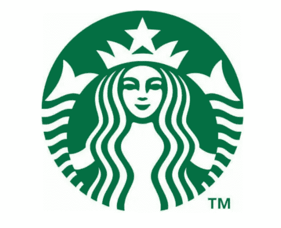

# 如何追踪你的食物来自哪里

> 原文：<https://medium.datadriveninvestor.com/how-to-trace-where-your-food-comes-from-a4c0fcde46c6?source=collection_archive---------6----------------------->

Source: Starbucks.com

2 分钟视频，介绍如何从农场到餐桌全程跟踪您的食物

追踪和追溯你盘子里食物来源的能力对农民商店，最重要的是对消费者有一些诱人的吸引力。这在一定程度上解释了为什么现在有这么多组织参与使用区块链驱动的平台。区块链允许食品的来源，因此零售商和购物者可以清楚地了解农产品的种植/捕捞方式、地点和时间，随后的储存条件，甚至潜在的环境影响及其生产的可持续性。

许多参与提高食品供应链透明度的公司正在使用人工智能(AI)、区块链和物联网(IoT)等技术的组合。通过这些技术收集和存储的信息通常可以在移动设备上访问，包括使用快速响应(QR)码的手机。这使得各方(通常沿着复杂的供应链，在某些情况下可以跨越全球)能够跟踪和追踪货物的旅程——它们是如何运输的，它们来自哪里，它们储存的温度条件，甚至它们被捕获的拖网渔船或它们生长的田地的细节。

 [## 数字货币、区块链和货币的未来|数据驱动的投资者

### “区块链”、“加密货币”、“令牌化”，以及现在的“央行数字货币”已经成为…

www.datadriveninvestor.com](https://www.datadriveninvestor.com/2020/02/18/digital-currencies-blockchain-and-the-future-of-money/) 

大约五年前，即 2015 年 11 月[，一家名为“出处”的公司发布了一份白皮书](https://www.provenance.org/whitepaper)(商业主张)，称，“*出处使每一件实体产品都带有一个证明真实性的数字‘护照’(这个产品是它所声称的吗？)和产地(这个产品来自哪里？)，为所有实物产品背后的旅程创造可审计的记录*。”出处继续引用[马克·安德森的话，他在 1993 年发明了第一个互联网浏览器，马赛克](https://www.wired.com/2012/04/ff-andreessen/)，当谈到它时，他说，“*区块链技术改变了一切。实际的结果是……第一次，一个互联网用户可以向另一个互联网用户转让独一无二的数字财产，从而保证转让的安全，每个人都知道转让已经发生，没有人可以质疑转让的合法性。这一突破的后果很难被夸大。*

还有许多其他不同组织使用区块链平台跟踪和追踪各种食品的例子，包括:

阿尔伯特·海恩(Albert Heijn)——荷兰超市现在能够让顾客追踪他们的橙子是在哪里种植的。它计划到 2025 年能够提供所有产品的来源；

[agri ledger](https://static1.squarespace.com/static/5a142e2b9f07f5b18a237f95/t/5d230d6ae96bd200011eb14c/1562578283980/RBF+EoM+2018+Case+Study+-+Agriledger+%26+Agunity.pdf)——根据牛津大学赛德商学院(在海地种植芒果和鳄梨)的一份报告，这家公司与世界银行合作，帮助农民增加了 2 到 3 倍的收入；

大黄蜂金枪鱼——[正在使用运行在 SAP 云平台](https://fortune.com/2019/03/08/tuna-blockchain-bumble-bee-sap/)上的 Multichain 来追踪黄鳍金枪鱼，从它被捕获到它出现在商店货架上的那一刻；

[加州巨型浆果农场](https://www.thepacker.com/article/california-giant-blockchain-use-boosts-freshness-food-safety) —美国最大的浆果农场之一正在使用 IBM 食品信托区块链公司的浆果供应链，以便让客户获得其浆果的原产地详情和产品跟踪；

[农民鸡舍](https://www.foodprocessing-technology.com/news/farmers-hen-house-eggs-uses-blockchain-to-trace-eggs-origin/)——每个鸡蛋上都印有二维码，这使得消费者能够知道鸡蛋是从哪个鸡场生产的；

[星巴克](https://www.computerworld.com/article/3393211/from-coffee-bean-to-cup-starbucks-brews-a-blockchain-based-supply-chain-with-microsoft.html) —正与微软合作，为星巴克的产品提供数字可追溯性，并支持其可持续发展战略。

与此同时，IBM 委托撰写了一份报告，对来自 28 个国家的近 19，000 名不同年龄组的消费者进行了调查，以了解个人购买决策是如何演变的。研究发现:

如果对品牌失去信任，今天所有消费者中有三分之一会停止购买他们首选的产品；

三分之一的消费者已经在 2019 年停止购买他们历史上最喜欢的品牌；

消费者优先选择那些可持续、透明且符合消费者核心价值的品牌和产品；

消费者愿意为做得好的品牌支付更多，甚至改变他们的购买习惯；

企业价值现在超过了产品成本和便利性；所有年龄和收入的消费者为符合他们个人信仰的产品支付更高的溢价；

平均而言，70%的“目的驱动型购物者”会为可持续购买多支付 35%的额外费用，如回收或环保商品；

其中 57%的人甚至愿意改变购买习惯，以帮助减少负面环境影响；

如今，79%的消费者表示，品牌提供有保证的真实性非常重要。在这一群体中，71 %的人愿意为提供完全透明和可追溯性的公司支付额外的费用，高出 37%。

IBM 建议，零售商要获得更大的市场，就必须通过透明度和可追溯性赢得消费者的信任……提供方便、快捷的详细信息，这些信息以前是不必要的，如产品是如何制造的、成分的质量、是否是可持续的或符合道德的来源，以及在什么条件下获得。但公平地说，IBM 已经花费了数百万美元来开发和销售其区块链技术技能！对于任何信息技术和数据库的使用，信息和报告的准确性只能取决于输入的质量，即“垃圾输入，垃圾输出”

不仅仅是消费者的需求和购买习惯令人鼓舞，或者有些人可能会认为，迫使新技术用于食品供应链，但立法也在推动采用。T4 世界卫生组织估计每年有 42 万人死于食物污染。在美国,[食品安全和现代化法案](https://www.fda.gov/Food/GuidanceRegulation/FSMA/)引入了对食品进口的控制。同时，欧盟的[贸易控制和专家系统](https://europa.eu/european-union/topics/food-safety_en)旨在提供食品可追溯性和风险管理，以便在整个食品供应链中跟踪和监控交易的植物或动物产品。

因此，使用区块链驱动平台的公司需要确保有可靠和可审计的程序，以确保首先输入正确的，如果可能的话，经过验证的信息。显然，被采摘、挖掘和捕获的食品更容易提供来源。然而，依赖于多个供应商的加工食品，混合，混合和其他“混乱”的步骤，虽然不是不可能，但很难在区块链上准确记录。

如果你想每周收到数字字节，请发电子邮件给[Jonny.Fry@TeamBlockchain.net](mailto:Jonny.Fry@TeamBlockchain.net)

**访问专家视图—** [**订阅 DDI 英特尔**](https://datadriveninvestor.com/ddi-intel)