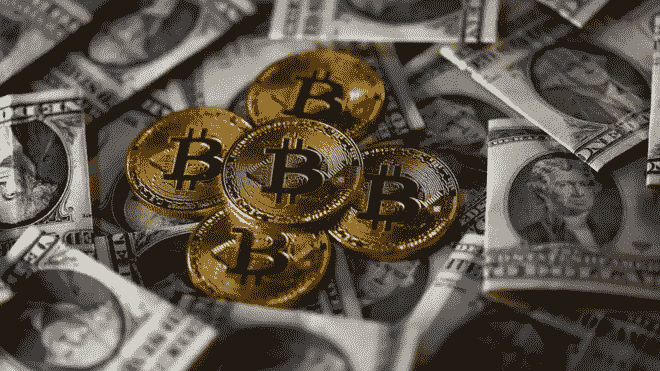
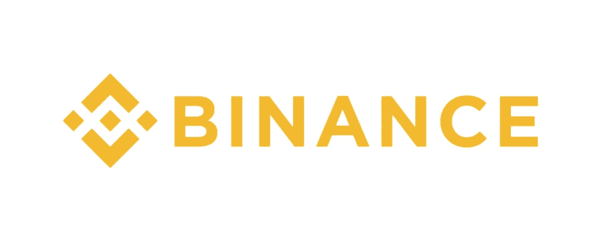

# 如何交易加密货币:权威指南[2020]

> 原文：<https://medium.datadriveninvestor.com/how-to-trade-cryptocurrency-the-definitive-guide-2020-a663a9accb78?source=collection_archive---------12----------------------->

很容易，2020 年最令人兴奋和谈论最多的在线赚钱方式之一是交易加密货币，如比特币、以太坊和其他数千种不同的加密货币。

虽然需要花费大量的时间和精力来正确地学习如何交易加密货币的盈利能力，但可以产生的收入也远远高于通过就业甚至创办大多数类型的企业可能获得的收入。

但加密货币交易是一项多维活动，它需要对许多主题有更深入的了解，交易者对市场和他们投资的资产的了解越多，这意味着可靠地产生利润的可能性就越大。

 [## 加密货币行业是死是活？数据驱动的投资者

### 九月初，我们在 X-Order 内部就代币市场的未来进行了一场辩论。有趣的是，我们的观点是…

www.datadriveninvestor.com](https://www.datadriveninvestor.com/2019/12/12/will-the-cryptocurrency-industry-be-dead-or-alive/) 

该指南旨在详细说明什么是加密货币交易，并通过了解为什么这么多人进行加密货币交易、加密货币交易者使用的最佳策略以及在线交易的最佳地点来帮助加密货币行业的新手。

# 什么是加密货币？

## 中本聪是谁或什么？

第一个[加密货币](https://coinmarketcap.com)比特币的创造者的名字是中本聪，然而这个名字实际上是我们对他们的所有了解，包括他们到底是谁，是个人还是团体，以及他们来自世界的哪个地方。

为了将加密货币的创建放在上下文中，比特币是在一篇名为《比特币白皮书》的研究论文中首次向世界介绍的，该论文由中本聪于 2008 年发布。

此时，世界仍处于全球金融危机之中，这是一场由银行和金融系统造成并延续的经济崩溃，贪婪的海洋在整个系统中流动，导致无法再持续的巨额坏账积累。

因此，中本聪创造并发行一种完全不依赖于银行的数字货币是非常合适的，这种货币被设计成一种去中心化的货币，权力和财富由许多人分享。

这可能向我们表明，中本聪不仅仅是一个机会主义的计算机科学家和企业家，他更可能是一个理想主义者，一个深切关心刚刚发生的全球金融危机的人。

自 20 世纪 90 年代以来，人们一直在探索数字货币，支持这一探索的金融无政府主义运动和赛博朋克运动在本质上是高度理想化的。

## 区块链和加密货币有什么不同？

几乎与加密货币一样著名的是允许它运行的技术，即区块链，这也是由中本聪创造的，并内置于比特币的核心。

区块链本质上是一个账本系统，或一个管理谁拥有多少在系统内交易的资产以及所有资产交易的数字系统。

[比特币](https://bitcoin.org)与普通央行运营的法定货币(如美元)之间的关键区别在于，比特币和所有其他加密货币一样是去中心化的，而法定货币是集中的。

这意味着，关于创造多少货币、给谁以及其他管理问题(如由法定系统内的央行管理)的决策，不适用于比特币和其他加密货币。

加密货币不需要中央银行来管理这个系统，而是使用区块链，这是一个基于数学和算法的自治系统，可以做出通常由中央银行做出的决定，并且不能被任何人类团体控制或影响。

这里要做的区分是，区块链不仅是加密货币的独立技术，而且它不仅可以用于金融应用，还可以用于广泛的非金融应用，如供应管理和医疗部门。

## 比特币是走向零还是走向 100 万美元？

这个问题，或者类似的问题，在加密社交媒体中不断被问及，是每个人都想更好地理解的事情，即比特币是否有足够的寿命来大幅增值，或者加密货币是否有一些固有的缺陷，会导致这些系统的崩溃。

看待这一点的最佳方式是，这一点没有决定性的答案让我们能够预测未来，但是如果我们对这两种结果发生的概率进行衡量，可以公平地说，比特币在不久的将来的任何时间点变为零的可能性不到 1%，比特币的价值在未来 20 至 30 年内达到 100 万美元的可能性至少为 50%。

其理由是，首先，比特币的价值只会导致价值的不断增加，不太可能有任何事情会暴露比特币的无价值或实际上不提供价值的系统。

从另一个角度来看，比特币达到 100 万美元的可能性实际上比许多人认为的要大得多。

如果我们回到 2013 年，当时比特币的价值还不到 10 美元，如果你在那个时间点问任何人，比特币达到 2 万美元的可能性有多大，许多人会说这根本不会发生，如果真的发生，那也需要十年或更长时间。

事实上，在那之后的短短几年里，比特币的价格达到了近 2 万美元，比 2013 年上涨了 2000 倍。

如果比特币的价格在未来四年内比现在增长 2000 倍，它将达到近 200 万美元，尽管这可能不是最有可能的情况，但它表明这不是不可能发生的。

# 为什么今天这么多人交易加密货币？

## 你能做好密码交易赚钱吗？

交易加密货币是 2020 年最赚钱的在线活动之一，这也是今天如此多的人成为活跃的加密货币交易者的主要原因。

纵观比特币和其他加密货币的历史，参与加密货币市场的盈利能力几乎是传奇，这是为什么如此多的人涌入市场希望致富的主要原因。

在现实中，交易者很少通过交易加密货币成为百万富翁，如果没有多年前的投资和多年的加密货币持有，没有其他简单的途径能够实现这一点。

然而，相反，有很多人挣的可能不是几百万美元，但比朝九晚五的工作收入要多得多。

与股票、外汇和其他传统资产不同，它们也可以盈利，但波动性低得多，加密货币波动性很大，这为在加密资产市场和其他金融市场创造更高利润提供了机会。

## 加密货币交易入门难吗？

今天，许多每天交易加密货币作为其主要收入来源的人最初只是购买相对少量的比特币或其他加密货币，并试图根据该加密货币的价格波动进行交易。

加密货币市场的入门就像这种最基本的形式一样简单，任何人基本上都可以通过购买一些加密货币或其他货币成为加密货币交易者，并为他们何时以及为何平仓制定基本策略。

然而，为了成为一名专业的加密货币交易者，这里的区别是某人基于大量的当前信息进行交易，具有严格和稳健的策略，并且通常是为了大量的金钱，入门的过程要更深入一些。

虽然任何人都可以买卖加密货币，并以可靠盈利的方式进行交易，但重要的是要加深对加密货币市场和交易原则(如技术分析)的了解。

只有做个人研究，完成在线课程和金融培训，通过执行大量交易积累经验，交易者才能成为专业人士。

## 交易加密的利弊是什么？

选择成为加密货币交易商有许多利弊，这些主要取决于可能涉及的风险以及可能出现的机会。

成为一名成功的加密货币交易员的一些显而易见的优势是，能够在一天中的任何时间灵活工作，在不需要老板或经理的情况下自主工作，当然还有产生大量利润的高潜力。

对于大多数人来说，一周的加密货币交易所能产生的利润远远高于他们从大多数就业机会中所能产生的收入，这也是过去几年来如此多的人进入加密货币市场的一个常见原因。

然而，与所有事情一样，成为加密货币交易商也有不利因素，也应该考虑在内。

最明显的缺点之一是加密货币市场固有的风险，即在没有进行足够的研究和积累足够的知识的情况下，以粗心的方式进行交易，确实有可能损失大量资金。

然而，幸运的是，大多数专业交易者使用风险缓解策略，如使用止损，以及提供强大专业功能的高级交易平台，以缓解加密货币交易损失的风险，从而仍有可能产生高额利润。

# 从新手到专业加密交易者

## 比特币交易如何入门？

根据你想要参与的比特币交易的类型，需要进行不同类型的准备，需要发展不同水平的知识和理解，以便成功执行比特币交易策略。

对于任何计划购买比特币或其他加密货币并计划长期持有它们的人来说，最重要的是要找到一个安全的平台，以便能够存储你的资产。

与交易者相反，投资者完成的交易量要少得多，但他们花大量时间在平台上存储资产，因此选择一个具有强大安全系统的交易平台至关重要。

对于任何正在计划一个更复杂的战略，而不是简单地购买和持有的交易者来说，学习任何一种金融投资的基本面都是关键，尤其是考虑到投资于许多不同金融资产的原则将有大量交叉投资于加密资产。

对于加密货币交易商来说，同样重要的是发展加密货币市场及其资产的行业知识。

虽然加密货币的大部分交易与其他资产(如实际股票)的交易类似，但加密货币行业存在细微差别，这意味着简单地将传统资产市场中应用的相同战略、战术和方法应用于加密资产市场注定会失败。

## 如何采取下一步行动

从加密货币交易商到专业加密货币交易商的步骤通常涉及向预告片参与加密货币市场的方式添加更多结构的过程，以及通常涉及更高级策略的开发。

专业加密货币交易商通常将他们的职业视为一项业务，考虑的因素包括可获得的利润水平、即将到来的利润的可靠性、获得即将到来的收入的成本、不同战略和投资的不同风险因素的比较，以及投资于知识和支持资源开发的价值。

专业加密货币交易商对于在加密货币市场中产生利润的选择是认真的，并且在将加密货币交易作为唯一收入来源之前，他们通常已经在该市场中呆了几个月甚至几年。

与新手相比，专业加密货币交易者的另一个共同因素是专注于获取广泛的信息和知识，这些信息和知识可以支持可靠盈利的加密货币交易策略的开发。

## 什么是新的密码交易员的大好机会？

过去三四年的另一个现象是社交交易被引入加密货币领域，它也是传统资产市场的一大部分，并逐渐渗透到数字资产领域。

社交交易是允许投资者分享他们手头的信息和资源，以便所有投资者共同创造更多利润的做法，正是投资者与市场互动的这种效率导致了它的流行。

PrimeXBT 等主要加密货币交易平台已将社交交易集成到他们为市场提供的产品中，PrimeXBT 的 Covesting 模块是主要加密货币平台向社交交易市场推出的最新产品。

以这个特定平台为例，投资者能够创建点对点投资基金，他们可以公开展示他们投资的成功和表现，其他投资者能够决定他们愿意投资哪些基金，并向基金经理支付象征性费用，以便能够支持他们正在进行的相同交易。

社交投资是一种新的方式，加密货币市场在盈利和分享能力方面变得更加先进和复杂。

# 网上交易加密货币的最佳地点

## PrimeXBT

PrimeXBT 是全球领先的多资产保证金交易平台，为加密货币市场和金融资产交易市场提供先进的服务和解决方案。

在相对较短的几年时间内，PrimeXBT 已经从拥有 150，000 名交易者的白名单开始发展，到在过去几年中发布广泛的功能和工具，再到今天成为每天管理高达 20 亿美元全球贸易的平台。

PrimeXBT 列出了一系列[的加密货币](https://primexbt.com/leverage-trading-crypto-indices-forex)，以及传统资产，并提供了一些业内最高的杠杆。

BTC、瑞士联邦储蓄银行、XRP、长期抵押贷款和 EOS 等加密资产可以在该网站上以高达 100 倍的杠杆进行交易，股票指数、外汇对和商品等传统资产可以以高达 500 倍的杠杆进行交易。

PrimeXBT 的费用也是业内所有主要加密货币交易平台中最低的，所有交易的[统一费率为 0.05%](https://primexbt.com/fees) 。

除此之外，PrimeXBT 的高级安全措施还包括银行级功能，如评级为 FIPS 公共 140–2 3 级或更高的硬件安全模块，以及每次下单和执行后的全面风险检查。

## 币安

[币安](https://binance.com)是另一个大型加密货币交易平台，提供一系列功能和大量加密货币列表供交易者和投资者选择。

币安也是几年前推出的，在此期间发展迅速，创造了许多工具，使交易者能够以强有力的方式获得加密货币市场的机会。

币安列出了市场上可用的更广泛的加密货币之一，这是它的主要优势，以及拥有一个易于导航的平台。

在 2019 年初被黑客入侵 4000 万美元的用户资金后，币安确实对其安全存在疑问，这让许多人怀疑币安是否能够保护他们的平台免受黑客攻击。

除此之外，币安的费用远远高于任何其他平台，这对于一些希望最大化利润并保持低成本的用户来说是一种威慑。

# 加密货币交易的最佳赚钱策略

## 头皮

刷单是另一个非常简单的概念，它在正式意义上的传统交易中更普遍，但在加密货币市场中也广泛使用，以便开发产生利润的方法。

刷单背后的基本原则是创造短期交易，比长期交易获利更少，但当一天或一周内多次刷单时，累积起来就能获得可观的利润。

黄牛党会寻找趋势中可预测的短期运动的机会，通常寻找可重复的情况，如一个给定的指标显示一个新的趋势即将形成，然后执行短期交易，快速进场和出场，以获得干净的利润。

作为一个黄牛党，要想成功赚钱，执行策略的第一步就是要能够识别一个特定的情况，或者一个有利可图的场景即将出现的迹象，然后准备好执行。

这可以手动完成，或者更常见的是，可以用基于软件的系统检测刷单机会并自动执行，通过算法来完成。

## 三角套汇

套利是所有金融交易中普遍使用的一种策略，由于其风险极小，因此极具吸引力。

套利的基本思想是识别可以进行交易的情况，这将导致有保证的即时利润产生，并且在这种情况下没有损失的风险。

虽然其他交易者可能会寻找高利润的机会，在一次交易中可以产生大量的利润，但套利交易者通常满足于产生最低限度的利润，甚至不到 1%，然后在一天的时间里，这些利润累积起来与其他此类交易相当可观。

三角套利是该策略的延伸，三角套利的原则是寻找机会同时进行三笔交易，利用三种不同资产之间的差价，并像正常套利一样在有保证的情况下产生利润。

## 秘密摇摆交易

摇摆交易是所有金融交易中的一种常见策略，它很容易理解，如果执行正确，会非常有利可图。

加密货币和所有其他金融资产一样，在一段时间内随着上升趋势波动，随后呈现下降趋势，随着时间的推移，交易者已经意识到，创造利润的成功策略可以是尝试利用这些波动进行交易。

通常，摇摆交易者会在他们感觉到加密资产的波动已经跌至低点时建立头寸，几天后会寻找他们感觉自然高点的位置，以便在该点附近卖出。

摇摆交易者纯粹基于技术分析做出决策，观察资产在图表上移动的历史模式。

# 总之:如何交易加密货币

在 2020 年，交易加密货币仍然是最受欢迎的在线赚钱方式之一。

有许多方法可以实现这一点，并且可以使用一系列不同的策略来与加密货币市场互动。

虽然在线加密货币交易平台比以往任何时候都多，但上述两个平台提供了许多业内其他平台所没有的独特优势。

要了解这两个平台的更多信息，请查看 PrimeXBT 和 T2 币安。