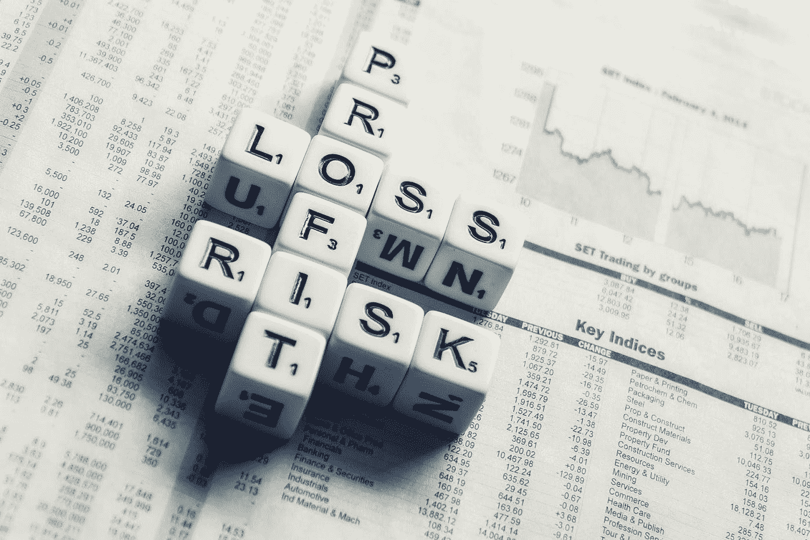
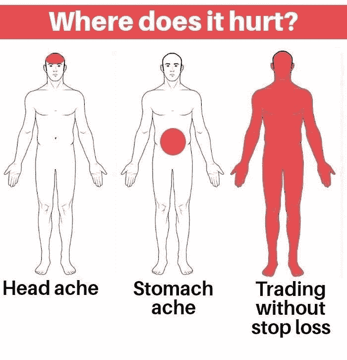
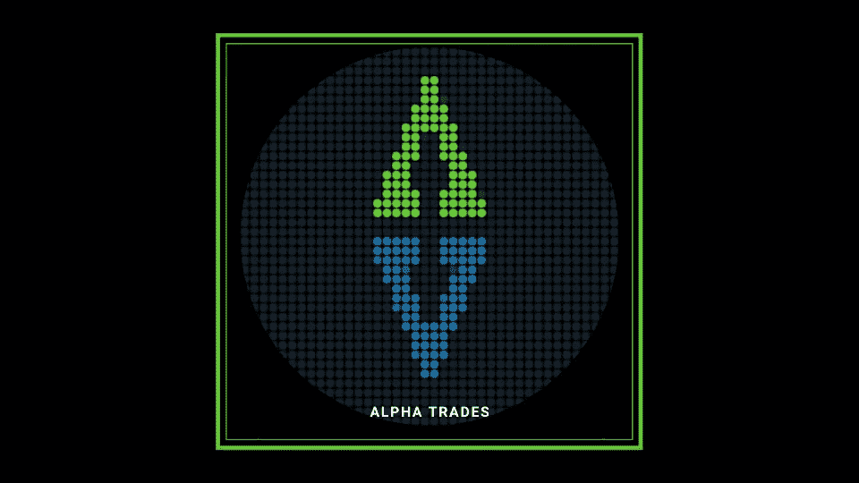

# 如何以交易为生

> 原文：<https://medium.datadriveninvestor.com/how-to-trade-for-a-living-bdbe3478b772?source=collection_archive---------6----------------------->

## **阿莫尔交易者纪律的 10 条戒律**

不管你是刚开始交易，还是已经开始了职业生涯，有一点是肯定的:你需要原则。每个成功的交易者都有保持交易干净和心态新鲜的指导方针。他们准备好接受市场对他们的任何打击或击掌。

我想给你十条规则，我的*交易者纪律十诫*，它帮助我成为持续成功的交易者。

没有人会捏你的胳膊，但这些是我与自己订立的契约，要么接受，要么放弃。我看到了遵循这些规则的巨大成功，我相信这十条规则也会对我的读者大有裨益。

但是你为什么要听我的？让我人性化一点。毕竟，没人想听机器人的意见。不用担心；我把它保持得很短。

# 我是谁？

我叫阿莫尔。我是 T4 阿尔法交易公司 T5 的首席分析师。你可以在以后的文章中读到更多关于我的信息，但现在，这里是统计数据:

**交易生涯:** 11 年。

**毕业生:**普渡大学

**学位:**计算机信息技术学位，辅修财经。

我第一次学习如何交易股票是在 17、18 岁左右。这是在美国金融危机发生之前。大约在 2007-2008 年。有一天发现了我爸的股票账户，决定背着他开始交易。

长话短说，开始时我赢了一些，但后来我输了很多我爸的钱。这是一个痛苦而代价高昂的教训。怀着沉重的心情，我决定改正我的错误，报答我的父亲。几个月后，我在美国满 18 岁，我开了一个个人经纪账户。

有时候我在早期的交易中运气不错，但是我经常赔钱。我不知道我在做什么。随着时间的推移，我会去图书馆，在网上搜索文章和视频，以及任何可以教我如何交易的东西。

在过去 13 年的交易中，我花了很多时间在外汇、黄金和石油上。2016 年，我首次涉足加密货币。那时候，没有那么多交易所提供衍生品。比特币和以太网是每个人的首选交易。

我对交易的第一个理解是:**了解你的市场**。

选一个板块，好好学。当时，我最了解科技行业。我不懂医疗保健，所以那是我最弱的领域，我在那里总是会赔钱。了解我的优缺点是走向成功交易生涯的重要的第一步。

# 规则 1 —风险管理和头寸规模

你需要了解你的账户里有多少现金，你愿意为每笔交易冒多大的风险。经验法则是，在任何给定的交易中，风险不要超过你账户的 2%或 3%。

例如，假设你有一个 100，000 美元的账户。对于这样大的账户，你不应该每次交易超过 2000 美元。换句话说，如果你被“止损”，你的损失不应该超过 2000 美元。

[【如何使用止损】](https://www.investopedia.com/articles/stocks/09/use-stop-loss.asp)

大多数新交易者不知道如何正确地设定规模，这意味着他们不知道或不遵守 2%到 3%的原则。当他们赢了，他们可能会估量一下。当他们输了，他们可能会更大的估计。

心理学上讲，当你损失了几笔交易时，你会觉得有必要把损失的钱赚回来，这会让你加大仓位。那是亏钱的头号交易方法。

同样的原则也适用于连续的盈利交易。当你变得有点自信或自大时，你可能会发现市场开始对你不利。突然之间，你持有的重要头寸将开始侵蚀你的利润率，最终侵蚀你的初始资本。这就是头寸规模至关重要的原因。

理解头寸规模和设置适当的止损如何影响潜在的风险回报至关重要。这个原则第一。**在每笔交易之前，必须了解承担多大的风险。**

使用 2%到 3%的原则，这将有助于你在未来保持资本和利润。

# 规则 2——使用止损。去做吧。看在你妈的份上，用止损吧。

交易市场而不止损是一个巨大的错误。大多数人进入市场时认为，一旦他们进入交易，不管他们是做空还是做多，最终都会朝着他们喜欢的方向发展。不管你对头寸有多自信，不管技术告诉你什么，你永远不会确切知道市场下一步会做什么。

 [## 世贸组织瘫痪表明美国在全球贸易中的主导地位|数据驱动的投资者

### 特朗普无情地绕开了世贸组织。美国现在明白了自己在贸易上的力量，因为特朗普也知道你…

www.datadriveninvestor.com](https://www.datadriveninvestor.com/2020/03/26/wto-paralysis-demonstrates-americas-dominance-of-global-trade/) 

## 不要在大额交易中使用止损。

另一件大多数人尝试做的事情是使用紧止损。因为他们的尺码太大了，他们需要紧止损。因为他们有严格的止损，他们无法利用任何给定资产的价格波动幅度。因为他们有严格的止损，他们的仓位太重，他们可能会因为随机噪音而被踢出交易。当心变得太贪婪；**缩小尺寸，并保持更深的停止**。然后，一旦市场开始波动，你就不会恐慌或烦躁了。

# 规则 3——尊重你的获利目标

大多数新交易者会进入交易，正确设置止损点，然后在第一个预定目标时失败。

他们会想，“交易做得很好，很有可能会继续按我的方式进行。”他们看到良好的交易量，积极的价格行动，他们最喜欢的 Twitter 影响者正在炒作交易；星星已经排成一行。

然后，市场开始向相反的方向移动，他们失去了目标。多么糟糕，交易者可能不得不在盈亏平衡或更糟的情况下平仓，亏损。

自然地，市场经常会掉头，在没有他们的情况下达到他们之前的目标。

# 规则 4——确定一个趋势，不要与之对抗。

大多数交易者在交易前都没有计划。理解风险管理并坚持你的获利水平是至关重要的。不过，你还需要**了解市场的走向**。

通常，你想在上升趋势的市场中做买方，在下降趋势的市场中做卖方。很直观吧？如果你是新手，不要尝试逆势交易。让我们看一个例子。

你可以在这个视频(时间戳:8:26)中找到的[的图表是针对 WTI 原油(USOIL)的。](https://youtu.be/5wwdx3Gm8ps?t=506)

在过去的一个半月里，市场一直处于下跌趋势。如果你在这个范围内寻找 USOIL 的头寸，试图通过买入下跌趋势来“抓住底部”是不明智的。在一直抛售的市场中，最安全的交易是卖空。如果市场回撤，你可以以之前的低点或更低的低点为目标做空(记住规则 3，设置止盈区)。

当你开始尝试技术分析时，识别趋势是最关键的步骤之一。

# 规则 5——耐心

## 知道什么时候折叠它们

全新的交易者通常想快速致富。通常，他们害怕削减亏损的交易，因为他们开始过度思考。他们对自己说，“不能再这样下去了！”市场不在乎你的信念。通过设置止损来降低你的风险，如果你认为头寸对你不利，**止损离场**。

喘口气。看一集 PewDiePie，吃一些素食纸杯蛋糕，或者任何能让你平静下来的东西。

我所知道的最成功的交易者在市场不顺心的时候砍掉了亏损的交易者。

当你开始交易时，你应该已经对技术和基本面有足够的信心。假设头寸表现可疑。你有一种预感，有些事情是错误的，或者整体市场正在变得不稳定。在这种情况下，最好开始调整你的头寸。目标是**让你的输家保持小规模**。

在耐心的游戏中，有三个教训:

*   当市场对你不利时，知道什么时候停止交易。
*   让你的失败者保持小规模。
*   **不曾，*不曾*加到吃亏的位置**。

回到视频(时间戳:11:56)中的 USOIL 图表[，假设你认为资产已经见底，那么你就做多。价格横向运行一段时间，没有出现更低的低点。你可能会想，“每次价格下跌时，我都会多买一些。”你刚刚平均到一个失败的位置。你没有砍掉亏损的交易，而是把仓位增加了两倍。如果资产开始崩溃，你就有麻烦了。](https://youtu.be/5wwdx3Gm8ps?t=716)

平均下跌到亏损位置会毁掉你的账户，不要这样做。承担小的损失。他们很健康，有点像运动代表。

规则 5 的最后一部分是，如果市场显示出对你有利的力量，但没有以理想的速度达到你的目标，检查你的不耐烦。

比如看视频(时间戳:13:21)中的比特币(BTCUSD)走势图[，我设定的两个目标是 10500 美元和 11800 美元。BTC 似乎在上涨，但市场会淘汰那些不耐烦的交易者，他们预计市场会直接飙升至 12000 美元。专业人士和算法机器人有充足的时间和金钱在通往这些价位的路上双向推动市场。](https://youtu.be/5wwdx3Gm8ps?t=801)

当市场朝着你的方向发展时，自我控制是至关重要的。这会帮助你有足够的时间来完成交易。最大的耐心，最大的收获。**让你的赢家跑**。

当你的赢家一层一层地达到目标利润时，留一个小包以防价格因为一些不可预见的原因而下跌。这样，你很高兴你获利了，但你也在多次交易中留下了足够的空间来捕捉那些极端的波动。

# 我们很高兴有你在身边，

[订阅 Discord 服务器](https://bit.ly/2KJ1oor)学习技术分析以及如何投资获利。询问 2 天的高级会员试用！

# 规则 6——用游戏计划交易

一旦你站在市场前面，确定更高时间框架的趋势，无论是 4 小时，每天，每周，每月，等等。

想想你要找的最佳进场，不管是做多还是做空。扪心自问:关键阻力和支撑位在哪里？[高流量节点](https://medium.com/@joezabbs/volume-profile-visible-range-e099f22cd2d7)在哪里？

评估每笔交易的风险，使用技术指标来确定止损的最佳水平。根据你的潜在获利点找到一个可控的止损点是一个好的风险回报交易的基本结构。业余选手会在已经建仓很久之后才采取这些步骤，否则他们什么都不会做。

不要做业余爱好者；采取措施保护和增加你的资本。没有游戏计划，你只是在赌博。

# 规则 7——训练你的心理

这条规则可能有点多余，但值得重申一下管理情绪的重要性。无论你的交易是赢是输，无论你的一天是好是坏，你都需要保持情绪稳定，才能长期参与这个游戏。在你进入或退出交易之前，内心的平静就已经形成了。

我们都经历过连续几笔交易亏损的情况。

随着时间的推移，这些损失开始对你的精神造成压力。那是自然的，也是人之常情。

你可能会想，“这是我命中注定的吗？我应该退出吗？”请记住，当市场在这些关键时刻将你击垮时，有一个应急计划来调整你的心态是至关重要的。

我喜欢做的是**远离市场**。我可能会锻炼、做瑜伽、冥想或实践积极的肯定。这帮助我重新进入健康的心态，增加了我下一次成功交易的机会。

交易不过是一个数字游戏。你有得有失。学会泰然处之，如果你遵循了规则 1-6，你就已经在正确的轨道上了。

但是，当你面临一连串亏损的交易时，管理风险意味着什么呢？

例如，假设你以 20，000 美元开始，你在每笔交易中使用 2%。你在第一笔交易中被止损，损失 400 美元，现在你有 19600 美元。

然后你又连续亏损了两笔交易，每次尝试的风险仍然只有 2%。这三次亏损给你留下了 18，824 美元。

现在比较一下，每笔交易的风险是 10%。在三次亏损后，你的亏损达到了 14580 美元，亏损了 27.1%。

这个例子揭示了复合的黑暗魔法，但也有光明的一面。假设你已经损失了前面列出的三笔交易，剩下 18，824 美元。谢天谢地，你每个头寸只冒了 2%的风险！你已经散了步，拥抱了几棵树，你准备好再试一次了。

瞧，你的交易成功了，获得了 2%的收益。在 4 次平均上涨 2%的尝试中，你已经打破了之前的亏损。此外，您的帐户也增加到了大约 20，375 美元。

探索神奇的复合方法:

Babypips.com 每笔交易的风险是 2%对 10%

Forex21.com[复利计算器](https://forex21.com/forex-compounding-calculator/)

# 规则 8——找出适合你的方法。

对于那些有创造力，喜欢使用不同技术或指标的人来说，要知道这个:**对我有效的不一定对你有效**，反之亦然。

我通常用原始价格行为，纯粹的技术，如支撑位、阻力位、成交量分析和第三级数据进行交易。你可以看看不同的指标，如相对强弱指标，MACD，等等。

# 规则 9——管理你的偏见和自我

进入市场时，不要抱有偏见。我再说一遍，市场不在乎你的信念。

引用这句话，然后纹上它的纹身:“市场保持非理性的时间将超过你保持偿付能力的时间。”约翰·梅纳德·凯恩斯

为了控制你的偏见，根据技术和确认信号做决定，正确管理你的风险，最终，你会胜出。错过了一笔好交易？好吧，总有明天，等待回调，但不要 FOMO。

害怕错过(FOMO)是最容易赔钱的方式(YOLO 可能紧随其后)。这两样都不要做。相反，使用适当的止损点，遵循这些原则，这样，你就可以保存资金，在下一天交易。

# 规则 10——用利润来改善你的生活

这个规则是很多交易者最容易忽视的一个，甚至是一些我尊敬的交易者。假设一个交易者享受了一个有利可图的日子。他们的投资组合在增长，他们把这些利润留在市场上。他们仍然持有大量头寸，或者也许他们至少已经将部分资金转回目标货币，比如美元。

然而，除了交易，他们不会把钱转移到其他地方去用在生活中。他们可能会想，“我有这笔钱，我赚了很多钱，也许我可以用差价赚更多钱！”

自然，他们想用新的钱赚更多的钱。但是那些违反规则 10 的人在交易之外的生活中没有实现利润。他们的成功只是屏幕上的一串数字，直到他们把钱投入到切实的、积极的生活变化中。

我每周获利，这意味着我把钱从交易所转移到我的银行账户。我不在乎明天能否用今天的利润赚钱。这种预测对我来说没有任何意义，因为我不能用未实现的收益来养活自己。**你不能吃“未来”三明治**。三明治超级禅；他们只存在于当下，明白吗？

# 规则 10.5——平衡你的生活和交易。

我怎么强调都不为过。你需要明白如何交易，而不是花几个小时盯着图表。我通常会针对不同的资产和不同的时间范围设置警报。然后我等待一个或任何一个信号触发。把它想象成钓鱼。有时你不得不离开池塘去参观冷却器。否则，你会喝完啤酒，而没有啤酒，钓鱼是非常无聊的。

我使用警报来设置进出位置，这些位置大部分是不用手的；没必要让我看孩子。

相信我，当我这样说的时候:没有一个交易者通过每天看 14 小时的五分钟图表而成为百万富翁。大多数成功的交易者坚持更高的时间期限。其他一切都是噪音，是算法机器人的领域。五分钟的时间不适合人类，也不适合精神健康的人。

如果你坐在屏幕前度过不敬的几个小时，你要么会筋疲力尽，要么会失去理智，以先发生者为准。

明白什么时候休息，记得呼吸。为您自己安排一些薄层色谱检查。花时间和你的朋友、家人在一起，甚至独处，让你的头脑清醒过来。

心态就是一切，你必须无限期地努力。在接近市场之前，先研究一下你的心理。遗忘昨天的失败者。遵循以下以交易为生的十条戒律，你将很快成为一名成功的图表制作者。

**想要视频格式吗？我们为您提供保险:**

[https://youtu.be/5wwdx3Gm8ps](https://youtu.be/5wwdx3Gm8ps)

# 找到您的优势。

[订阅阿尔法交易不和服务器](https://bit.ly/2KJ1oor)并寻找职业玩家一对一的指导。加入阿尔法包两天，无风险。

# 放弃

Alpha Trades，LLC 提供的信息不用于任何财务决策，也不是购买、持有和/或销售特定产品、数字资产或 ICO 的邀请或建议。

访问我们完整的服务条款:[https://bit.ly/3faVeeV](https://bit.ly/3faVeeV)

**访问专家视图—** [**订阅 DDI 英特尔**](https://datadriveninvestor.com/ddi-intel)