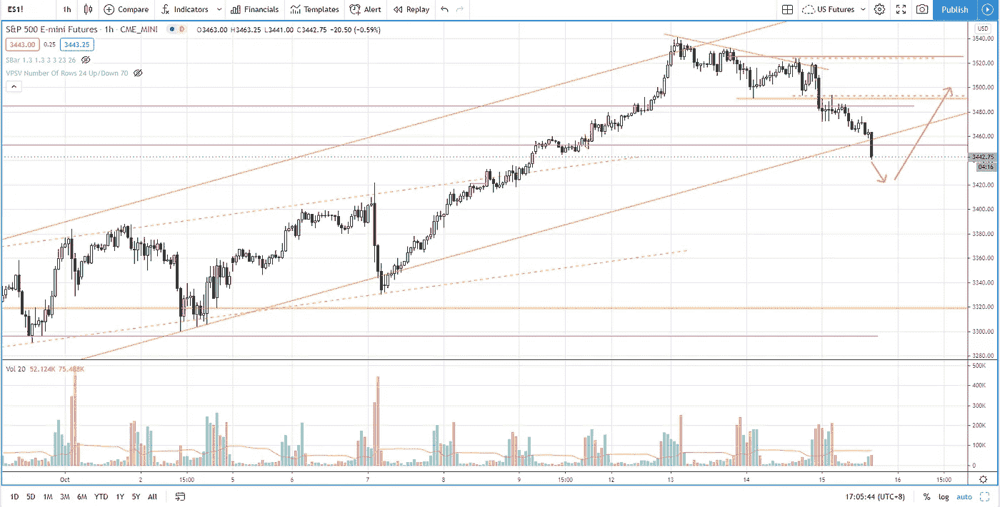
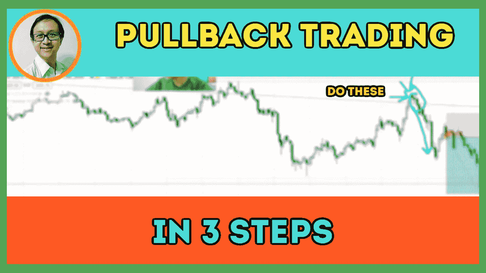

# 遵循这三个步骤(没人谈论)从回调交易中获利

> 原文：<https://medium.datadriveninvestor.com/how-to-trade-pullbacks-in-3-steps-with-high-winning-rate-s-p-500-day-trading-981f7ad776cb?source=collection_archive---------27----------------------->

在交易回顾部分，你会发现如何在 3 个步骤中交易回调，这将提高你的胜率。

观看视频，了解 2020 年 10 月 15 日交易时段标准普尔 500 指数期货的**每日市场分析。在这个视频中，我向你展示了上一个交易日的市场回顾和三分钟内的交易回顾(包括进场、出场和背后的原理)。展望未来，我将涵盖偏见，要注意的关键水平，我稍后的交易计划。**

## 时间戳

*   [0:57](https://www.youtube.com/watch?v=GbTnbGVGYmM&t=57s) 市场回顾
*   [4:10](https://www.youtube.com/watch?v=GbTnbGVGYmM&t=250s) 贸易回顾
*   [6:37](https://www.youtube.com/watch?v=GbTnbGVGYmM&t=397s) 第一步
*   [9:00](https://www.youtube.com/watch?v=GbTnbGVGYmM&t=540s) 定义趋势
*   [11:25](https://www.youtube.com/watch?v=GbTnbGVGYmM&t=685s) 第二步
*   [12:45](https://www.youtube.com/watch?v=GbTnbGVGYmM&t=765s) 第三步
*   [15:45](https://www.youtube.com/watch?v=GbTnbGVGYmM&t=945s) 当前市场前景

如果你还没有看我在上一期的[每日市场分析视频](https://www.youtube.com/watch?v=pMy8WGvBgtM)，以便更好地了解市场回顾和交易回顾。

**偏向** —中性(日内交易)；看涨(长期)

**关键点位** —阻力:3587，3540；支持:3510–3515，3450–3480

**潜在设置** —在关键级别寻找潜在反转。

# 资源

**每周市场展望&最佳交易建议**直达您的收件箱:[https://www.tradeprecise.com/](https://www.tradeprecise.com/)

**职业免费**制图平台:创建账户→[www.TradingView.com](https://bit.ly/2U2Femd)

**非美国居民？** ( **、新加波**、澳洲、纽西兰、欧洲等……):[点击此处，存款 2000 新币](https://ji.hn/sgtiger)即可获得**免费股票(价值 100++ &美元)老虎经纪公司的欢迎礼物**

美国居民？[点击此处，当您存入 1500 美元](https://ji.hn/ustradeup)时，就有机会在 TradeUP 上获得一份**免费的 AMZN 股票(价值 3000++美元** ) & **欢迎礼物**

**无限制访问媒体文章** —加入以下:[https://priceactiontrading.medium.com/membership](https://priceactiontrading.medium.com/membership)

# 进一步阅读

 [## 市场修正，泡沫还是崩盘？标准普尔 500 价格行为分析

### 标准普尔 500 期货(es)昨日因供应激增下跌 2.5%，跌破上行通道。这是正常的…

medium.com](https://medium.com/datadriveninvestor/market-correction-bubble-or-crash-s-p-500-price-action-analysis-6f26e6698dbc)  [## 凯西·伍德警告市场即将调整——标准普尔 500 价格走势分析

### 在 2020 年 12 月 18 日对彭博的采访中，方舟投资公司的首席执行官兼首席信息官凯西·伍德警告说…

medium.com](https://medium.com/datadriveninvestor/cathie-wood-warns-market-correction-soon-price-action-analysis-on-s-p-500-7e621e013310)  [## SLV 白银 ETF——下一个 GameStop (GME ),由 WallStreetBets (WSB)做空？

### SLV 交易所交易基金将成为下一个 GameStop (GME)开始疯狂上涨，因为华尔街 Bets 准备释放世界…

medium.com](https://medium.com/datadriveninvestor/slv-silver-etf-the-next-gamestop-gme-by-wallstreetbets-wsb-short-squeeze-d2c748045fe1) 

Photo by Author — Ming Jong Tey

Photo by Author — Ming Jong Tey

披露:如果您点击本文中的链接进行购买或开立账户，并将所需金额存入推荐的经纪人账户，我们将免费为您赚取佣金。

免责声明:本演示中的信息仅用于教育目的，不应作为投资建议。