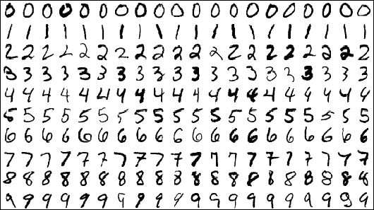

# 如何训练一个人工大脑

> 原文：<https://medium.datadriveninvestor.com/how-to-train-an-artificial-brain-7704805aeef6?source=collection_archive---------10----------------------->

这个宇宙中最灵活的东西是什么？苗条身材。杂技演员？拉伸阿姆斯特朗？不对！它实际上就是你现在正在使用的东西——🧠！

想想看，我们人类能够做出疯狂的事情！我们可以计算天体的运动，诊断疾病，发明新技术，这一切都是靠人类的思维。事实上，你头骨里的**硬件** **可以做任何其他人类在**之前做过的事情！

所以让我们把同样的力量转移到一个人造系统中。这就是神经网络(NN)的用武之地！他们拥有与我们不相上下的**动力和灵活性**！NNs 可以[诊断癌症](https://www.bbc.com/news/health-50857759#:~:text=Artificial%20intelligence%20is%20more%20accurate,images%20from%20nearly%2029%2C000%20women.)，[在斗狗中击败战斗机飞行员](https://www.defenseone.com/technology/2020/08/ai-just-beat-human-f-16-pilot-dogfight-again/167872/#:~:text=An%20AI%20algorithm%20has%20again,adversary%20aircraft%20in%20a%20dogfight.)，[制造优美的音乐](https://openai.com/blog/musenet/)！

但是大脑和神经网络是如何达到能够掌握如此专门任务的地步的呢？当然是通过训练！💪

**注意**:跟随这篇文章，它是🔑对 NNs 如何工作有一个扎实的理解**！[点击这里阅读我关于神经网络如何工作的文章](https://medium.com/datadriveninvestor/the-easiest-and-most-intuitive-explanation-of-neural-networks-53162e5ce104?source=friends_link&sk=0739bb1862ff1b875d7a6958f2f730ba)！**

## 等等，什么是真正的训练？

当我们训练我们的大脑时，我们学习如何做微积分或如何翻转煎饼。从外面看，我们长得一样！但是在内部，我们的大脑已经重新连接了神经元 T21，所以我们可以做这些事情。

同样，NNs 也通过**增加**或**减少**其值来重新布线其参数。

A neuron has thousands of connections that it has to adjust

# 训练参数的过程:

当训练我们的参数时，我们希望一切都是自动的。我们不能手动调整参数(那会花很长时间)。相反，我们让计算机为我们做这件事，用一个**损失函数**和**随机梯度下降(SGD)** 。

## 损失函数:

任何培训的一个重要部分就是反馈！你需要教练告诉你什么是对的，什么是错的。对于 **NNs** 来说**教练**就是**损失函数**！

损失函数评估神经网络的性能。它接收神经网络和目标的预测，然后计算一个**损失。**损失有很多种，但是对于所有的损失函数:**损失越低越好**！

 [## 一名大学生使用语言生成人工智能工具创建了一个病毒式博客帖子|数据驱动…

### 作为作家，我们喜欢告诉自己，我们处在一个无法自动化的职业中，至少短期内不会。但是…

www.datadriveninvestor.com](https://www.datadriveninvestor.com/2020/09/15/a-college-student-used-a-language-generating-ai-tool-to-create-a-viral-blog-post/) 

## SGD 背后的直觉:

想象你在玩一个游戏:

*   你在一个美丽的丘陵地带🌄
*   你戴着眼罩
*   你被安排在一个随机的位置
*   目标:到达地形的最低点

你要去哪个方向？你想尽可能快地到达底部。那会是山的**坡**的方向！朝那个方向迈一步，重新找到斜坡，然后**重复**！继续前进，你最终会找到底部！🙌

将**损失函数**替换为**草地、**，将**参数**替换为**你、**和**你已经获得了 SGD** ！参数从损失场的某个随机位置开始。然后他们四处摸索，找到最陡的地方，朝那个方向走。他们继续前进，直到他们找到亏损领域的底部！

**训练=获取参数到底**！当你的参数接近底部时，训练就结束了。

🔑不要被这些大牌吓倒。99%的时间他们可以简化下来！(SGD →寻山底之道！)

The Loss Field

## SGD 背后的数学原理:

那么我们如何在数学上表示 SGD 呢？**陡度=导数**！为了找到损失场的**最陡部分**，你对损失函数相对于你的参数求**偏导数。然后你**将**的导数乘以**的学习率**(将在后面解释)来创建**步骤**。然后**从参数中减去**步长，得到更新后的参数。**

你必须一遍又一遍地为每个参数重复这个过程。但是不用担心！**计算机很快**，它们可以**自动为我们计算导数**！

Formula for SGD

*   θⱼ =任何参数
*   α =学习率
*   J(θ) =损失函数

# 学习率:

学习率是在 5 个时期和 100 个时期训练你的模型之间的差别！1 epoch 是你训练数据的一个完整循环。选择的时候要用心！👀

坚持用**类比**，学习率就是你的步伐有多大**。它们可以是巨大的进步(高学习率)或微小的步伐(小学习率)。在**数学**方面，学习率是**你用**乘以导数来得到你的步长。👟**

**选择学习率是棘手的部分。但是说到底，就**实验**，看看哪个学习率效果最好！**

**下面是我自己制作的一些漂亮的 gif，向你展示如果你选择了完美、太低、太高和太高的学习率会发生什么！**

****gif 上的注释**:绿色抛物线代表希尔/损失场。这些小跳跃代表了我们正在采取的步骤。该标志表示损失函数的底部。**

## **完美学习率:**

**这个**很快收敛**到最小值！**步长自然减小**，因为每个点的导数越来越接近 0。👍**

****

**The perfect learning rate**

## **学习率太低:**

**当学习率太低时,**将永远**到达底部。这是因为我们只迈出很小很小的一步，几乎不会让我们有任何改变。结果，你必须训练更多的纪元，这**增加了过度适应**的风险。👎**

****

**The Learning rate is too low**

## **学习率太高:**

**当学习率太高时，T21 也要花很长时间才能到达底部。这是因为步长经常超过最小值。这需要太多的历元，这有使**过拟合**的风险。👎**

****

**The Learning Rate is too high**

## **学习率太高:**

**当我们的学习率太高时，我们就会偏离方向，永远得不到答案。当你的损失呈指数增长时，你就知道这是在发生了！👎 👎 👎**

****

**The Learning Rate is way too high**

# **度量与损失函数:**

**当你用 PyTorch 或 TensorFlow 训练神经网络时，这两列总是出现。那么它们是什么呢？它们在提供关于神经网络如何工作的反馈方面是相似的，但是它们有两个不同的目的:**

## **度量:**

*   ****人为查看**并检查其性能的任意测量**
*   ****凭直觉挑选****
*   **根据度量的类型，**可以增加或减少****

## **损失函数:**

*   **计算机 **对 SGD** 使用的一种度量**
*   ****被选中是因为它的**与我们的目标**相似，并且**可以被微分******
*   ******应始终减少******

****等等，为什么它们不能是一样的东西？嗯，他们可以，但通常情况下，他们不是。一个例子将有助于澄清为什么。假设我们的任务是将数字图像分类成数字。度量将是我们的神经网络的**准确度**(#正确/总)。****

****如果我们用这个作为我们的损失函数，我们会有一些严重的问题。首先，它是**甚至不可微**。就算是，也还是很恐怖。这是因为如果我们将所有参数改变 0.001%，我们的**输出将是相同的**。当它们相同时，我们就有大问题了！我们的**导数是 0** 。****

****这意味着我们被困住了。**步长**将始终为**等于 0** 。我们不能动，也没有出路。即使重启，提高学习率，还是有巨大的几率卡死！😖****

****所以我们不用精度来表示损失函数。相反，我们将使用类似 [**的二进制交叉熵损失**](https://en.wikipedia.org/wiki/Cross_entropy) 。**可微**和**参数**的微小变化**将改变损失**。😄****

****

**MNIST Dataset, The Hello World Of AI**

# **批处理:**

**好了，最后一个话题！到目前为止，每次我们运行神经网络并将预测与目标进行比较时，我们都会**更新参数。但是这是做这件事的最佳方式吗？其实不是！这在计算上**很昂贵**并且给**不好的结果**！👎****

**首先，如果你有 7000 个训练样本，程序必须在一个时期内运行 7000 次！每次都有成千上万的参数更新，每一个参数都需要几十次运算才能找到导数！**

**电脑很快，但那要花很长时间。再加上一次只训练一个样本导致**颠簸损失场**。这是因为当它训练时，它总是 100%正确或 0%正确。这导致神经网络**训练不太准确**并导致不良结果。😖**

**那么如何才能修复呢？我们可以**将多个样本**一起批处理，并在更新参数之前对整批样本训练神经网络。这个**解决了速度问题**因为计算机可以并行贯穿整批！此外,**损失字段不那么颠簸,**因为损失都是平均的(不再是 100%正确或始终 0%正确)。😄**

# **🔑外卖:**

*   ****NNs 通过调整**参数**来训练**🔼和🔽**
*   ****由于**损失函数和 SGD** ，训练是自动进行的****
*   ****损失函数**就像**丘陵地**，其中 **SGD** 是到达底部的**过程****
*   **选择**正确的学习率很重要****
*   ****配料加速**加速**训练**并增加**精度****

**感谢阅读！我是 Dickson，17 岁的技术爱好者，很高兴能加速自己的步伐，影响数十亿人🌎**

**如果你想跟随我的旅程，你可以加入[我的每月简讯](https://bit.ly/DicksonNewsletter)，查看[我的网站](https://bit.ly/DicksonWebsite)，连接 [Linkedin](https://bit.ly/DicksonLinkedin) 或 [Twitter](https://bit.ly/DicksonTwitter) 😃**

****访问专家视图—** [**订阅 DDI 英特尔**](https://datadriveninvestor.com/ddi-intel)**