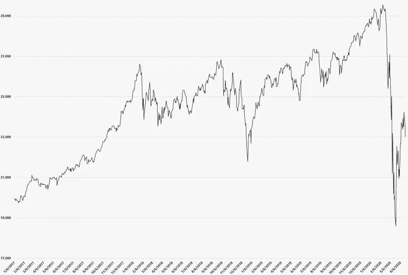
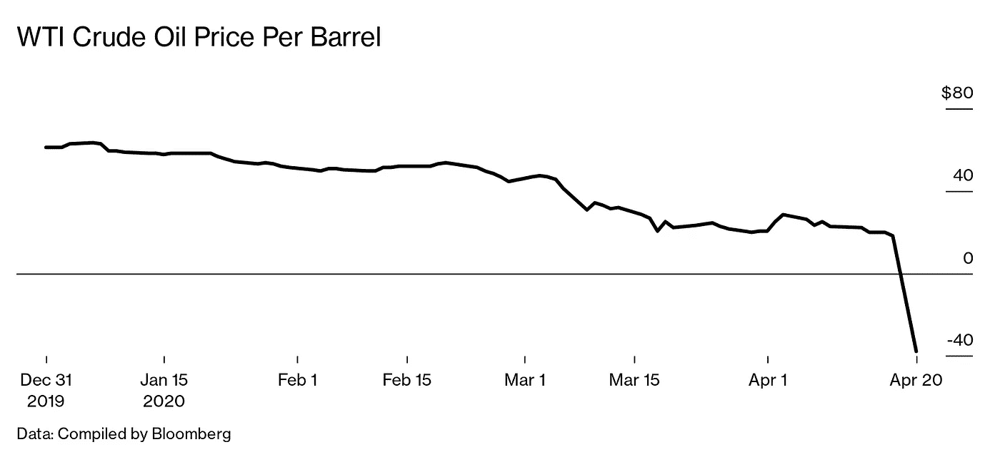
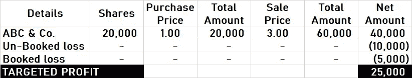

# 如何将股票交易亏损转化为巨额利润

> 原文：<https://medium.datadriveninvestor.com/how-to-transform-stock-trading-loss-into-mega-profit-ea2bcb6c935d?source=collection_archive---------25----------------------->

## 这是我的股票交易之旅，冠状病毒如何影响世界，以及复苏的路线图。

Photo by [Isaac Smith](https://unsplash.com/@isaacmsmith?utm_source=medium&utm_medium=referral) on [Unsplash](https://unsplash.com?utm_source=medium&utm_medium=referral)

# 2019 年 8 月，我被介绍到股票交易的世界。我抓住了这个机会。

但不知道该做什么或期待什么？所以，做了必要的研究，如果我真的应该进入这个行业。答案出来了*是*。我启动了尽职调查程序。浏览了所有入围股票交易平台的利弊。几天后，我的账户设置好了，可以进行第一笔交易。

可能值得注意的是，我是一名金融专业人士，在该行业有 20 年的经验。我还对 SAP 和许多其他软件和应用程序有广泛的了解。因此，我决定首先了解我的交易平台的财务触发因素。

这是我学到的:

*   所有买卖交易收取 0.04%的佣金。
*   对购买股票征收 0.3%的政府税。
*   如果股票的买卖发生在同一天，则不征收交易税。
*   对市值< € 1 Billion.
*   Up to 30% tax on dividends, deducted at source.

## DOs and DON’Ts of my stock trading

I set the following rules for myself:

*   No day trading.
*   Only trading in stocks (NO: Forex, Commodities, ETFs…).
*   Buying stocks of well-renowned/big companies only.
*   No leverage/margin trading.
*   No investment in the financial sector.
*   No direct investment in indices.
*   No loss transaction — hold the stocks till they earn a profit.

## This is how I made profits

At first, I started to improve my knowledge about the stock business. Followed market movements, the geopolitical situation, and the resulting business opportunities and threats. I watched business news on a regular basis. I also had tonnes of applications on my cell phone. There, I got relevant news, analysis, and information on a real-time basis.

In the real business sense, this is what I did:

*   **股票**交易的航空航天、石油、制药、汽车等股票的公司不征收交易税。相当多样化的投资组合。但我的关注点是短期的，即几天或一周的时间。但是，我的*口头禅*是持仓直到数字变绿。
*   股息这是我股票交易的另一个途径。我使用了不同的信息来源，关于即将到来的高收益股息。然后列出获得股息的入围公司。

*我的另一篇关于股票交易的文章。*

 [## 新冠肺炎期间股票交易的 9 个教训

### 行业新人的最佳实践

medium.com](https://medium.com/datadriveninvestor/9-lessons-learned-about-stock-trading-during-covid-19-c67a6d7688cb) 

## 我的财务状况(前六个月)

一开始，我很谨慎。所以，只转让了€ 400 英镑作为初始投资。我理解了交易门户，并开始通过一些交易获得信心。然后开始加大投资。8 月份给€转了 7500，9 月份给€转了 11500，10 月份给€转了 2000，以此类推。每月拨款仍在继续。但这些钱并没有立即转换成公司股票。我在观察、学习和行动。

作为这个行业的新手，我对自己能够获得的微薄利润感到自满。在我的第一个月，我只做了€ 50。但是，随后利润开始逐月下降。

> 我从股票交易中赚了很多钱。但是我不想谈论它，因为这不是我们正在讨论的…

> 然后冠状病毒来袭…一切都变了

有一句谚语说“如果任何事情都可能出错，它就会出错。”果然如此。当我开始在生意上安顿下来时，不可思议的事情发生了。一种前所未闻的病毒袭击了这个世界。

让我们看看它是如何影响全球的生活和商业的。

## 旅行禁令和禁闭

冠状病毒从 2020 年 2 月开始超快传播。2020 年 3 月 11 日，它被世界卫生组织宣布为疫情。结果，禁闭开始在全球范围内发生。在家工作(WFH)的概念很快成为生活方式。办公室、教育机构、餐馆，甚至机场都关闭了。这对全世界的微观和宏观层面都产生了毁灭性的影响。

## 市场形势(下跌-暴跌-崩溃)

冠状病毒开始以非常快的速度在全球传播。因此，市场做出了非常强烈的反应。【2020 年的股市崩盘后来被戏称为冠状病毒崩盘。从二月份开始的股市崩溃一直持续到四月底。

***冠状病毒崩溃***

Image credit: Wikipedia

股票市场的下跌变成了长期以来最严重的暴跌。那是一场噩梦。这是全球股票市场最快的下跌——自 1929 年大萧条以来最大的崩溃。

## 石油危机

全球对商品和服务的需求对油价有直接影响。所以，石油也跟不上这场竞赛。全球对*液体黄金*的需求开始萎缩。石油输出国组织一篮子原油、布伦特原油和 WTI 原油价格大幅下跌。价格开始下降。WTI 原油的最低水平是在 2020 年 4 月，当时跌至-40 美元。这是历史上第一次期货交易进入负领域。

Image credit: Bloomberg

> 悬而未决期间的情况

## 我的财务状况(未来一年)

由于股市暴跌，我在 2020 年第二季度和第三季度没有投资。相反，从我的交易入口取出几千欧元。但是，在第四季度，€的 4000 人进行了再投资。这个想法是为了减少现有头寸的损失。然后等待股价上涨，在盈亏平衡或盈利时平仓。但由于持续的波动，结果并不理想。

2020 年，我在几笔交易中获利。现有头寸也支付了一些股息。然而，一些股票头寸也因亏损而平仓。我们应该考虑损失的两个部分。一，已经预定的损失。第二，亏损没有入账，也在我目前的投资组合中。

金融专家可能会辩称，这种意外损失无关紧要。它只有在被预订时才是相关的。是的，非常正确。但是，我们必须看到全局。面临风险的最大金额是多少？为避免潜在损失的发生，需要采取哪些具体步骤？否则，风险可能会比我们预期的更早出现。

## 扭亏为盈的策略

我看有四种可能的方式:

1.  ***策略 1*** 等到所有亏损都扭亏为盈的时候。但是，在正常情况下，这是恢复损失的最长路径。
2.  ***策略二*** 在各自的股票上投入足够的资金。这样所有的损失都会变成利润。这种补救措施需要一秒钟就能见效，但需要太多的资本流入。
3.  ***策略三*** 在现有股票仓位上多投入一些资金。这将降低平均购买价格/当前损失。然后，等待减少的损失转化为利润。
4.  ***策略四*** 关注估值较低的股票。从成本较低的股票中获取可观的利润更容易。投资所需金额以减少当前损失。然后，等待股价反弹，在所有投资组合的基础上产生利润。 ***这是我挑的！***

## 是把理论付诸实践的时候了

事实上，第四个策略已经在实施中，以弥补我的损失。但是我将使用样本数据展示相同的内容。

*   **总计账面损失€ 5，000。**
*   **未登记损失总额€ 10，000。**
*   **当前/收购价格€每股 1.00 美元(ABC & Co.)**
*   **目标价€每股 3.00(ABC&co .)**

这是目标股票达到目标价格后的样子。

一旦价格触及€ 3.00，所有投资组合的损失将结束。此外，投资组合将有 25，000€的利润。这是考虑到其他股票仓位不涨价。这个想法是为了展示这种策略是如何独立运作的。也可以找到类似的股票。

> 2021 年的前进方向…

## 市场形势

美国股市反弹比以前更好。由于几个因素，这也是可能的。这包括科技巨头的回归，美联储/国会的支持，以及投资者的回归。政府提供了许多刺激方案来支持他们的人民和企业。但是，在英国、法国、西班牙……等等。股票市场仍在复苏。尽管各国政府宣布了重复的、单独的和集体的刺激方案，但情况依然如此。

## 旅行禁令和限制

由于冠状病毒，政府不得不不时实行封锁和旅行禁令。但是，与以前不同，现在这些都是短命的。我们学会了小心翼翼地生活，并意识到守在界限内并不是解决之道。

## 疫苗

最重要的是，世界需要疫苗来摆脱持续的疫情。制药公司、国际政府间组织和政府部门正在做大量工作。截至 2020 年 12 月 23 日，至少有 7 种疫苗目前正在世界不同地区使用。辉瑞、BioNTech、Moderna 等公司的疫苗。一直是领跑者。人们正在北美、墨西哥、英国、欧盟、中东、远东和俄罗斯接种疫苗。更多的疫苗处于不同的测试/批准周期。

## 石油市场

即使在疫情期间，全球石油供应也一直保持稳定。根据世界需求减少石油产量是推动油价上涨的主要动力。石油输出国组织和全球经济复苏的努力正在帮助推动石油价格达到 50 美元甚至更高。有进一步的驱动力使油价回升到 60 美元，并继续保持在 60-65 美元的范围内。这不仅有助于大型石油公司，也是全球许多经济体的救星。

> 公司在财务预测上往往比较保守。我确信，2020 财年业绩中应包含疫情账户的损失准备金。依我拙见，我们将看到大公司盈利能力的提高。股票市场也应该见证股价反弹回以前的辉煌。2021 年一定充满惊喜。新年快乐！

***免责声明:*** 本文的意图不是以任何方式向读者提出建议。你应该有自己的想法、志向、抱负和商业计划。如果这篇文章的任何内容对你有任何好处，请随意使用。但是，你也要承担相关损失的风险。

**进入专家视角—** [**订阅 DDI 英特尔**](https://datadriveninvestor.com/ddi-intel)