# 如何将数据转换成高斯分布？

> 原文：<https://medium.datadriveninvestor.com/how-to-transform-the-data-to-look-like-gaussian-distribution-c50ab3fdada5?source=collection_archive---------5----------------------->

> 本文讨论了使变量分布看起来更像高斯分布的变换。

Image by [Carlos Muza](https://unsplash.com/@kmuza?utm_source=medium&utm_medium=referral) on [Unsplash](https://unsplash.com/?utm_source=medium&utm_medium=referral)

在我之前的文章中，我如何知道我的变量分布是高斯分布？)中，我们讨论了确定一个变量的分布是否呈高斯分布的方法。

从该文章中发现， ***虹膜数据集*** 的变量 0 和 1 的分布更接近高斯分布，而变量 2 和 3 的分布与高斯分布相差甚远。下面是这些变量的密度图。

Image by author

以下是上述变量的 Kolmogorov-Smirnov 检验结果。Kolmogorov-Smirnov 检验期望输入变量具有完美的正态分布。因此，在 Kolmogorov-Smirnov 检验中，没有一个变量看起来像高斯。

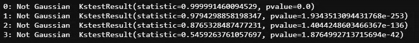

Image by author

我们将讨论一些变换，使你的变量看起来更像高斯分布。这些方法的一个缺点是，它们只能转换接近高斯分布的变量，看起来更像高斯。

# 方法 1:对数转换

对数变换计算变量的自然对数，使其看起来更像高斯。只有当变量值大于 0 时，才能应用此转换(因为 log 不是为 0 和负数定义的)。但是，可以使用此变换将值缩放为正值。下面是日志转换在 Python 中的实现。我更喜欢使用 ColumnTransformer 对数据进行转换。

我们将查看对数变换前后上述变量的密度图。

Density plots of variables before log transform. (Image by author)

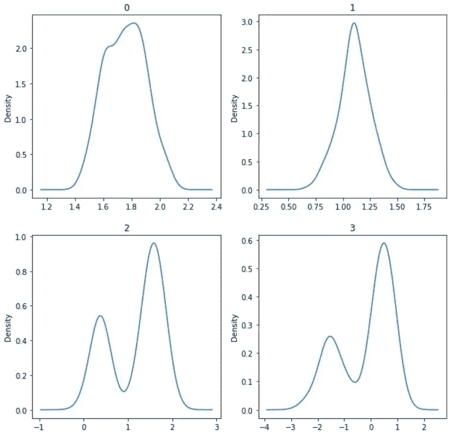

Density plots of variables after log transform. (Image by author)

我们可以看到变量 0 和 1 看起来几乎和应用对数变换之前一样。变量 2 和 3 的其中一个峰值有所降低，但它们看起来不像高斯分布。我们将查看对数变换前后上述变量的 Kolmogorov-Smirnov 测试结果。

Kolmogorov-Smirnov test results before log transform (Image by author)

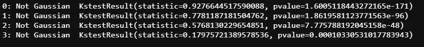

Kolmogorov-Smirnov test results after log transform (Image by author)

从上面的结果中，我们可以看到，对数变换在将变量的分布变换成更像高斯分布方面并不十分有效。

# 方法 2:倒数变换

倒数变换计算变量的倒数，使其看起来更像高斯。如果变量的任何值为 0，则不能应用此转换(因为 1/0 未定义)。下面是 Python 中倒数变换的实现。

我们来看看上述变量在倒数变换前后的密度图。

Density plots of variables before reciprocal transform. (Image by author)

Density plots of variables after reciprocal transform. (Image by author)

我们可以看到变量 0 和 1 看起来几乎和应用倒数变换之前一样。变量 2 和 3 的其中一个峰值有所降低，但它们看起来不像高斯分布。我们将查看上述变量在倒数变换前后的 Kolmogorov-Smirnov 测试结果。

Kolmogorov-Smirnov test results before reciprocal transform (Image by author)

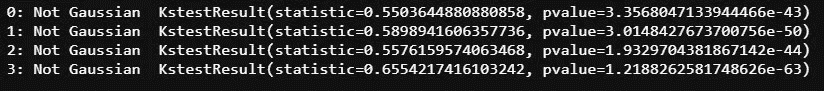

Kolmogorov-Smirnov test results after reciprocal transform (Image by author)

从上面的结果中，我们可以看到倒数变换在将变量的分布变换成看起来更像高斯分布方面不是很有效。

# 方法 3:指数变换

指数变换计算变量的指数，使其看起来更像高斯。常用的指数有平方(平方变换)、立方(立方变换)、平方根(平方根变换)、立方根(立方根变换)。下面是 Python 中使用 square(平方变换)的指数变换的实现。

我们将查看平方变换前后上述变量的密度图。

Density plots of variables before square transform. (Image by author)

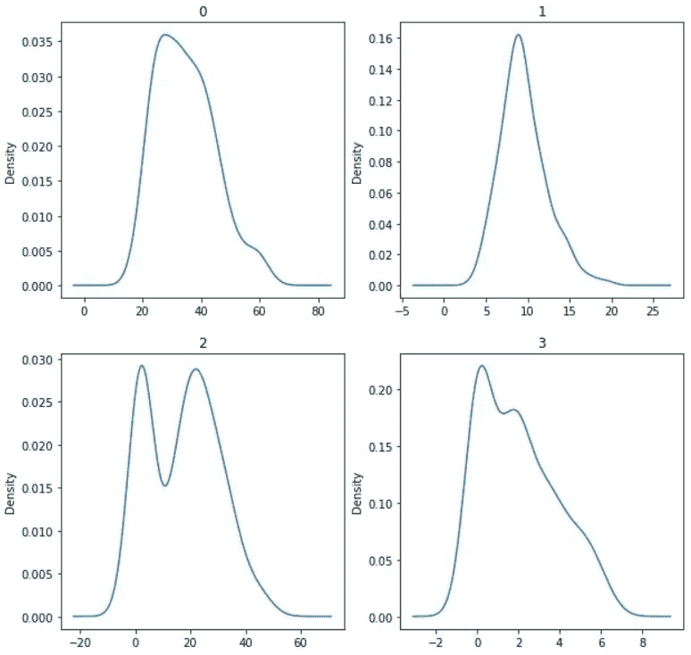

Density plots of variables after square transform. (Image by author)

在上面的图中，可以看到变量 0 和 1 看起来像以前一样是高斯的，但是与以前的变换相比，变量 3 在平方变换后看起来更像高斯(但不是完美的高斯分布)。我们来看看上述变量在平方变换前后的 Kolmogorov-Smirnov 检验结果。

Kolmogorov-Smirnov test results before square transform (Image by author)

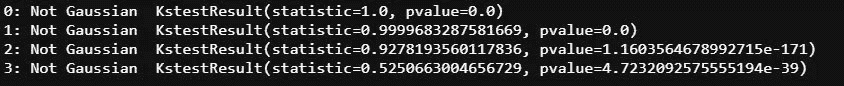

Kolmogorov-Smirnov test results after square transform (Image by author)

从上面的结果中，我们可以看到平方变换在将变量的分布变换成看起来更像高斯分布方面不是很有效。

# 方法 4: Box-Cox 变换

Box-Cox 变换是一种有效的方法(与前面讨论的方法相比),可以将变量的分布变换成更像高斯分布。这种方法的缺点是，它要求变量值大于 0。但是，可以使用此变换将值缩放为正值。

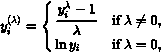

Box-Cox Transform (Image from [Wikipedia](https://en.wikipedia.org/wiki/Power_transform))

Box-Cox 变换搜索-5 和 5 之间的λ值，并使用使数据看起来更高斯的最佳λ。下面是 Box-Cox 变换在 Python 中的实现。

我们将查看 Box-Cox 变换前后上述变量的密度图。

Density plots of variables before Box-Cox transform. (Image by author)

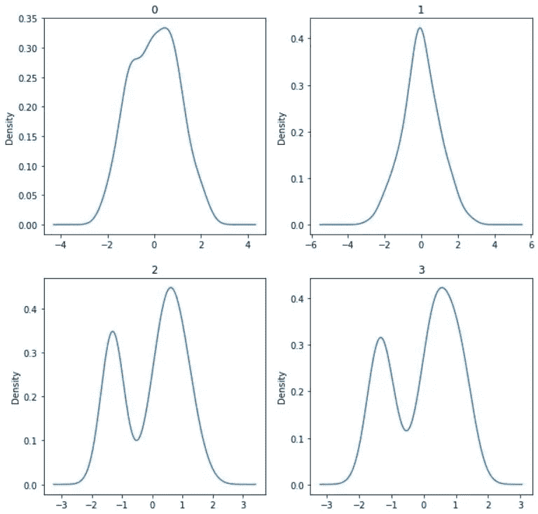

Density plots of variables after Box-Cox transform. (Image by author)

我们可以看到所有的变量看起来几乎和应用 Box-Cox 变换之前一样。我们将查看 Box-Cox 变换前后上述变量的 Kolmogorov-Smirnov 检验的结果。

Kolmogorov-Smirnov test results before Box-Cox transform (Image by author)

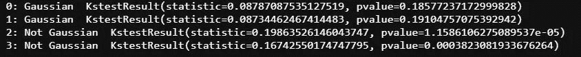

Kolmogorov-Smirnov test results after Box-Cox transform (Image by author)

我们可以看到 Kolmogorov-Smirnov 检验结果显示变量 0 和 1 是高斯型的。如前所述，这些变换只有在变换前的变量分布接近高斯分布时才有效。要查看为变量选择的λ值，PowerTransformer 必须直接适合数据，而无需 ColumnTransformer。

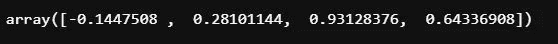

λ chosen for each of the 4 variables (Image by author)

# 方法 5: Yeo-Johnson 变换

Yeo-Johnson 变换类似于 Box-Cox 变换。但是 Yeo-Johnson 可以应用于变量的正值和负值。

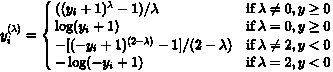

Yeo-Johnson Transform (Image from [Wikipedia](https://en.wikipedia.org/wiki/Power_transform))

下面是 Yeo-Johnson 变换在 Python 中的实现。

我们将查看 Yeo-Johnson 变换前后上述变量的密度图。

Density plots of variables before Yeo-Johnson transform. (Image by author)

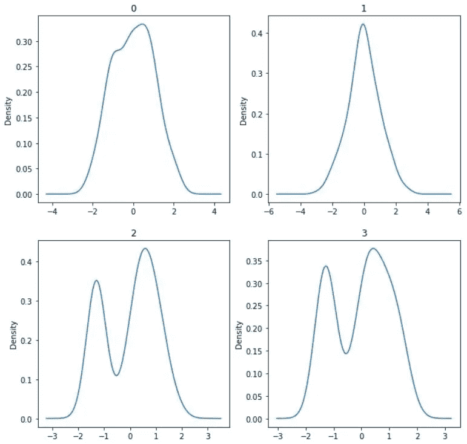

Density plots of variables after Yeo-Johnson transform. (Image by author)

我们可以看到，所有变量看起来几乎与应用 Yeo-Johnson 变换之前相同。我们将看看上述变量在 Yeo-Johnson 变换前后的 Kolmogorov-Smirnov 检验的结果。

Kolmogorov-Smirnov test results before Yeo-Johnson transform (Image by author)

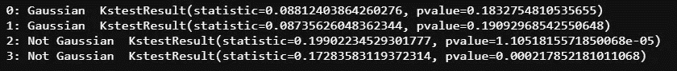

Kolmogorov-Smirnov test results after Yeo-Johnson transform (Image by author)

我们可以看到 Kolmogorov-Smirnov 检验结果显示变量 0 和 1 是高斯型的。如前所述，这些变换只有在变换前的变量分布接近高斯分布时才有效。要查看为变量选择的λ值，PowerTransformer 必须直接适合数据，而无需 ColumnTransformer。

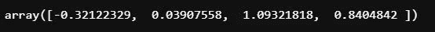

λ chosen for each of the 4 variables (Image by author)

正如我们在上面看到的，变量转换方法只有在变量的分布接近高斯分布时才有效。使用这些变换不能使分布号接近高斯分布的变量看起来像高斯分布。此外，与其他方法相比，Box-Cox 和 Yeo-Johnson 被证明是有效的。但是，这纯粹取决于你的数据。在某些情况下，前面讨论的三种方法足以将变量转换成更像高斯的形式。