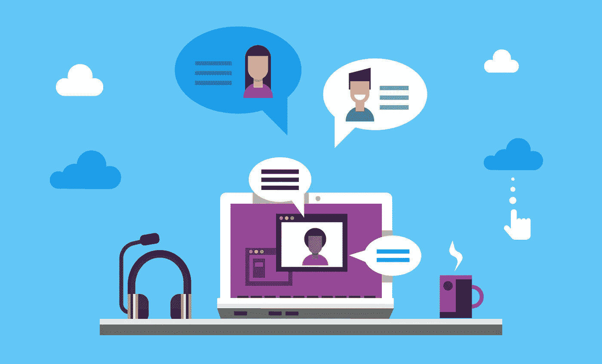

# 如何将 WFH 转变成你公司创新的最佳方式

> 原文：<https://medium.datadriveninvestor.com/how-to-transform-wfh-into-the-best-thing-to-happen-to-innovation-in-your-company-bb3e7e0c0089?source=collection_archive---------16----------------------->

季节可能会改变，但对大多数人来说，我们的新作品《在家工作》( WFH)的存在看不到尽头。对大多数人来说，未来几个月要在餐桌上工作，寻找一个安静的地方打电话，每分钟都要处理个人和职业责任，这种前景令人沮丧，令人无法承受。

这也引发了对未来工作的质疑。公司还会保留大型物理办公空间吗？什么样的权力和地位的新象征将取代角落办公室？人换公司会需要重新定位吗？什么时候，如果有的话，员工会亲自聚在一起？

公司文化将如何形成？创新会继续还是停滞？

过去几个月，我的每一位客户，所有负责公司增长和创新的高管，都在问最后两个问题，也在努力回答这个问题。

他们担心 WFH 的孤立消除了点燃创新的人们和思想的偶然碰撞。他们担心缩放会议的人为性降低了对话的真实性。他们知道会议的爆炸会让人们感到不知所措，耗尽他们的精力、好奇心和创造力。

但是如果不一定要这样呢？

如果相反的情况是真的呢？

**如果 WFH 加速创新会怎样？**

我相信可以。

我相信，如果我们愿意采取以下步骤，它就会

## ***1。不要试图在数字世界中重现真实世界。***

*公司在采用或适应“新常态”时最常犯的一个错误是将旧的东西剪切并粘贴到新的东西中。*

*例如，考虑一下报纸行业。1980 年，当第一份报纸上线时，他们提供印刷版的文本版本。随着网速的提高，他们转向提供印刷版的视觉图像。直到订阅和广告收入开始暴跌，他们才意识到他们不能简单地将印刷版“剪切并粘贴”成数字格式，而是需要创建针对数字媒体的内容。*

*今天同样的事情正在发生。为了激发意外收获和创造随意的对话，公司在春季和夏季举办了 Zoom Happy Hours 和虚拟咖啡聊天。结果甚至比通常面对面的“强制性娱乐”活动更尴尬，也更没用。*

## ***2。认识到刺激创新的东西不是“一刀切”的。***

*今天的工作场所是为外向的人设计的。开放式平面图、未分配的桌子、玻璃墙会议室、社区桌和无休止的头脑风暴会议满足了外向者对参与、精力和互动的渴望。*

*内向的人，我也是其中之一，讨厌它。*

*当我们能够安静地坐着，深入思考，从多个角度看待事物，然后与世界分享时，我们的工作效率最高。在家工作让我们有空间(如果不是安静的话)以最适合我们风格的方式进行思考和创造。正因为如此，我们更有可能在会议上畅所欲言，分享想法，接触他人。*

## ***3。为 WFH 的员工创造创新方法和活动。***

*确定真实世界体验中最重要的部分。注意不要把“必不可少”和“最爱”混为一谈。是的，对你来说，呆在一个人们疯狂地喊出想法并把它们写在便利贴上的房间里可能很有趣。但是唯一重要的部分是从很多人那里获得想法。*

*找出 WFH 经历中最独特的部分。在办公室的头脑风暴会议中很难带来不同的观点，但是在家里，你可以随时获得来自孩子、朋友和那个在你享受早晨咖啡时遛狗路过你家的人的观点。*

*将现实世界体验的基本部分与 WFH 体验的独特部分结合起来，创造出在数字空间中行得通的东西。例如，不要在一次会议中对所有想法进行头脑风暴、排序和优先排序(就像你在“过去”做的那样)，而是在会议前 24 小时将头脑风暴主题发送给人们。让他们在会前集思广益，并准备好与小组成员分享。一旦每个人都与团队分享了他们的想法，那么团队就可以集体讨论、构建、分组并确定优先级。*

## *创新之所以发生，是因为人们有思考新事物的自由，有分享想法的许可，有与他人合作实现创新的机会。*

*不仅仅是因为我们在走廊上撞到别人或者坐在陌生人旁边。你不需要办公室来做这些事情。如果你放下旧的常态，拥抱“新 WFH 常态”，你可以拥有所有这些，甚至更多*

**Robyn M. Bolton 是* [*MileZero*](http://www.milezero.io/) *的创始人&首席导航员，她在那里与价值数十亿美元的公司合作，利用创新创造有意义的新增长。你可以在*[*www . mile zero . io*](http://www.milezero.io/)了解更多关于她的信息和她的作品*