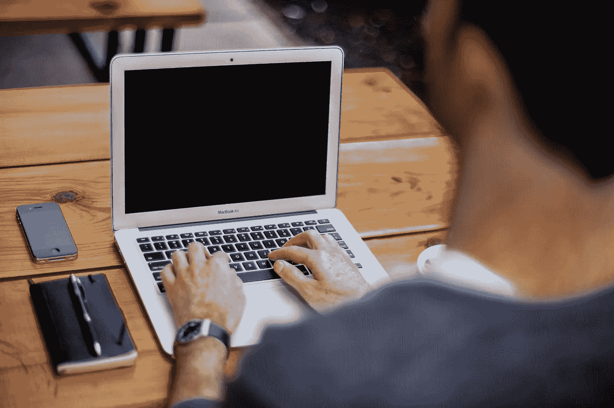

# 如何让你的大脑变得高效

> 原文：<https://medium.datadriveninvestor.com/how-to-trick-your-brain-into-being-productive-f50ccddaa16e?source=collection_archive---------9----------------------->

自助行业是 21 世纪增长最快的市场之一，预计未来两年将超过 130 亿美元。

这一行业的快速增长并不令人惊讶。根据皮尤研究中心的一项研究，美国人每天花在智能手机上的时间超过 4 小时。

我们手边的大量分散注意力的内容促使我们寻找更多的内容来激励我们停止浪费时间。

讽刺。

我对这种恶性循环完全有罪。我会发现自己在浪费时间，这促使我去看一些马特·达维拉关于培养好习惯的视频，然后我继续在 Youtube 上转。我尝试过写日记、冥想、分段计划和其他提高效率的方法。然而，我继续发现自己被阻力推上了拖延症的云端。

我不认为我是一个人。

反抗。那种无法形容的感觉让我们无法完成这个最简单的任务。由于反抗组织的邪恶活动，像清理冰箱或发送电子邮件这样不需要动脑筋的任务似乎是不可能的。

 [## 跑步摆脱疯狂:锻炼如何提高你的生产力|数据驱动的投资者

### 没有比锻炼更好的方式来开始一天的工作了。我试着一周至少做四天，在…

www.datadriveninvestor.com](https://www.datadriveninvestor.com/2018/10/23/running-to-get-rid-of-the-crazy-how-working-out-increases-your-productivity/) 

理解生产力的艺术始于理解阻力的原因和它的对立面:“流动”。这两者都只是受到大脑中儿茶酚胺化学物质缺乏或过多的影响。

儿茶酚胺是一种神经递质，有三种不同的形式:多巴胺、肾上腺素和去甲肾上腺素。这三种化学物质负责动力、注意力、兴奋、生存等等。

《做好工作》和许多其他关于生产力的书籍的作者史蒂文·普雷斯菲尔德(Steven Pressfield)表示，儿茶酚胺生产力理论认为“我们需要高水平的多巴胺和中等水平的肾上腺素和去甲肾上腺素，才能进入最高生产力状态”。

因此，掌握生产力的秘诀是了解如何促进大脑中这些化学物质的释放，并达到我们最高效的状态。显然，你可以通过药物(如 Adderall 和 Ritalin)刺激非自然的方式，或者你可以欺骗你的大脑自然释放这些化学物质，并达到专注和生产力的巅峰状态。

Photo by [Alejandro Escamilla](https://unsplash.com/@alejandroescamilla?utm_source=unsplash&utm_medium=referral&utm_content=creditCopyText) on [Unsplash](https://unsplash.com/s/photos/productivity?utm_source=unsplash&utm_medium=referral&utm_content=creditCopyText)

# 现在如何欺骗你的大脑

许多常见的生产力技巧，如记日记、冥想和睡觉，可以更好地优化儿茶酚胺的释放。这些做法都是非常有益的，但还有更意想不到的方式刺激大脑，达到“心流”状态。正如 Solomon Poon 在他写的一篇关于这个主题的文章中所说的,“大多数生产力教练都是商业人士，而商业人士很少会对神经科学进行粗略的浏览”。

# 1.吃富含酪氨酸的食物

为了制造多巴胺，需要酪氨酸来刺激大脑中多巴胺的释放。香蕉、鳄梨、鸡蛋、豆类和鸡肉等食物都富含酪氨酸。因此，简单地选择早餐吃鳄梨吐司和一根香蕉，而不是通常的可可泡芙，就能决定你一天的工作效率。

# 2.迷你训练

如果你有一个大的任务要完成，结合 1 或 2 分钟的小休息可以帮助你保持专注。当你运动时，多巴胺和催产素会被释放到你的大脑中，增加你的能量和注意力。

# 3.器乐

Spotify 和 Apple Music 上有许多播放列表主要是乐器，节拍稳定。根据大量的大脑扫描研究，听音乐会增加大脑奖赏中枢的活动，这是多巴胺受体喜欢出没的地方。

# 4.获取一些自然光

你可能会想，我是在建议你喝便宜的啤酒来提高你的生产力，但实际上我说的是阳光。已经证明，暴露在阳光下会激活大脑中的多巴胺受体。缺乏自然阳光被证明是季节性抑郁症的主要原因。为了完成工作并对我们的工作感到兴奋，我们的大脑需要这种自然光。打开百叶窗，或者如果你在地下室工作，你可以买一个光疗灯，模仿自然阳光，让你的大脑快乐。

希望这些技巧能帮助你在 2020 年达到“工作流”的巅峰状态。记住，完成任务最关键的因素是采取行动。读完这最后一段后，去做一件你已经拖延了一段时间的事情，让 2020 年成为你有史以来最有成效的一年！