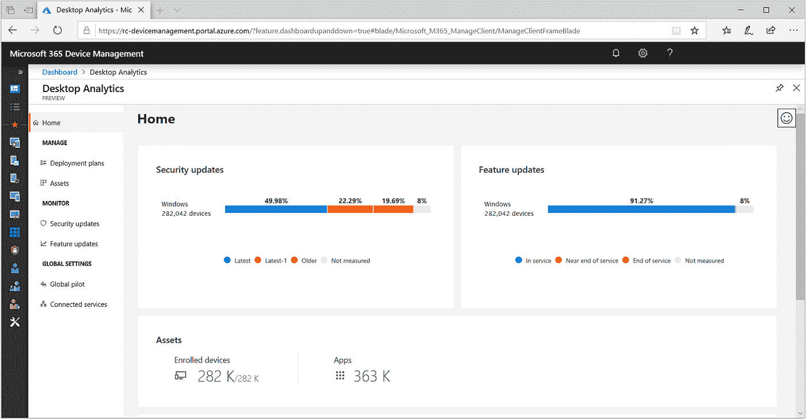
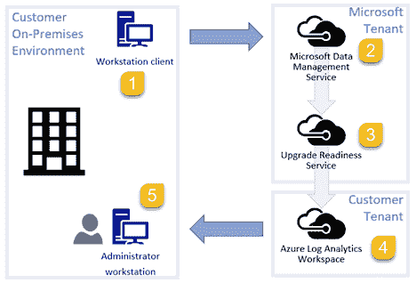
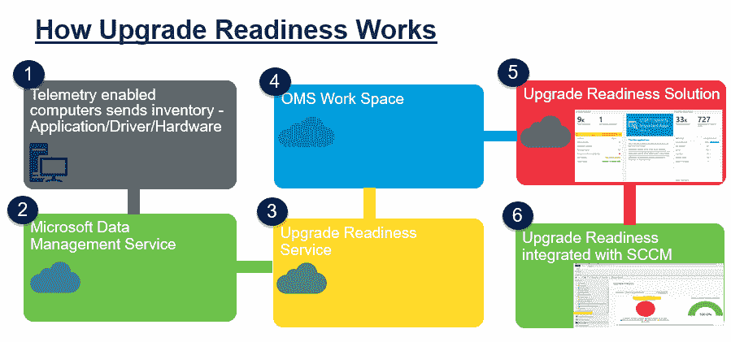
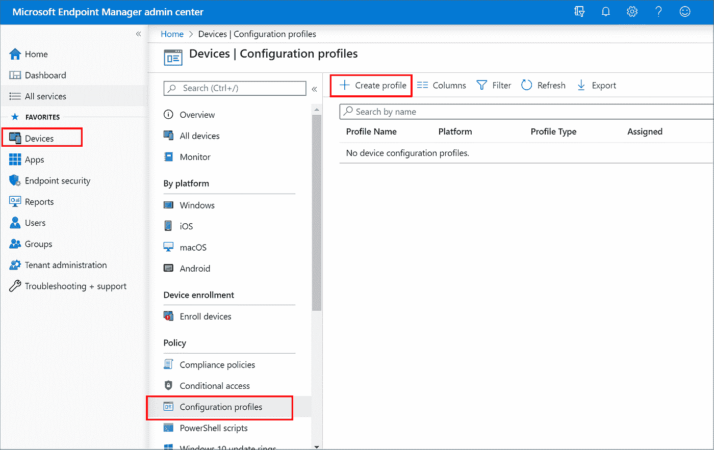
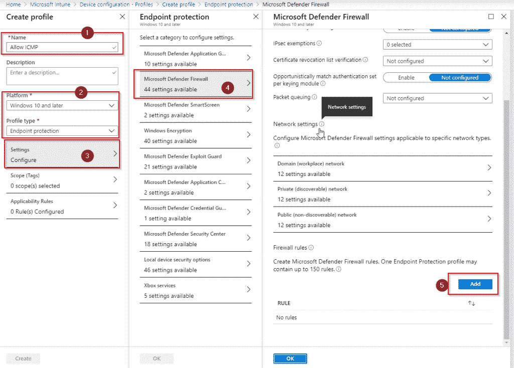
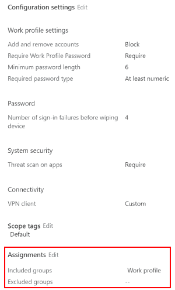
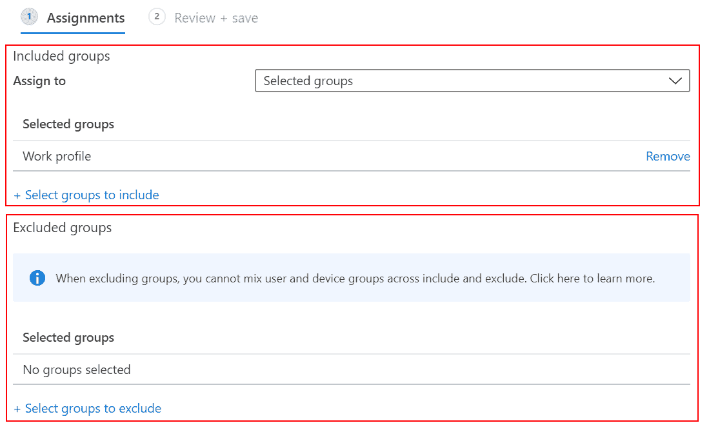

# 如何升级 Windows 10 并部署企业安全功能

> 原文：<https://medium.datadriveninvestor.com/how-to-upgrade-windows-10-deploy-enterprise-security-features-cbc041e61602?source=collection_archive---------6----------------------->

微软 365 是微软的新产品，它将 Windows 10 与 Office 365 以及企业移动性和安全性(EMS)相结合。

要在您的组织中成功部署 Windows 10 操作系统，了解其不同的部署方式非常重要，尤其是现在有新的场景需要考虑。在这些场景中进行选择，并了解每个场景的功能和局限性，是一项关键任务。

Windows Autopilot
就地升级
使用 Intune 部署 Windows 10 升级
使用 Microsoft Endpoint Configuration Manager 部署 Windows 10 升级
使用 Microsoft Endpoint Configuration Manager 部署计算机更新

**学习目标**

本帖第一部分的 [***就是这个链接，我们已经看过下面的***](https://medium.com/@ealtili/plan-windows-10-deployments-in-microsoft-365-72b74906c264)

*   规划 Windows 即服务(WaaS)
*   选择 Windows 10 部署方法
*   Windows 10 自动驾驶部署
*   创建自动驾驶部署配置文件
*   注册 Windows 10 设备

这是第 2 部分

*   分析 Windows 10 的升级准备情况
*   Windows 10 企业安全功能
*   威胁防护
*   部署企业安全功能

# 分析 Windows 10 的升级准备情况

Windows Analytics 是一套云服务，由三个解决方案组成:**升级就绪**、**更新合规**和**设备健康**。2019 年 7 月，桌面分析作为 Windows 分析平台的下一个版本通过公开预览推出。2020 年 1 月 31 日，Windows Analytics 将退役，取而代之的是桌面分析。一旦桌面分析变得普遍可用，新客户将不再能够加入升级就绪和设备健康解决方案。然而，更新合规性将通过 Azure 门户保持可用。桌面分析是 Windows 分析的继承者。Windows Analytics 服务包括升级就绪性、更新合规性和设备运行状况。所有这些功能都结合在桌面分析服务中。桌面分析也与 Configuration Manager 更紧密地集成在一起。支持的升级途径是 Windows 7、Windows 8.1 和 Windows 10。要从 Windows 7 和 Windows 8.1 执行就地升级，用户计算机必须运行最新版本的 Windows 7 SP1 或 Windows 8.1。启用 Windows 诊断数据后，升级准备会执行计算机的完整清单，以便您可以查看每台计算机上安装的 Windows 版本。保持 Windows 10 最新包括部署功能更新和升级准备工具，帮助您准备和规划这些 Windows 更新。必须在 Windows 10 计算机上安装最新的累积更新，以确保安装了所需的兼容性更新。那么，升级准备工作是如何进行的呢？

嗯，微软分析系统数据应用程序和驱动程序诊断数据，以帮助您确定计算机何时可以升级。用户计算机通过 Microsoft 数据管理服务将计算机应用程序和驱动程序诊断数据发送到安全的 Microsoft 数据中心。配置升级就绪后，升级就绪服务将分析诊断数据。这些信息随后被推送到您的 OMS 工作区，然后您可以使用升级准备解决方案来规划和管理您的 Windows 10 升级。升级准备作为 Azure 门户中的一个解决方案提供，利用操作管理套件和 Azure 日志分析，这是一个基于云的服务集合，用于管理内部部署和云计算。如果你已经在使用 Azure Portal 或 Azure Log Analytics，你会在解决方案库中找到升级准备。

单击库中的升级准备情况互动程序，然后单击解决方案详细信息页面上的添加。然后它在您的工作区中变得可见。如果您没有使用 Azure Portal 或 Log Analytics，您可以访问 microsoft.com 网站上的 Log Analytics 站点，然后选择“免费启动”开始设置过程。在此过程中，您将创建一个工作区，并向其中添加升级准备解决方案。升级准备也可以与 Configuration Manager 的安装相集成。现在，有三个核心步骤。第一个是添加，第二个是注册，第三个是升级。Windows 10 专业版、教育版和企业版免费提供升级准备。管理和使用升级准备需要 Azure 订阅，但使用它不会产生 Azure 费用。将升级准备添加到 Azure 订阅中的工作区后，您可以开始在您的组织中注册设备。然后，您可以使用升级准备情况来确定应用程序和驱动程序问题的优先级并解决这些问题，分配和跟踪问题解决状态，并确定准备升级的计算机。升级就绪性使您能够放心地部署 Windows，因为您知道已经预先解决了潜在的阻塞问题。注册桌面分析的设备只能由 Windows 10 企业版 E3 或 E5、Windows 10 教育版 A3 或 A5 以及 Windows 虚拟桌面 E3 或 E5 的许可用户使用。除了许可证订阅费用，使用桌面分析没有额外费用。在 Azure Log Analytics 中，桌面分析是零评级的。这一评级意味着无论您选择哪个 Azure Log Analytics 定价层，它都不会受到数据限制和成本的影响。如果您使用免费层，该层对每天收集的数据量有上限，桌面分析数据不会计入上限。桌面分析收集和分析您组织中的设备应用程序和驱动程序数据。基于此分析和您的输入，您可以使用此服务为 Windows 10 创建部署计划。部署计划具有以下功能:自动推荐试点计划中包括的设备，识别兼容性问题并提出缓解建议，在更新之前、期间和之后评估部署的运行状况，以及跟踪部署进度。作为部署计划的一部分，您需要完成以下操作:

*   定义您希望部署的 Windows 10 版本，
*   选择要部署的设备组，
*   为部署创建就绪规则，
*   定义你的应用的重要性，
*   根据自动建议选择试验设备，
*   根据桌面分析的建议，决定如何修复应用程序的问题。

默认情况下，桌面分析每天都会刷新部署计划数据。您在部署计划中所做的任何更改，例如对应用程序很重要的签名，或者选择要包含在试点中的设备，都需要长达 24 小时的处理时间。为了加快这一过程，您可以请求按需数据刷新。

# Windows 10 企业安全功能

Windows 10 包含各种企业安全功能。但是三个共同的领域是:

*   身份和访问管理，在这里我们可以部署安全的企业级身份认证和访问控制，以保护帐户和数据。
*   威胁防护，可以阻止网络威胁，并快速识别和响应违规行为。
*   信息保护，使我们能够识别和保护我们的关键数据，以防止数据丢失。

当我们看到身份和访问管理时，在 Windows 10 中， **Windows Hello** 在 PC 和移动设备上用强大的双因素身份认证取代了密码。这种身份验证包括一种与设备和生物特征或 pin 绑定的新型用户凭证。我们还可以使用凭据保护来保护派生的域凭据。这是在 Windows 10 企业版中引入的，**凭据保护**使用基于虚拟化的安全性来隔离秘密，以便只有特权系统软件才能访问它们。对这些机密的未经授权的访问可能会导致凭证盗窃攻击，例如 Pass-the-Hash 或 Pass-the-Ticket。凭据保护通过保护 NTLM 密码哈希和 Kerberos 票证来帮助防止这些攻击。我们还可以使用相同的凭据保护来保护远程桌面凭据。**远程凭证保护**通过将 Kerberos 请求重定向回请求连接的设备，帮助您通过远程桌面连接保护您的凭证。可以使用能够增强任务安全性的防篡改便携式存储设备，例如验证客户端、签署代码、保护电子邮件以及使用 Windows 域帐户登录。你会认出这些是智能卡。我们还可以提供证书锁定。企业证书锁定是一种 Windows 功能，用于记住或锁定给定域名的路由颁发证书颁发机构或终端实体证书。**企业证书锁定**有助于减少中间人攻击，使您能够防止内部域名链接到不需要的证书或欺诈性颁发的证书。当然，Windows 10 支持 **S/MIME** ，它让用户对发出的信息和附件进行加密，以便只有拥有数字标识(也称为证书)的预定收件人才能阅读它们。用户可以对邮件进行数字签名，这为收件人提供了一种验证发件人身份以及邮件未被篡改的方法。当然，我们这里的最后一个选择是使用 **VPN** ，它允许我们将所有流量安全地传输回组织。现在 Windows 10 也提供了**威胁防护**。它提供威胁和漏洞管理，这是一种内置功能，使用基于风险的方法来发现、优先处理和补救端点漏洞和错误配置。攻击面缩减是一组提供堆栈中第一道防线的功能。通过确保正确设置配置设置，并应用漏洞缓解技术。这些功能可以抵御攻击和利用。为了进一步加强网络的安全边界， **Microsoft Defender ATP** 或**高级威胁防护**使用了旨在捕捉所有类型的新兴威胁的下一代防护。**端点检测**和响应功能已到位，可检测、调查和响应入侵企图和主动违规行为。借助**高级搜索**，您将拥有一个基于查询的威胁搜索工具，让您能够主动发现漏洞并创建自定义检测。除了能够快速响应高级攻击， **Microsoft Defender ATP** 还提供自动调查和补救功能，有助于在几分钟内大规模减少警报数量。Microsoft Defender ATP 还包括一个**安全评分**来帮助您动态评估企业网络的安全状态，识别未受保护的系统，并采取建议的措施来提高组织的整体安全性。Microsoft Defender 的 ATP 新托管威胁搜寻服务提供了主动搜寻、优先排序以及额外的上下文和洞察力，进一步增强了安全运营中心快速准确地识别和响应威胁的能力。Microsoft Defender ATP 是 Microsoft 威胁防护解决方案的一部分，有助于在现代工作空间中跨可能的攻击面实施端到端安全保护。

# 威胁防护

微软还提供**信息保护**。第一个是 BitLocker。 **BitLocker** 提供与操作系统集成的数据加密和保护功能，解决丢失、被盗或不当停用的计算机带来的数据失窃或泄露威胁。**内核 DMA** 保护使用通过 thunderbolt 3 端口连接的 PCI 热插拔设备，保护电脑免受直接内存访问或 DMA 攻击。 **Windows 信息保护**提供了有关如何创建 Windows 信息保护策略的信息，该策略有助于防止潜在的公司数据泄露，并应用于设备上存储的内容。Windows 10 还支持通过利用**安全 Windows 10 启动**来帮助防止根工具包和启动工具包在启动过程中加载的功能。最后，**可信平台模块或 TPM** 技术用于提供基于硬件的安全相关功能。TPM 芯片是一种安全加密处理器，它可以帮助您执行诸如生成、存储和限制密钥使用等操作。Microsoft defender advanced threat protection 需要以下许可证之一:Windows 10 enterprise E5、Windows 10 education E5、Microsoft 365 E5，其中还包括 Windows 10 enterprise E5 和带有身份和威胁保护包的 E3。实施**攻击面缩减**有三个核心步骤。我们首先安装**应用防护**，其次定义**组策略设置**，第三自定义应用防护。您可以使用许多工具来配置攻击面减少，包括 Microsoft InTune、system center configuration manager、组策略和 powershell 命令。我们的最后一步是测试我们应用的配置，以确保这些企业安全功能尽可能以最佳方式工作。

# 部署企业安全功能

现在，我们的 Windows 10 设备已连接到我们拥有的 Intune 参考，我们可以单击“Devices ”,使用 Windows 选项单击“by platform ”,您可以看到我们的设备已列出。如果我点击这个，它会给我一个设备本身的故障和任何其他需要显示的信息。此时，我们还可以单击“device configuration ”,您会注意到没有任何配置应用于此设备。那么，让我们回到设备，我们将下降到配置文件。我们只有 IOS 设备限制，所以我们创建一个 Windows 10 设备。因此，我们将单击创建配置文件。我就称之为“Windows 10 安全”。我们会把平台换成 Windows 10 及更高版本。然后，我将选择我希望添加的配置类型。例如，我们可以进行设备限制、交付优化和信息亭、VPN、Wi-Fi 等。现在，我能做的就是选择预罐装的。例如，终端保护将为我提供所有 Microsoft Defender 功能。它将为我提供本地安全策略的安全细节，或者任何与用户权限分配有关的信息。

如果我滚动到 Microsoft Defender Firewall，那么从这里我可以将防火墙规则定义为该部署的一部分。因此，我可以转到文件传输协议并选择数据块。我可以说预共享密钥编码，我可以启用或不启用。我可以选择例外。例如，我可以说，我希望 ICMP 可用，也就是 ping。然后，我可以返回并对证书撤销列表说，我想禁用它。因此，任何需要发出调用的证书都是允许的，我不需要担心，它们只是被禁用了。我可以再滚动一点，我可以启用身份验证块。然后我可以转到网络设置。在那里我可以点击进入域工作场所网络。从这里，我能够配置 Microsoft Defender 防火墙。如果我单击启用，我可以进入隐藏模式并选择允许。然后，我可以决定是否使用 Ipsec 安全数据包免除。我打算让它保持原样。我希望允许屏蔽，然后我可以定义一些入站通知以及默认的行动。例如，我可以说，我希望显示入站通知。如果你需要知道这些是什么，你可以悬停在上面，它会说，“当一个应用程序被阻止监听时，阻止通知显示给用户”。默认情况下，我可以阻止或允许出站连接。我要说允许，我们就允许。然后我可以选择规则合并。所以我可以说，来自本地存储的授权应用程序 Microsoft Defender 规则可以被合并。我会选择好的。全球港口可以合并。允许来自本地存储和 IPsec 的 Microsoft Defender 规则，我将单击“确定”。因此，我要仔细检查并为每一项定义这些设置。无论是主工作场所、私人可发现场所还是公共场所。我还可以添加防火墙规则。所以我可以说，加，然后这将带我到一个规则。我可以说是 RDP，所以我们称它为远程桌面。我可以说方向是向内的。我希望允许的行动。然后是网络类型，我可以选择所有三个网络，也可以只选择其中一个网络。然后，我可以转到应用程序本身，说出所有。所以，我不需要把它限制在一个特定的应用上。我可以向下滚动到 IP 地址范围，并说我想阻止或允许本地或远程地址。然后从协议选项，我可以选择 TCP，去指定的端口，当然远程桌面其实是 3389。我要说的是，遥控器的指定端口是 3389。这允许我为远程桌面定义一个规则。我可以指定它应该可用的接口类型。无论是远程访问、无线还是本地网络。我将选择所有这三个选项，然后单击“ok”。然后，我将再次单击“确定”,然后我们将创建新规则。

既然已经创建了规则，下一步就是分配该规则。因此，我将单击“assignments ”,将其留在“select groups”上，选择“select groups to include ”,然后一直向下滚动到“我的 Windows 10 auto group ”,并单击“save”。现在，我已经成功创建了一个配置文件并分配了。

**如果我现在单击“返回设备”,单击“Windows ”,然后返回设备，您会看到，如果我单击“设备配置”,则还没有应用任何内容。这是因为我们实际上没有执行同步和重启。如果我单击 sync，这将尝试直接将设备与我的 Microsoft Intune 同步，强制将策略下放到设备**。我将单击“是”。同步现已启动。如果我只是刷新此页面并再次返回，我们可以看到同步过程将生效，然后我可以说“restart”并单击“yes”。现在，这将启动这两个组件。从 Microsoft Intune 的 Windows 10 设备进行同步，然后强制重启设备。现在，设备已经重新启动并开始备份，我们可以重新登录到设备；我们可以像平常一样使用它。现在，为了验证部署是否成功。我们可以点击进入 Windows，我们可以点击进入设备本身，然后当我在这里点击设备配置时，您会看到我们应用到它的 Windows 10 安全配置文件已成功。如果我点击它，就会看到成功的细节。您可以看到我们创建的所有配置文件属性，如防火墙出站连接和入站连接，以及防火墙规则都是成功的。这意味着我们在微软 Intune 注册的 Windows 10 设备现在有了新的安全策略。在任何时候，我们都可以回到设备，回到配置文件，单击我们的 Windows 10 安全策略，单击属性，然后我们可以根据需要对设置和配置进行更改。例如，我可以单击 Windows 加密，此时我可以说“要求加密设备”，然后定义需要启用的任何 BitLocker 设置。我们当然可以对所有可用的不同类别都这样做。从 Windows Defender 应用程序防护，到凭证防护，再到智能屏幕(如果需要)。**现在，这里的关键是这些设置没有立即应用**。 ***它们需要从 Windows 10 设备自动同步到 Intune*** 。但是，一旦保存了该配置文件，如果我在这里单击“确定”取消，如果我们返回到 Windows 设备，单击该设备，我们可以通过单击“同步”再次强制执行该操作。这将强制 Intune 连接与 Windows 10 同步，然后如果需要，我们可以远程重启该设备。

*最初发表于*[*https://github.com*](https://github.com/ealtili/Blog/blob/master/Microsoft365/Windows10Deployments.md)*。*