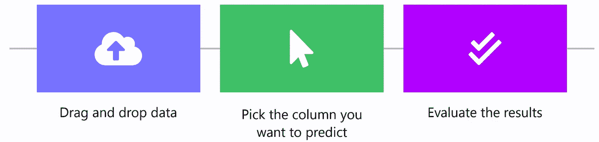

# 如何利用人工智能寻找交叉销售机会

> 原文：<https://medium.datadriveninvestor.com/how-to-use-ai-to-find-cross-sell-opportunities-ab634862bc86?source=collection_archive---------7----------------------->

## 无代码指南。

交叉销售就是将一种商品和顾客已经计划购买的另一种商品放在一起销售。

假设你在亚马逊上买一些绿茶，亚马逊可能会推荐一个杯子和一个热水器。如果你想在新蛋网上买一台笔记本电脑，商店可能会推荐一个笔记本电脑支架和一个手提箱。如果有人问你，“你想配薯条吗？”，那么你已经熟悉了交叉销售的概念。

# 交叉销售的复杂性

然而，这并不像乍看上去那么简单，尤其是当您处理数百、数千甚至数百万的产品时。

你如何确切地知道*什么是最好的推荐产品，以及你应该推荐给你的哪个客户？你应该推荐某种产品或服务，还是会让你倒胃口？这就是[的明显所在。AI](http://obviously.ai) 开始发挥作用，它通过单击来分析大量数据，以优化交叉销售机会，以及表格数据中的任何其他 KPI。*

# 计算交叉销售的附加值

如果你需要更多关于交叉销售附加值的证据，可以考虑一下[麦肯锡](https://www.mckinsey.com/industries/retail/our-insights/how-retailers-can-keep-up-with-consumers)的发现:

> “消费者在亚马逊上购买的 35%和在网飞上观看的 75%来自基于这种算法的产品推荐。”

这些是令人难以置信的百分比，对于较小的电子商务商店来说，它们可能是成败的关键。没有什么比优化交叉销售更能影响你的电子商务商店了。

# 无代码人工智能寻找交叉销售机会

还是用明显吧。给定[保险公司数据](https://www.kaggle.com/anmolkumar/health-insurance-cross-sell-prediction?select=train.csv)，人工智能预测交叉销售机会。这个 Kaggle 数据集大约有 381，000 名健康保险客户，我们想知道一名新客户是否对车辆保险感兴趣。

也许你甚至有过购买新车的经历，并得到车辆保险的选择。我们将采纳这个想法，并准确计算出我们应该向哪个客户推荐哪个计划。

上述数据集中的信息包括人口统计信息(如客户的年龄、性别和地区)、车辆信息(如车龄及其损坏情况)和政策信息(如保费、来源渠道和客户任期)。

我们的 KPI，或者说我们想用来预测的值。AI，叫做“回应”如果客户*对保险*感兴趣，则该列的值为“1”；如果客户*对保险*不感兴趣，则该列的值为“0”。

显然是通过上传这个数据集到。AI，并选择“响应”列，我们可以评估每个客户属性如何影响他们对车辆保险感兴趣的可能性。

这样，我们会发现客户的任期(数据集中的列名“vintage ”)对于预测交叉销售成功的可能性极其重要。客户在公司工作的时间越长，他们就越有可能对车辆保险感兴趣。

按照重要性递减的顺序，我们将看到客户的年龄、年保费和销售渠道都具有预测性。

特别是，老年客户(他们可能更富有，更厌恶风险)和保费较低的客户对车辆保险更感兴趣。

# 部署交叉销售模式

显然在建立了一个模型之后。人工智能，你有几个选择来部署它。如果你经营的是高价低量的业务，你可能会选择使用“人物角色”页面进行单次预测，或者上传一个客户数据集进行批量预测。

如果您经营的是低价、大批量的业务，您可能会选择部署我们的预测 API，为每个客户实时生成交叉销售成功概率，这样您就可以在正确的时间推荐正确的产品或服务。

# 摘要

亚马逊和网飞依靠数据驱动的交叉销售来推动数十亿美元的销售额——这是他们战略的核心。现在，任何公司都可以利用无代码人工智能，以正确的方式快速轻松地实施交叉销售。