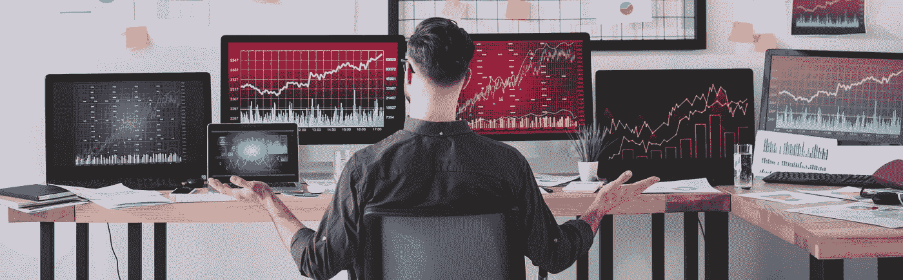
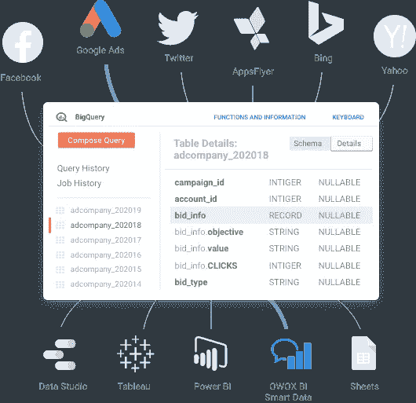
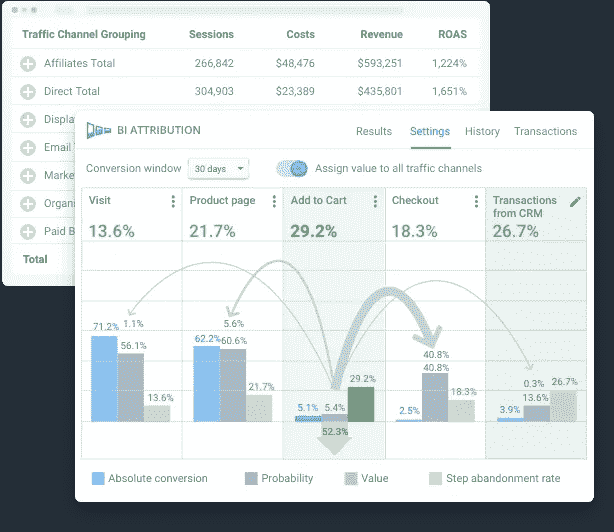

# 如何使用分析优化您的营销预算

> 原文：<https://medium.datadriveninvestor.com/how-to-use-analytics-to-optimize-your-marketing-budget-acf3c882b332?source=collection_archive---------3----------------------->

Source:[Depositphotos](https://ua.depositphotos.com/357619558/stock-photo-back-view-data-analysts-sitting.html)

## 继续阅读，了解如何使用分析不仅用于报告，而且避免耗尽您的预算。

为了避免后悔你的广告和营销费用，你必须做三件事:花钱营销，建立分析，并不断跟踪你的分析。继续阅读，了解如何使用分析不仅用于报告，而且避免耗尽您的预算。

# 表明你的营销预算没有优化

## 你的广告活动效率低下

每个业务领域甚至每个独立的活动的效率指标都是不同的。但总的来说，从长远来看，如果你花的比你挣的多，一场广告活动是低效的。此外，如果您的 KPI 没有显示出持续增长的趋势，或者没有产生一定数量的使您的业务盈利的线索，您的活动将是低效的。最后但同样重要的是，如果你不能判断哪个活动是真正高效的，那么很可能你所有的活动都是低效的。

## 你在点击付费上耗尽你的预算

你曾经因为不恰当的点击付费(PPC)广告活动而在一天内浪费了你的月预算吗？如果你因为人为错误而不断消耗你的 PPC 预算，你就不会有效地花钱。

## 你把成本归因于错误的渠道

根据 Hubspot 的数据，52%的营销人员使用归因报告。根据归因模式，主要渠道(或渠道序列)获得了大部分价值，这导致在它(或他们)身上花费了大部分预算。但是，如果你的模型不能反映现实，你将会低效地分配你的预算，并且会使真正有效的渠道中的增长区域无法被发现。

# 分析如何帮助您有效地使用广告预算

## 控制你的开支和利润

为了优化你的营销预算，你必须弄清楚你到底把钱花在了什么地方。关注广告成本和产生的收入。为了恰当地衡量这些 KPI，即使是[谷歌分析也可能不够](https://www.owox.com/blog/articles/when-analytics-360-is-not-enough/)。您将需要一个专门的工具来控制您的数据质量，并保证您的成本/收入计算的实际价值。

尝试使用 OWOX BI 将[成本数据导入到 Google Analytics](https://www.owox.com/products/bi/pipeline/google-analytics-cost-data-import/) 和 [Google BigQuery](https://www.owox.com/products/bi/pipeline/google-bigquery-cost-data-import/) 中，这样您就可以计算每项活动的广告支出回报率(ROAS ),并估计其真实效率。

Image courtesy of the author

## 分析你所有的数据:受众群体，关键词组，登陆页面

任何见解都无法从深度数据分析中隐藏！这里有一个小的待办事项列表，可以从你的营销数据中获益:

*   在一个安全的地方收集你所有的数据
*   正确合并您的数据并设置自动更新(使用 OWOX BI)
*   应用分段:使用群组分析和基于漏斗的 Google BigQuery 数据分段
*   比广告活动分析更深入——根据关于客户行为和广告努力的完整信息，分析你的关键词、产品和登录页面的效率(点击了解如何做到这一点)。
*   通过分析客户旅程和广告活动表现，找出降低 roa 的关键词、产品和登录页面(并找出原因)。
*   进行 ROPO 分析，找出线下和线上渠道如何相互影响。
*   尝试各种归因模式，直到找到最有效的模式来改进广告活动管理。

你可能会发现曾经很有效的宣传活动不再有效了，因为你的受众的意图已经改变了。或者你可能会发现，与其他社交媒体广告相比，你的 Instagram 广告比你想象的要好得多。这些是你的**增长区**。

## 激活您的数据

一旦完成了基本数据的合并和自动数据更新的配置，预算优化的下一步就是尽量减少人为错误，避免凭直觉做出决定。要激活您的数据:

*   为您的细分市场和受众推出 [A/B 测试](https://www.owox.com/blog/articles/a-b-testing/)
*   针对您的细分市场和群体个性化您的产品，提高转化率，并开始节省您的广告预算
*   使用您的数据分析结果为外部广告和营销自动化服务创造受众
*   [计算您未来的转化率水平](https://www.owox.com/blog/news/forecast-marketing-plan-performance/)以改进您广告活动预算的规划

如果您已准备好从数据中获得真实结果，请应用 OWOX BI 基于机器学习漏斗的归因模型:

Image courtesy of the author

在这个阶段，你可以找到省钱的地方，投入到更有效率的渠道和活动中。

## 自动化您的预算管理

我们已经在这篇关于营销自动化的文章中详细描述了这个阶段。但是，我们应该提到，在这个阶段，您可以通过以下方式优化您的广告预算:

*   配置自动投标管理系统，关闭关键字和活动类别或启动其他类别
*   自动控制每日预算限额；
*   通过电子邮件最大限度地提高再销售和销售线索挖掘沟通的效率，例如，通过发送自动废弃购物车电子邮件，并通过脸书推出废弃购物车商品的特别优惠

处理没有分析的现代营销就像悬在悬崖边的指甲。构建可操作的分析是对自己的行为和工作结果负责。