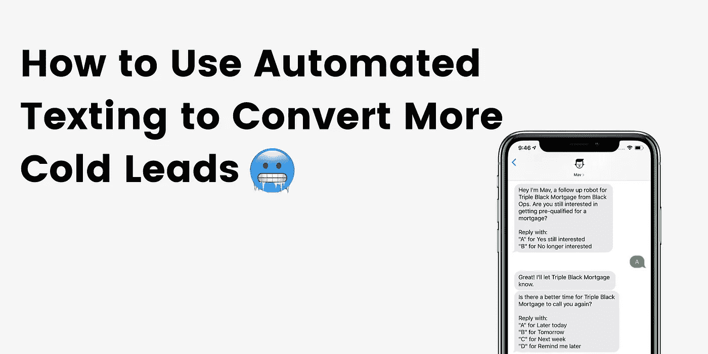

# 如何使用自动短信让冰冷的线索复活

> 原文：<https://medium.datadriveninvestor.com/how-to-use-automated-texting-to-bring-cold-leads-back-to-life-2a68c67401ed?source=collection_archive---------7----------------------->

你知道吗？80%的销售在初次接触后需要**五次**跟进，然而 44%的销售代表仅在**一次尝试**后就放弃了。自动发短信可以让你的跟进自动进行，帮助你在他们表达兴趣几天、几周甚至几个月后转化更多的潜在客户。

我们明白了…跟进很糟糕。这是重复的、费时的，而且说实话，它会让人觉得你在骚扰你的潜在客户。他们还有兴趣吗？也许你已经收到了一份冰冷的线索清单，可以开始打电话了，知道大多数人会把你转到语音信箱，或者甚至不记得他们最初为什么感兴趣。有什么意义？

您的销售团队花费大量时间(几天、几周、甚至几个月)持续寻找销售线索，这需要大量手动工作和浪费时间。只有不到 [5%](https://blog.hiremav.com/20-reasons-why-you-need-automated-texting-for-sales-marketing-in-2020-crazy-stats?hsLang=en) 的语音邮件得到回复，这意味着你可能需要留下 **20 封语音邮件**才能得到回复。你继续跟进他们的条款，记得下周二联系他们，34 天后，他们仍然会缠着你👻。

# 自动化短信改变了这一切。以下是如何…

使用像 Mav 这样的机器人，你可以给你所有的潜在客户发送个性化的短信，看看他们是否仍然感兴趣。你甚至可以更进一步，找到合适的时机去联系。这个过程是完全自主的，所以你不需要花费任何时间去管理它或者发送信息。将您的传统跟进流程转变为您和您的潜在客户更喜欢的全新自动化短信体验。

# 那么，你到底是如何让冷线索起死回生的呢？🥶

# 首先，发一条他们可以回复的短信。

用户不能回复你可能熟悉的对话之外的单向短信广播或行动号召(如链接或“给我打电话”)。当你发送一条用户可以回复的 [**自动双向文本**](https://pages.hiremav.com/automated-texting) 时，它立刻变得有价值。释放用户在对话中完成行动的能力，并获得您想要的信息:他们是否感兴趣。

# 然后，按照以下步骤重新接洽您的销售线索。

问一个可行的问题，看看他们是否感兴趣

一位感兴趣的主管可能会将您转到语音邮件，因为现在不是他们交谈的好时机。发短信可以让客户在更方便的时候回复，当你使用自动化机器人时，它会全天候继续对话。

提供你为什么跟进的背景(一个具体的报价或产品价值)，并快速问是或否“你仍然感兴趣吗？”是获得回复的最快方式——事实上，普通人在 90 秒内回复一条短信。我们甚至看到这种策略对两年前的线索有效(并转化)。

**找准时机连接**

再说一次，有时候生活会碍事。如果您提供的服务必须通过电话完成，找到一个更好的时间与您的销售线索联系，并在同一天再次确认时间是确保转换的最佳方式。最好的方法是让他们尽可能简单地用一封信来回复。

如果您是手动完成这个过程，那么需要做大量的后续工作。一个机器人可以询问正确的时间，等待响应，即时确认，到时候继续跟进。有了 [Mav](http://hiremav.com) ，你的机器人也能够使用 NLP 理解“明天”、“星期二 5 点”和“下周五”之间的区别。确认日期和时间后，您将收到一封电子邮件或一条短信，提醒您可以联系销售线索了。

**如果没有回音，继续跟进，直到有结果为止**

机器人永远不会忘记跟进。由于[短信是一个开放、持久的渠道](/why-sms-bots-are-better-than-website-chatbots)，你可以持续几天、几周、甚至几个月重新接触一个线索，并从中断的地方重新开始同样的对话，而不会忘记任何事情。

与第一次外展活动类似，通过短信再次吸引客户的最佳方式是提醒他们等待他们的是什么，并鼓励他们采取行动。

**冲洗&重复**

现在你的短信机器人已经准备好工作了，你可以坐下来，让它管理你所有的后续工作！将销售线索添加到您的队列中，无论它们在流程中处于什么位置，您的机器人都会让事情继续进行，并且只在冷销售线索准备向前移动时提醒您。

# 准备好开始将你的冷线索转化为热前景了吗？Mav 可以帮忙。

如果你准备好开始跟进，Mav 随时准备为你工作。Mav 是一个自动化的双向发短信机器人，它可以与你的潜在客户和客户进行对话。

确认潜在客户，用新的产品重新吸引现有客户，并通过完全自主的对话跟进已经放弃的潜在客户。大规模发送个性化短信，持续跟进，并与 CRM 和数百个其他平台集成。🔥借助自动化工作流程，Mav 知道何时开始发送短信，以及何时何地发送您的销售线索数据。

[**见 Mav 在这里的行动。**](http://hiremav.com)

*我是希拉里，营销负责人&对话设计在* [*Mav*](http://hiremav.com/) *。想聊天机器人？* [*加入我的私人脸书群吧！*](https://www.facebook.com/groups/210860349731183)