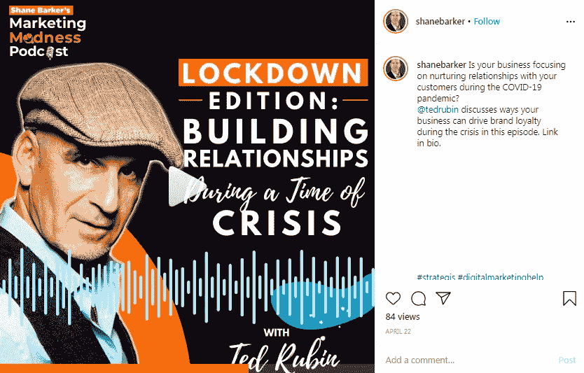

# 如何利用有争议的话题增加自己在社交媒体上的影响力

> 原文：<https://medium.datadriveninvestor.com/how-to-use-controversial-topics-to-increase-your-influence-on-social-media-4d80e6cc014c?source=collection_archive---------5----------------------->

## 有争议的话题往往会得到更多的关注。

Image via [Pixabay](https://pixabay.com/photos/protest-signs-women-s-march-placard-2734408/)

新闻不再局限于印刷媒体。很多人使用在线渠道来了解时事。社交媒体改变了我们交流的方式，这几乎是革命性的。

谈到政治话题和社会原因，Twitter 是人们分享观点的领先社交媒体平台。

在所有讨论的话题中，有争议的话题在几乎每个社交媒体平台上都获得了最大的关注。每个人都想了解他们，每个人都有自己的观点可以分享。

 [## 以最好的面貌面对未来|数据驱动型投资者

### 社交媒体营销从客户开始。广告、反馈和管理投诉交织在一起…

www.datadriveninvestor.com](https://www.datadriveninvestor.com/2020/03/01/take-charge-with-your-best-face-forward/) 

这就是为什么你可以利用有争议的话题来获得大量的有机流量。

如果你在有争议的话题上创造有价值的内容，权衡所有的事实和观点，你可以吸引成千上万的人。

在这篇文章中，我将讨论如何利用有争议的话题来增加你在社交媒体上的影响力。

# 1.密切关注时事

Image via [Pixabay](https://pixabay.com/photos/truth-newspaper-news-printed-text-166853/)

为了让有争议的话题对你有利，你首先应该知道世界上正在发生什么。让自己了解所有最近在社交媒体上引起关注的事件和原因是至关重要的。

你应该读报纸，看新闻，并且一定要活跃在 Twitter 上，因为它是全球趋势新闻的中心。不要忘记在其他社交媒体平台上保持活跃，密切关注你所在行业的热门话题。

然后你可以利用这些热门话题来创造有可能成为病毒的内容。

例如，今天世界上的每个人都在谈论新冠肺炎疫情，以及他们如何度过隔离期。你可能已经看到了许多与危机相关的教育内容、折扣优惠、免费订阅和迷因。

许多品牌和企业家正在利用这个话题，创造相关的内容来吸引他们的观众。

作为一名营销人员，我写了许多关于新冠肺炎危机期间最佳营销实践的内容。这帮助我获得了很大的吸引力。

事实上，我还主持了一些与新冠肺炎危机相关的独家播客。

这是我在 Instagram 上发布的视频截图，宣传我与 Ted Rubin 就“在危机时期建立关系”进行的讨论

Image via [Instagram](https://www.instagram.com/p/B_QyOzVI9sm/)

那么，你到底应该做些什么来利用热门话题呢？

你应该关注周围发生的事情，选择你认为会引起你的追随者好奇心的话题。

# 2.挑选社会问题

Image via [Pixabay](https://pixabay.com/photos/women-s-march-sign-child-political-2001559/)

你应该选择贴近你内心的社会问题，并在社交媒体上写下和分享你对这些问题的看法。

谈论影响你的追随者日常生活的有争议的社会原因可以帮助你产生参与。然而，在分享你的观点时，你应该感同身受。记住，你不想伤害他们的情绪。

当你谈论这些社会话题时，你的追随者很可能会更认真地对待你，并感到与你更亲近。他们会认为你是一个成熟的人，有独特的声音，并且不怕表达出来。这肯定会帮助你增加你的追随者数量。

例如，增加税收或学费、教育系统、通货膨胀和妇女赋权等问题往往会引发真实的讨论。

你可以讨论这种有争议的话题来建立你在社交媒体上的影响力。

# 3.使用趋势标签

Image via [Pixabay](https://pixabay.com/illustrations/hashtag-hash-tag-social-internet-1084519/)

标签让人们可以很容易地搜索关于特定主题的帖子和推文。人们经常将有争议的话题与一组独特的标签联系起来，这些标签会迅速成为流行趋势。

你应该跟踪流行标签，尤其是在 Twitter 上，并创建与之相关的内容。

例如，在当前新冠肺炎疫情期间，世界上许多地方都实施了全面封锁。

一些在互联网上流行的相关标签包括:

*   #锁定日记
*   #住宿之家
*   #安全停留
*   #covid19
*   #隔离
*   #隔离生活
*   #隔离 2020

这些标签势头很快。如果你在你的内容中使用它们，你可以帮助更多的人容易地找到它。

如果你的内容有价值，它将能够帮助你在社交媒体上建立强大的影响力。

有许多[标签工具](https://shanebarker.com/blog/instagram-hashtag-generator-tools/)可以帮助你在社交媒体上找到与特定利基和主题相关的趋势标签。你也可以用它们来寻找与有争议话题相关的标签。

# 4.进行民意测验

Image via [Pixabay](https://pixabay.com/photos/feedback-survey-nps-satisfaction-3709752/)

当我们谈论有争议的话题时，意味着人们有相反的观点。虽然有些人可能赞成某事，但其他人可能会反对。

跟踪观众对有争议话题的看法的最佳方式是什么？

我相信这是为了主持民意调查。

那是最容易听到双方故事的方式。幸运的是，像脸书和 Instagram 这样的社交媒体平台让民意调查变得前所未有的容易。

我非常喜欢 Instagram Story 的投票贴纸，它让用户只需轻轻一点就可以为他们相信的东西投票。它很有趣，也很容易使用。

在你决定写任何有争议的话题之前，做一个民意调查是个好主意。这将有助于你了解读者的想法。你可以在创作该主题的内容时记住他们的观点和看法。

民意调查还可以帮助你在社交媒体上吸引观众，引发健康的讨论。

# 准备好利用有争议的问题了吗？

社交媒体上分享的内容会对人们的日常生活产生重大影响。

每当你谈论一个有争议的话题时，你应该总是陈述事实并涵盖故事的双方。你一定要分享你的观点，因为你的追随者想知道他们最喜欢的影响者对这个问题的看法。

表明立场可能有风险，但你的追随者可能会因为你告诉他们你的观点而尊重你。

你对你的观众有一定的影响力，你不希望它变得消极。我们知道这可能有风险，但权力越大，责任越大。

你想通过谈论最近有争议的话题来增加你的影响力吗？你觉得大声说出来很难吗？请在下面的评论中告诉我们你的观点。