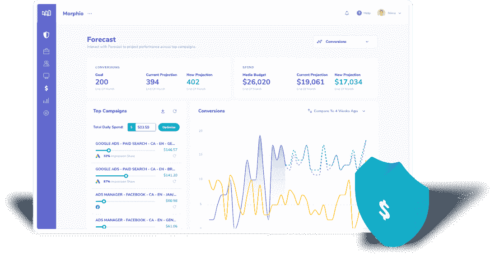
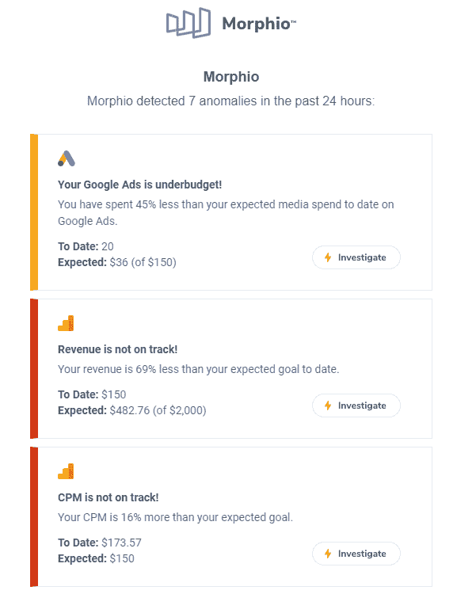
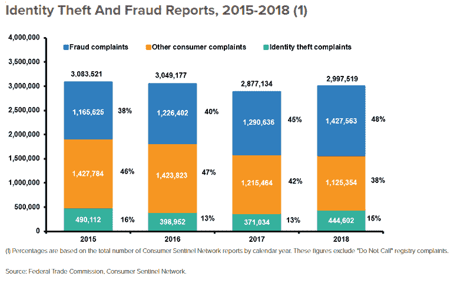
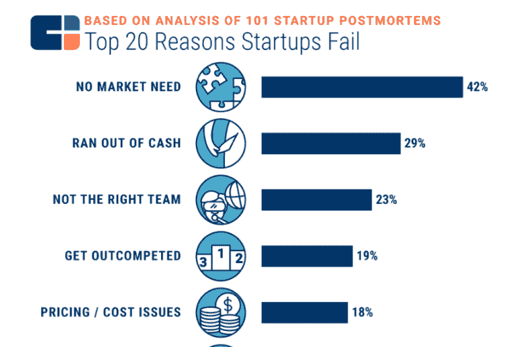
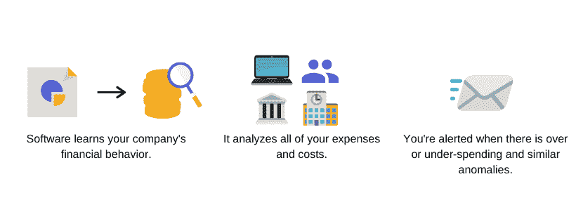

# 如何在财务和营销中使用财务异常检测

> 原文：<https://medium.datadriveninvestor.com/how-to-use-financial-anomaly-detection-in-finance-marketing-bd715a82bb81?source=collection_archive---------6----------------------->

金融是任何商业中极其重要的一部分。然而，这并不是每个人都喜欢的。

这就是为什么 60%的小企业主认为他们不懂财务或会计。你自己呢？

资产负债表、损益表、预算等。—不是世界上最有趣的事情。

 [## 更好的预算，打造更大的|数据驱动型投资者

### 即使是专家也承认它们并不完美。从 1 到 10 的范围内，安东尼·科普曼和德尔…

www.datadriveninvestor.com](https://www.datadriveninvestor.com/2018/11/08/budget-better-to-build-bigger/) 

此外，优化财务、支出和费用增加了每天要做的堆积如山的财务任务。

你已经在监督一个团队，管理工具，并努力寻找业务发展的时间。

但是，有一种新的解决方案，很少有公司利用它来解决所有这些问题。它叫做*金融异常检测*。而且，实现起来比您想象的要容易得多。

想学怎么做？继续读。

# 营销中的财务异常检测是什么？

金融异常检测是人工智能驱动的软件，可以识别罕见的事件。这些包括有价值的金融机会和潜在的风险。

它是这样工作的:一家公司采用像 Morphio 这样的营销安全软件开始。人工智能分析公司的[财务数据](https://morphio.ai/budget-protection)，以确定正常运营是什么样子。这些被置于标准偏差内。

任何超出正常范围的数据集都是财务异常。又名需要调查的可疑营销财务数据。

金融中的异常也被分为三个级别:1 级、2 级和 3 级。认为一个是次要异常，三个是主要异常。首先处理主要异常，然后再处理次要异常。

这看起来很复杂，但事实并非如此。这项技术是即插即用的。你注册，整合工具和活动，踢你的脚了。你像往常一样工作，软件会在运行中发现优化和问题。

这些数据也很容易理解，有着直截了当的信息和简单的仪表板。

例如，你会收到一封来自 Morphio 的电子邮件提醒:

很简单，对吧？一旦你被告知收入不在正轨上或者[你的 KPI 超出了预期](https://medium.com/@e.vardon/how-to-monitor-kpis-while-scaling-4bbf614ef3de?source=---------5------------------)，你就要调查原因。

这就引出了我的下一点。

# 金融异常检测用例

现在，您已经了解了什么是金融领域的异常检测，我将向您介绍一些最佳用例。

# 欺诈和风险检测

问题发生在你最意想不到的时候。知道自己处于[较低的金融欺诈风险](https://morphio.ai/blog/blog/marketing-security-trends)中，内心的平静是无价的。这也是金融异常检测的最佳用途之一。

金融欺诈和风险也有许多不同的形式。其中包括信用卡欺诈、不安全交易和数据泄露。

事实上，虽然身份盗窃有所下降，但自 2015 年以来，[诈骗持续增加](https://www.iii.org/fact-statistic/facts-statistics-identity-theft-and-cybercrime)。

不过，没必要担心子弹。财务异常检测减轻了您的负担，因此您可以继续做重要的事情。

例如，[一家大型金融电子商务公司](https://spd.group/machine-learning/credit-card-fraud-detection-case-study/#Anomaly_Detection_Solution_for_E-Commerce_Credit_Card_Transactions_from_SPD_Group)开始与一家防欺诈公司合作，以使其平台更加安全。特别是，他们的钱不见了，欺诈性的订单经常发生，他们知道有些事情必须改变。

[一个机器学习算法](https://morphio.ai/blog/blog/scaling-with-machine-learning-6-things-you-need-to-know)被创建来基于标准行为和历史数据集允许或不允许交易。

结果呢？降低解决欺诈相关问题、客户支持、退款表格和退款验证的成本。此外，由于交易更简单、更快速、更安全，客户满意度也提高了。

# 最大化营销预算

营销需要钱。从内容营销到 SEO 和 PPC，一切都需要持续的现金来扩展业务。

但是，你有没有想过你是否从预算中获得了最大收益？别担心。这让大多数营销人员夜不能寐。29%的企业失败是因为他们只是没钱了。这意味着你必须以最好的方式使用你的资本。

金融异常检测通过分析营销和广告活动来解决这一问题。它能发现产生最佳绩效的因素和消耗血汗钱的因素。

这让你能够抓住好机会，剔除坏苹果。最终，这意味着你将[在收效甚微的活动上节省预算，同时将预算重新分配给投资回报率更高的项目。](https://morphio.ai/blog/blog/reduce-ad-spend-with-these-5-simple-strategies)

换句话说，由于异常算法，客户节省了资金，改善了客户体验，并更智能地工作。

# 降低您的开支和成本

你的企业有哪些开支？员工、设备和工具可能是少数。人们很容易专注于优化转化率和点击费，却忘记了还有很多其他省钱的方法。

也没有必要花几个小时自己做。你已经够忙的了。

[异常检测](http://www.forbes.com/sites/forbesagencycouncil/2020/02/03/how-to-apply-anomaly-detection-and-reap-these-three-benefits/)软件发现包括超支、低转换率和缺乏投资回报在内的事件。这些数据用于进行调整，如减少某些项目的预算，重新构建工具堆栈，以及淘汰表现不佳的活动。

最精彩的部分？都为你做好了。管理团队、工具和你的日常任务足以让你头昏脑胀。将这些小麻烦一扫而光，你就可以轻松地自由扩展了。

更不用说你降低了成本，节省了预算，还可以把时间和金钱用在其他地方。

# 结论

我们都知道钱很重要。但是，我们必须开始像它一样行动。许多美国营销人员仍处于流程和技术的石器时代。

我们尝试手动完成所有事情:修复错误、检查集成、进行优化。我们在 2020 年，伙计们。现在电脑为我们做了所有的事情！

这就像试图检查一辆崭新的奔驰车的气压，而仪表盘却告诉你已经有的数据！

这就是为什么我们创造了世界上第一个营销安全软件。我们的平台将帮助您节省预算，深入了解支出，并让您重新投入到重要的工作中。[今天免费试用 Morphio】自己看吧。](https://app.morphio.ai/register)