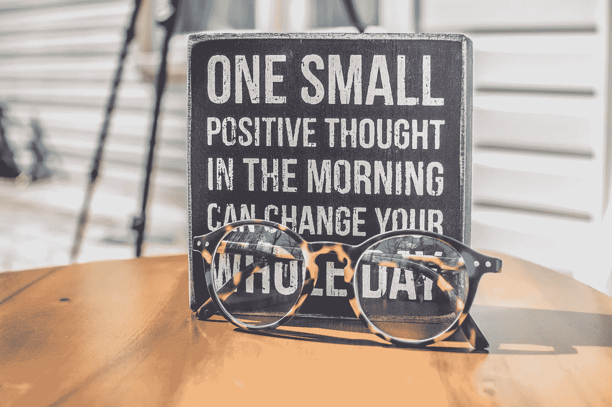

# 如何使用“我是”的断言来实现任何财务目标

> 原文：<https://medium.datadriveninvestor.com/how-to-use-i-am-affirmations-to-manifest-any-financial-goal-d1ab0c9b7ff8?source=collection_archive---------16----------------------->

Photo by [Binti Malu](https://www.pexels.com/@bintimalu?utm_content=attributionCopyText&utm_medium=referral&utm_source=pexels) from [Pexels](https://www.pexels.com/photo/photo-of-a-sign-and-eyeglasses-on-table-1485657/?utm_content=attributionCopyText&utm_medium=referral&utm_source=pexels)

你看过[大米实验](https://www.youtube.com/watch?v=zvShgttIq7I)吗？有三罐大米，每罐都重复地被告知一个词。一个罐子收到像“我爱你”这样积极的话语。另一个罐子被忽略，而最后一个罐子收到的是“我讨厌你”之类的负面话语。实验结束时，最后两罐大米已经变黑或发霉，而第一罐(正极罐)仍然完好无损。

这个故事的寓意——语言是非常强大的。那么，如果我们像第一罐大米一样，用这种魔力将积极的话语和对自己的意图结合起来，会怎么样呢？这个实验实际上已经在人类身上做过了，这种专注的练习被称为肯定。

**第一肯定**

最流行的肯定是“我在”。这两个字之后的任何东西都有决定我们现实的力量。许多熟悉肯定的人理解使用它们来显化我们生活中所渴望的东西的力量。

“我是”才是真正的上帝和宇宙的共鸣。因为我们都是一体的，上帝就在我们的内心，所以我们有与生俱来的能力去发掘这种超能力。

我们不断地肯定自己的思想，坚持自己的信念。我们没有意识到这一点的唯一原因是因为我们大部分的肯定都是下意识的。知道了这一点，就很容易理解为什么我们的人生旅程会如此艰难。我们天生警惕，85%的想法是消极的。恐惧、压力、焦虑、怀疑和不安全感是不断贯穿我们头脑的情绪。尽管有很好的理由，我们的大脑只是试图保护我们不受过去发生的所有事情的影响。更不用说根深蒂固的童年创伤和我们的机构和亲属的社会条件。

为了养育我们内心的孩子，为更多积极的想法腾出空间，我们要确保我们做了大量的工作，用积极的肯定来取代那些限制我们和他人的信念。我们希望确保我们掌握了自己的潜意识故事，并通过告诉自己尽可能多的积极陈述来重写这些剧本。

Photo by [Binti Malu](https://www.pexels.com/@bintimalu?utm_content=attributionCopyText&utm_medium=referral&utm_source=pexels) from [Pexels](https://www.pexels.com/photo/i-love-you-to-the-moon-and-back-5324352/?utm_content=attributionCopyText&utm_medium=referral&utm_source=pexels)

**誓词 101**

我的理论是一个反复重复的想法变成了一个信念。你现在持有的任何信念仅仅是因为你已经思考了太多次，它已经在你心中根深蒂固，无论是有意识的还是无意识的。所以我们想留意我们告诉自己的话。有了肯定，写下来会有更大的力量。

这里有几行关于金钱和富足的肯定，你可以经常写下来或者大声说出来。做这件事没有对错之分，有大量关于写强有力的肯定的日记练习。

我给你们举几个例子:

*   我是一股充沛的能量流，金钱源源不断地流向我
*   我是一个丰富的资金流
*   我是财富的强大来源
*   我很容易让富足进入我的生活
*   我很幸运拥有我现在所拥有的一切和即将到来的一切
*   我真的很喜欢她/他表现出的一点点感激
*   我是个吸铁石，我花的每一样东西都会回来。平衡更多一点的高级肯定
*   在需要的时候，我有充足的资源
*   我允许宇宙用金钱来奖励我
*   我乐于接受更多
*   我在各方面都很丰富

此时此刻，有些话你可能难以启齿和相信，没关系。有些肯定对你来说会比其他的更容易，但最重要的是选择那些你觉得舒服的。要重复和一致，也不要平淡或肤浅——付出努力。

Photo by [cottonbro](https://www.pexels.com/@cottonbro?utm_content=attributionCopyText&utm_medium=referral&utm_source=pexels) from [Pexels](https://www.pexels.com/photo/woman-in-black-tank-top-4327038/?utm_content=attributionCopyText&utm_medium=referral&utm_source=pexels)

**将肯定融入生活的不同方式**

有些人相信在镜子前大声肯定，而看着自己就像看着自己的灵魂并对着它说话——让你话语中的力量强大 10 倍。我甚至有一个催眠治疗师告诉我每天早上起床，通过镜子盯着我的眼睛看五分钟。仅此一项就超级超级强大。

另一个你可以尝试的肯定练习叫做脚本，这是我个人喜欢做的。写脚本的关键是用现在时写出你想要的东西，就好像你已经有了一样。所以它可能看起来像这样:

> *“我太高兴了，我终于买到了特纳街 525 号的房子！这是最漂亮的房子，有漂亮的后院和游泳池。我很享受在后院用这株含羞草沐浴阳光的时光，我很高兴宇宙给了我想要的一切。我喜欢它。我和我的梦中情人住在这个房子里，我有这些可爱的孩子，我非常爱他们。我的家庭带给我很多快乐。我很幸运也很感激能来到这里，我感谢我所拥有的一切。”*

基本上就是假装你就在当下。不仅仅是想象它看起来会是什么样子，还有它感觉起来会是什么样子。记住，你投入的精力同样重要。

我推荐的最后一个工具很简单，冥想和想象你想要什么。有大量的冥想指南可供下载。应用程序“洞察计时器”有大量的指导冥想可供选择，或者你可以为自己找一个安静的空间，播放一些柔和的音乐，燃烧任何种类的草药。创造一个让你感觉最舒适的神圣空间和环境，这样你的思想就可以轻松地带你去你最深处的梦想和渴望的地方——不受干扰。简单地冥想和想象你自己正在经历你想要经历的事情，就像你正活在当下一样。想象自己走进梦想中的房子，想象自己在梦想中的假期，或者和梦想中的男人在一起。你可以思考任何你想带入生活的事情，不仅仅是金钱上的富足。

Photo by [Ann Nekr](https://www.pexels.com/@ann-nekr-3111643?utm_content=attributionCopyText&utm_medium=referral&utm_source=pexels) from [Pexels](https://www.pexels.com/photo/workplace-with-laptop-and-opened-diary-5797903/?utm_content=attributionCopyText&utm_medium=referral&utm_source=pexels)

**肯定拿工作**

这不仅仅是你的金钱之旅，更是人生之旅。在做内在的工作来移除限制你的东西时，渴望和肯定你的梦想也是很重要的。只要你投入工作，并采取必要的步骤来实现你的目标，肯定会是一个很好的方式来推动甚至更快。仅仅显化而不做工作将会让你一事无成。展现富足并不一定意味着物质上的金钱享受。它可以是家庭、朋友、事业、爱情、金钱和生活的全面丰富。

不要回避尽可能具体的问题。准确地说出你想挣多少钱，你想拥有的确切工作，生活方式的类型，这些都是至关重要的！只要你下定决心，并确保经常重复上述练习，一个充满机遇的世界将展现在你面前。

**注册观看我的免费大师课“过最好的生活时储蓄”，了解所有的储蓄技巧和工具，立即让你存更多的钱——甚至不用做预算。你可以在这里* *看大师级重播* [*。*](https://www.holisticbucks.com/mainfreebie)

** *一直沉迷于我的博客文章，想从我的每周时事通讯中获得更多信息，并获得最佳理财建议？* [*加入邮件列表！*](https://view.flodesk.com/pages/5f90a6f2bdb7252fa740b358)