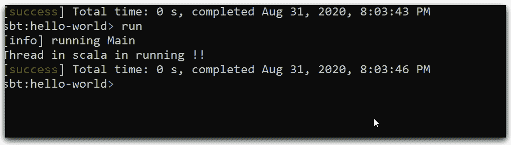
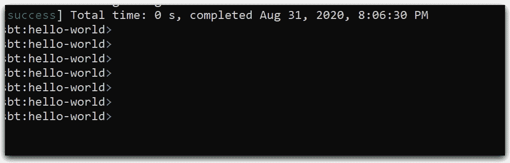
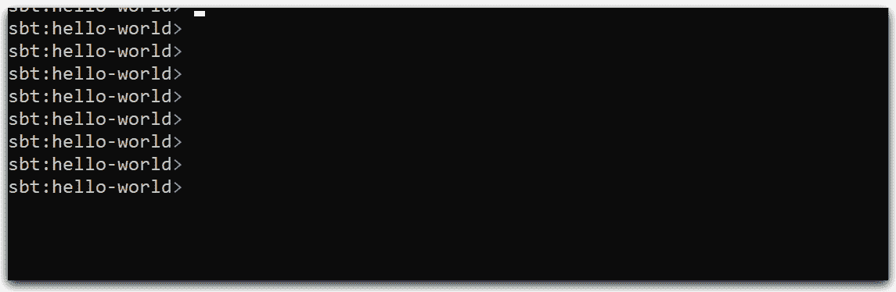
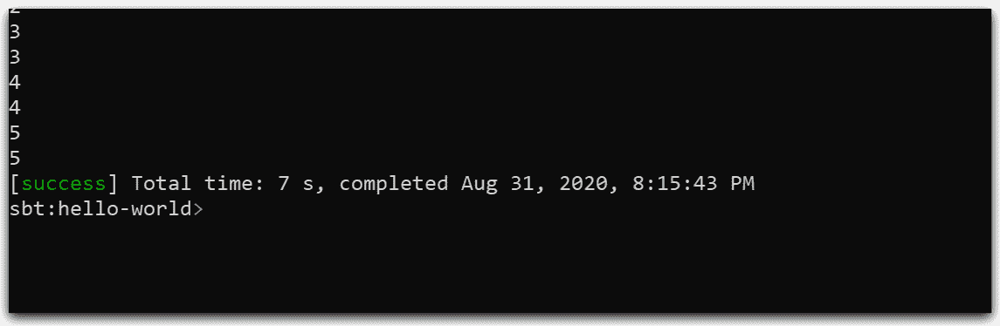
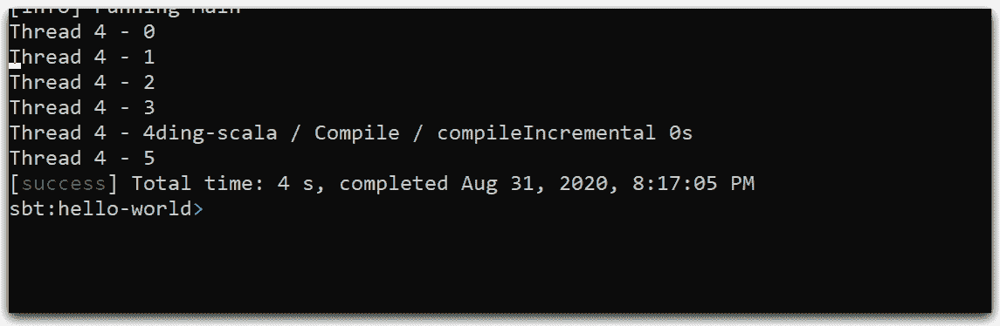

# 如何在 Scala 中使用 Java 线程？

> 原文：<https://medium.datadriveninvestor.com/how-to-use-java-threads-in-scala-d93d34d3b8b5?source=collection_archive---------2----------------------->

## SCALA 概念

## 多线程是一种同时运行多个线程的机制。它允许您同时执行各种操作。

线程是占用较少内存的轻量级子进程。多线程可以用来在 Scala 中构建并发应用。

Scala 没有为创建线程提供任何单独的库。如果你熟悉 Java 的多线程概念，你会知道除了 Scala 语言本身的语法之外，它是相似的。

可以通过两种不同的方式创建线程。

*   扩展线程类
*   实现 Runnable 接口

[](https://www.datadriveninvestor.com/2019/09/17/work-begins-on-java-14-as-java-13-set-to-launch/) [## Java 14 工作开始，Java 13 即将发布|数据驱动投资者

### 随着 Java 13 准备于 2019 年 9 月 17 日上线，科技公司更令人兴奋的发展已经开始了…

www.datadriveninvestor.com](https://www.datadriveninvestor.com/2019/09/17/work-begins-on-java-14-as-java-13-set-to-launch/) 

# Scala 中的线程类

下面的示例从 Thread 类继承，并重写 run 方法。使用 start()方法点燃一个线程。

```
object Main extends App {
 var thread = new ScalaThreadExample()  
 thread.start() 
}class ScalaThreadExample extends Thread{  
 override def run(){  
  println("Thread in scala in running !!");  
 }  
}
```



# 在 Scala 中实现 Runnable 接口

下面的示例实现 Runnable 接口并重写 run 方法。使用 start 方法点燃一个线程。

```
object Main extends App {
 var runnableObj = new ScalaRunnableThreadExample()  
 var threadRunnable = new Thread(runnableObj)  
 threadRunnable.start()  
}class ScalaRunnableThreadExample extends Runnable{  
 override def run(){  
  println("Thread is running using the Runnable interface !!")  
 }  
}
```



# Scala 中的线程类提供了

处理线程状态的各种方法如下:

## Scala 线程睡眠()

上面的过程让线程休眠一段指定的时间，这段时间以毫秒为参数指定。

```
object Main extends App {

 var thread1=new ThreadSleepExample();
 var thread2=new ThreadSleepExample();
 thread1.start()
 thread2.start()
}class ThreadSleepExample extends Thread{  
 override def run(){  
  for(i<- 0 to 5){  
   println(i)  
   Thread.sleep(500)  
  }  
 }
}
```



## Scala 线程连接()

join()方法等待前一个线程死亡，意味着 join()进程保持当前正在运行的线程的执行，直到指定的线程完成其执行。

```
object Main extends App {

 var thread3=new ThreadSleepExample();
 thread1.start()
 thread1.join()
 thread2.start()
 thread3.start()
}class ThreadSleepExample extends Thread{  
 override def run(){  
  for(i<- 0 to 5){  
   println(i)  
   Thread.sleep(500)  
  }  
 }
}
```



## Scala 集合名称()

setName 方法为线程提供了唯一名称。

对象主扩展应用程序{

```
var thread4=new ThreadSetNameExample();
 thread4.setName("Thread 4");
 thread4.start()
}class ThreadSetNameExample() extends Thread{  
 override def run(){  
  for(i<- 0 to 5){  
   println(this.getName()+" - "+i)  
   Thread.sleep(500)  
  }  
 }  
}
```



## GitHub 回购

[](https://github.com/ssukhpinder/threading-scala) [## ssukhpinder/线程-scala

### 如何在 Scala 中使用 java 线程概念？为 ssukhpinder/threading-scala 开发做出贡献，创建一个…

github.com](https://github.com/ssukhpinder/threading-scala) 

## 为什么使用线程？

*   减少开发时间。
*   降低支持成本。
*   它有助于提高复杂应用程序的性能。
*   对 UI 的响应很有用。
*   线程在服务器应用程序中用于高吞吐量和资源利用率。
*   并行化作业。
*   如果一个线程不能利用 CPU 的所有资源，运行另一个线程可以避免这些资源闲置。

## 缺点:

*   多个线程在共享公共硬件资源时可能会相互干扰。
*   多线程的硬件维护对软件来说更明显，因此比多处理需要对应用程序和操作系统进行更多的修改。

感谢您的阅读。请继续访问并在你的网络中分享。请把你的想法和反馈放在评论区。

在[LinkedIn](https://www.linkedin.com/in/sukhpinder-singh-532284a2/)[insta gram](https://www.instagram.com/sukhpindersukh/)[脸书](https://www.facebook.com/sukhpinder.singh.52/) [Twitter](https://twitter.com/sukhsukhpinder) 上关注我。

**访问专家视图—** [**订阅 DDI 英特尔**](https://datadriveninvestor.com/ddi-intel)