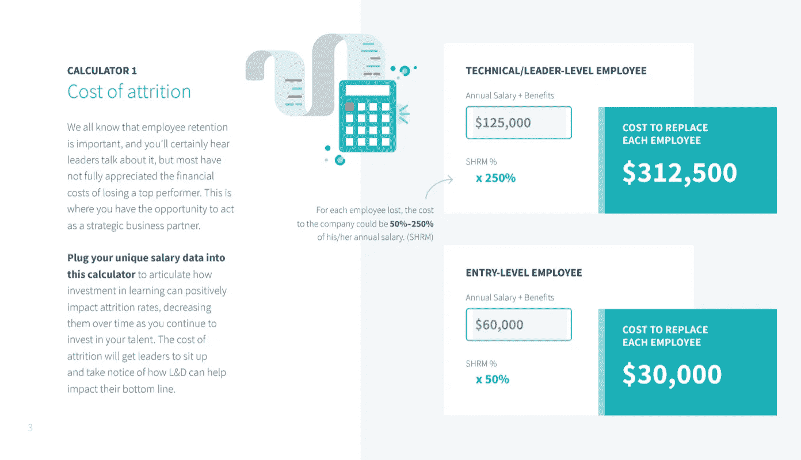
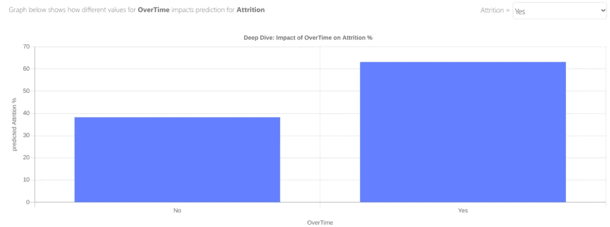

# 如何使用无代码人工智能减少员工流失

> 原文：<https://medium.datadriveninvestor.com/how-to-use-no-code-ai-to-reduce-employee-attrition-bce1bcb7223?source=collection_archive---------25----------------------->

## 简单指南。

自然减员就是一名员工辞职，这可能会非常昂贵，因为雇主需要寻找和培训新人才，或者将工作重新分配给现有员工，从而增加他们的工作负担。

LinkedIn 提供了一个方便的[工具](https://learning.linkedin.com/content/dam/me/learning/en-us/pdfs/lil-workbook-calculating-cost-of-employee-attrition-and-disengagement.pdf)来估算你所在组织的人员流失成本——大约是初级员工工资的 50%,或者是领导级别员工工资的 250%。

Source: [LinkedIn](https://learning.linkedin.com/content/dam/me/learning/en-us/pdfs/lil-workbook-calculating-cost-of-employee-attrition-and-disengagement.pdf)

对于员工辞职的原因，我们可以做出一些有根据的猜测:他们的工资不够高，福利不够好，工作场所文化有毒，老板缺乏领导技能，员工看不到在组织中的长期职业生涯。

研究还表明，员工更有可能在特定的时间(T4)辞职，比如工作纪念日和生日。

想象一下，如果这些指标都被量化了——如果我们能够采取一种数学的、有组织的、逻辑的方法来*计算*和*优化*损耗，而不是依赖直觉。

# 该过程

员工数据集包含个人身份信息——但这些信息并不需要用来建立预测减员的人工智能模型，像姓名、性别和种族这样的 PII 列应该被排除在外。

我们可以看看这个合成的[员工流失数据集](https://www.kaggle.com/pavansubhasht/ibm-hr-analytics-attrition-dataset)来了解一个典型的数据集可能是什么样子。以下是其中包含的一些属性:

*   员工教育
*   环境满意度
*   工作投入
*   工作满意度
*   作业等级
*   关系满意度
*   工作生活平衡

与任何表格形式的无代码人工智能问题一样，有一个简单的 3 步过程来洞察损耗。

显然，我们想要将上述员工数据上传到[。AI](http://obviously.ai) 并挑选我们想要预测的列(`attrition`)。

这样做，我们可以看到加班最有预测力，这是有道理的:加班时间越长的员工压力越大，参与度越低，留在公司的可能性也越小。

其他重要的属性是收入、离家的距离和雇员的任期。同样，我们可以看到为什么模型认为这些是重要的特征:住在远离办公室的地方，在公司工作时间不长的低收入员工，逻辑上不太可能留在公司。

 [## 机器学习和人工智能如何改变电子商务的面貌？|数据驱动…

### 电子商务开发公司，现在，整合先进的客户体验到一个新的水平…

www.datadriveninvestor.com](https://www.datadriveninvestor.com/2020/11/19/how-machine-learning-and-artificial-intelligence-changing-the-face-of-ecommerce/) 

# 模型

有趣的是，我们现在不仅确切地知道了是什么导致了员工流失，而且我们可以主动地*预测*某个特定员工或一组员工流失的可能性。

这可以通过转到“导出预测”选项卡，在“批量预测”下上传您想要预测的数据，或者使用 API 进行实时预测来完成。在这种情况下，使用 API 对于那些拥有数千名员工的大公司来说更有意义。

# 免责声明

人工智能从业者应该以某种程度的谨慎来计算员工流失。如果你错误地包含了像性别或种族这样的价值观，你的模型可能会带有性别或种族偏见。

如果你使用这个模型来做雇佣和解雇的决定，你将会违反禁止歧视的平等就业机会(EEO)法。解决方法很简单:不要在训练数据中包含这些列。

此外，重要的是要记住，无代码人工智能自动化了做出预测的过程，但它不会自动化商业技能或直觉。仍然由您来使用该模型，并根据您发现的见解在您的组织中更改策略。

# 摘要

无代码人工智能是一种分析和优化员工流失的强大方法，可以帮助组织削减与不断雇佣和培训新员工相关的成本。很明显。人工智能，构建和部署人工智能是容易的部分——在你的组织中实现改变取决于你。

**访问专家视图—** [**订阅 DDI 英特尔**](https://datadriveninvestor.com/ddi-intel)