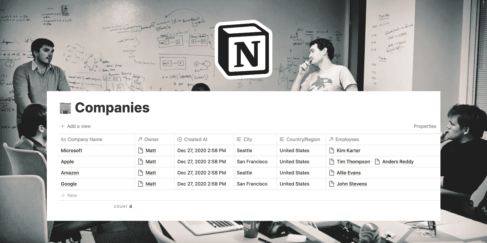
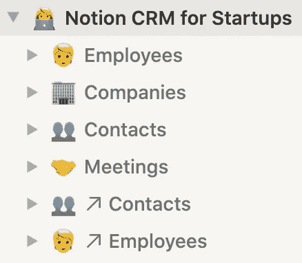
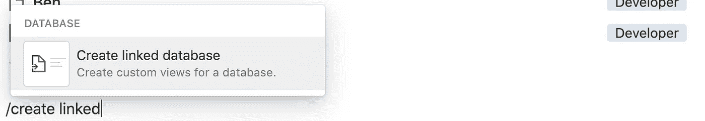

# 如何在你的创业中使用概念作为一个轻量级的 CRM

> 原文：<https://medium.datadriveninvestor.com/how-to-use-notion-as-a-kick-ass-lightweight-crm-b020758720dd?source=collection_archive---------4----------------------->

[image source: [https://www.youtube.com/watch?v=783ccP__No8](https://www.youtube.com/watch?v=783ccP__No8)]

## 概念

## 只需 0 美元，你就可以将你最重要的客户数据放入 idea，并围绕这些数据开展业务。

作为一名个体创业者，我经常要做许多和大公司一样的工作，但预算和时间却少得多。这使得我拥有能让我快速工作并且不会为此倾家荡产的工具变得很重要。

这就是观念完美的原因。

idea 正是中小型创业公司需要的灵活的一体化解决方案。它让您可以在一个工具中处理您的电子表格、会计、项目管理和客户关系管理。

然后，当您的业务扩展时，concept 提供了方便的导出功能，因此您可以迁移到您选择的任何系统。

这种组合使它成为我现在最喜欢使用的工具之一。我见过的最方便的 idea 用例之一是 CRM 系统。

# 如何树立客户关系管理的理念

以下是如何通过简单的一键操作将 concept 设置为 CRM 的方法:

1.  创建一个概念账户。
2.  点击下面的按钮(或点击[这里](https://www.notion.so/spencerpauly/Notion-CRM-for-Startups-1cdc1e4d2dbc4becb2a65fa0a9ec39e8)，然后点击右上角的“复制”)，复制我预先制作的模板。

3.复制模板后，浏览一下以了解包含的文件，然后我会在本文中对它们进行更多的解释。

# CRM 能做什么

## ✅特色:

*   跟踪公司和你在这些公司的联系人
*   评估客户的销售漏斗
*   跟踪电子邮件、电话号码等
*   管理与潜在客户/潜在客户/客户的互动，并保存会议记录
*   将所有数据导出到。战斗支援车

## ❌ **缺点:**

*   直到 2021 年春天，概念 API 仍在开发中，所以可悲的是，更复杂的集成(到日历、对讲机、电子邮件等)还不可能(但很快就会实现！)

# 如何使用概念 CRM

CRM 的概念基本上包含 4 个主要的数据表。您可以将这些表格看作单独的“电子表格”，但是它们之间的关系有额外的好处。

概念使管理这些表和创建不同的视图以不同的方式查看您的 CRM 数据变得非常容易。我已经在这个模板中创建了两个视图，一个用于查看当前客户，一个用于查看您的员工。

您还可以添加自己的“快速视图”,或者以您喜欢的任何方式更改这些表格，以优化您的业务。下面我将向您展示如何做到这一切。

## 桌子

**员工—** 保存您公司的当前员工。此表允许您将员工分配给客户或 CRM 系统的其他部分。

**公司—** 持有您与之互动的公司。如果对您很重要，您可以添加关于每家公司的更多信息。

**联系人—** 这是你在那些公司与之交谈的联系人。您可以标记销售漏斗不同部分的联系人，并在此处跟踪他们的联系信息。这是我从中获得最大价值的桌子。

**会议—** 使用它来跟踪会议，并为每位客户做笔记。

 [## 去公关还是不去公关？初创公司的 5 个关键问题|数据驱动的投资者

### 在 2015 年发表了一篇发人深省的观点文章，将围绕创业公司的新闻周期比作 12 小时的时钟…

www.datadriveninvestor.com](https://www.datadriveninvestor.com/2020/12/21/to-pr-or-not-to-pr-5-key-questions-for-startups/) 

## 快速浏览

这些快速视图让您基本上可以查看表的一部分。假设您在这个系统中有 300 个联系人，您真的想一直查看所有联系人吗？也许你只是想查看那些被标记为“线索”？或者仅仅是那些被标记为当前“活跃”客户的客户。快速视图可以做到这一点。

这些快速视图在概念上也被称为**链接数据库**。

↗ **联系人—** 遗憾的是，您不能重命名链接数据库，所以理想情况下，它应该被命名为“当前客户端”或其他名称。但是，这基本上是从 Contacts 数据库中获取数据，并为其显示一个不同的视图，该视图只显示作为活动客户的联系人。

↗ **员工—** 这在一个简单的视图中显示了您的员工，您也可以点击查看每个员工的更多信息。

## 如何添加自定义快速视图(链接数据库)

1.  转到“创业概念 CRM”页面
2.  滚动到底部，开始输入“/创建链接数据库”，并选择弹出的“创建链接数据库”按钮

3.键入要为其创建视图的表的名称(例如。“联系人”)。

现在，您可以过滤和编辑该表，但是您希望创建一个视图来编辑数据，而不实际改变数据库的格式。

# 全部的

几个月来，我一直在使用 great 作为我的 CRM，这是一个小型创业公司组织客户数据的好方法。

对我来说，这绝对是电子表格之上的一步，因为它与我所有的其他笔记和信息都在同一个应用程序中，一旦概念 API 出来，你最好相信我会为此自动完成我的工作流程。

我可以想象未来:

*   当用户在网站上填写电子邮件表单或注册应用程序时，自动将用户添加到联系人表中。
*   与电子邮件应用程序集成，从概念表管理营销活动
*   日历集成，以便会议的概念可以自动添加到我的日历。
*   甚至更多！

当概念 API 发布时，我将为这篇文章写一篇关于所有这些特性的 V2，敬请关注。一如既往，尽情享受！

**访问专家视图—** [**订阅 DDI 英特尔**](https://datadriveninvestor.com/ddi-intel)