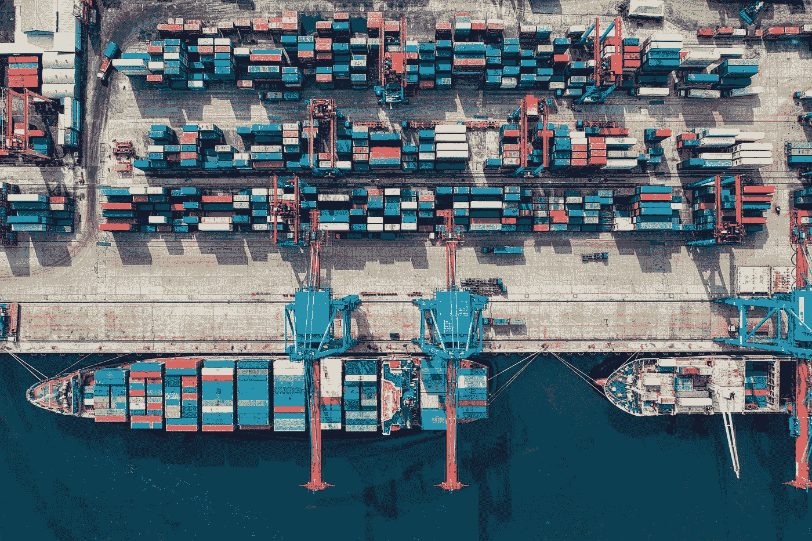
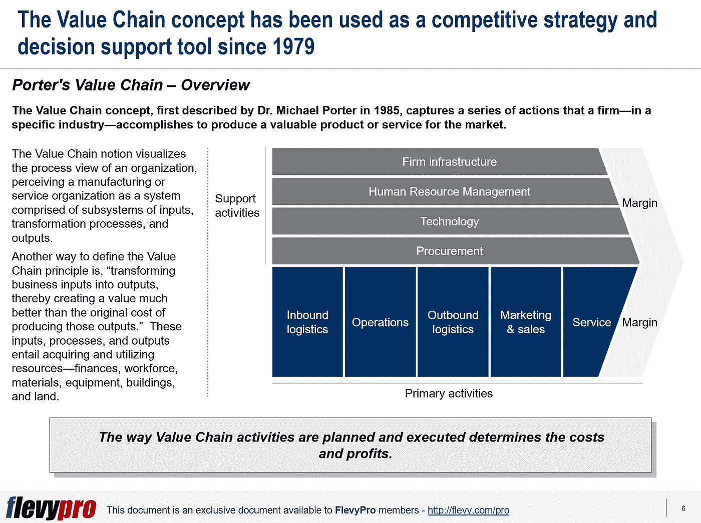

# 如何使用波特的价值链来识别成本节约和差异化机会？

> 原文：<https://medium.datadriveninvestor.com/how-to-use-the-porters-value-chain-in-identifying-cost-savings-and-differentiation-opportunities-c728cdb0501c?source=collection_archive---------6----------------------->

价值链的概念是由迈克尔·波特博士在 1985 年首次提出的，它是一个特定行业的公司为向市场提供有价值的产品或服务而完成的一系列活动。价值链概念将组织的流程视图可视化，将制造或服务组织视为由输入、[转换](https://flevy.com/browse/stream/transformation)流程和输出子系统组成的系统。

定义价值链原理的另一种方式是，“将业务投入转化为产出，从而创造比生产这些产出的原始成本更好的价值。”这些输入、过程和输出需要获取和利用资源——资金、劳动力、材料、设备、建筑和土地。

产业价值链包括提供投入的供应商、企业的产品创造、分销价值链，直到产品到达客户手中。价值链活动的计划和执行方式决定了成本和利润。

价值链由一系列活动组成，产品必须经历这些活动才能增加价值。这些活动可以分为两类:

*   主要活动
*   次要活动

[波特价值链](https://flevy.com/browse/flevypro/strategy-classics-porters-value-chain-4058)中的主要活动与产品或服务的生产、销售、维护和支持相关，包括:

*   进货后勤
*   操作
*   外向物流
*   营销和销售
*   服务

波特价值链中的次要活动和过程支持主要活动。例如:

*   采购
*   人力调配
*   技术发展
*   基础设施

# 价值链分析的好处

价值链分析有许多好处，包括:

*   识别瓶颈并快速改进
*   根据市场和竞争的变化进行微调的机会
*   展现一个组织的真正需求
*   成本降低
*   竞争差异化
*   提高盈利能力和业务成功
*   提高效率
*   减少浪费
*   以更低的成本交付高质量的产品
*   零售商可以监控整个过程中的每一个动作，从产品创造到储存和配送给顾客。

# 价值链分析(VCA)方法

寻求竞争优势的企业经常求助于价值链模型，以确定生产周期中成本节约和差异化的机会。[价值链分析(VCA)](https://flevy.com/browse/flevypro/strategy-classics-porters-value-chain-4058) 流程包括以下 3 个步骤:

*   **活动分析**
*   **价值分析**
*   **评估与规划**

# 活性分析

价值链分析的第一步需要确定为了提供产品或服务所必须进行的活动。这一阶段的主要活动包括:

*   在流程图上直观地列出服务客户所必需的关键流程，例如营销、销售、接单、配送和支持，以便更好地理解。
*   要做到这一点，应该让整个团队参与进来，收集丰富的反馈，并让他们支持随后做出的决策。
*   列出其他重要的非面向客户的流程，例如，聘用对组织至关重要的技能人员，激励和发展他们，或者选择和利用技术来获得竞争优势。
*   这个阶段还需要收集客户对组织的产品或服务以及持续改进方法的意见。

# 价值分析

价值链分析的第二阶段需要确定每项创造最大价值的主要活动所需的任务。这一阶段的特点是:

*   确定第一阶段确定的每个具体活动的关键行动。
*   思考“价值因素”——客户对每项活动执行方式的赞赏。
*   例如，对于订单处理流程，客户重视对他们的呼叫的快速响应、礼貌的行为、正确的订单输入、对查询的迅速响应以及问题的快速解决。
*   在流程图的每项活动旁边引用价值因素。
*   记下每个价值因素下要完成的关键行动或要做出的改变。

有兴趣了解价值链分析方法的其他阶段吗？你可以在 [Flevy 文档市场](https://flevy.com/browse)的这里[下载一个关于**经典战略:波特的价值链**的可编辑幻灯片。](https://flevy.com/browse/flevypro/strategy-classics-porters-value-chain-4058)

## 你在这个框架中找到价值了吗？

您可以从 [FlevyPro 库](https://flevy.com/pro/library)下载关于这个和数百个类似业务框架的深入介绍。 [FlevyPro](https://flevy.com/pro) 受到 1000 名管理顾问和企业高管的信任和使用。有些人不得不说:

> “我的 FlevyPro 订阅为我提供了当今市场上最受欢迎的框架和平台。它们不仅增加了我现有的咨询和辅导产品和服务，还让我跟上了最新的趋势，为我的实践激发了新产品和服务，并以其他解决方案的一小部分时间和金钱教育了我。我强烈推荐 FlevyPro 给任何认真对待成功的顾问。”

–战略商业建筑师事务所创始人比尔·布兰森

> “作为一家利基战略咨询公司，Flevy 和 FlevyPro 框架和文件是一个持续的参考，有助于我们为客户构建我们的调查结果和建议，并提高他们的清晰度、力度和视觉效果。对我们来说，这是增加我们影响力和价值的宝贵资源。”

–Cynertia Consulting 的咨询区域经理 David Coloma

> “作为一个小企业主，FlevyPro 提供的资源材料已被证明是非常宝贵的。根据我们的项目事件和客户要求按需搜索材料的能力对我来说很棒，并证明对我的客户非常有益。重要的是，能够针对特定目的轻松编辑和定制材料有助于我们进行演示、知识共享和工具包开发，这是整个计划宣传材料的一部分。虽然 FlevyPro 包含任何咨询、项目或交付公司都必须拥有的资源材料，但它是小公司或独立顾问工具箱中必不可少的一部分。”

–变革战略(英国)董事总经理迈克尔·达夫

> “作为一名独立的成长顾问，FlevyPro 对我来说是一个很好的资源，可以访问大量的演示知识库来支持我与客户的合作。就投资回报而言，我从下载的第一个演示文稿中获得的价值是我订阅费用的好几倍！这些资料的质量让我能够打出超出自己体重的水平，这就像是用很小一部分开销就能获得四大咨询公司的资源一样。”

–Roderick Cameron，SGFE 有限公司的创始合伙人

> “我每个月都会浏览几次 FlevyPro，寻找与我面临的工作挑战相关的演示文稿(我是一名顾问)。当主题需要时，我会进一步探索，并从 Flevy 市场购买。在所有场合，我都阅读它们，分析它们。我采纳与我的工作最相关和最适用的想法；当然，所有这些都转化为我和我的客户的利益。"

量子 SFE 公司首席执行官奥马尔·埃尔南·蒙特斯·帕拉

在 [**管理和企业咨询**](https://app.ddichat.com/category/management-and-corporate-consulting) **:** 中安排一个 DDIChat 会话

 [## 专家-管理和企业咨询- DDIChat

### DDIChat 允许个人和企业直接与主题专家交流。它使咨询变得快速…

app.ddichat.com](https://app.ddichat.com/category/management-and-corporate-consulting) 

在此申请成为 DDIChat 专家[。
与 DDI 合作:](https://app.ddichat.com/expertsignup)[https://datadriveninvestor.com/collaborate](https://datadriveninvestor.com/collaborate)在此订阅 DDIntel [。](https://ddintel.datadriveninvestor.com/)