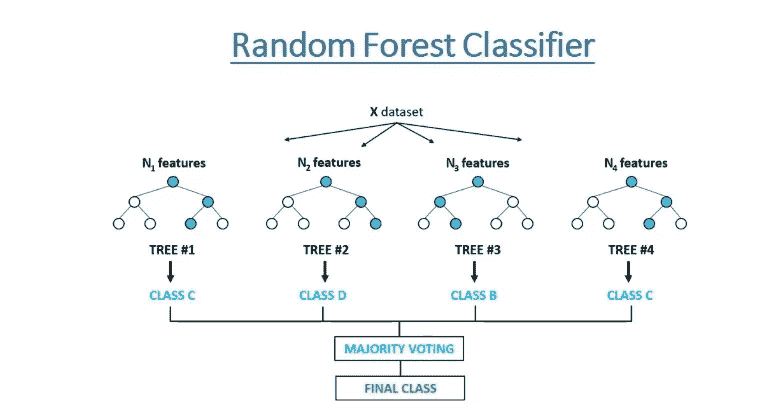

# 如何使用基于树的算法进行机器学习

> 原文：<https://medium.datadriveninvestor.com/how-to-use-tree-based-algorithms-for-machine-learning-9da624c75755?source=collection_archive---------7----------------------->

## 使用和理解随机森林算法的指南


基于树的算法是用于解决监督学习问题的流行的机器学习方法。这些算法非常灵活，可以解决手边的任何类型的问题(分类或回归)。

基于树的算法在对其所属区域的训练样本进行预测时，倾向于使用连续特征的**均值**或分类特征的**模式**。他们还产生具有**高精度**、**稳定性**、**易解释**的预测。

# 基于树的算法的例子

您可以使用不同的基于树的算法，例如

*   决策树
*   随机森林
*   梯度推进
*   引导聚集

所以每个数据科学家都应该学习这些算法，并在他们的机器学习项目中使用它们。

在本文中，您将了解更多关于随机森林算法的内容。完成本文后，您应该能够熟练使用随机森林算法，通过 scikit-learn 解决和构建分类问题的预测模型。

# 什么是随机森林？

随机森林是最流行的基于树的监督学习算法之一。它也是最灵活、最容易使用的。

该算法可用于解决分类和回归问题。随机森林倾向于组合数百个**决策树** ，然后在不同的观察样本上训练每个决策树。

随机森林的最终预测是通过对每棵树的预测进行平均而得到的。

随机森林的好处很多。单个决策树倾向于**过度适应**训练数据，但是随机森林可以通过**平均**来自不同树的预测结果来缓解这个问题。这使得随机森林比单个决策树具有更高的预测准确性。

随机森林算法还可以帮助您在数据集中找到重要的要素。它是 [Boruta 算法](https://towardsdatascience.com/boruta-explained-the-way-i-wish-someone-explained-it-to-me-4489d70e154a)的基础，该算法选择数据集中的重要特征。

随机森林已经在各种应用中使用，例如在电子商务中向客户提供不同产品的推荐。

在医学上，可以使用随机森林算法，通过分析患者的病历来识别患者的疾病。

此外，在银行部门，它可用于轻松确定客户是欺诈性的还是合法的。

# 随机森林算法是如何工作的？

随机森林算法通过完成以下步骤来工作:

**步骤 1** :算法从提供的数据集中选择随机样本。

**第二步:**算法会为每个选中的样本创建一个决策树。然后，它将从创建的每个决策树中获得一个预测结果。

**步骤 3: V** 然后对每个预测结果进行投票。对于一个分类问题，它会使用**模式**，对于一个回归问题，它会使用**均值**。

**步骤 4** :最后，算法将选择投票最多的预测结果作为最终预测。



How It works

# 实践中的随机森林

现在您已经知道了随机森林算法的来龙去脉，让我们构建一个随机森林分类器。

我们将使用 Pima Indians 糖尿病数据集构建一个随机森林分类器。皮马印第安人糖尿病数据集包括根据提供的医疗细节预测 5 年内糖尿病的发病。这是一个二元分类问题。

[](https://www.datadriveninvestor.com/2020/08/27/what-is-a-data-catalog-and-how-does-it-enable-machine-learning-success/) [## 什么是数据目录，它如何使机器学习取得成功？数据驱动的投资者

### 数据目录是机器学习和数据分析的燃料。没有它，你将不得不花费很多…

www.datadriveninvestor.com](https://www.datadriveninvestor.com/2020/08/27/what-is-a-data-catalog-and-how-does-it-enable-machine-learning-success/) 

我们的任务是在 Pima Indian 糖尿病数据集上分析并创建一个模型，以预测特定患者在给定其他独立因素的情况下是否有患糖尿病的风险。

我们将从导入重要的包开始，我们将使用这些包来加载数据集并创建随机森林分类器。我们将使用 [scikit-learn](http://scikit-learn.org/stable/tutorial/index.html) 库来加载和使用随机森林算法。

```
# import important packages
import numpy as np
import pandas as pd
import matplotlib.pyplot as plt
import seaborn as sns

%matplotlib inline

from sklearn.model_selection import train_test_split
from sklearn.ensemble import RandomForestClassifier
from sklearn.metrics import accuracy_score
from sklearn.preprocessing import StandardScaler, MinMaxScaler
import pandas_profiling

from matplotlib import rcParams
import warnings

warnings.filterwarnings("ignore")

# figure size in inches
rcParams["figure.figsize"] = 10, 6
np.random.seed(42)
```

# 资料组

然后从数据目录加载数据集:

```
# Load dataset
data = pd.read_csv("../data/pima_indians_diabetes.csv") 
```

现在我们可以观察数据集的样本。

```
# show sample of the dataset
data.sample(5)
```


如您所见，在我们的数据集中，我们有不同的带有数值的要素。

让我们来了解一下该数据集中的要素列表。

```
# show columns
data.columns
```


在该数据集中，有 8 个输入要素和 1 个输出/目标要素。缺失值被认为是用零值编码的。变量名的含义如下(从第一个到最后一个特征):

*   怀孕次数。
*   口服葡萄糖耐量试验中 2 小时的血浆葡萄糖浓度。
*   舒张压(毫米汞柱)。
*   三头肌皮褶厚度(毫米)。
*   2 小时血清胰岛素(μU/ml)。
*   体重指数(体重单位为千克/(身高单位为米))。
*   糖尿病谱系功能。
*   年龄(岁)。
*   类别变量(0 或 1)。

然后我们将数据集分成独立特征和目标特征。这个数据集的目标特性叫做**类。**

```
# split data into input and taget variable(s)

X = data.drop("class", axis=1)
y = data["class"]
```

# 预处理数据集

在我们创建模型之前，我们需要通过使用 scikit-learn 的`standardScaler`方法来标准化我们的独立特征。

```
# standardize the dataset
scaler = StandardScaler()
X_scaled = scaler.fit_transform(X)
```

点击[这里](https://towardsdatascience.com/how-and-why-to-standardize-your-data-996926c2c832)，你可以从这篇文章中了解更多关于如何以及为什么要标准化你的数据。

# 将数据集拆分为训练数据和测试数据

现在，我们将处理过的数据集分成训练数据和测试数据。测试数据将占整个已处理数据集的 10%。

```
# split into train and test set
X_train, X_test, y_train, y_test = train_test_split(
    X_scaled, y, stratify=y, test_size=0.10, random_state=42
)
```

# 构建随机森林分类器

现在是时候创建我们的随机森林分类器，然后在训练集上训练它。我们还将通过名为 **n_estimators 的参数传递我们想要使用的森林中的树木数量(100)。**

```
# create the classifier
classifier = RandomForestClassifier(n_estimators=100)

# Train the model using the training sets
classifier.fit(X_train, y_train)
```


上面的输出显示了在训练数据的训练过程中使用的随机森林分类器的不同参数值。

经过训练后，我们可以对测试数据进行预测。

```
# predictin on the test set
y_pred = classifier.predict(X_test)
```

然后，我们使用测试数据中的实际值和预测值来检查准确性。

```
# Calculate Model Accuracy
print("Accuracy:", accuracy_score(y_test, y_pred))
```

精确度:0.801948051948052

我们的准确率在 80.5%左右，这是不错的。但我们总能让它变得更好。

# 识别重要特征

我之前说过，我们也可以通过使用 scikit-learn 中随机森林算法的 **feature_importances_** 变量来检查重要特性。

```
# check Important features
feature_importances_df = pd.DataFrame(
    {"feature": list(X.columns), "importance": classifier.feature_importances_}
).sort_values("importance", ascending=False)

# Display
feature_importances_df
```


Important Features

上图显示了特征的相对重要性及其对模型的贡献。我们还可以使用 seaborn 和 matplotlib 库来可视化这些特性及其得分。

```
# visualize important featuers

# Creating a bar plot
sns.barplot(x=feature_importances_df.feature, y=feature_importances_df.importance)
# Add labels to your

plt.xlabel("Feature Importance Score")
plt.ylabel("Features")
plt.title("Visualizing Important Features")
plt.xticks(
    rotation=45, horizontalalignment="right", fontweight="light", fontsize="x-large"
)
plt.show()
```


从上图中，您可以看到**三头肌 _ 皮褶 _ 厚度特征**的重要性较低，对预测没有太大贡献。

这意味着我们可以删除此功能，并再次训练我们的随机森林分类器，然后看看它是否可以提高测试数据的性能。

```
# load data with selected features
X = data.drop(["class", "triceps_skinfold_thickness"], axis=1)
y = data["class"]

# standardize the dataset
scaler = StandardScaler()
X_scaled = scaler.fit_transform(X)

# split into train and test set
X_train, X_test, y_train, y_test = train_test_split(
    X_scaled, y, stratify=y, test_size=0.10, random_state=42
```

我们将使用从数据集中选择的已处理要素来训练随机森林算法，执行预测，然后确定模型的准确性。

```
# Create a Random Classifier
clf = RandomForestClassifier(n_estimators=100)

# Train the model using the training sets
clf.fit(X_train, y_train)

# prediction on test set
y_pred = clf.predict(X_test)

# Calculate Model Accuracy,
print("Accuracy:", accuracy_score(y_test, y_pred))
```

精确度:0.81818181818182

现在，在我们移除了最不重要的特征*triceps _ skin fold _ thickness*之后，模型精度从 **80.5%** 提高到了 **81.8%** 。

这表明检查重要的特征并查看是否可以移除最不重要的特征以提高模型的性能是非常重要的。

# 包扎

基于树的算法对于每个数据科学家来说都是非常重要的。在本文中，您了解了基于树的算法的基础，以及如何使用随机森林算法创建分类模型。

我还建议你尝试其他类型的基于树的算法，比如[额外树算法](https://scikit-learn.org/stable/modules/generated/sklearn.ensemble.ExtraTreesClassifier.html#sklearn.ensemble.ExtraTreesClassifier)。

你可以在这里下载本文用到的数据集和笔记本:[https://github . com/Davisy/Random-Forest-class ification-Tutorial](https://github.com/Davisy/Random-Forest-classification-Tutorial)

恭喜你，你已经完成了这篇文章的结尾！

如果你学到了新的东西或者喜欢阅读这篇文章，请分享给其他人看。在那之前，下期帖子再见！也可以通过推特 [@Davis_McDavid](https://twitter.com/Davis_McDavid) 联系到我

本文首次发表于 [freecodecamp](https://www.freecodecamp.org/news/how-to-use-the-tree-based-algorithm-for-machine-learning/) 。

***最后一件事:*** *在以下链接中阅读更多类似这样的文章。*

[](https://towardsdatascience.com/14-lesser-known-impressive-features-of-scikit-learn-library-e7ea36f1149a) [## Scikit 学习库的 14 个鲜为人知的令人印象深刻的特性。

### scikit 学习库中经常未知和被低估的功能示例。

towardsdatascience.com](https://towardsdatascience.com/14-lesser-known-impressive-features-of-scikit-learn-library-e7ea36f1149a) [](https://chatbotslife.com/how-to-use-texthero-to-prepare-a-text-based-dataset-for-your-nlp-project-734feea75a5a) [## 如何使用 Texthero 为您的 NLP 项目准备基于文本的数据集

### 一个简单的 python 工具包，可以快速、轻松地处理基于文本的数据集。

chatbotslife.com](https://chatbotslife.com/how-to-use-texthero-to-prepare-a-text-based-dataset-for-your-nlp-project-734feea75a5a) [](https://medium.com/analytics-vidhya/15-undiscovered-open-source-machine-learning-frameworks-you-need-to-know-in-2020-77ad6e6f109d) [## 2020 年你需要知道的 15 个未被发现的开源机器学习框架。

### 在你的下一个机器学习项目中有用的 ML 框架。

medium.com](https://medium.com/analytics-vidhya/15-undiscovered-open-source-machine-learning-frameworks-you-need-to-know-in-2020-77ad6e6f109d) 

**访问专家视图—** [**订阅 DDI 英特尔**](https://datadriveninvestor.com/ddi-intel)