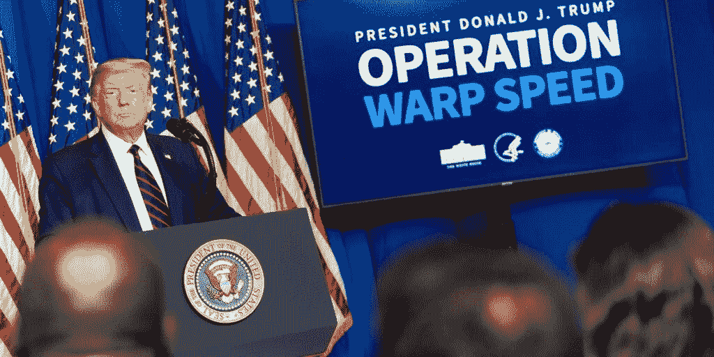
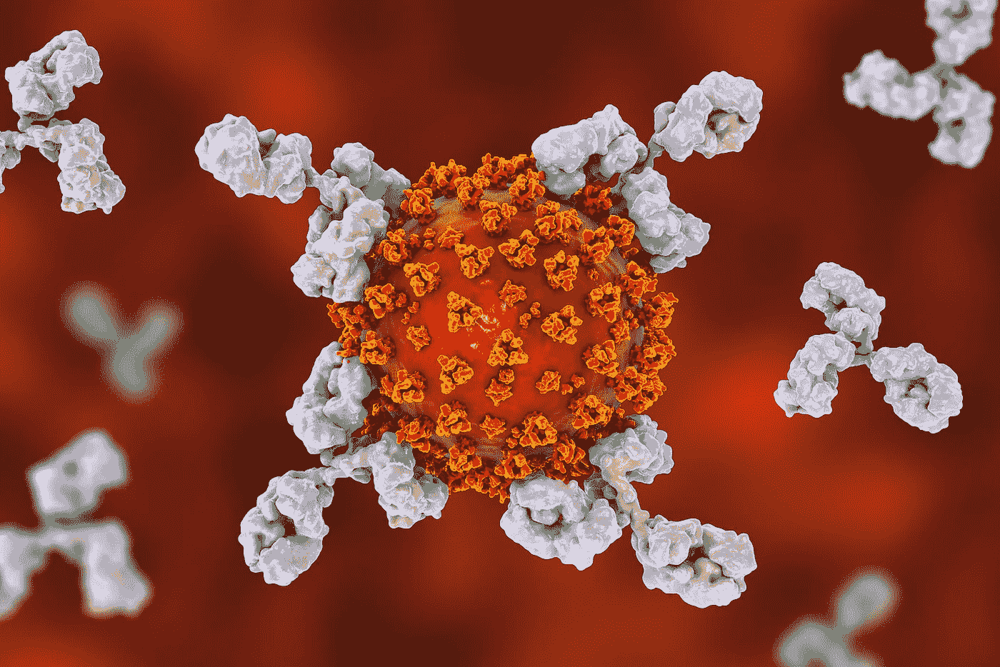
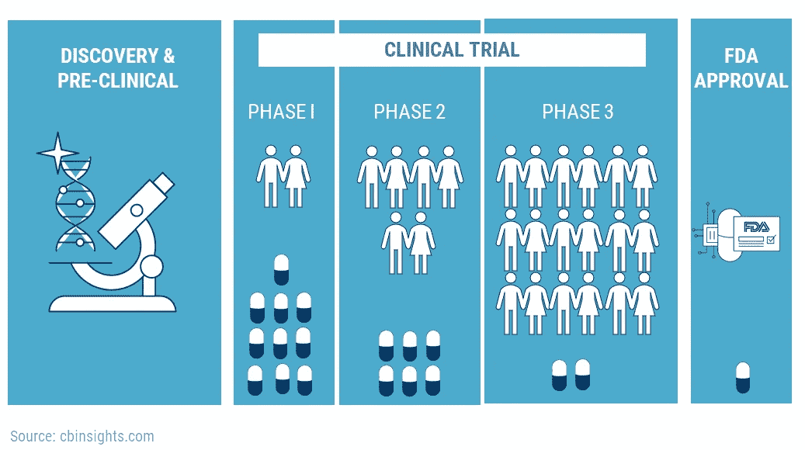
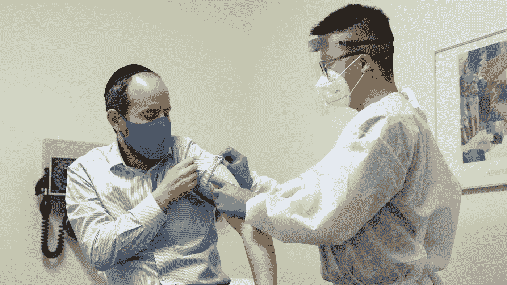

# 如何给整个国家接种疫苗

> 原文：<https://medium.datadriveninvestor.com/how-to-vaccinate-an-entire-country-7e5e72a5211c?source=collection_archive---------24----------------------->

## 公司竞相开发一种有效的疫苗，这将成就还是毁灭我们的经济？

1650 万曾经有过 COVID 的人。

30 万**死**。

[而这只是在美国](https://www.nytimes.com/interactive/2020/us/coronavirus-us-cases.html)。

*辉瑞*，领先的 COVID 疫苗公司之一，最近被[授权](https://www.cnn.com/2020/12/21/europe/pfizer-biontech-covid-19-vaccine-eu-authorization-intl/index.html)发行他们的疫苗。他们正面临着一些分发的撤回，但正在努力让它对公众开放。

> 问题是:找到安全和速度之间的完美平衡

## 运行翘曲速度

由于疫情的紧迫性，白宫已经启动了“曲速行动”,为加快分发进程提供资金。

像辉瑞制药和现代制药这样的公司正在研发一种疫苗，他们希望这种疫苗能尽快在世界范围内推广，但是这种疫苗仍在临床试验阶段。

在这种情况下，制药公司正专注于开发 mRNA 疫苗。

## 疫苗是如何工作的？

在传统的免疫接种中，注射包含进入体内的病毒的弱化形式。这触发免疫系统产生抗体。

与传统方法不同，mRNA 疫苗方法不需要向患者体内注射病毒来产生抗体。

***抗体*** 是一种特殊的蛋白质，像锁和钥匙一样绑定到身体的入侵者——包括病毒、细菌、真菌或寄生虫。它们在免疫系统中的任务是标记敌人并消灭它。

疫苗的 mRNA 方法将指令编码成一串合成的 mRNA，指示如何产生抗体来击败病毒。信使核糖核酸(mRNA)是一种分子，它将指令传输到细胞中产生蛋白质的部分。一旦被诱导，mRNA 就会复制这些抗体。

传统疫苗需要人体内的病毒来产生抗体。然而，mRNA 疫苗不需要人体系统内的病毒。

任何世界监管机构从未批准这种新的疫苗。

尽管如此，还是有一些优势:

*   系统中没有病毒的风险
*   更容易制造

美国政府从辉瑞和[从 Moderna](https://www.cnbc.com/2020/08/11/trump-says-us-has-reached-deal-with-moderna-for-100-million-doses-of-coronavirus-vaccine.html) 分别预购了 [1 亿剂和](https://www.cnbc.com/2020/07/22/us-government-taps-pfizer-to-produce-millions-of-doses-of-coronavirus-vaccine.html)1 亿剂，都是在 2020 年。

然而，这两种疫苗都在进行临床试验。

## 阶段

疫苗在获得 FDA 批准之前，通常会经历三个阶段的临床试验。

**第一阶段**在一小组健康人群中测试疫苗，以确保药物足够安全，可以进入第二阶段。

第二阶段有 100 名志愿者。第二阶段的目标是监测身体系统，并持续跟踪风险和副作用。

**第三阶段**是在数千人身上进行的。研究人员正在监测疫苗的安全性和有效性。第三阶段的一半人注射安慰剂，另一半人注射疫苗。

安慰剂是一种药片、针剂或看起来是药物治疗，但实际上不是。这是一种“假”疗法，用于临床试验，以测试“真”疗法(即疫苗)的有效性。

志愿者被随机分配安慰剂或疫苗。这创造了一个无偏见的试验，因为研究人员也不知道谁注射了什么。

第三阶段的过程是最艰难的阶段，持续 1-3 年。

 [## 新冠肺炎期间股票交易的 9 个教训|数据驱动的投资者

### 在你浏览之前，让我告诉你一些关于我自己的情况。我是…

www.datadriveninvestor.com](https://www.datadriveninvestor.com/2020/12/09/9-lessons-learned-about-stock-trading-during-covid-19/) 

## 分配

Moderna 的首席执行官 Stephan Bancel 指出，疫苗试验和疫苗分发的最佳情况将于 2020 年 10 月开始，最差情况将于 2020 年 12 月开始。

班塞尔先生，十二月就要过去了…

由于疫情的紧迫性，许多科学家期待 FDA 通过紧急使用授权批准一些疫苗的更广泛使用。

然而，紧急使用授权并不等同于完全批准。它的门槛更低，通过审批过程所需的文书工作也更少。这并不意味着疫苗不可信。它仍然经过严格的试验，以确保疫苗是可靠的。

尽管 mRNA 疫苗更容易制造，但难题在于疫苗的大规模销售。像 Moderna 这样的公司无法在如此有限的时间内为全世界生产足够的剂量。

为了保证疫苗能够到达世界大部分地区，制药公司计划在疫苗试验完成之前生产疫苗。这被认为是*制造风险*。这是一个不确定的命题；如果疫苗试验不成功，工厂将不得不销毁昂贵的疫苗。

由于剂量有限，疫苗接种过程更具选择性。据专家称，该疫苗将首先给予那些感染病毒的高风险人群。

尽管如此，首要任务是公平地接种疫苗并确保疫苗的安全性。

事实上，专家认为该疫苗将获得 FDA 批准，并于 2021 年第一季度开始销售。

值得注意的是，怀疑政府的社区可能会阻碍群体免疫的实现。这加剧了对疫苗的不信任，并可能推迟免疫接种。

随着病毒的快速变异和进化，科学家们能够跟上开发疫苗的步伐吗？

人们只能乐观。

# 个人笔记

希望你喜欢阅读！查看我的[**LinkedIn**](https://www.linkedin.com/in/fatimah-hussain/)[**insta gram**](https://www.instagram.com/fxtimxhh/?hl=en)，关注我的 [**中**](/@fatimahandhussain) 。我最近发布了我的 [**个人网站**](https://fatimahhussain.com) ，看看吧！当我写这些文章的时候，我总是付出 100%的努力和奉献，所以我希望你过得愉快！敬请关注，点击关注按钮，获取每周更新和引人入胜的文章！

## 访问专家视图— [订阅 DDI 英特尔](https://datadriveninvestor.com/ddi-intel)