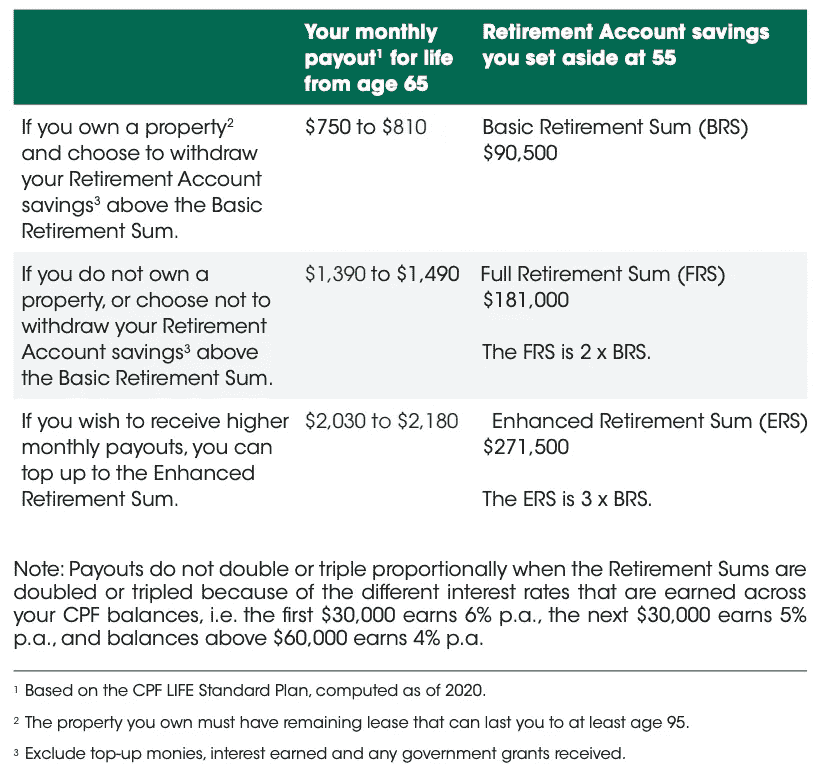
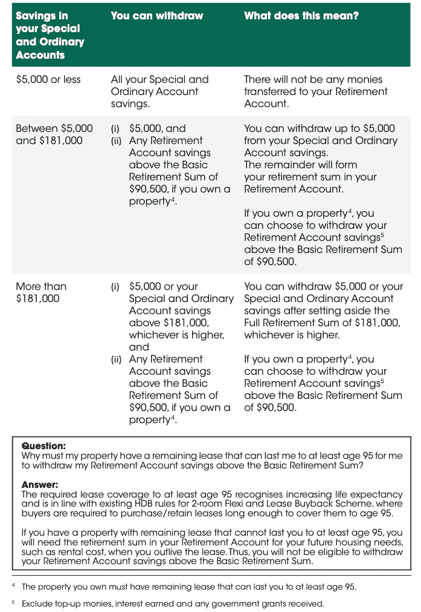

# 如何在 55 岁时从中央公积金提款的简单指南

> 原文：<https://medium.datadriveninvestor.com/how-to-withdraw-money-from-cpf-at-55-5ab34df6140a?source=collection_archive---------0----------------------->

## 尽管新加坡的养老金制度提供了拉降利率，但当你到 55 岁时，你如何才能提取这笔钱呢？或者你退休的时候，你会从公积金领取多少？

Photo by [Yeo Khee](https://unsplash.com/@yokeboy?utm_source=unsplash&utm_medium=referral&utm_content=creditCopyText) on [Unsplash](https://unsplash.com/s/photos/singapore?utm_source=unsplash&utm_medium=referral&utm_content=creditCopyText)

当你从 25 岁开始在新加坡工作，成为一名公关或公民，你很有可能在你的公积金中积累 290 万新加坡元，直到你 65 岁。由于特殊账户的高利率，在复合效应下，在新加坡工作和贡献 10 年、20 年或 30 年后，你可以在公积金中拥有巨大的财富。可以阅读 [<如何优化并拥有 100 万新币的公积金>](https://www.fasttrack.life/blog/how-to-optimize-and-have-sgd-1-million-in-cpf) 看看如何优化并拥有百万的公积金。

经过多年的积累，接下来的问题是，到了 55 岁，到了退休的时候，怎么把钱拿出来。让我们具体情况具体分析。

# 55 岁时提取，退休时支付

2022 年，新加坡的退休年龄将提高到[女性 63 岁，男性 68 岁](https://www.mercer.com/our-thinking/law-and-policy-group/singapore-to-increase-retirement-reemployment-ages.html#:~:text=The%20current%20retirement%20age%20is,63%20and%2068%20years%2C%20respectively.)。55 岁可以开始提取公积金，65 岁可以领取公积金支出。

当你到 55 岁时，中央公积金会为你设立一个退休账户。更好的是，你会收到中央公积金的一封信，让你对个人退休规划有一个全面的了解，这样你就知道你可以或应该把多少钱存入你的退休账户，以及当你退休时你的支出是多少。

# 什么是退休账户

退休账户是在你 55 岁的时候建立的。普通账户和特殊账户中的一些钱将被转到这个退休账户。当你到 65 岁时，退休金账户中的金额将成为你每月支出的来源。你存进退休账户的钱越多，每月的支出就越高。**只要你活着，每月的支出就永远存在。**

下表显示了当你 55 岁时，根据你在你的退休账户里存了多少钱，你每月能得到多少钱。根据新加坡目前的生活成本，如果你想在退休后保持高质量的生活，你肯定需要有额外的储蓄或投资来补充每月的支出。在这里，您可以查看您在中央公积金中的额外资金，任何超过 271，500 美元的金额。但是医疗储蓄账户是不能用的，它是用来支付你年老时的医疗费用的。

source: [https://www.cpf.gov.sg/Assets/members/Documents/CPF_Retirement_Planning_Booklet.pdf](https://www.cpf.gov.sg/Assets/members/Documents/CPF_Retirement_Planning_Booklet.pdf)

如果你读了 [<如何优化并让 100 万新币的中央公积金>](https://www.fasttrack.life/blog/how-to-optimize-and-have-sgd-1-million-in-cpf) 的文章和[下载的中央公积金计算电子表格](https://money.fasttrack.life/cpf)，你会发现，如果你做得对，即使你把最高的退休金存入退休账户，你也会有额外的 100 万或 200 万新币。

接下来，让我们看看如何从你的公积金中提取额外的钱

 [## 首次创业的 4 个资金管理技巧|数据驱动的投资者

### 超过 82%的企业倒闭是由于财务管理不善和现金流问题。开始新的…

www.datadriveninvestor.com](https://www.datadriveninvestor.com/2020/10/23/4-money-management-tips-for-first-time-entrepreneurs/) 

# 55 岁时提取公积金

如果不够，您可以从您的普通帐户和特殊帐户中提取资金来补充您的每月支出。但是你能提取的金额取决于你从 55 岁起在你的特殊账户和普通账户中有多少。下表为您提供了一个通用指南。

source: [https://www.cpf.gov.sg/Assets/members/Documents/CPF_Retirement_Planning_Booklet.pdf](https://www.cpf.gov.sg/Assets/members/Documents/CPF_Retirement_Planning_Booklet.pdf)

有三种情况

1.  **您的 OA 和 SA 中的存款少于 5000 美元**

你可以提取所有的钱，但是你将没有退休账户，这意味着当你 65 岁的时候，你的月支出为零。因为你的积蓄太少，无法形成年金。

**2。您的 OA 和 SA 节省在 5000 美元到 181，000 美元之间**

当务之急是把钱存入退休账户。

如果你没有房产，你最多只能提取 5000 美元，其余的需要进入退休账户。

如果你拥有一处房产，你最多可以提取 90，500 美元以上的金额。因为 90，500 美元是你需要在退休账户中留出的最低金额，以供你每月支付。你所拥有的房产必须有一份至少能让你活到 95 岁的剩余租约。

**3。OA 和 SA 的储蓄超过 181，00 美元** 0

这意味着您可以达到更高的支出层，因为您有足够的钱存入基于全额退休金(181，000 美元)或提高退休金(271，500 美元)的退休金账户。但这也取决于你是否拥有房产。

如果你没有房产，你首先需要在你的退休账户中留出 181，000 美元，然后你可以提取其余的。

如果你拥有一处房产，你可以选择保持在最低退休账户水平，将 90，500 美元存入你的退休账户，然后取出剩余部分。但你的月支出将处于最低水平(750 至 810 美元)。或者你可以留出更多的钱来达到全额退休金(181，000 美元)，并获得更高的月支出。然后你可以从你的 OA 和 SA 中取出剩下的。你所拥有的房产必须有一份至少能让你活到 95 岁的剩余租约。

主要目的是确保你首先把钱存进你的退休账户，然后再看看是否还有多余的钱可以取出来。

如果你根据我在上一篇文章 [<如何优化中提到的方法，在 SA 和 OA 中有足够的储蓄，并在 CPF >](https://www.fasttrack.life/blog/how-to-optimize-and-have-sgd-1-million-in-cpf) 中有 100 万新币，你可以轻松地将 181，000 美元存入你的退休账户。退休账户的利率甚至比普通的公积金账户还要高:OA(2.5%)，SA(4%)，MS (4%)。

退休账户的利率:

前 30，000 美元每年 6%

接下来的 30，000 美元每年 5%

其余的每年 4%。

# 撤回过程

一旦你达到了标准和金额，从你的中央公积金中取钱就相对简单了。您需要有一个新加坡银行账户完成下面的过程，钱将被转移到您的银行账户。

第一步:[使用您在 cpf.gov.sg 的新加坡通行证在线申请](https://www.cpf.gov.sg/r55)

步骤 2:提交一份硬拷贝申请完成中央公积金网站上的表格，并提交给中央公积金委员会。

# 结论

当你年满 55 岁时，你将为你的晚年创建一个退休账户，以接收每月支出。你在退休账户里存的越多，你每月的支出就越高。当你在普通账户和特殊账户中有足够的存款时，在为退休账户留出钱后，如果你愿意，你可以提取这些钱。或者你可以把它们留在里面，以进一步积累利息，并在未来提取。这完全取决于你的个人情况和需求。显然，拥有一处房产可以降低你的退休账户金额，因为你不需要支付住房费用，但这些是达到最低标准的标准。如果你想在退休后过上舒适的生活，你需要提高你的公积金，存下额外的钱并进行长期投资来积累你的财富。

这不是财务建议，我提供的信息，你需要了解自己，并根据你自己的个人情况做出决定。我希望这篇文章能给你提供一些有用的信息。

**此处** **下载电子表格计算自己的养老金金额** [**。**](https://fantastic-creator-4488.ck.page/fa91d82dfd)

要了解更多关于金钱的技巧，请关注我的账号或收听我的播客，我们在这里讨论金钱、职业和企业家精神:[https://www.fasttrack.life/](https://www.fasttrack.life/)

相关文章: [<如何优化并拥有 100 万新币的公积金>](https://www.fasttrack.life/blog/how-to-optimize-and-have-sgd-1-million-in-cpf)

## 获得专家视图— [订阅 DDI 英特尔](https://datadriveninvestor.com/ddi-intel)