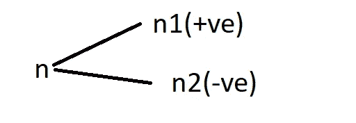
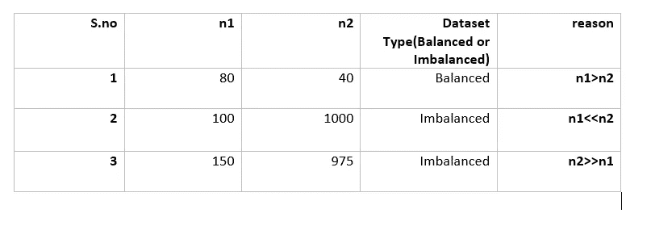

# 如何处理不平衡的数据集？

> 原文：<https://medium.datadriveninvestor.com/how-to-work-with-imbalanced-dataset-7fd188cafa89?source=collection_archive---------10----------------------->

在机器学习中，大多数时候我们处理的是不平衡的数据集。在知道如何处理它之前，让我们看看它是什么。

我们有两种类型的数据集平衡数据集和不平衡数据集。假设我们有两个类分类器 n1 和 n2，n1 是+ve 点和 n2 -ve 点。



和

```
n = n1 +n2
```



第一，我们在 n1 中有 80 个点，在 n2 中有 40 个点，这几乎是相似的，所以这是一个平衡的数据集。

[](https://www.datadriveninvestor.com/2019/01/23/which-is-more-promising-data-science-or-software-engineering/) [## 数据科学和软件工程哪个更有前途？数据驱动的投资者

### 大约一个月前，当我坐在咖啡馆里为一个客户开发网站时，我发现了这个女人…

www.datadriveninvestor.com](https://www.datadriveninvestor.com/2019/01/23/which-is-more-promising-data-science-or-software-engineering/) 

在第二和第三，n1 和 n2 之间有很大的差异，这就是为什么它是一个不平衡的数据集。

## 如何解决不平衡的数据集

处理不平衡的数据集是一项单调乏味的任务。但是有一些方法可以用来处理不平衡数据集。

*   **欠采样-** 欠采样是我们留下额外点数的一种方法。

即，在点 t0 处，我们分别有 100 和 1000 个点 n1 和 n2，因此我们从 n2 处留下 900 个点以使数据集不平衡。

但是这里有一点需要注意，我们已经离开了 900 个点，离开这么多点不是一个好主意，也会降低我们的精度

*   **过采样-** 过采样是一种创建人工点的方法。让我们以 3 为例，n1 和 n2 分别是 150 和 975。所以我们将为 n1 创建人工点。
*   **阶层权重-** 这是一种给少数阶层更多权重，给多数阶层更少权重的技术。

也就是说，我们有 100 +ve 和 900-ve 积分。所以我们将 900 个点分成两组，分别训练 700 个和测试 300 个。现在，我们再次将 700 个点分成 630 -ve 和 30+ve 点，同样的方法也适用于测试数据 270-ve 和 30+ve

**注:**我们可以用不平衡数据得到高精度，称为**哑模型。**

感谢阅读！！！

欢迎建议！！！

**参考文献:**

[https://www.appliedaicourse.com](https://www.appliedaicourse.com/)