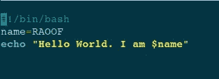
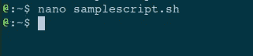
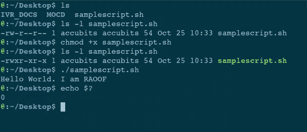
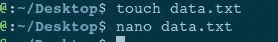
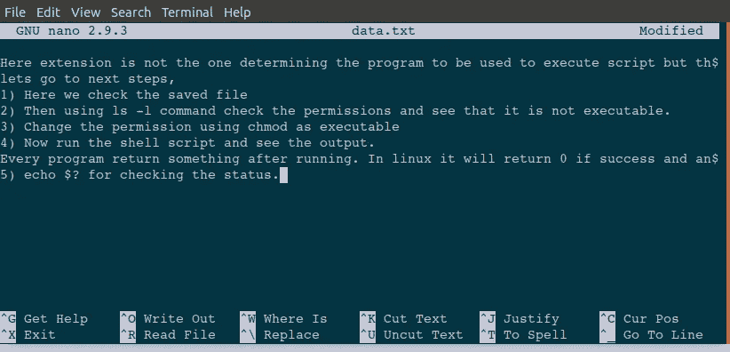
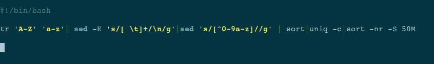
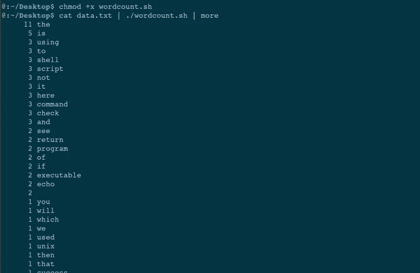

# 如何用例子写一个 shell 脚本

> 原文：<https://medium.datadriveninvestor.com/how-to-write-a-shell-script-with-examples-c31bbb6158fc?source=collection_archive---------6----------------------->

本教程介绍了如何编写一个 shell 脚本并使其工作！让我们开始吧。

hintworld.com — [Source](https://www.hintword.com/article/shell-script-5d41c8d98317b)

shell 脚本是包含许多命令的文件。让我们编写一个 shell 脚本。我们使用 nano 打开了一个 sh 文件，并编写了一些命令。

Generated By Author

这里，extension 不是决定用来执行脚本的程序，而是 shell 脚本的第一行。这是一个 unix shell。
让我们进入下一步，
1)在这里，我们检查保存的文件
2)然后使用`ls -l`命令检查权限，看它是否可执行。
3)使用`chmod`作为可执行文件更改权限
4)现在运行 shell 脚本并查看输出。

每个程序运行后都会返回一些东西。在 linux 中，如果成功，它将返回 0，如果不成功，它将返回一个错误号。您可以使用`echo $?`命令检查之前命令的代码

5) `echo $?`用于检查状态。

Generated By Author

# 字数统计的外壳脚本

让我们首先创建一个包含一些内容的 txt 文件。

Generated By Author

Generated By author

现在创建一个名为`wordcount.sh`的 sh 文件。使用 nano wordcount.sh 命令。

Generated By Author

这个 sh 文件做一些处理，比如使用管道 it
1)将 A-Z 转换为 A-Z`tr 'A-Z' 'a-z'`2)替换制表符和非字母数字`ed -E 's/[ \t]+/\n/g'|sed 's/[^0-9a-z]//g'`

3)计数排序取唯一和计数排序。`sort|uniq -c|sort -nr -S 50M`

现在你可以保存它了。然后你可以看到这样的结果。
保存后，我们将权限更改为可执行，然后使用管道将`data.txt`的输出与`wordcount.sh`文件和`more`一起以分页方式显示。

Generated By Author

感谢您的阅读和宝贵时间。希望这篇阅读是有用的。