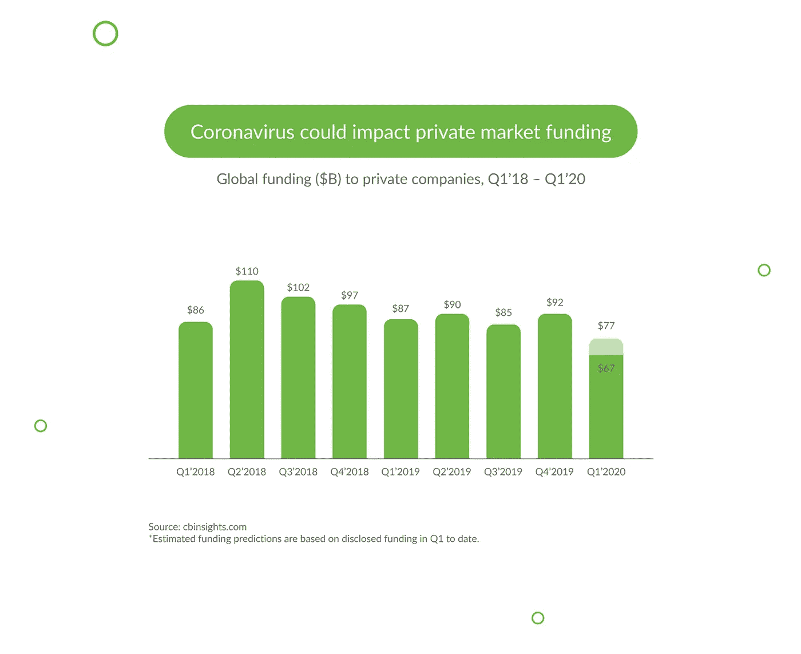
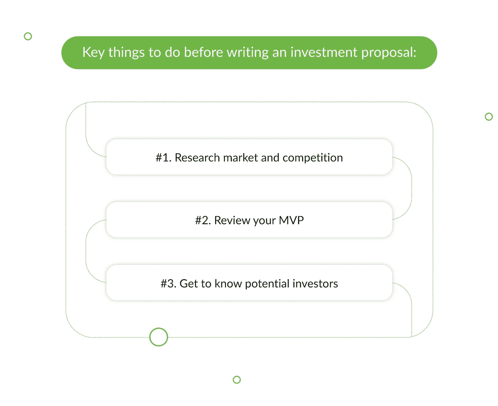
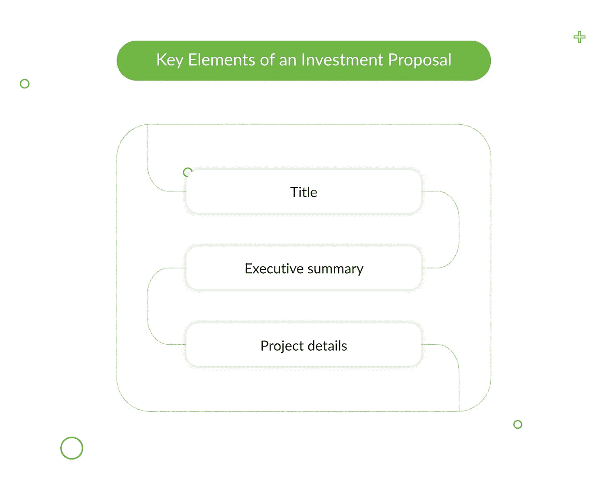
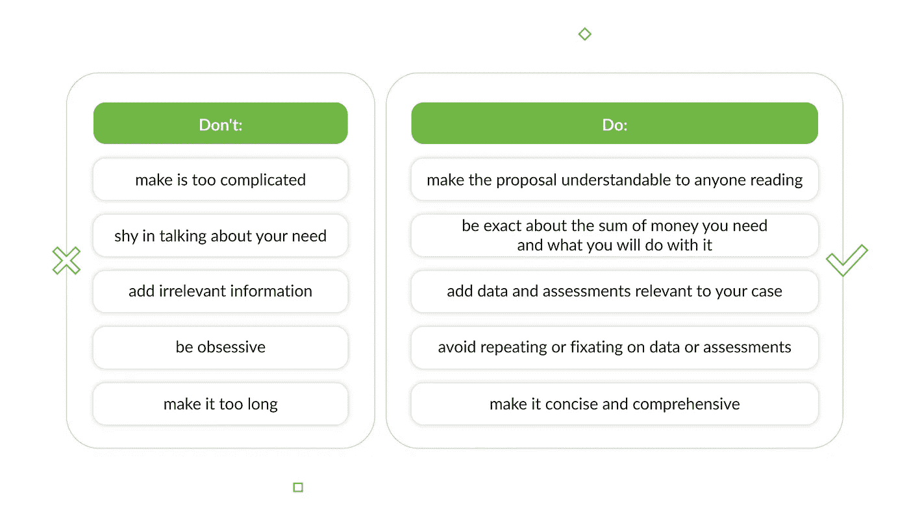
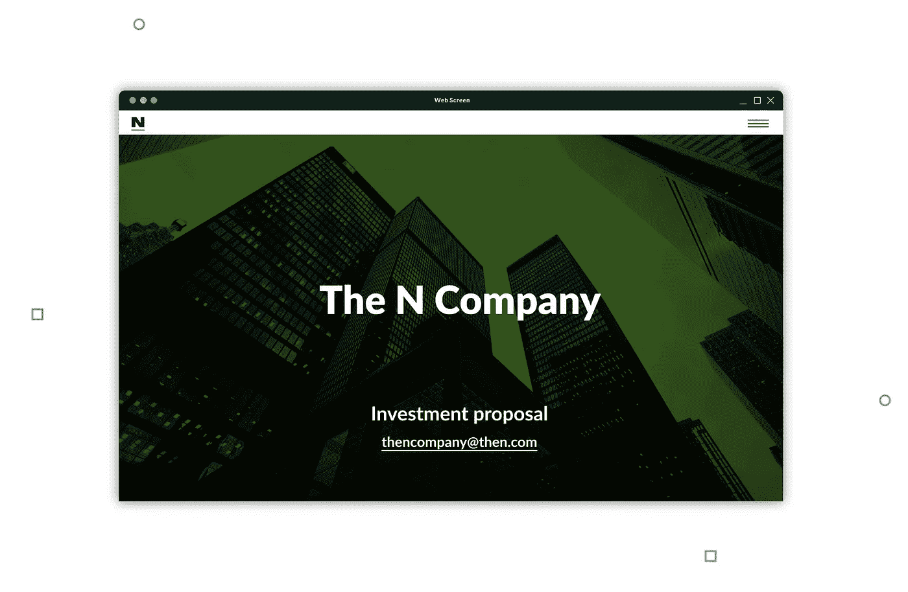
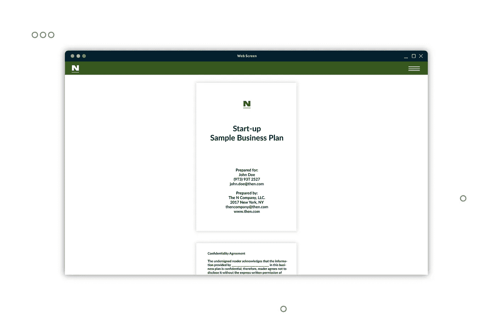

# 如何撰写投资建议书:一步一步的指南

> 原文：<https://medium.datadriveninvestor.com/how-to-write-an-investment-proposal-a-step-by-step-guide-f219219f81fb?source=collection_archive---------0----------------------->

大约三分之一的创业公司因为缺乏资金而失败。他们可能有出色的想法，但没有足够的资金支持来生存。

此外，COVID 正在显著改变初创企业的融资状况。正如我们在图表中看到的，预计 Q1 2010 年的私人市场融资将降至 770 亿美元，比 2019 年第四季度减少 16%以上，比 Q1 2010 年减少 12%。

这意味着金融行业变得越来越挑剔，竞争越来越激烈。但是不要把你的好主意束之高阁。一个令人信服的投资建议会给你一个很好的机会来获得你需要的资金。

但是如果你以前没有做过，你可能会有一堆问题。如何写好投资计划书？应该是多长或多短？你应该写些什么？

你会在这本指南中找到所有必要的信息。

> 这篇关于[如何撰写投资建议书的指南:一步一步的指南](https://djangostars.com/blog/writing-investment-proposal/)最初发布在 Django Stars 的博客上。由 Django Stars 的编辑团队撰写。

# 什么是投资建议书？

简而言之，投资提案是关于你的初创公司(产品或服务)的文本文档、PDF 或幻灯片演示，其目的是筹集资本。它对那些有钱并且可能有兴趣捐款的人很有吸引力。

 [## 利用股市相关性的最佳方式|数据驱动的投资者

### 当阿尔弗雷德·温斯洛·琼斯开创了世界上第一个“对冲”基金(后来“d”被去掉了)时，他让其他投资者大吃一惊…

www.datadriveninvestor.com](https://www.datadriveninvestor.com/2020/02/02/the-best-way-to-use-stock-market-correlations/) 

一份成功的投资提案会提供有力的论据，说明为什么你的初创公司值得投资，这需要在你开始写作之前做好准备。此外，提案应该在产品开发的[适当阶段](https://djangostars.com/blog/guide-mvp-mmp-mlp-mdp-map-startup-stages/)提交，也就是说，在 MVP 阶段。

# 写作前的必要准备

在你开始写投资建议书之前，你需要做好准备，并分阶段进行:

## #1.研究你的市场和竞争

一家初创公司的成功很大程度上取决于前期开发，或者说[发现阶段](https://djangostars.com/blog/discovery-phase-in-software-development/)。这是当你从市场分析中收集数据，并使用它来定义产品市场的适合度。发现阶段可以帮助您消除许多与意外开支、市场需求不足和其他潜在问题相关的风险。

让我们详细了解一下发现阶段的不同部分:

## 市场规模、潜力和竞争对手

发现阶段的一半是确定和界定你的细分市场、客户和产品需求以及竞争对手。这是这一过程中至关重要的一部分，因为它有助于你了解市场的规模和潜力，找到行业的差距，并确定你的产品与市场的契合度。除此之外，它还有一个好处，那就是它可以帮助你找出如何在竞争中胜出——你可能会把客户从竞争中吸引过来。

## 买家角色和客户之旅

发现阶段应该产生客户旅程图。这张地图是基于你的买家角色——会使用你的产品的人的营销化身——基本上确定了你的用户会与之互动的接触点。这是发现阶段的一个关键部分，因为顾客与你的产品的第一次接触会决定他们的体验。之后的每一次联系也是如此。

客户旅程图将帮助您预测您的买家角色可能会遇到的一些困难，找到解决这些困难的最佳方法，并帮助确保更好的用户体验。

## #2.回顾你的产品

如上所述，开始撰写投资建议书的最佳时间是当你有 MVP(最低可行产品)或产品的早期版本时，该版本具有足够的功能使其对用户可行，但仍需要一些开发工作和时间。在这个阶段，你也应该已经想好了你的商业目标和买家角色。

展示你的 MVP 将展示你对潜在观众的深刻理解，并证明你能满足他们的需求。

## #3.收集投资者的信息

首先，你应该确定你希望吸引哪些投资者。它们可以分为几个不同的类别:

*   **天使投资人和天使团体。**这些是高净值个人和团体，他们投资创业公司以换取股票，这使得他们对创业公司的成功投资不亚于获得回报。很多时候，他们也有丰富的创业经验，所以他们也可以辅导或辅导你。
*   **银行。**这些并不是初创公司最常见的投资来源，但一旦你的项目开始显示出进展(例如，通过赢得客户)，你仍然可以将你的建议提交给银行。
*   **风险投资公司。这些公司通常比天使投资人达成的交易更多，因为他们有更多的燃料来推动创业。你对风险资本的选择通常取决于你的地理位置，因为大多数风险资本都是平等的。**
*   **法人投资者。一些公司对资助初创公司感兴趣，将其作为获取新资产和识别新技术的一种方式，所有这些都可以帮助他们增加收入。**
*   **点对点和个人投资者。**这个群体可以包括你的近亲和熟人，P2P 贷款人，众筹平台。朋友和家人通常是名单上的第一批人，有时他们可以借给你一大笔钱。不过，你也可以直接去找潜在客户，发起一个众筹项目。

另一个资金来源是加速器项目，它有助于开发你的想法并获得牵引力。这些可以为你提供从$10K 到$12 万美元的种子资金，以及额外的创业资源，如行业或财务管理知识。

在确定投资者类型并形成目标实体列表后，您应该研究:

*   他们的主要领域或重点
*   如果他们打算冒险进入新的领域
*   他们已经资助了哪些项目
*   他们拒绝了什么项目，为什么
*   任何可能有用的其他公开信息(如采访、感兴趣的领域等。).

此外，记住你将为哪类投资者写作，并考虑写几份量身定制的提案。例如，如果你向银行家寻求帮助，他们会更多地投资于金融方面的事情，而天使投资者会想更多地了解你的财务和营销理念。

# 投资建议应该包括什么

如上所述，投资建议书可以是普通的文本文档，也可以是带图形的 PDF。它也可以是用 PowerPoint 或 Keynote 等软件创建的演示文稿。你的提案的格式很大程度上取决于你选择的投资者类型，但是三种格式都可以。

然而，**每个提案中都有一定的必备要素。他们是:**

## 投资名称

一切都从名字开始，你的提案也需要一个名字。理想情况下，它应该是几个词来描述未来产品或服务的价值以及您正在采取的方向，例如细分市场。

例子:*露营车预订平台*

朗朗上口并不一定意味着迷人。像我们的例子这样的标题直截了当—在这种情况下，您希望构建一个人们可以用来租赁露营车的平台。

## 行动纲要

给投资者的商业计划书以封面开始，然后是目录。文件的主体应该以执行摘要开始。在这份总结中，您应该包括您的价值主张，即传达有关您的目标客户、他们的问题、您提议的解决方案以及您的解决方案为客户和投资者带来的好处的简短陈述。

你应该马上提到你期望从所需投资中获得的投资回报率。讲述你作为一名企业家或你的公司的成功故事(如果有的话)也是很好的(如果你的初创公司是从一家成熟的企业发展而来的话),以进一步增强你对自己能力的信心。

保持现实，记住一个关键问题:这对投资者有什么好处？通过创造一个令人信服的提议，让你的提议大声喊出你的想法实际上可以赚钱。

## 项目详情

这一部分需要所有的事实和论据来支持你作为一个企业家，你的公司(如果你已经有了)和你的 MVP——特别是，你计划如何让它变得有生命力。

## 公司业绩

如果是现有的公司，包括业务描述，并提供历史和当前的财务数据。如果你还没有创业，分享你参与过并做出重大贡献的产品信息，当前项目的利益相关者及其成就，以及强调你的创业潜力的令人信服的市场统计数据。

## 计划营销和销售方法

在文件的这一部分，展示你对你的市场及其竞争所做的所有研究。

这一部分还应该概述你的营销策略和渠道，以及你的销售策略。这里的一个关键点可能是你为你的产品选择的定价模式，以及为什么它是最有利可图的一个理由。

## 运营团队后勤

另一个可以帮助潜在投资者对你的初创公司及其潜力形成积极看法的信息是你当前团队的结构——将实现你的目标的团队。这可能包括您企业的位置、您已经雇用/计划雇用的员工数量、启动和运行项目所需的设备和/或技术，以及任何适用的运营费用。

## 项目融资

看到这是提案的整个目标，确保你使用准确的数字，并包括大量的细节。这一部分应该详细说明资金来源、预测、时间框架、ROI 和投资退出计划。

退出策略是投资提案中的一个关键点，在两种情况下是必要的:

*   当企业满足预定的投资标准时；或者
*   当企业未能实现既定的利润目标时。

通常，这是一个应急计划，其中包含如果企业破产，如何限制财务损失的信息。

# 写投资建议书时要避免的事情

投资提案可能是任何初创公司的生命线，因此为你的案例提供令人信服的论据至关重要。同时，它必须直截了当，实事求是，突出你在你的领域的能力。我们已经讨论了如何让你达到目的，所以这里有一些你应该避免的事情:

*   不要让它变得复杂
    这篇文章应该让任何阅读它的人都能理解，而不仅仅是你的同龄人。此外，使用大量的行话或复杂的短语可能听起来像是你复制了信息，而不是用你自己的话来描述。简单的措辞也表明你可以和你的潜在客户平起平坐。如果别人不明白你在说什么，你如何吸引他们的注意力？
*   **不要害羞** 在谈论你需要的经济支持时，不要拐弯抹角。要明确你想筹集的资金数量，你将用它做什么，以及你为什么需要它。
*   避免无关信息只包含相关的信息。你的技能和经验可能令人印象深刻，但如果它们不能补充业务或提案，它们只会制造信息噪音。
*   不要执迷不悟不要专注于你在提案中提供的任何信息，因为这可能会被视为不专业。
*   **不要写得太长** 一份很长的提案可能根本看不下去。考虑到别人阅读和评估你的提议所需要的时间，以及你自己的时间。

# 三个不同的投资提案示例

这里有一些优秀的模板，你可以从中汲取灵感。

1)第一个[投资提案示例](https://templates.qwilr.com/Khr3ml2fStmI)是一个登录页面，附有对创业公司及其竞争优势的描述和说明。这家初创公司希望为小型企业开发发票软件。

2)第二个[创业投资提案](https://pitchdeckexamples.com/startups/investment-proposal-template)是一个演示文稿，可以向观众展示或以 PDF 格式发送。该模板提供了一些提示，告诉您可以在哪里插入自己的信息。

3)最后一种类型的投资建议书模板是作为商业计划的一部分而编写的传统文本文档。点击[此链接](https://images.sampletemplates.com/wp-content/uploads/2019/07/Start-up-Sample-Business-Plan-and-Investment-Proposal.zip)下载一个可编辑的模板。

# 结论

项目投资建议书是每个创业公司需要获得资金支持的关键文件。一个理想的提案提供准确的数据和预测，向投资者展示你的能力和盈利能力，最终回报他们的贡献。

如果你想增加你的项目成功的机会，不要急于创建一个提案。花点时间准备必要的信息，确保你根据普遍接受的指导方针写提案。毕竟，如果标题不够吸引人，投资者甚至可能不会去读它。因此，要特别注意提案的结构，只包括相关信息，对你的创业潜力做出积极而现实的评估。不要做抽象的陈述，计算要精确。