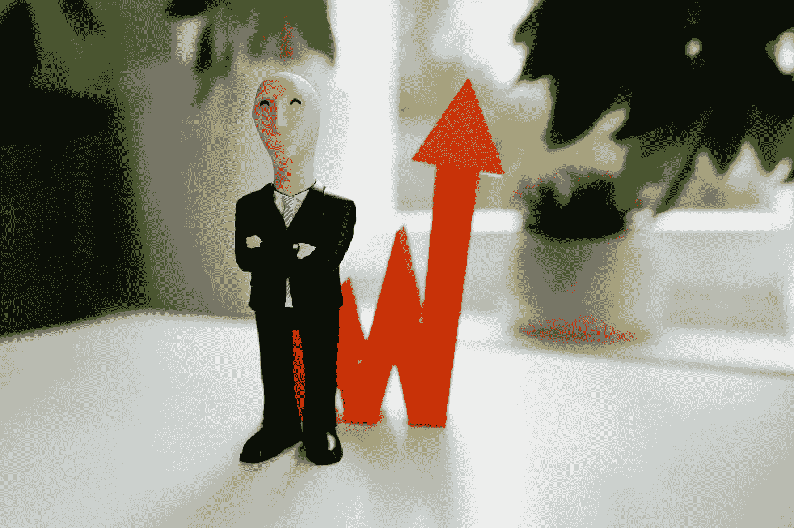
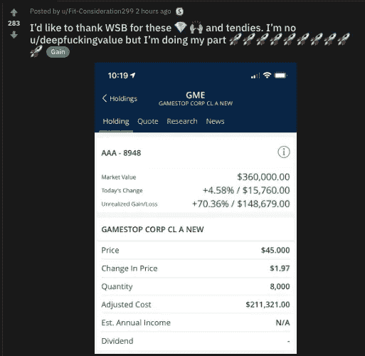
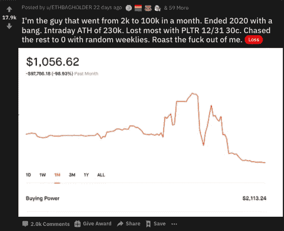

# 华尔街赌注如何影响股票市场

> 原文：<https://medium.datadriveninvestor.com/how-wall-street-bets-influences-the-stock-market-afb5bf538f7c?source=collection_archive---------10----------------------->

## 看看这个社区用 Gamestop 和黑莓股票做了什么

Photo by [Gilly](https://unsplash.com/@gillyberlin?utm_source=unsplash&utm_medium=referral&utm_content=creditCopyText) on [Unsplash](https://unsplash.com/s/photos/wall-street?utm_source=unsplash&utm_medium=referral&utm_content=creditCopyText)

任何投资者都知道股票泵的存在。这些泵所在的第一个社区在 Reddit 页面上，WallStreetBets。

这里有成千上万的会员，他们尽力鼓励其他投资者或交易者把他们的钱投向某些股票，因为他们希望价格上涨并从中获利。

有大量的人很少或根本不做尽职调查，把钱投在一些希望能赚钱的东西上。

对许多人来说，这导致了数千人的损失。对其他人来说，它回报巨大，让他们赚了很多钱。

股票市场有时除了上涨之外，不知道还能做什么，多亏了华尔街赌注，似乎一切皆有可能。

# WSB 光明的一面

$148,679 gain from WSB on $GME (Gamestop Stock)

从上面的图片中，你会看到这个人在 Gamestop 上下了大约 45，000 美元的注，因为很多人都在大肆宣传。事实证明，这是非常值得的！在市场上仅仅通过冒险就能赚到这么多钱，这太疯狂了。

看到你在交易中投入的几美元让你赚了一大笔钱，这种兴奋感会让你迷上交易。

它将所有这些疯狂的收益视为容易实现的事情，最终对许多在线交易者来说是最具破坏性的。

随着疫情的发生，如今除了看体育比赛、玩电子游戏或炒股，没有太多事情可做。似乎人们把他们的钱用作娱乐，而不是真正的投资，这对于很少或没有风险管理的人来说是非常危险的。

从负面来看，大风险也可能意味着大损失。我说的是荒谬的损失。这种损失会让你反胃，几天都不想吃东西。像这样的损失。

# WSB 的缺点

Trader who lost nearly 100k

在这里，你有一个交易者，他赚了很多钱，他的账户有了很大的增长，如果他想买特斯拉，他也可以买，但是他太贪婪了，没有做出最好的决定，结果被炒了。

你可以运气好，把什么都没有变成什么，但你也可以逆转，同样快地失去它，在某些情况下甚至更快。交易期权的好处在于，它比预先投入更多资金进行交易更方便，但失去这一切也同样方便，因为一旦合约到期，它们就会消失得无影无踪。

某一天看起来很棒的投资，让你赚了一些钱，结果可能是你交易之旅的悲惨结局。记住，不要冒超出你承受能力的风险。

处于光谱的两端是一个疯狂的高度。前一天你觉得自己站在世界之巅，没有什么能阻止你，然后第二天你觉得自己很失败，或者交易不适合你。

# 交易可以是赌博

华尔街上没有多少人喜欢做尽职调查和研究，相反，他们会盲目相信那些说有事情要发生的陌生人。

对于那些做“Yolo”交易并祈祷某样东西会让他们的钱翻倍甚至三倍的人来说，有些人会赢，有些人会输。

大多数人失败了，但对那些赢了的人来说，这只是火上浇油。生活已经彻底变好了。生命也同样被毁灭。

如果你没有勇气拿自己辛苦赚来的钱冒险，甚至可能失去所有，那么华尔街赌注可能不适合你！

# WSB 最鼓励的股票

*   Gamestop
*   特斯拉
*   帕兰提尔
*   黑莓
*   iShares
*   苹果
*   超微半导体公司
*   诺基亚（总部设在芬兰）
*   阿里巴巴
*   插头

这些是在社区中最常被提及的股票代码，通常会影响价格的变动。

# 我对 WSB 的立场

我绝不反对 WSB。我认为他们是一个非常有趣的社区，可以提供很多东西。

然而，我反对那些在自己的网页上寻找理财建议的人。当你看到有人在股票上获得难以置信的收益，例如 Gamestop，那么你就会看到有人跟风，损失了大量的金钱。

我对股市的看法是，在这个地方，你应该把钱投入进去，并表现得好像你已经输光了一样。当你对得与失了如指掌时，你会做出更理性的决定，而不是不理性的决定。

对于那些正在赚钱的人，我向你们致敬。

对于那些冒着一切风险希望赢得股票彩票的人，我祈祷你会做出好的决定，并在将大量资金投入到你认为有益的投资之前做好尽职调查。

# 最后的想法

如果你是交易新手，我强烈建议你加入一些可靠的脸书团体，比如这个团体，或者难以置信的股票交易社区，比如 T2 的 Haikhuu。我去他们那里已经快一年了，有稳定持续的收获。

不管你要投资多少钱，最好现在就开始，而不是根本不开始。有些人会恐慌，亏本卖出，有些人会长期持有，被动地获取巨额收益。

我的座右铭是设置它，然后忘记它，这样你就不会对那些不影响你日常生活的事情过度检查或过度紧张。

华尔街赌博是一个很好的娱乐场所，但就实际盈利和持续稳定的收益而言，我会谨慎对待他们的游戏，并把你的钱投向他们的选择。