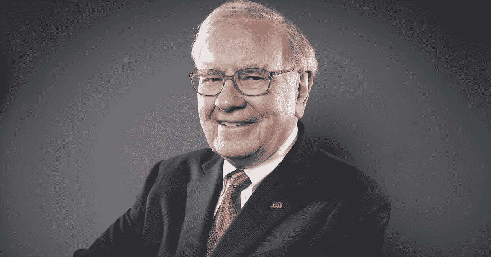
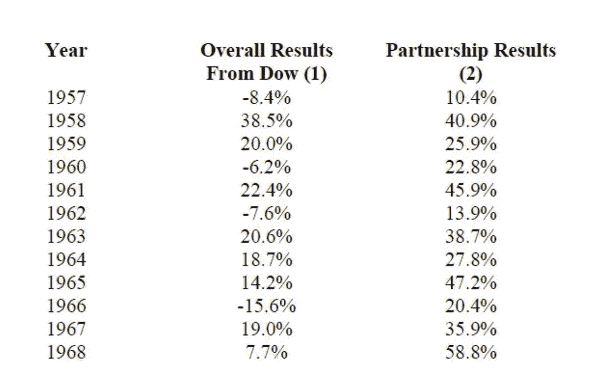

# 沃伦·巴菲特是如何在 10 多年间获得 30%的年回报率的

> 原文：<https://medium.datadriveninvestor.com/how-warren-buffet-achieved-a-30-annual-return-for-10-years-fb4be87bc43c?source=collection_archive---------2----------------------->

## 投资股市时要遵循的七条简单的关键规则

乌菲特的历史最高回报率是在他职业生涯的早期实现的，他拥有自己的私人公司巴菲特合伙有限公司。该公司成立于 1957 年至 1969 年，在它的一生中，著名的投资者**在股票市场的投资取得了高达 29.5%的年平均回报率**。

但是因为他使用了一个非常简单的风格，叫做“*价值投资*”，几乎任何一个有金融基础知识的人都可以做同样的事情。正如他曾经说过的:

> “你不需要成为一名火箭科学家。投资不是一个智商 160 的人总能打败智商 130 的人的游戏。理性至关重要。你需要一个稳定的人格”

以下是巴菲特在职业生涯中遵循的主要规则。

Buffett Partnership returns compared to the ones of the Dow Jones

*免责声明:我不是财务顾问，此内容仅供娱乐。在投资之前，一定要做好自己的研究。*

# 规则 1:购买商业成功，而不是股票收益

这条规则实际上并不是巴菲特本人提出来的，而是著名投资家本杰明·格拉哈姆提出来的。名著《*聪明的投资者*》的作者告诉巴菲特**拥有一只股票就意味着拥有一家企业**，也就是说股票只会跟随企业的业绩。

考虑到这一点，投资时你应该**关注那些将在未来占据主导地位的公司**，而不是那些目前表现良好的公司。你应该关注那些利润率高的公司，那些具有巨大竞争优势的公司，那些受消费者喜爱的公司:如果业务做得好，你的投资也会有同样的回报。

 [## 如何成为一个聪明的投资者

### 沃伦·巴菲特的神奇导师和他的书给我们的启示

medium.datadriveninvestor.com](/how-to-be-an-intelligent-investor-8f3f274e305f) 

# 规则 2:大多数新闻都不是真正的新闻

这可能是他最不受欢迎的观点，但巴菲特认为我们消费的大多数关于投资的新闻实际上在购买金融资产时并没有用。在互联网时代，财经节目、报纸甚至 youtubers 都有让你听它们的个人兴趣。即使不使用 clickbait，他们也倾向于制造尽可能多的炒作和紧张气氛来吸引你的点击和浏览。

但要长期投资，你只需要关注其中的一小部分:

> “股票所有者往往会让其他所有者反复无常、不理智的行为导致他们也变得不理智。因为有太多关于市场、经济、利率等的话题。一些投资者认为，听取专家的意见很重要，更糟糕的是，考虑根据这些意见采取行动。”

# 规则 3:不是每个人都值得信任

我之前说的并不是说你不应该听任何人的话。甚至巴菲特在他的职业生涯中也有过几个导师:首先是本杰明·格拉哈姆，然后是查理·芒格。

现在，我们这些普通投资者可以通过互联网实时看到许多伟大投资者的准确动向，比如巴菲特本人。

这里的关键词是信任:你应该信任一个只是想让你点击他的附属链接的随机优步吗？大概不会:只听那些你认识和信任的人。选择正确的投资是关于你的需求，而不是别人认为会有好处。

# 规则 4:计划永远持有

你可能听说过这个，但是复利是非常强大的。每当你获得股息或资本利得，再投资这些钱会让你赚更多的钱。但是，如果你继续买卖股票，你可能不会让复利发挥作用，错过很多长期回报。

这就是为什么重要的是**在市场中的时间，**而不是把握市场时机。这就是为什么你应该准备好永远持有同一只股票:如果你买入时做得正确，**卖出的时机几乎永远不会到来。**

# 规则 5:了解内在价值

巴菲特所说的“正确地做好自己的工作”就是这个意思。

如果你在投资时不遵循这条特别的规则，所有其他的规则都是毫无价值的。**不管公司有多好**，不管它的经理有多好，你必须明白，它不值得无限的价格:你必须确保它低于其内在价值。

没有人怀疑法拉利是一辆多么棒的车，但当你考虑购买它时，这并不是你所怀疑的。你要决定的是它值不值得花 25 万美元。股票也是如此，这就是为什么巴菲特自己说:

> “N o 公司，无论多么美妙，都值一个无限的价钱。价格是你付出的，价值是你得到的！”

为了知道每只股票的价值，你首先需要知道如何计算内在价值。

# 规则 6:了解你要买什么

这很简单，但也很基本:了解你要收购的公司。也许巴菲特投资组合的唯一模式之一是，他投资的企业实际上非常简单。*可口可乐*销售软饮料，*苹果*销售 iPhone 和 iPads，*西南航空*是一家航空公司，*家具市场*似乎也是不言自明的。

> “风险只来自于不知道自己在做什么”

如果你对汽车充满热情，你应该看看福特或者特斯拉的股票；如果你对电子商务感兴趣，去看看*亚马逊*；如果你对社交媒体感兴趣，那就去看看脸书。但是只买那些你真正懂的。

测试这一点的一个快速方法是问自己这个问题:“*我能向一个 5 岁的孩子解释这家公司是如何赚钱的吗？*”。

# 规则 7:当别人贪婪时，要害怕

如果你在 1 月份开始投资，知道这条规则会很有帮助，因为它在漫长的牛市中会派上用场。当市场持续上涨，像 T2 苹果 T3 这样的股票在 24 个月内翻了一番，每个人都变得贪婪。在这样的时期，人们往往对自己的投资技巧过于自信，将更多的钱投入市场，从而越来越难找到好的交易。

在这个时候，你必须更加谨慎，这正是巴菲特去年所做的，他积累了 1280 亿美元的现金，几乎相当于他整个投资组合的一半。但是，如果有一件事我们可以肯定的话，那就是当股票市场开始出现恐慌的时候，他就会在股票打折的时候抢购大量的股票。

# 简单地

1.  一只股票要上涨，企业的基本面必须良好(并且经得起未来考验)。
2.  大部分消息只是噪音，不要把每件事都看得太重。
3.  当你决定寻找新闻和提示时，只向你认识和信任的人寻求建议。
4.  如果你选择了正确的股票，你几乎不需要卖掉它。
5.  即使是最好的企业也不值得支付过高的价格。
6.  你能向一个 5 岁的孩子解释你买的公司是如何赚钱的吗？如果答案是否定的，你可能不应该买它。
7.  在好的时候投资，但是当坏的事情发生时，总是要储备一些现金。

如果你喜欢阅读这样的故事，并想支持我作为一名作家，请考虑关注我。