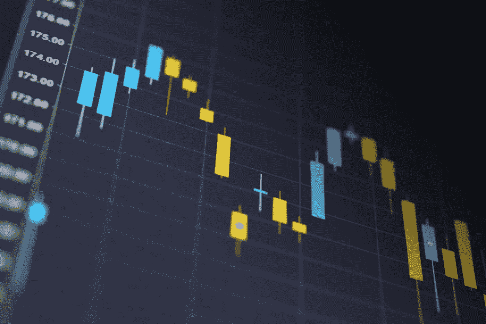

# 沃伦·巴菲特如何在 5 分钟内赚到 750 万美元

> 原文：<https://medium.datadriveninvestor.com/how-warren-buffett-made-7-5-million-in-under-5-minutes-79363ac2d52b?source=collection_archive---------0----------------------->

使用这个策略在股票市场积累你的财富

当大多数人想到沃伦·巴菲特的投资策略时，他们会想到买入并持有。选择优秀的公司，并永远持有它们。

虽然巴菲特确实以多年持有公司而闻名，但这并不是他积累财富的唯一方式。

沃伦·巴菲特时不时地交易期权来收取溢价，同时等待他喜欢的股票达到一定的价格点。

巴菲特出售期权，而不是购买期权。出售期权会把你变成赌场，而不是赌徒。

卖出期权时，你有两种选择:备兑看涨期权和现金担保看跌期权。对于备兑买入期权，你已经拥有 100 股股票。你可以卖出看涨期权，收取你账户中股票的溢价。

如果你以 50 的执行价卖出 XYZ 股票的看涨期权，那么你只有在 XYZ 股票突破 100 美元/股时才有义务卖出你的 100 股 XYZ 股票。然而，如果股票保持在 100 美元/股以下，你保留你所有的股份和溢价。

 [## 这么说一家大型风投基金正在投资你的初创公司？4 实际考虑|数据驱动的投资者

### 首先，恭喜你。融资总是需要努力的，一个大的风险投资基金当然是一个大的…

www.datadriveninvestor.com](https://www.datadriveninvestor.com/2020/08/09/so-a-big-vc-fund-is-investing-in-your-startup-4-practical-considerations/) 

即使你最终卖掉了这些股票，你也会一路升值。如果你以每股 95 美元的价格买入 XYZ 股票，然后被迫以每股 100 美元的价格卖出，除了溢价，你还可以得到每股 5 美元。

这是一个降低现有头寸风险并获得额外收入的好策略。许多投资者使用这种策略来增加他们的投资组合，但这不是巴菲特用来在不到 5 分钟内赚到 750 万美元的策略。

几年前，巴菲特在可口可乐 39 美元的时候卖出了它的看跌期权。巴菲特喜欢可口可乐的股票，但他不想以 39 美元的价格买入。相反，他想以每股 35 美元的价格购买它们。

巴菲特决定以 35 美元的执行价卖出 50，000 份可口可乐看跌期权，而不是在可口可乐的价格达到 35 美元时创建限价单。

由于每份期权是 100 股，巴菲特的 50，000 份可口可乐看跌期权是以他想要的 35 美元的执行价购买 500 万股可口可乐股票。

这 50，000 份看跌合约为每股股票提供了 1.50 美元的溢价，这立即导致了 750 万美元的意外之财。

你可以立即用你从保费中赚到的钱投资其他股票，或者在款项结清后支付费用。与此同时，你将以低于当前交易价格的价格获得你最喜欢的股票。

这种策略只有两个风险:

#1:股票可以低于 35 美元，但你仍然有义务购买。如果你打算购买股票并长期持有，这不是问题。

#2:股票永远不会触及你的执行价。这并不完全是坏事，因为你仍然可以保留你所有的溢价，你可以继续这样做，直到股票达到你想要的价格目标。

不是每个人都能卖出可口可乐的 5 万份看跌期权。现金担保看跌期权要求，如果你有义务购买股票，你必须有足够的现金进行购买。

在 35 美元的执行价下，一份现金担保看跌合约需要你有 3500 美元的流动现金可供交易。直到看跌期权被执行，到期，或者你决定买入相同的看跌期权来结束合约，你才能再次获得这笔现金。

即便如此，一份可口可乐看跌期权也会产生 150 美元的溢价，这对于 4.3%的即时收益和以低于当前价格 4 美元购买可口可乐股票的可能性来说是不错的。这 4.3%的收益超过了可口可乐的股息收益率，你提前收到了钱，而不是等待 4 个季度的股息支付。

巴菲特经常使用期权和其他衍生品来建立自己的投资组合。虽然他的大部分策略是买入并持有，但衍生品可以带来超凡脱俗的收益或稳定的被动收入，保护你免受一些潜在的负面影响。

**进入专家视角—** [**订阅 DDI 英特尔**](https://datadriveninvestor.com/ddi-intel)