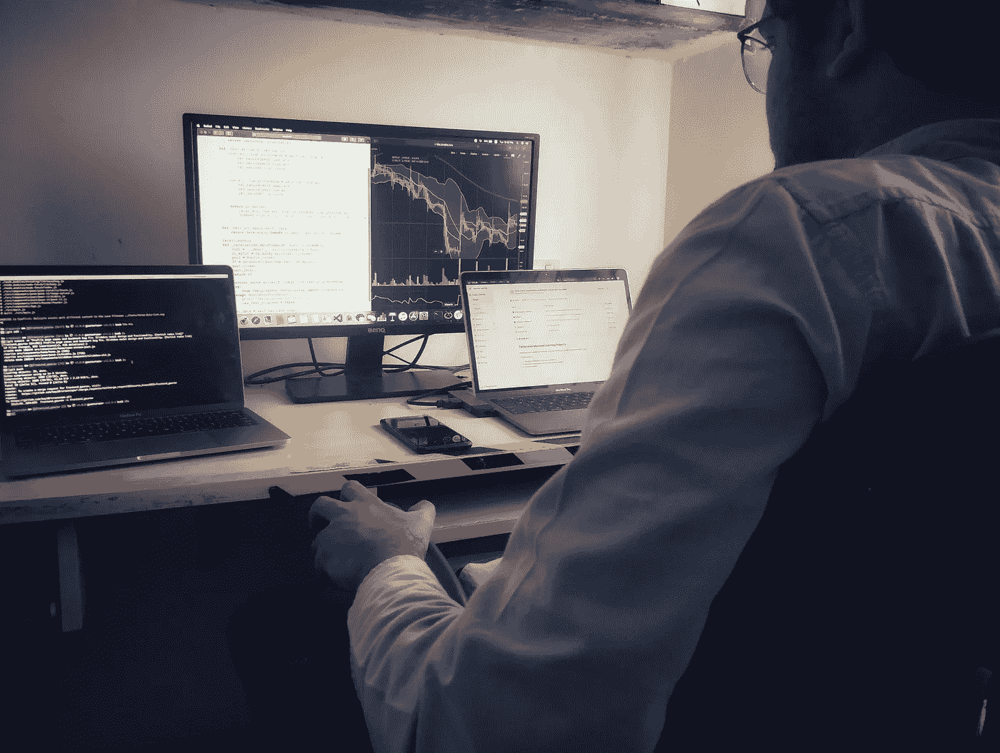
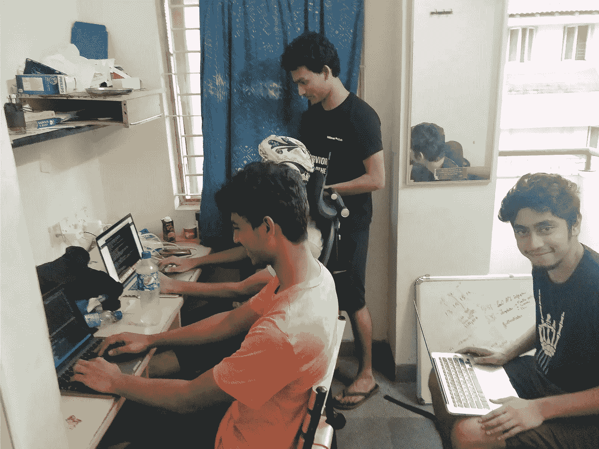
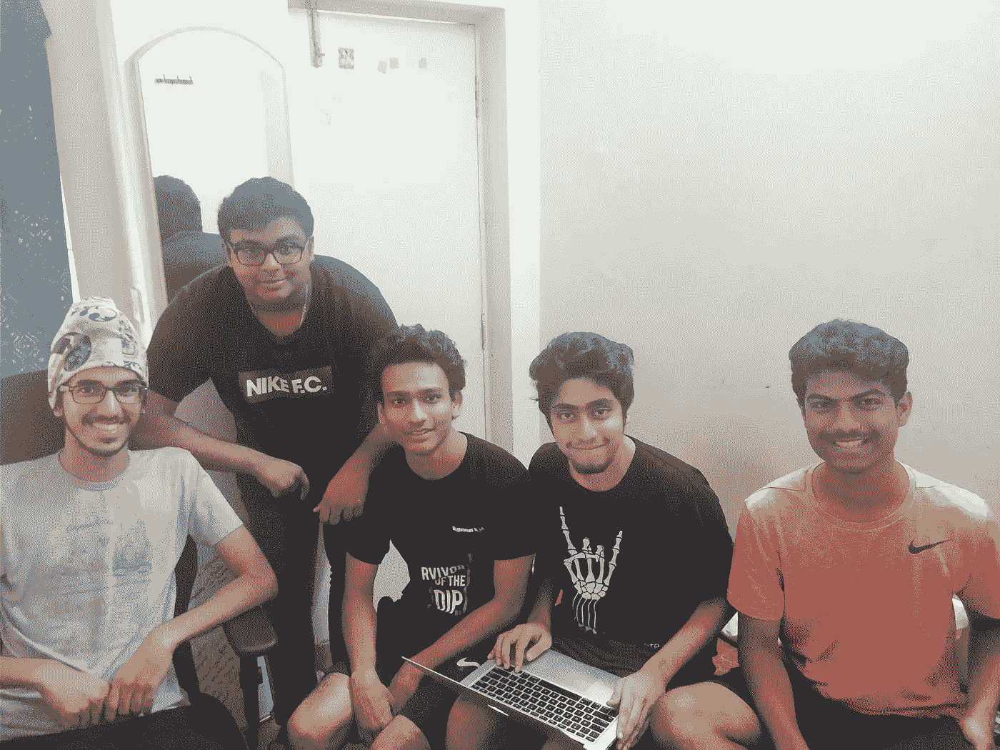
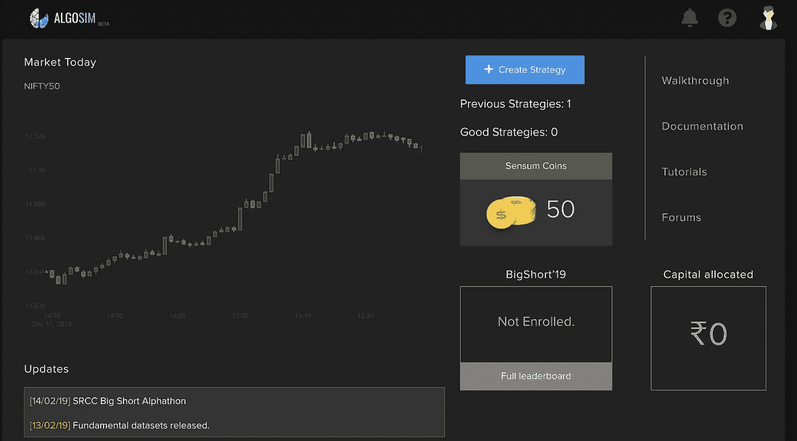
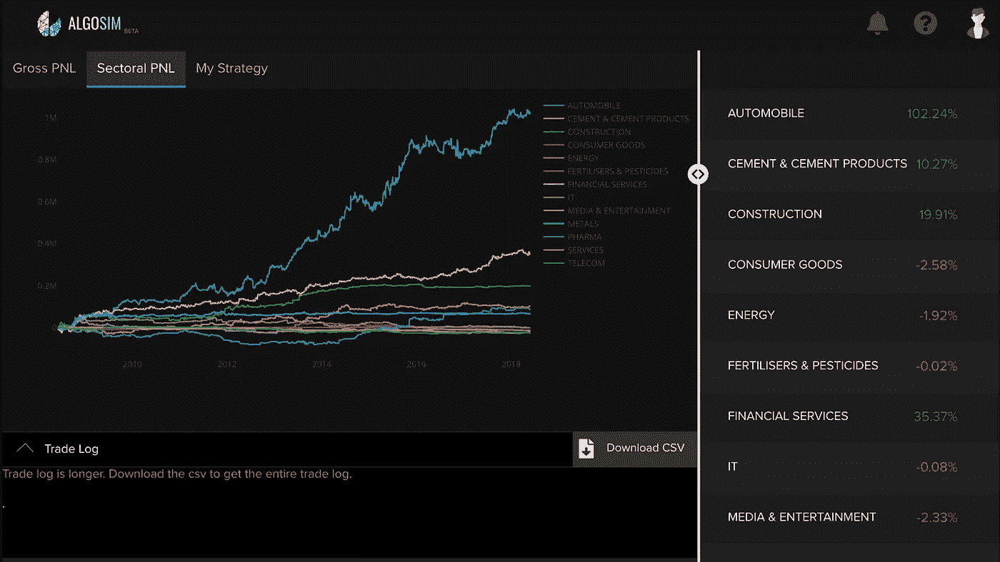

# 我们如何在我的宿舍里创建一家金融科技创业公司

> 原文：<https://medium.datadriveninvestor.com/how-we-built-a-fintech-product-from-my-dorm-room-3442e54c855e?source=collection_archive---------4----------------------->

从我记事起，我就想创业。在你的宿舍里创建一家公司的美好想法一直激励和吸引着我。

现在，它终于发生了。

我的朋友 Aditya 和 Mohit 在金融科技领域做一些事情，他们希望我成为科技方面的专家。这是一个令人兴奋的产品，是印度股票市场的金融算法模拟器。该产品本应被纳入 Sensum FinTech(该公司的名称)提供的更大系列产品中。

Aditya 已经说服了两个非常有才华的年轻人来开发这个产品；Samarjeet 负责 UI 设计和前端，Priyesh 负责构建后端。

很快我们就进入了构建产品的阶段。我的宿舍已经成为典型的黑客宿舍，在任何给定的时间都有一定排列的 6 人团队躲藏在那里。有了我们学院比特·皮兰尼的零出勤率政策，我们享受了正常缺课的自由，没有任何严重后果。因此，很多时候，我们常常编码到早上 6-7 点，然后在上课时间睡觉！

在一个这样的夜晚，当我们正忙于编码时，Priyesh 指出他的房间里可能有一些剩下的比萨饼切片。当时是夜里 3 点左右。我和 Aditya 走出我的宿舍，从校园另一端的 Priyesh 宿舍取回比萨饼！我们走着走着，Aditya 开始告诉我，Sachin Bansal 在他的 LinkedIn 个人资料中对他担任 Flipkart 首席执行官的描述读起来像是“零工”。这是真的，当技术团队忙于编码时，Aditya 通过做许多这样的零工来确保每个人的最佳条件！除此之外，他还担任了产品经理的角色，并在将他的愿景转化为产品方面做了值得称赞的工作。

 [## 银行和金融科技初创公司的未来|数据驱动的投资者

### 银行的概念没有太大变化，但随着技术的发展，旧的概念也在更新。不相信我？拿一个…

www.datadriveninvestor.com](https://www.datadriveninvestor.com/2019/10/22/the-future-of-banks-and-fintech-startups/) 

在构建产品的过程中，我们所有人都学到了很多。但我意识到的最重要的事情是，作为一个团队，我们有能力建造几乎任何我们想要的东西。曾经有很多次，当这个看似不可能实现的特性或者一个巨大的 bug 威胁到我们所构建的一切时，但是在每一次这样的情况下，我们都成功地实现了那个特性或者消灭了那个 bug。这似乎有一个完美的模板来证明这一点；我们在午夜前的某个地方发现了问题，我们考虑了一段时间如何解决它，然后我们最终决定试一试，几乎每次我们都在日出前解决了问题！我清楚地记得，有一次，当这一切发生的时候，正是我们应该最终部署应用程序的那一天。当时是凌晨 4、5 点左右，我们在部署应用程序时一再失败。每个人都非常疲惫和困倦，我们几乎决定推迟一天部署。但就在那时，Samarjeet 宣布，在成功部署应用程序之前，他不会离开座位。实际上，他直到早上 8 点完成部署才起床。我们仍然称那把椅子为“部署椅”！

(from left) Samarjeet on the deployment chair, Priyesh, Mohit, Aditya, Gaurav (me)

在开发产品的那些日子里，这样的故事数不胜数。就像有一次，在 Aditya 即将向我们在班加罗尔的潜在投资者演示产品之前，我和技术团队在我的宿舍里疯狂地调试。或者是另一次，当我和莫希特一路走到萨马尔吉特的宿舍房间，叫醒他去解决一个服务器问题。

尽管这个产品是为算法交易爱好者设计的，但在短短几个月内就有 1000 名用户注册。我们甚至在印度最好的商业学院之一 SRCC 大学举办了一场比赛，并且发现我们自己没有付钱就上了他们节日的赞助委员会。

A snapshot of the homepage

The strategy results page

Algosim 的目的是众包金融算法，然后我们在其上测试和构建。后来，我们在一个名为 Algokart 的平台上提供了这些强大的金融算法作为订阅，这是我们的旗舰产品。

当我回头看它们时，这段旅程的记忆确实是我大学生活中最珍贵的时刻。我们建立了一些东西，真实的人在使用，来测试他们真实的策略，来赚一些真正的钱！虽然不是很大，但我们确实产生了影响。